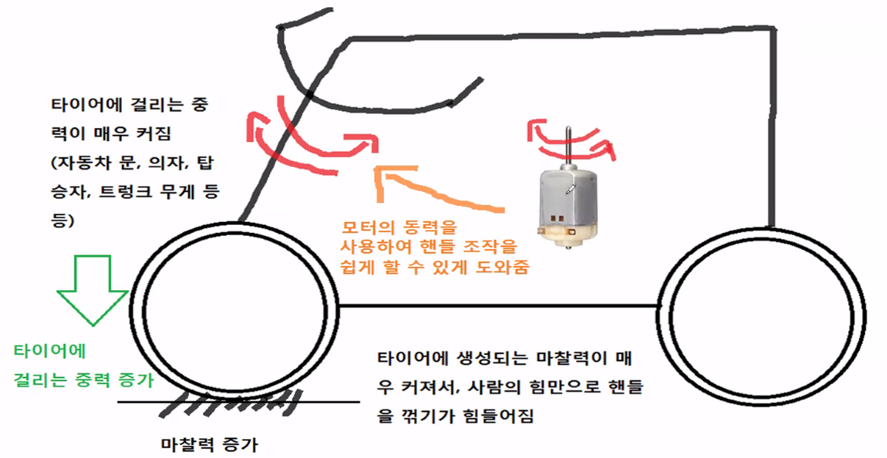
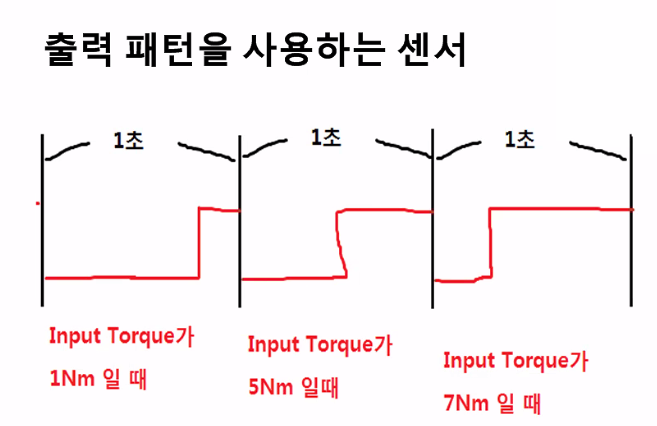
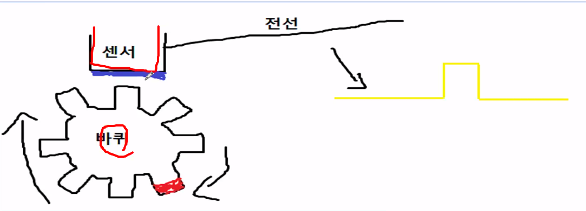
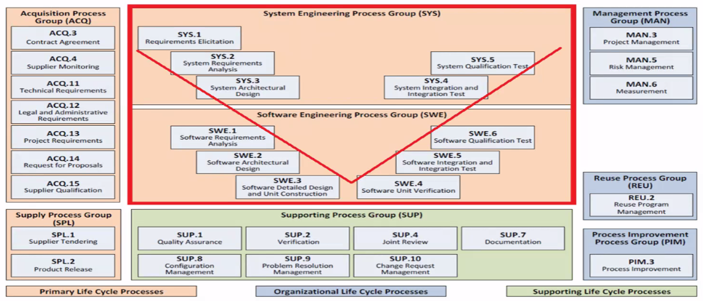

# 현대모비스 임베디드 sw개발

**프로그램 내용**

\- 최근 산업 동향 및 이슈

\- 현업 프로세스의 이해와 필요역량

\- 실무 예시로 보는 임베디드 SW개발

\- 취준 과정과 입사 꿀팁

\- 자유로운 Q&A


## CONTENTS 목차

1. 자동자 부품회사의 설계 직무 소개
   - hw/sw/기구 설계

2. 조향장치의 개요

3. 구체적 예시(조향 제어 sw)를 통하여 알아보는 sw설게 직무가 하는 일

4. sw설계 직무자의 요구 역량

5. 채용공고를 볼 때 도움이 될 용어 소개


### 자동자 부품회사의 설계 직무 소개

> 자동차 부품의 종류
>
> 1. 구동시스템 (엔진 or 전기차 하이브리드 차의 구동모터)
> 2. 조향시스템 (핸들(스티어링 휠)
> 3. 제동시스템 (브레이크)
> 4. 안전시스템 (에어백)
> 5. 현가시스템 (승차감, 차량 안정성)
> 6. DAS시스템 (Driving Assistant System)

[제어기(제어sw) ]- 액츄에이터


### 조향장치의 개요

#### **모터제어의 개요**

제어기를 이용하여 모터로 공급되는 전류의 크기, 방향을 제어

**공급된 전류를 이용하여 회전력(토크)를 생성**

- <u>전류의 크기</u>가 커지면, 회전력의 크기가 커짐
- <u>전류의 방향</u>에 따라 모터가 돌아가는 방향이 달라짐
- 따라서 모터를 제어한다는 것은 ⇒ 모터에 공급하는 전류의 크기와 방향을 제어하는 것임


#### 조향장치 설명 (제어로직의 필요성)




- <u>사람이 원하는 방향</u>으로 회전력(토크)를 발생시켜야 함
- 사람이 컨트롤 할 수 있게 <u>적당한 크기의 회전력</u>을 발생시켜야 함
- <u>현재 차량의 이동속도</u>를 고려해서 적당한 크기의 회전력을 발생시켜야 함


### sw직무가 하는일

자동차 부품 제어 sw의 구조

```
input → processing → Output
```

- **input**

  - <u>사람이 원하는 방향</u>
  - <u>사람이 핸들에 가한 회전력</u>
  - <u>현대 차량의 이동속도</u>

  ```python
  전류 방향 결정
  if(input_direction == left)  # 방향을 왼쪽으로 줌
  	output_direction = left;
  else
  	output_direction = right;
      
  전류 크기 결정
  output_torque = input_torque * 10;  
  # 10배만큼 힘을 더 줌. 즉, 10배만큼 마찰력을 덜 받을 수 있음
  
  ⬇
  
  전류 크기 결정 (속도 반영)
  if(speed > 100)
  	var = 2;
  if (speed > 60)
  	var = 4;
  if (speed < 60)
  	var = 10;
     
  output_torque = input_torque * var
  # 차량의 속도 올라갈수록 도와주는 힘을 약하게
  ```

  ```python
  ## 빙판길 운전 상황 = 마찰력이 적음
  # 빙판길에서도 조향감이 무거운 것이 운전에 도움이 될 것임 
  # 이를 반영한 제어로직을 설계해보자
  
  input = 현재 노면상황
  
  int ground_condition;
  
  if(ground_condition == ice)
  	output_torque = input_torque * 5
  else
  	output_torque = input_torque * 10;
  ```

  - input에 대하여

    > 지금까지는 제어 로직에 대해서만 살펴보았음
    >
    > Intput을 어떻게 받아 올 것인지도 SW구현이 필요하다.
    >
    > Input을 받아오는 방법에는 다양한 방법이 있지만 몇가지 센서의 예시를 들어서 설명해봄

    - **전압값을 이용하는 센서**

      - input 값이 변경되면 출력되는 전압이 변경되는 Type
      - ex) 운전자가 가한 토크가 커질수록 센서의 output전압이 올라감

      

      ```python
      global count = 0
      tick = 0
      1ms_task # 1ms돌때마다 pin이 row인지 high인지 확인
      {
      tick ++;
      if(p_05 == 1)
        count++;
      else
      {
          
      }
      if(tick == 1000)
          tick = 0
      if(count == xx)
          input_torque == xx
      }
      ```
    
    - **휠 회전속도 측정(RPM)**
    
      
    
      - 바퀴가 1바퀴 돌 때마다 노란색 Edge가 1가 발생될 것임
      - 따라서, 특정 시간 동안 노란색 Edge가 몇개 발생됐는지 갯 수를 세보면 바퀴의 회전속도를 알 수 있다
      - ex) 1초 동안 노란 Edge가 10개 발생 
        - 1초에 바퀴 10번 회전했다는 의미
        - RPM(Rotate Per Minute)으로 환산해보면 600RPM
    
      ```python
      # register < -1
      prev = 0;
      1ms_task
      {
      diff = register - prev
      prev = register;
      }
      ```
    
      - register = 8, prev = 3, diff = 5 이므로 1초 동안 펄스가 5개 생김
      - 1ms = 3
        1초 = 3000
        60 = 180000

- **processing**

  - 제어로직 : 여러가지 input들이 주어졌을 때, 어떤 output을 생성할 것인지 결정하는 방법

    ```python
    int input_directionl
    float input_torque;
    float car_speed;
    
    int output_direction
    int output_torque;
    ```

- **output**

  - 모터의 공급전류 크기
  - 모터의 공급 전류 방향


#### 제동, 안전, 현가 등등 다른 제어기

**제동 시스템의 경우**

- 특정한 input이 들어왔을 때 제동력을 어떻게 제공할 것인가? 
- 이를 결정하는 것이 제어 로직의 역할

**안전 시스템의 경우**

- 특정한 input이 들어왔을 때 에어백을 터뜨릴지 말지 여부를 결정하는 로직이 제어로직의 역할
- 이 때, 단순히 On/ Off만 결정하는게 아니라 에어백의 부풀어지는 정도를 얼마나 할 것인지 그런 것도 판단해야할 항목 중 하나이다.

**이외에 다른 시스템** 

- **모두 맥락은 비슷함**

- 각 부품이 갖는 고유 기능을 어떤 상황일 때 어떻게 동작시킬 것인지를 결정하는 것이 제어로직이고,
- 이 제어로직을 SW로 구현하는 것이 SW설계 업무자의 할 일이다.


### 요구역량

- 임베디드 SW개발 경험(C언어)
  - 가장 대표적인 예시 : Atmega128 프로그래밍
  - **But** 책, 블로그가 아니라 오직 Data Sheet만을 보고 내용 파악을 할 수 있어야 함
  - (Adc, Gpio, SPI통신, **CAN통신**(자동차쪽 제어기), Uart통신, 타이머 인터럽트 등등)

- 회로도 파악 능력(간단한 정도만)
  - (MOSFET, Bjt 트렌지스터를 스위치로 사용하는 Case는 꼭 알아두기)

- **꼼꼼함 & 인내심**
- 영어 (토익 Reading 원활하게 할 수 있는 정도)
  - 당연하지만 데이터 시트, 유저 매뉴얼, 각종 Spec자료 등등의 99%는 영어
  - 만약 회화가 자유로운 정도의 실력을 갖고 있다면 매우매우 크게 어필할 수 있음


### 협조제어란

하나의 자동차 안에는 여러 개의 자동차 부품들이 들어가있고, 그 자동차 부품은 제각각 제어기를 갖고 있음

이러한 부품들은 서로서로 협력하여 자동차를 컨트롤하게 되는데, 이렇게 서로 다른 제어기가 서로 협력해서 자동차를 제어하는 것을 협조제어라고 함


#### 협조제어 예시1)

**긴급제동 시스템**

> 차량 전방 일정한 거리에 장애물이 있을 경우, 자동으로 제동을 하는 기능

- 카메라, 레이더센서 제어기를 통하여 현재 전방의 장애물 유무를 판단해야 함

- 판단된 결과를 제동시스템 제어기에 전달
  - 장애물이 있을 경우 자동으로 브레이크를 동작시킴


#### 협조제어 예시2)

**자동주차 시스템**

> 자동으로 주차를 해주는 기능

<u>주차할 장소를 인식하기 위하여 카메라 제어기 필요</u>

<u>주차를 하려면 조향장치 조작 필요</u>

주차 중 충돌 위험이 있을 경우 브레이크 조작 필요

주차를 하려면 자동차가 움직여야 하므로 구동장치 조작 필요

- 각각의 제어기가 서로 협조를 해야 자동주차 기능이 구현 가능함
- 이들 제어기가 서로 원활하게 잘 동작할 수 있도록 제어로직을 잘 만들어야 함


### Failsafe란?

**Failsafe 로직 설계 업무란 무엇인가?**

고장 상황을 진단하고, 고장이 발생했을 경우 그에 대한 Reaction을 구현하는 업무

**예시1)**

차량의 배터리 전압을 주기적으로 측정

배터리 전압이 정상범위를 벗어났을 경우, 운전자에게 경고해주고 시동이 켜지지 않도록 함

**예시2)**

안전을 위하여 조향각을 측정하는 센서를 동일한 것 2개를 사용함

두가지 센서가 모두 동일한 값을 출력할때만 정상 상황으로 판단(중복 판단)

만약 서로 다른 출력값을 출력할 경우 무언가 문제가 있다고 판단하여 자동차의 최대속도를 제한함


### BSW, 플랫폼 SW vs. App, 제어로직, 알고리즘 SW

- sw 직무 내에서도 위와 같은 형태로 크게 2가지로 구분
- **But,**
  - 2가지 영역을 완벽하게 잘라서 구분하기는 힘듬
  - 2가지 영역을 따로 팀을 나누지않고 같이 구현하기도 함
- 전자의 경우 **(BSW, 플랫폼 SW)**
  - Input Processing Output에서 
  - Input, Output을 제공하기 위한 SW와 좀 더 가깝다
- 후자의 경우 **(App, 제어로직, 알고리즘 SW)**
  - 제어로직을 만드는 부분(Processing)이 후자와 가까움

> BSW가 좀더 hw스러움
>
> pp입장에서는 윈도우가 BSW (좀더 밑바탕에 깔려있는 느낌)
>
> 담겨있다 = BSW가 만들어뒀고 그 위에 로직을 짜는것
>
> 판단하는 로직을 짜는것 = 제어로직 
>
> input, 차량 속도, 통제 통해 
>
> 최종적으로 제품 조작 로직 짜는것이 제어로직 


### A-Spice란

- Automotive Software **Process** Improvement  and Capability dEtermination



sw = 고객이 원하는 동작이 잘 되면 됨

과거와 달리 sw가 복잡해지고 다양해짐에 따라 재사용성 등 기능 + 체계를 갖추고 sw를 만들었느냐가 핵심

즉 process를 보는 것

A-Spice 표준 문서는 200~300pages정도 

당연한 소리 적혀있음

- 요구사항 분명하게

- 체계 정확하게

- 산출물들 버전관리 확실하게

모든지 계획을 세워라 

그 계획이 문제 없는지 리뷰해라

리뷰했다는 증거를 남겨라

리뷰를 바탕으로 계획

계획 -> 버전

버전- > 리뷰

버전 -> 개발기간, 인원, 책임자, 평가자, 개발자 계획

이를 바탕으로 순서대로 일 수행

요구사항 -> sw 구조 -> 코딩  이런 모든것 리뷰 하고 증거를 남겨야함

증거를 어떤 문서타입인지 그리고 버전을 적어놔야함

대강요약 : 계획, 증거물, 리뷰, 버전관리 


### Q&A

keyword : MCU, 학력, 경력

**학력 보나요?**

- 과거에는 많이 봄
- 최근에는 학력 안돼서 서류컷 당하는 경우는 거의 없음
- 경험 많으면 뽑음

**경력 중요하나요?**

- 신입이 경력 있을 수 없다는 것 알고 있음

- 어떤것을 했을것 => 면접, 자소서 기반 
  - 이를 기반으로 임베디드 안해봤지만 잘 가르쳐서 하면 잘 하겠다 라는 판단이 들면 뽑는다.
- 어쨋든 같이 일할 사람 뽑는것
  - 얘랑 일하면 잘 하겠다 라는 생각이 들게 해야함

**코딩테스트 준비?**

- 당연히 준비해야함
- 백준 등에서 공부해라

**AI, 딥러닝 배운게 도움 되나요?**

- 된다. 하지만 안쓰는 부서도 있긴함. 하지만 있으면 당연히 좋음

**학점보나요?**

- 수시채용이기때문에 전보다는 확실히 덜보긴 함
- 사바사 / 평가바이평가지만,  본인은 중요하다고 생각
- but 방어가 잘되면 됨
  - 말이 잘 되면 된다 = 자기가 좋아하는 과목을 본다

**전공 내용 물어보는지 궁금**

- 수시채용은 진짜 일할사람 뽑기때문에 기본적 개념이 있는지 (컴파일러, 캐쉬...)는 확인한다.

**혹시 실무에서 Git을 사용하는지 궁금합니다!**

- 당연히 사용

**남녀 채용 비율 알수 있나요..?**

- 수치적 고정이 아님
- 공대랑 비슷 
- 남자가 많아서 많이 뽑을 수 밖에 없음
- 그냥 사람 좋으면 뽑는다
- 성별때문에 불이익은 별로 없음

**프로젝트?**

- Rc카 자율주행 정도면 해봤구나 생각함 = 기본적인것은 해봤구나
- 하면서 배운게 더 중요하다
- 임베디드랑 상관없어도 뽑는다

**물리적/ 수리적 역량이 중요?**

- 제어 로직은 필요 
  - 모델링 해야하기 때문
- sw는 별로 안봄
- 이미 선배들이 해둔것이 있기때문에 성장해나가면 됨
- 있으면 좋지만, 없다고 채용 안되는건 아님

**동아리, 외부활동 중요?**

- 본인은 딱히 모르겠음

**pt면접이 사라졌는데 30분동안 어떻게 프로젝트 경험을 어필해야 할까요??**

- 진리의 사바사

**멘토님께서 말씀해주신 Atmega128 사용해서 개인프로젝트를 준비할까하는데 면접에서 어필이 될까요? 현재는 아두이노밖에 안다뤄본상태라.. 제가사실 이 조향직무 최종면접까지 갔다가 불합격 되어서 추가적인 프로젝트가 필요할 것 같아 이런 질문 드리게 되었습니다.**

- 제일 중요한건 여러명이서 일하니까 => 여러명이서 했던거 문제 발생하고 어떻게 해결했는지 어필해야함
- 과제를 많이한게 문제가 아니라 그 안에서 배운것 어필이 중요함
- 그거 하면서 어떤 센스 어떤 종류 골랐고 따라서 sw는 어떻게 짰고~ 이런 베이직 같은거를 어필하면 좋을듯 함
- Atmega128써봤다! 가 아니라
  - 자료 엄청 많음(200페이지 내용 다 비슷비슷) -> 밑바탕에서 어떻게 돌아가는지를 어필하는것이 중요할듯 

**제어기 어떤거 쓰나요?**

- 기본적 임베디드 제어기 (CAN..?)
  - 개념을 알아두면 좋음
  - 기본 기능에 대해 잘 파악하고 있다! 를 어필하면 좋을 것 같다.


### 이것만 기억하세요!

- 시스템은 제어기, 제어SW, 액츄에이터로 구성됨
- 제어 SW는 액츄에이터를 적절하게 컨트롤(제어)하는 역할을 함
- 제어 SW는 
  - 현재 상황 판단 - 상황에 맞는 동작 결정 - Output 동작
  - input - processing - output 형태로 구성됨