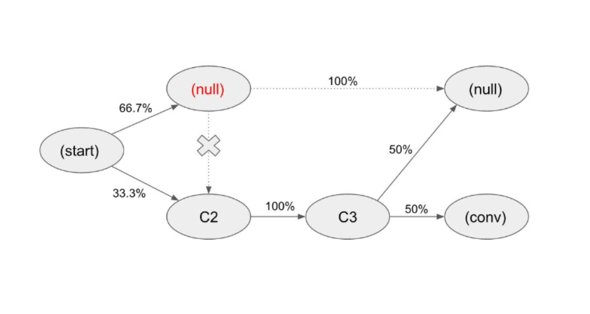

# 기여모델(attribution model)

## 규칙 기반(rule-based) 기여 모델

+ Last-click
+ First-click
+ position-based
+ 등등

## 데이터 기반(data-driven) 기여모델

**샤플리 값(Shapley value)**와 **마르코프체인(Markov Chain)** 이 작동원리

+ 샤플리 값(Shapley value): 경제학에서 다루는 협조적 게임이론에 기반, 공동의 성과물에 대해 각 참여자에게 기여도를 분배하는 방법론. 구글에서 제공하는 데이터 기반 기여모델의 기초이론으로 채택된 방법론이기도 하다.
+ 마르코프체인(Markov Chain): 특정 상태(state)에서 다른 상태로 전이하는 확률(transition probability)을 다루는 수학 이론. 

###### 마르코프체인(Markov Chain)에 기반한 기여모델(attribution model)을 설명하는 다이어그램

