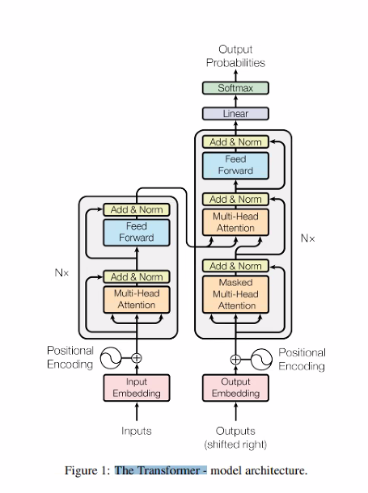

# TIL

## 목표변수 (target variable)

모델을 만들 때 사용자가 예측하고 하는 값

기계학습 알고리즘을 가지고 예측하고자 하는것

## 회귀분석 (Regression)

주어진 데이터가 어떤 함수로부터 생성됐는가를 알아보는 **함수 관계**를 추측하는 것

어떤 자료에 대해 그 값에 영향을 주는 조건을 고려하여 구한 평균

+ 선형 / 비선형 회귀 모델: 모델링 대상을 **회귀 계수**의 선형 결합만으로 표현할 것인지(회귀계수가 선형인지 아닌지) 여부에 따라 구분
+ 독립 변수 개수에 따른 구분
  + 단일 회귀: 독립변수의 개수가 하나
  + 다중 회귀: 독립 변수의 개수가 여러개
+ 종속 변수 개수에 따른 구분
  + 단변량(univariate): 종속 변수가 하나인 회귀 모델
  + 다변량(multivariate): 종속 변수가 2개 이상인 경우의 회귀 모델

## 배깅 (Bagging)

배깅은 Bootstrap Aggregation의 약자로 샘플을 여러번 뽑아 (Bootstrap) 각 모델을 학습시켜 집계(Aggregration)하는 방법이다.

## 다중공선성(multicolinearity)

어떠한 변수가 다른 여러변수들의 결합과 선형적인 관계를 가지는 정도

+ 예를들어, 동기부여라는 변수가 능력, 과제, 난이도, 주변 분위기 등 여러 변수들을 모두 결합한 값에 의해서 선형적으로 설명되는 정도가 높으면 동기부여는 다중공신성이 높은 것

## 범주형 반응자료

### 범주형 자료의 정의

관측값이 **질적자료(qualitiative data)**또는 어떤 속성에 따라 분류되어 범주(category)에 속하는 도수(frequency)로 주어질 경우 이를 범주형 자료(categorical data)라고 한다.

범주형 변수는 측정척도가 범주집합으로 구성된다.

+ 예를 들어,
  + 성별 - 여자, 남자
  + 선호도 - 좋음, 보통, 나쁨
  + 소득수준 - 높음, 중간, 보통
  + 색깔 - 빨강 파랑

#### 범주형 변수 측정척도

명목(nominal)변수: 결과 변수 간에 순위, 대소 관계가 존재하지 않는것

순서(ordinal)변수: 결과 변수 간에 순위, 대소 관계가 존재하는 것

위의 예에서, 

+ **명목형** - 성별, 색깔
+ **순서형** - 선호도, 소득수준

### 연속형 변수

등간(interval)변수, 비율(ratio)변수가 있다.

+ 등간변수: 그 값들끼리 덧셈 뺄셈이 가능한 척도
  + 예) 온도 등
+ 비율변수: 그 값들끼리 덧셈, 뺄셈 그리고 곱하기, 나누기까지 가능한 척도. 또한 등간척도에는 없는 절대 '0'점이 존재한다.

**<u>명목 → 순서 → 등간 → 비율 → ...</u>** 

우측으로 갈수록 고차원 척도로써 측정방법 폭이 넓다.

