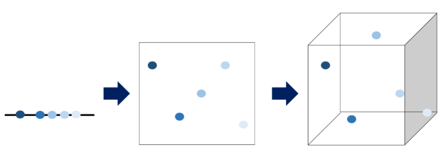

# 차원의 저주 (The curse of dimensionality)

데이터 학습을 위해 **차원이 증가**하면서 학습데이터 수가 차원의 수보다 적어져 **성능이 저하되는 현상**

+ 학습데이터 수 < 차원의 수

데이터 용량이 커지면서 불필요한 샘플이 많아지는 것

차원이 증가할수록 개별 차원 내 학습할 데이터 수가 **적어지는(sparse) 현상 발생**

즉, 차원이 증가함에 따라(= 변수의 수 증가) 모델의 성능이 안 좋아지는 현상을 의미한다.

무조건 변수의 수가 증가했다고 해서 차원의 저주 문제가 있는게 아니라, **관측치 수보다 변수의 수가 많아지면** 발생한다.

위의 그림에서 점은 데이터 or 관측치이다.  차원이 증가하면서 점들 사이에 빈 공간이 생기는 것을 차원의 저주라고 한다.

## 발생하는 문제

컴퓨터 상에서는 "**빈 공간이 생겼다 = 0으로 채워졌다.**" 라고 볼 수있다. 정보가 없다는 것으로, 정보가 적으니 당연히 모델을 돌릴때 성능이 저하된다.

머신러닝 모델 구축시,  **"차원 = 각 샘플을 정의하는 정보 개수"** 를 뜻한다. 

차원의 저주에 치명적인 알고리즘: **KNN**

+ KNN(K-Nearest Neighborhood)알고리즘은 자신과 가까운 이웃 K개를 보고 라벨(= 결과값)을 정하게 되는데, 차원이 커질수록 이웃을 찾아볼 수 없게 된다.
+ 따라서 너무 큰 차원이면 KNN알고리즘 말고 다른 알고리즘을 쓰거나 차원을 줄이는 방법으로 데이터를 한 번 정제해야 한다.

## 해결책

 데이터를 많이 획득하거나, 차원을 줄여야함 (**차원 축소를 목표로 설정**)

목적에 적합한 샘플 수만 남기가 나머지를 없애 데이터 사용량을 줄이는 한편 머신러닝 모델은 더욱 단순하고 효율적으로 구축할 수 있다.

### 차원축소 (Dimensionality Reduction)

#### 차원축소 (Dimensionality Reduction) 하는 이유

1. 더 나은 성능의 모델을 만들기 위해
2. 이해하기 쉬운 모델을 만들기 위해
3. 더 빠르게 실행되는 모델을 만들기 위해

#### 차원축소 (Dimensionality Reduction)의 방법

##### 1. 형상선택·특징선택(Feature Selection)

'요점만 분류' 하는 작업. 대상 변수와 가장 관련성이 높은 형상의 하위 집합을 식별해 제외시킨다. 여러 형상의 공분산(두 가지 변수 사이 관계를 나타내는 양) 을 시각화 할 수 있다. 두 형상이 높은 상관관계를 갖는다면 둘 다 대상 변수에 유사한 영향을 미치기 때문에 머신러닝 모델에 모두 포함시킬 필요가 없다. 따라서 모형 성능에 부정적인 영향을 주지 않고도 둘 중 하나를 제거할 수 있다.

##### 2. **형상추출·특징추출(Feature Extraction)**

개별 기능을 제거할 수 없는 경우에는 형상추출·특징추출(Feature Extraction)이라고 하는 투영기술로 여러 형상을 저차원 공간으로 압축해 모델을 단순화 한다.

가장 잘 알려진 추출 방법으로는 ‘주성분분석(Principal Component Analysis, PCA)'이 있다. PCA란 데이터의 특성을 가장 잘 표현하는 '주성분'을 추출해 데이터 양을 줄이는 방법이다. 고유값, 고유벡터, 공분산 등 다양한 선형대수 이론을 활용해야 하기 때문에 수학적 전개가 매우 어렵다.

PCA를 사용해 MNIST 데이터세트를 95% 보존하면서 기능은 줄인 효과를 보여주는 사진. 

