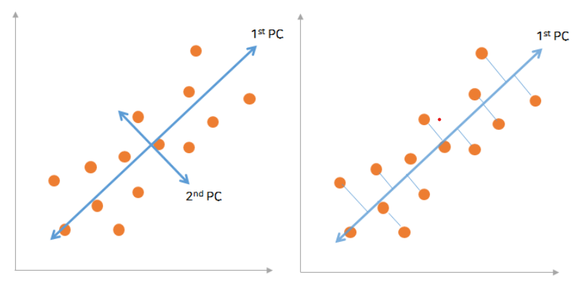
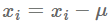
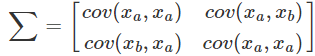
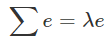

# 차원 축소의 방법

## 개념 비교

+ Feature engineering: 도메인의 지식을 사용하여 데이터에서 feature를 변형 / 생성
+ Feature Extraction: 차원축소 등 새로운 중요 feature를 추출
+ Feature Selection: 기존 feature에서 원하는 feature만 (변경하지 않고) 선택

즉, **Feature Extraction(FE)**는 **"데이터의 feature를 어떻게 유용하게 만들 것인가"** 의 문제이며,

**Feature Selection(FS)**는 **"데이터에서 유용한 feature를 어떻게 선택할 것인가"**의 문제이다.

## Feature engineering

**attribute(column)**을 머신러닝에서는 **feature**라고 한다.

머신러닝 알고리즘을 돌려 신뢰할만한 결과를 얻기 위해서는 적절한 feature들을 선정해야한다. 이 작업을 **feature engineering**이라고 한다.

많은 feature중 결과에 좋은 영향을 줄 feature만 선정하고, 의미가 비슷한 feature들을 가려내야 한다.

불필요하거나 도움이 많이 되지 않을 feature수가 많아질 경우, 이 feature들은 메모리 공간을 낭비하고 머신러닝 알고리즘 계산 시간을 증가시킨다.

## Feature Extraction (형상 추출)

개별 기능을 제거할 수 없는 경우에는 형상추출·특징추출(Feature Extraction)이라고 하는 투영기술로 여러 형상을 저차원 공간으로 압축해 모델을 단순화 한다.

### Feature Extraction (형상 추출) 방법

1. PCA(Principal component analysis)
2. LDA(Linear discriminant analysis)
3. NMF(Non-negative factoriztion)

#### PCA(Principal Component Analysis)

##### Dimension of the greatest variability

데이터를 잘 표현하고 있다. = 다른 데이터들과 거리가 충분히 떨어져 있다.

각 데이터들 간 거리가 충분하고 처음 데이터와 끝 데이터의 거리가 멀 수록 다양성이 높다고 할 수 있다. 

+ 머신러닝에서 다양성이란, Variance로 분산을 의미한다.

차원 축소를 접근할 때는 분산이 가장 높은 것(= 다양성이 높은 것, 각 데이터들 간 거리가 충분한 것) 선택해야 한다.

##### PCA

**주성분분석 PCA**:  차원 축소의 방법 중 형상 추출 기법 중 하나.

데이터의 특성을 가장 잘 표현하는 '주성분'을 추출해 데이터 양을 줄이는 방법

고유값, 고유벡터, 공분산 등 다양한 선형대수 이론을 활용해야 하기 때문에 수학적 전개가 매우 어렵다.

PCA는 데이터의 분산(variance)을 최대한 보존하면서 서로 직교하는 축을 찾아 고차원의 공간의 표본을 저차원으로 변환하는 차원 축소 기법

차원을 결정하는 성분 중 다양성을 최대한 보전하는 성분으로 변환하는 기법

1. 데이터가 2차원에 놓여 있을 때 가장 분산이 잘 표현된 방향을 찾는다.

2. 그 방향을 1st Principal Component로 선택
3. 1st에 직교하는 축에 있는 2번째로 가장 크게 변화하는 방향을 2nd Principal Component 선택
4. Principal Component(주요 성분)은 N개의 차원에서 N개의 주요 성분이 나오게 된다. 
5. 이렇게 나온 주요 성분 중 데이터들을 잘 표현하고 있는 주요 성분만 선택하여 사용

**주요 성분은** 기존에 있는 Feature값이 아니라, **기존의 Feature를 가지고 새롭게 정의된 성분**이라는 것을 생각해야 한다.

##### PCA (주성분분석) 구하는 방법

1. 평균이 0이 되도록 데이터들을 정규화(nomalization), 현재 평균을 구해 각 데이터에 평균만큼 빼면 전체 평균이 0이 되도록 정규화 할 수 있다.

   

2.  Covariance Matrix (공분산 행렬) 구한다.

​                                                                                

+ Covariance Matrix (공분산 행렬) : 2개 이상의 변량들에서 다수의 두 변량 값들 간의 공분산들을 행렬로 표현한 것.  
  + 행렬의 대각선 원소는 각 변수의 분산을 포함하며, 대각선 이외의 원소는 가능한 모든 변수 쌍 간의 공분산을 포함합니다.

3. EigenVector(고유벡터) & EigenValuse(고유값) 를구한다.

고유값(EigenValuse)이 람다이다. PCA에서는 이 **고유값의 크기가 주요 성분의 중요도**라고 할 수 있다.

이 **성분의 크기가 가장 큰 것이 Variance(분산, 다양성)이 높다고 할 수 있고, 고유 성분을 선택하는 기준**이 된다.

##### PCA의 주요 성분 선택 방법

1. 고유값을 퍼센트로 계산해 기준 값으로 주요 성분 선택
   + 전체 고유 값을 % 계산하여 선택 기준이 되는 threshold(임계점) %를 정하고 기준을 넘는 부분까지 주요 성분을 선택. 

위 그래프는 90%를 기준을 threshold으로 정하고 4개의 주요 성분을 선택하는 Ex.

2. 고유값을 내림차순하여 주요 성분을 선택

고유값 그대로 내림차순으로 정렬하고 급격하게 완하 되는 지점으로 주요 성분의 개수를 선택한다.

## Feature Selection (형상 선택)

모델링 시 raw data의 모든 feature를 사용하는 것은 computing power와 메모리 측면에서 매우 비효율적이기 때문에, 일부 필요한 feature만을 선택해서 사용하는 것

모델 성능을 높이기 위해서 반드시 필요한 기술 중 하나이다.  (차원 축소의 한 방법)

결론적으로 Feature Selection은 단순하게 하위 세트를 선택하는 과정 (Feature가 적은 데이터에서의 장점을 얻을 수 있음)

형상 선택의 장점으로는

+ 사용자가 해석하기 쉽게 모델을 단순화
+ 훈련 시간의 축소
+ 차원의 저주 방지
+ 일반화

### Feature Selection (형상 선택)의 방법

1. Filter Method : feature간 관련성을 측정하는 방법
2. Wrapper Method: feature subset의 유용성을 측정하는 방법
3. Embedded Method: feature subset의 유용성을 측정하지만, 내장 metric을 사용하는 방법

feature selection(형상 선택)을 한다. => feature subset을 만드는 과정

시간과 자원이 충분하다면, 모든 방법을 테스트하여 구하고자 하는 score가 높은 subset을 사용하면 된다. 하지만 이 방법은 현실적으로 무리가 있기 때문에 평가 metric에 따라 적합한 방법을 사용하는 것이 좋다.

#### Filter Method

+ Filtering: 사전적 의미처럼 도움 되지 않는 feature들을 걸러내는 작업

Filter Method는 통계적 측정 방법을 사용하여 featrue간의 상관관계를 알아낸 후, 높은 상관계수(영향력)를 가지는지 feature을 사용하는 방법으로 적합한 feature들만 선택하여 알고리즘에 적용하는 방법

하지만, **높은 상관계수가 높은 featrue**가 **반드시 모델에 적합한 feature**라고 **할 수 없음**

##### Filter Method의 방법

+ information gain
+ chi-square test
+ t-test
+ fisher score
+ correlation coefficient (상관 계수)
  + 흔히 correlation을 heatmap으로 표현하여 시각화한다
  + **상관 계수**는 **상관**관계 분석에서 두 변수 간에 선형 관계의 정도를 수량화하는 측도입니다. **계수**는 **상관**관계 보고서에서 r로 기호화합니다.
+ variance threshold (분산 임계값)
  + Filter Method에 접근하는 간단한 baseline. 임계값에 도달하지 못한 분산인 feature들을 모두 제거한다. 기본적으로 모든 제로 분산 feature들을 제거하며, 이 feature는 모든 표본에서 값은 값을 갖는 feature이다. 
  + 임계값: '경계'와 비슷한 개념으로, 어떤 변화가 나타나기 시작하는 지점

#### Wrapper Method

 wrapper는 예측 모델을 사용하여 피처들의 부분 집합을 만들어 계속 테스트 하여 최적화된 피처들의 집합 만드는 방법. 즉, Wrapper Method는 예측 정확도 측면에서 가장 좋은 성능을 보이는 feature subset(피처 집합)을 뽑아내는 방법

이때 기존 데이터에서 테스트를 진행할 hold-out set을 따로 두어야 한다.

여러번 Machine Learning을 진행(최적화된 모델을 만들기 위해 여러번 모델을 생성하고 성능을 테스트)하기 때문에 시간과 비용이 매우 높게 발생 => 충분한 시간이 없다면 비추천

최종적으로 Best Feature subset을 찾기 때문에, 모델의 성능을 위해서는 매우 바람직한 방법이다.

+ 물론, 해당 모델의 파라미터와 알고리즘 자체의 완성도가 높아야 제대로 된 Best Feature Subset을 찾을 수 있음

##### Wrapper Method의 방법

+ Forward Selection (전직 선택)
  + 변수가 없는 상태에서시작하며, 반복할 때마다 가장 중요한 변수를 추가하여 더 이상 성능의 향상이 없을 때까지 변수를 추가한다.
+ Backward Elimination(후방제거)
  + 모든 변수를 가지고 시작하며, 가장 덜 중요한 변수를 하나씩 제거하면서 모델의 성능을 향상시킴
  + 더 이상 성능의 향상이 없을때까지 반복
+ Stepwise Selection (단계별 선택)
  + Forward Selection과 Backward Elimination 을 결합하여 사용하는 방식
  + 모든 변수를 가지고 시작하여 가장 도움이 되지 않는 변수를 삭제하거나, 모델에서 빠져있는 변수 중 가장 중요한 변수를 추가하는 방법
  + 반대로 아무것도 없는 모델에서 출발해 변수를 추가, 삭제를 반복
  + 이와 같이 변수를 추가 또는 삭제를 반복
+ Genetic search
  + 유전자가 진화하는 방식과 같이 서로 다른 부분 집합의 일부 요소들만 선택하여 합침
  + 돌연변이 같은 기존 요소를  빼고 없는 요소를 추가하여 모델의 성능을 측정하여 최적화된 feature를 찾아내는 방식
+ Local search
  + 주변에 있는 feature중 가장 높은 성능을 보이는 하나의 feature를 선택하고 최고의 성능이 나타날때까지 반복하여 feature의 집합을 찾아내는 방식
  + Hill Climbing Algorithm이라고도 불림
    + 가까운 feature 중 가장 성능이 좋은 feature를 선택하는 방식
+ Recursive Feature Elimination (RFE)
  + scikit-learn 함수
  + SVM을 사용하여 재귀적으로 제거하는 방법
  + 유사한 방법으로 Backward Elimination, Forward Elimination, Bidirectional elimiation이 있다.
+ Sequential Feature Selection (SFS)
  + mlxtend 함수
  + 그리디 알고리즘, 빈 Subset(집합)에서 feature을 하나씩 추가하는 방법. 최후에 원하는 feature만 남게된다.

#### Embedded Method

Filter Method과 Wrapper Method의 장점을 결합한 방법. 학습 알고리즘 자체에 feature selection을 넣는 방식

각각의 feature를 직접 학습하며, 모델의 정확도에 기여하는 feature를 선택한다.

계수가 0이 아닌 feature가 선택되어, 더 낮은 복잡성으로 모델을 훈련하며, 학습 절차를 최적화 한다.

모델의 정확도에 기여하는 피처를 학습. 좀 더 적은 계수를 가지는 회귀식을 찾는 방향으로 제약조건을 주어 이를 제어한다.

##### Embedded Method의 방법

+ LASSO: L1-norm을 통해 제약을 주는 방법 (L1 regularisation)
+ Ridge: L2-norm을 통해 제약을 주는 방법 (L2 regularisation)
+ Elastic Net: 위 둘을 선형결합한 방법
+ SelectFromModel
  + decision tree기반 알고리즘에서 feature를 뽑아오는 방법
    + RandomForest나 LightGBM등

### Filter와 Wrapper 차이점

1. 

   + filter는 종속변수와의 상관관계에 의해 feature의 관련성을 측정

   + wrapper는 실제 모델을 학습하여 feature의 부분집합의 유용성을 측정
2. 

   + filter는 모델을 학습하지 않아 wrapper보다 속도가 빠름

   + wrapper는 계산적이기에 비용이 많이 들고 속도가 느림
3. 

   + filter는 통계 방법을 사용하여 feature의 부분 집합을 만듦

   + wrapper는 교차 검증을 활용하여 feature의 부분 집합을 만듦
4. 

   +  filter는 항상 최적의 feature부분 집합을 선택할 수는 없지만
   + wrapper는 항상 최적의 feature부분 집합을 선택할 수 있다
5. wrapper 방법은 filter 방법보다 overfitting되기 쉽다.

## 주의사항

훈련데이터에서 feature를 고른다면, 훈련 데이터에 과적합 될 수 있음

따라서 훈련데이터, 테스트 데이터를 분리한 후, 훈련 데이터에서 선택하는 것이 중요

또한, 모든 훈련 데이터에서 feature selection을 진행한다면, 교체 검증에서 똑같이 선택된 feature를 사용하게 되므로 결과가 편향될 수 있다.

