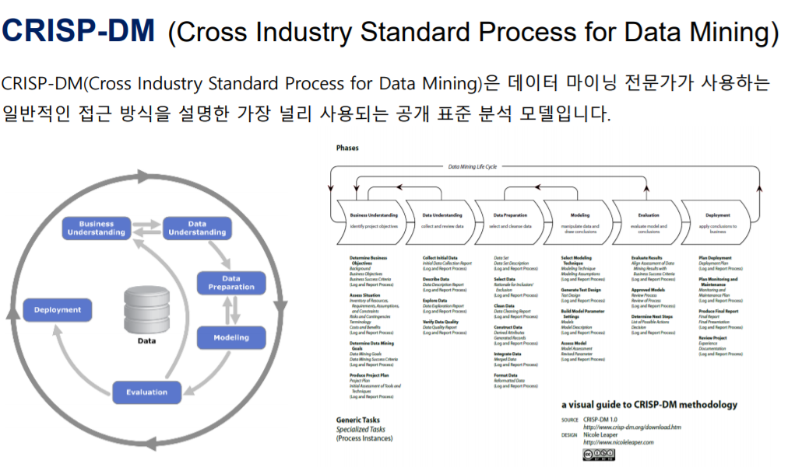

# 전통적 데이터분석 방법론 : CRISP-DM, KDD

###### 데이터 과학의 수명주기 CRISP-MD, KDD, TDSP, 사용자 지정 프로세스

## 분석

**분석** : 데이터의 중요한 패턴을 발견하고 해석한 결과를 전달하는 과정

축적된 데이터로부터 성공적 분석을 위해서는 적절한 **분석 기획** 수립은 필수

+ 실제 분석을 수행하기 앞서 분석을 수행할 과제를 정의

+ 인사이트 등 결과를 도출할 수 있도록 적절하게 관리할 수 있는 방안 계획

### 분석 기획 수행시 고려할 점

1. **가용 데이터에 대한 고려(Available Data)**

분석을 위한 데이터 확보가 우선, 데이터 유형에 따라 적용 가능한 솔루션과 분석 방법이 다르기 때문에 유형에 대한 분석이 선행적으로 이루어져야 한다.

2. **적절한 활용방안과 활용사례 (Proper Business Use Case)**

분석을 적용하여 성과를 낼 수 있는 대상 업무가 있어야함. 동 업종 또는 동 업무의 분석 적용 사례 참조할 수 있다. 유사 분석 시나리오 및 솔루션을 최대한 활용하는 것이 중요

3. **장애요소들에 대한 사전계획 수립(Low Barrier of Execution)**

1회성 분석에 그치지 않고 조직 역량으로 내재화되기 위해서는 지속적인 교육 및 활용방안 등의 변화 관리가 고려되어야 한다.

### 분석 대상(What)과 방법(How)

분석의 대상(WHAT)과 분석의 방법(HOW)에 따라 4가지 유형으로 나누어 분석 수행, 결과 도출 과정 반복

![[그림1] 분석의 4가지 유형](https://www.2e.co.kr/news/photo/202012/301010_3634_547.jpg)

## KDD분석 방법론과 CRISP-DM 방법론

매번 분석시마다 새로운 분석 기획을 하는것은 비효율적임

적절한 분석 절차가 정찾하기 위해서는 체계화한 절차와 방법이 정리된 분석 방법론이 필요.

방법론은 절차와 방법, 도구, 기법, 템플릿과 산출물로 구성. 또한 활용하기 쉽도록 구성되어야 한다.

### KDD분석 방법론

**KDD(Knowledge Discovery in Database)** 분석 방법론은 데이터를 통해 통계적 패턴이나 지식을 찾을 수 있도록 정리한 데이터마이닝 프로세스

데이터마이닝, 기계학습, 인공지능, 패턴인식, 데이터 시각화에서 응용 될 수 있는 구조를 가지고 잇음

KDD분석 방법론은 데이터셋 선택, 데이터 전처리, 데이터 변환, 데이터마이닝, 결과 평가로 이루어져 있음

![[그림2] KDD 분석 절차](https://www.2e.co.kr/news/photo/202012/301010_3635_555.jpg)

**1. 데이터 선택 Selection**

데이터베이스나 Raw data에서 <u>분석에 필요한 데이터를 선택</u>하는 단계

분석을 하려는 산업도메인에 대한 이해와 해당 과제의 목표 설정이 필수

**2. 데이터 전처리 Preprocessing**

선택된 데이터셋에 포함 되어 있을 수 있는 노이즈와 이상값, 결측값들을 식별하고 필요하다면 삭제 및 변환 등의 전처리를 통해 <u>데이터셋을 정제</u>하는 단계

이 단계에서 추가로 데이터가 필요한 경우, 데이터셋 선택 절차를 반복한다.

**3. 데이터 변환 Transformation**

정제된 데이터를 분석 목적에 따라 데이터의 feature를 생성·선택하고 데이터 차원을 축소하며 데이터마이닝을 진행할 수 있도록 <u>변환</u>하는 단계

**4. 데이터 마이닝 Data Mining**

학습 데이터셋을 이용하여 분석 목적에 맞게 데이터마이닝 알고리즘을 선택하여 <u>데이터마이닝을 실행</u>하는 단계

필요에 따라 데이터 전처리(2) 및 데이터 변환(3) 절차 반복할 수 있다.

+ **데이터 마이닝**(**data mining**) : 대규모로 저장된 데이터 안에서 체계적이고 자동적으로 통계적 규칙이나 패턴을 분석하여 가치있는 정보를 추출하는 과정

**5.데이터 마이닝 결과 평가 Interpretation / Evaluation**

데이터 마이닝을 수행한 결과에 대해 해석과 평가 진행

결과가 충족되지 않았을 경우, 데이터 선택 절차(1)와 데이터 마이닝 절차(4) 반복 수행

### CRISP-DM 분석 방법론

**CRISP-DM(Cross-Industry Standard Process for Data Mining)** 방법론은 전 세계에서 가장 많이 사용되는 데이터 마이닝 표준 방법론

단계, 일반과제, 세부과제, 프로세스 실행 등의 4가지 레벨로 구성된 계층적 프로세스 모델

CRISP-DM의 절차는 6단계로 구성되어 있는데, 각 단계들은 순차적으로 진행되는 것이 아니라 필요에 따라 단계 간의 반복 수행을 통해 분석의 품질을 향상 시킨다.

![[그림3] CRISP-DM 분석 절차](https://www.2e.co.kr/news/photo/202012/301010_3636_5611.jpg)

**1. Business Understanding(업무 이해)**

분석을 수행하고자하는 과제의 목적과 요구사항을 이해하고, 도메인 지식을 활용하여 <u>초기 프로젝트 계획을 수립</u>하는 단계

업무 목적 파악, 상황파악, 데이터마이닝의 목표 설정, 프로젝트 계획 수립 등의 세부 업무 포함

**2. Data Understanding (데이터 이해)**

분석을 위한 <u>데이터를 수집하고 이해</u>하는 단계

초기 데이터 수집, 데이터 기술 분석, EDA, 데이터 품질 확인 등이 있다.

**3. Data Preparation (데이터 준비)**

수집한 모든 데이터에서 <u>분석에 용이한 데이터만을 추출하여 편성</u>하는 단계

데이터셋의 선택과 데이터 정제, 분석용 데이터셋 편성, 데이터 통합, 데이터 포맷팅의 업무가 있음

+ **머신러닝에서 일반적 Data Preparation 과정 정리**
  1. 데이터 준비 과정의 중요성
  2.  결측치의 처리방법
  3. 특징 추출 (Recursive Feature Elimination)
  4. 데이터 정규화
  5. 원 핫 인코딩으로 범주 변환 (One Hot Encoding)
  6. 숫자 변수의 범주형 변수로 변환
  7. PCA를 통한 차원 축소

**4. Modeling (모델링)**

<u>다양한 알고리즘을 선택하여 모델링</u> 과정을 수행하고 파라미터를 최적화 하는 단계

학습 데이터셋 통해 모델링을 수행, 실험 데이터셋으로 평가

수행 업무 : 모델링 기법 선택, 모델 테스트 계획 설계, 모델 작성과 평가

**5. Evaluaion (평가)**

<u>수행한 모델링 결과가 과제 목적에 적절한지 평가</u>하는 단계

평가된 모델링 평가가 분석 결과로 적용되는지 판단

분석결과 평가, 모델링 과정 평가, 모델 적용성 평가 등의 수행 업무 포함

## 정리

데이터 경제가 진화될수록 데이터 분석의 가치는 커진다. 전통적으로 적용해왔던 분석 방법론은 지금도 여전히 유효하다. KDD방법론은 5가지, CRISP-DM방법론은 6가지 프로세스로 이루어져 있다. 모두 이론적인 프로세스보다 구체적이면서 실무 적용 측면을 강조하고 있다. 

각 단계 간에는 피드백을 통한 반복으로 분석 품질을 높이고 있다. 분석 기법과 알고리즘이 새롭게 소개되고 있는 현재에도 위 두가지 방법론은 기본으로서 이해하고 있어야 한다.

참고

https://www.2e.co.kr/news/articleView.html?idxno=301010