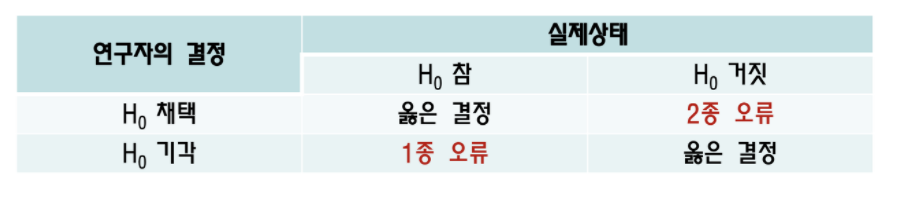
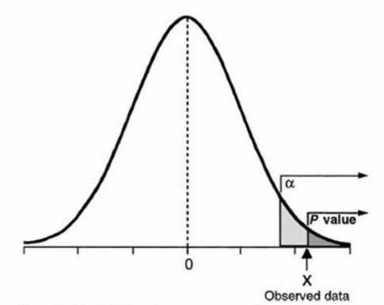
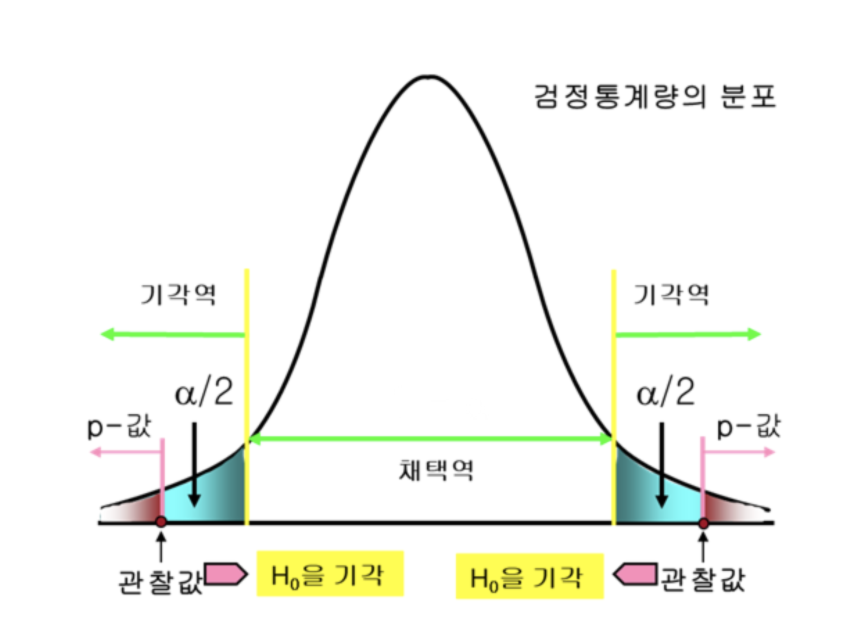

# 통계적 가설검정

## CHAPTER 11

### 통계적 가설검정 (statistical hypothesis testing)

모집단의 모수에 관한 두 가지 가설을 세우고, 표본으로부터 계산되는 통계량을 이용하여 어느 가설이 옳은지 판단하는 통계적인 방법 (표본의 정보를 이용해 그 가설을 검증하는 기법)

+ 가설검정에서의 모수에 관한 두 가설

  1.**귀무가설** (null hypothesis)

  2.**대립가설** (alternative hypothesis)

#### 귀무가설과 대립가설

**귀무가설** :대립가설과 반대되는것으로, '차이가 없다.' or '효과가 없다.' 라는 내용. **H0**으로 표기되며, 귀무가설은 통게가설의 목표이다.

**대립가설** : 대립가설이 주장하고 싶은 가설로 '차이가 있다.' or '효과가 있다.' 라는 내용. **H1**으로 표기

이 두 가설을 검증하기 위해 표본으로부터 통계량을 계산하여 가설검정을 수행하는 것.

따라서 결론은 '귀무가설을 기각한다.(귀무가설은 옳지 않다는 결론)' or '귀무가설을 채택한다.(귀무가설이 옳지 않다고 말할 수 없다는 결론)' 중 하나이다. 

귀무가설은 채택한다는 것은 귀무가설이 **옳은지 여부를 알 수 없다고 보류하는 결론**이 된다.

- 귀무가설을 채택한다고 해서, <u>반대의 결론이 맞다는 것이 아니라는 점</u>에 주의해야 함.

'귀무가설을 기각한다/채택한다.'의 판단은 귀무가설의 가정을 바탕으로 했을 때 표본으로부터 계산되는 통계량이 드문 값인지 여부로 결정한다. 

+ 드문 값을 얻으면, 그것은 <u>우연이 아니라 어떤 의미 있는 값</u>이라 생각하여 **귀무가설을 기각**
+ 드문 값이 아니면, **귀무가설을 채택**

 <u>우연이 아니라 어떤 의미 있는 것</u> = **유의하다** (Significant) 

아래 그림은 표본평균의 분포이다.

 회색부분 : 5%밖에 발생하지 않는 드문 사건 ↔ 흰 부분 : 자주 발생하는 사건

**기각역** (rejectio region) : 귀무가설이 기각되는 구간

**채택역** (acceptance region) : 귀무가설이 채택되는 구간

**유의수준** (level of significance) : 기각역에 들어가는 확률 

- 가설검정에서는 유의수준을 정하고 나서 검정을 수행한다.

**임곗값** (critical value) : 경계선상의 값

**검정통계량** (test statistic) : 검정에 사용되는 통계량

**P값** (p-value) : 검정통계량보다 왼쪽에 있는 영역의 면적

- 검정통계량이 임곗값보다 작을때, 임곗값보다 왼쪽에 있는 영역의 면적은 유의사항에 해당한다. 

(알파 : 임곗값, X: 검정통계량) 

가설검정은 검정통계량과 임곗값 비교가 아닌, p값과 유의수준(0.05 또는 0.01) 의 비교로 수행될 수도 있음.  

- p값이 유의수준보다 작을 때, **귀무가설 기각**
- p값이 유의수준보다 클 때, **귀무가설 채택**

유의수준은 어느 정도의 확률로 발생하는 사건을 드물다고 인식하여 설정한 것으로, 5%나 1%라는 값이 자주 사용된다. 그러나 이 값들은 어디까지나 <u>관습적인 값</u>이라는 점에 유의해야 한다.

+ 유의 확률(p-value, p 값) : 귀무가설이 맞다는 전제하에(H0채택), 표본에서 실제로 얻어진 통계값(검정 통계량 t, z, F, ..)보다 더 극단적인 값이 나올 확률 
  + 1종 오류(귀무가설이 참임에도 귀무가설을 기각할 오류)를 범할 확률

ex. p-value가 0.05라면, 100번 중에서 95번은 1종 오류를 범하지 않았고, 5번만 1종 오류를 범했다는 것이다.

파란선은 잔차

예측값 - 실제값 제곱을 잔차로 나누면 

파생 변수

encoding - 라거?? one-hot

피어슨은 이니얼 , 음의 선형관계

선형관계 피어슨 - 스피어맨?

독립변수 간의 상관성을 통해서 제일 좋은? 특징을 뽑아내는거라고 이해하면 되나요?

카이스퀘어 검증

파생변수로 축소

(카테고리칼아노바 : 변수1, 카이스퀘어(Chi-Squared) : 칼럼 여러개 / 변수 여러개)

아노바 개념

아노바 - 하나의 컬럼 내(독립 변수 내) 각의 평균과 전체평균의 라벨 평균의 분산값을 계산해서 어떤 부분에서 성적이 똑같거나 다를때 변수 선택 시 똑같은 것은 버림( 차원 축소 위해 )

독립변수 내 클래스가 여러개일때 아노바 테스트 f분포값으로 가설 검증

범위내에서 전체 평균과 다른게 ㅇ있다 없다로 판별 상관성 비교 피쳐 뽑아낼때 쓰는 방법이 아노바

- 혹시 영향을 덜주는 독립변수들을 계속 없애는 것을 f분포를 이용한다는 건가요?
  - https://www.youtube.com/watch?v=vusSCU-gn4A

뉴메리칼 카테고리칼 변수 정의

엔코딩 - 디코딩

data preparation과정 순서

마지막에 도메인 (데이터 언더스탠딩에서의 파생변수까지)

