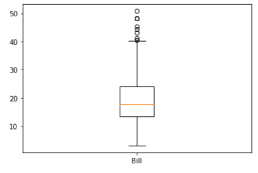

# Seaborn (데이터 시각화)

seaborn은 데이터 시각화 라이브러리 중 하나로 대표적 시각화 도구로는 matplotlib과 seaborn이 있다. seaborn은 matplotlib대비 손쉽게 그래프를 그리고 그래프 스타일 설정할 수 있다는 장점이 있다.

정교하게 그래프 크기를 조절하거나 각 축의 범례 값을 조절할 때에는 matplotlib을 함께 사용해야한다.


**아래 표는 seaborn라이브러리에서 제공해주는 그래프(plot) 종류이다.**


## 라이브러리 임포트

```sql
#라이브러리 임포트
import pandas as pd 
import matplotlib.pyplot as plt 
import seaborn as sns 

#seaborn에서 제공하는 flights 데이터 셋을 사용
flights = sns.load_dataset('flights')

#그래프 사이즈 설정
plt.figure(figsize=(12, 3))
```


## Categorical Plot

카테고리 데이터 변환

### Barplot 

```sql
sns.barplot(data=flights, x="year", y="passengers")
```

막대그래프를 그린다. filghts DataFrame의 x축은 year, y축은 passengers 컬럼의 값을 도식화 한다.

x축에는 정수형 데이터 형태가 적합하다. 만약 x축으로 사용할 값이 소숫점을 포함한 실수형의 연속데이터라면 barplot이 굉장히 세밀하게 표시되어 그래프를 이해하기 어려운 형태가 될 것이다.

barplot과 같이 Categorial Plot을 사용할 때는 실수타입의 연속형 데이터가 x축에 설정되지 않도록 하는것이 좋다.


x축에 사용한 year값은 정수형 데이터로 barplot을 그리기 적합한 형태의 데이터이다.

barplot의 각각의 값에 검정색 막대기가 꽂혀있는 것은 데이터의 신뢰구간을 나타낸다. 데이터의 평균값을 사용하여 표시한다.

- barplot은 각각의 x축(year)값에 대해 하나의 대표값을 y축(passenger)으로 설정해야하므로 데이터의 평균값을 사용하여 표시
- 예를들어, 1949년에 승객수가 100명인 날이 있고, 120명인 날도 있다면 평균인 110명을 기준으로 그래프를 그리는 것

데이터의 4분위 수 기준으로 **상세한 도포를 도식화** 하고 싶다면 **Violinplot 이나 Swarmplot을 사용**하는것이 더욱 효과적이다.


### Boxplot

```sql
sns.boxplot(data=flights, x="year", y="passengers")
```


### Violineplot

```sql
sns.violinplot(data=flights, x="year", y="passengers")

```


### Swarmplot

```sql
sns.swarmplot(data=flights, x="year", y="passengers")

```


**boxplot, Violinplot, Swarmplo**t은 <u>barplot</u>과 유사하게 x축 (year, 연도)별 y축(passengers, 승객 수) 값을 표시하지만, <u>하나의 대표값으로 표시하는 것이 아니라</u> **데이터의 분포를 확인**할 수 있도록 표시한다.


## Relational Plot

연속데이터 관련성

### Lineplot

```sql
sns.lineplot(data=flights, x="year", y="passengers")

```


선 그래프를 도식화한 lineplot

barplot의 가장 상위 점을 하나의 선으로 이은 형태의 그래프이다. 선 주변의 옅은 파란색은 데이터의 신뢰구간을 표현한 것이다. 즉 1950년대에는 y축 데이터 (승객 수)가 약 150부근에 몰려 있다면, 1960년에는 400~500 사이에 분포한 것을 확인할 수 있다.


### scatterplot

```sql
sns.scatterplot(x='total_bill', y='tip', hue='sex', data=tips)
```


## Distribution Plot

데이터 분포

### Distplot

```sql
sns.distplot(flights["passengers"])
```


displot은 하나의 데이터에 대해 분포를 확인할 때 사용한다.

승객 데이터는 100~300 사이에 많이 분포해있다는 것을 확인할 수 있다. displot에서는 막대(bin)를 사용한 히스토그램과 밀도를 선으로 이은 kde plot이 함께 그려진다. 파라미터 설정을 통해 막대의 개수와 kde선 표시 여부 등을 추가로 설정할 수 있다.


## Regression Plot

데이터 분포 회귀선

### regplot

```sql
sns.regplot(data=tips, x='total_bill', y='tip')
```


```sql
sns.regplot(data=tips, x='size', y='tip')
```


# Multi-plot gird

여러 개의 그래프, 상대비교 

### pairplot

```sql
sns.pairplot(tips.loc[:,['total_bill','tip']])
```


## 실습내용

목표변수

- 매출
- 팁
- 요일별 팀 Size 수
- Tip rate
- 요일별 방문 예상 팀 수

```sql
import seaborn as sns
import pandas as pd
df = pd.read_csv('tips.csv')
tips = df

t_bill = tips.total_bill
plt.boxplot(t_bill, labels=["Bill"])
```



```sql
plt.boxplot(t_tips, labels=['tips'])
```


```sql
t_sns_bill = sns.boxplot(data= tips, x="total_bill")
```


```sql
sns.distplot(x=t_bill, bins = 50 )
#bin = 막대 
#bin 크기 작아질수록 막대는 두꺼워지고, 커질수록 막대는 얇아진다.              
```


```sql
sns.distplot(x=t_bill, bins = 10 )
```


```sql
sns.distplot(x=t_bill, bins = 100 )
```


``` sql
sns.histplot(x=t_bill, bins = 50 )
```


```sql
sns.distplot(x=t_tips, bins = 50 )
```


```sql
sns.histplot(x=t_tips, bins = 50 )
```


```sql
sns.regplot(data=tips, x='total_bill', y='tip')
```


```sql
sns.regplot(data=tips, x='size', y='tip')
```


```sql
sns.scatterplot(x='total_bill', y='tip', hue='sex', data=tips)
#hue = class
```


```sql
sns.pairplot(tips.loc[:,['total_bill','size']])
```


```sql
sns.pairplot(tips.loc[:,['time','tip']])
```


