# PCA 수업 내용

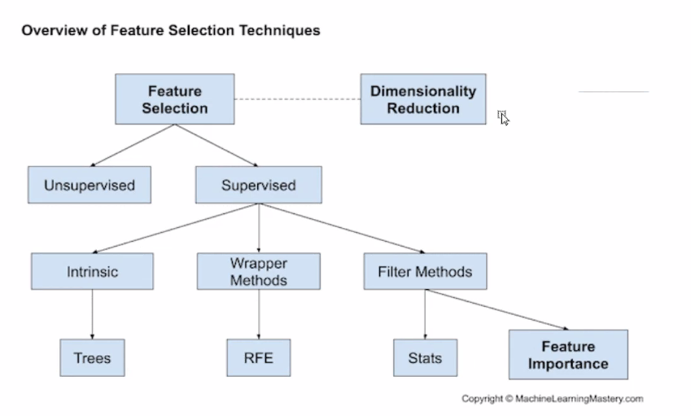

Dimensionality Reduction(차원 축소)에는 FS(형상 선택), FE(형상 추출) 이 있으며 FE 방법에는 PCA가 있다.

PCA는 원래 데이터셋(original dataset)에서 특정 Feature를 선택하는 것이 아니라, Feature들이 구성하는 차원(dimension)에서의 부분 공간(subspace)를 구성하는 축(eigenvector)를 찾아 투영(projection)해주는 알고리즘으로써 특정 feature(ex. 키, 몸무게와 같은)를 선택하는 것은 아니다.

그리고, PCA는 데이터의 feature들이 구성하는 차원을 축소함으로써 학습 단계에서의 속도를 높이거나, 시각화에 주로 쓰인다. 따라서, PCA를 이용해서는 학습속도를 높일 수 있으나, 성능(performance)가 높아진다고는 볼 수 없을 듯 하다.

## 차원 축소시 PCA에서는 

1. covariance matrix(공분산 행렬)생성  
2. 고유값(eigenvalue) λ 을 가짐
3. cutoff할 것 선택(목표)
4. 선택 (기준은 고유값)

## PCA는

- 목표변수를 정하지 않음 (목표변수는 상관 없다)
  - 실습 코드를 보면 목표변수 y값 설정 X
- 가지고 있는 feature 중에서 covariance matrix를 이용해 고유값만을 구하는 것
- 공간에서 데이터 분포만을 보는것

## PCA에서 고유벡터를 통해 고유값 구하기

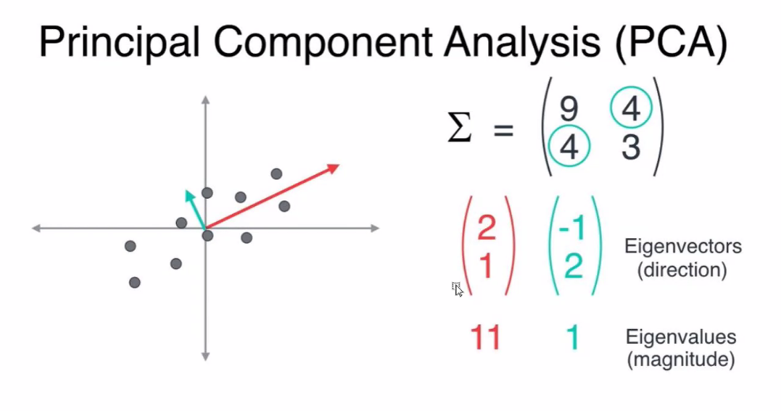

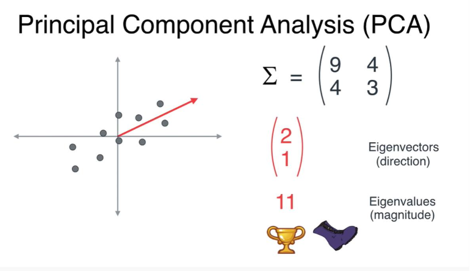

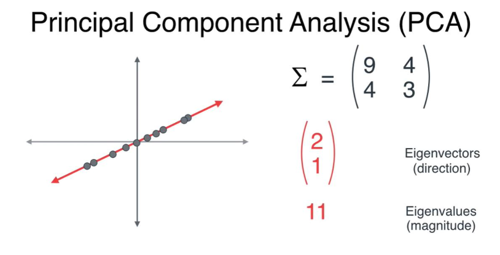

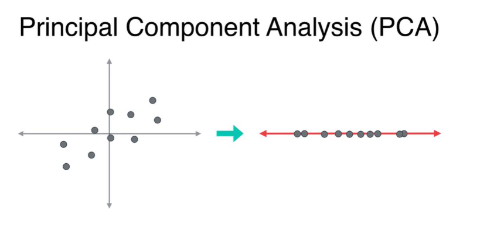

PCA의 목적은 원 데이터(original data)의 분산을 최대한 보존하는 축(axis)을 찾아 투영(projection)하는 것이다.

공분산 C의 고유벡터 (eigenvector, 방향) e , 공분산 C의 고유값(eigenvalue, 수치) λ 

λ(고유값)는 eigenvector(고유벡터)로 투영했을 때의 분산(variance)이다.

이때, 고유벡터의 열벡터를 주성분(PC, principal component)라고 한다.

따라서, 고유벡터(digenvector)에 투영하는 것이 분산이 최대가 된다.

### 분산

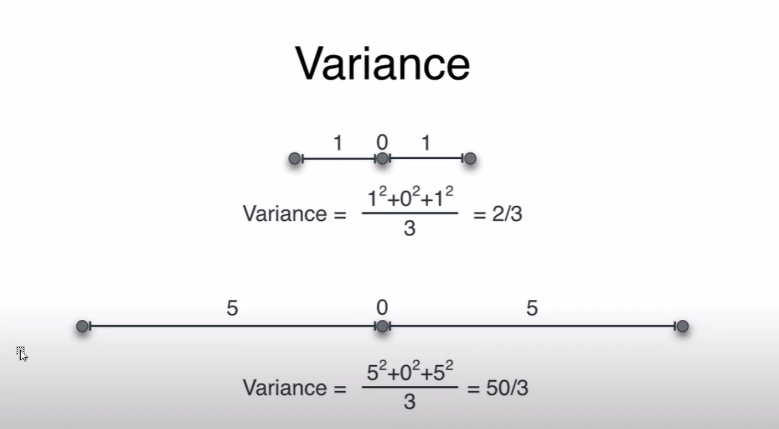

축 1개에서 분산값 동일

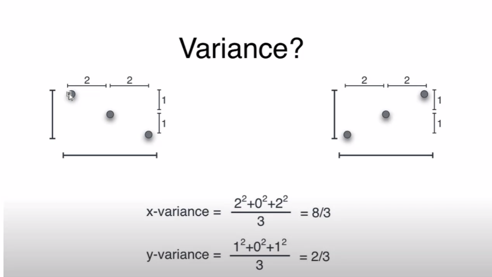

축2개의 x, y 분산 같지만 위치가 다름

이를 구분할 수 있는것이 Covariance (공분산)

### 공분산

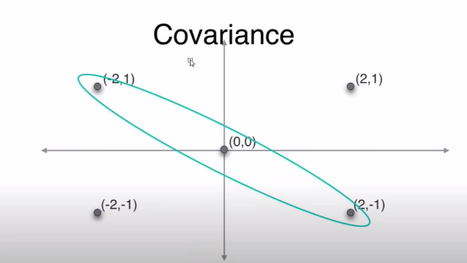

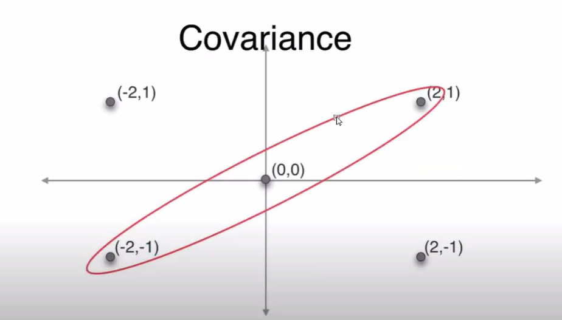

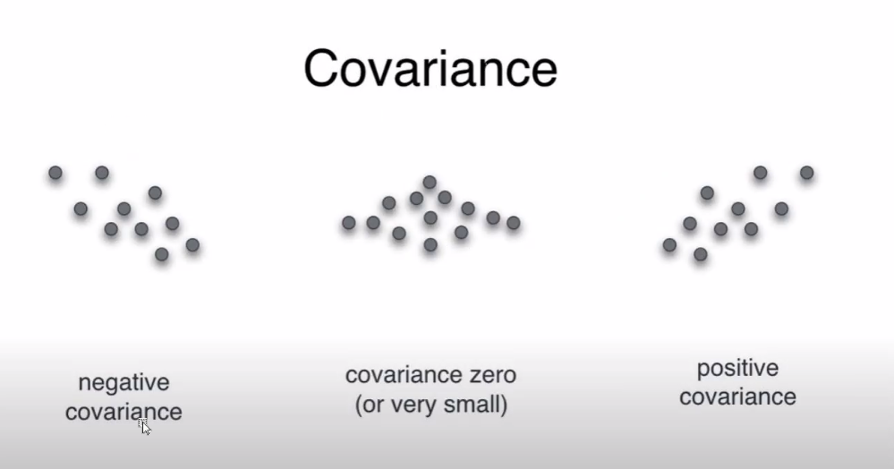

절대값 크다 = 분산의 분포가 크다

절대값이 작으면 뭉쳐 있음 = 분산의 분포 작다

### 공분산 매트릭스

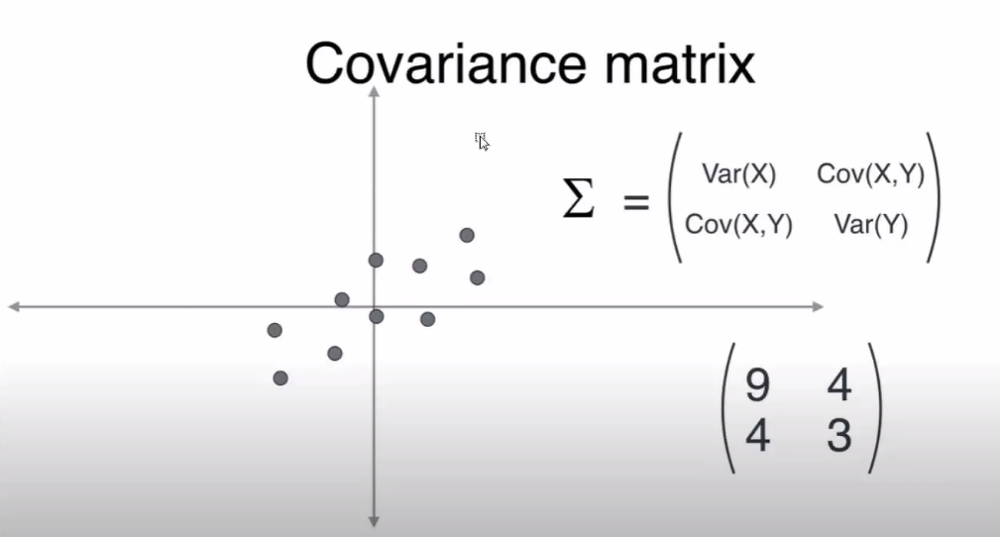

### Linear Transformation(선형 변환)

벡터 공간에서 벡터 공간으로 가는 함수로, 그것들 중 벡터 공간의 성질을 보존하는, 즉 선형성을 갖는 함수이다.

 쉽게 말해, 한 점을 한 벡터공간에서 다른 벡터공간으로 이동시키는데 그 이동 규칙을 **선형 변환**이라고 한다.

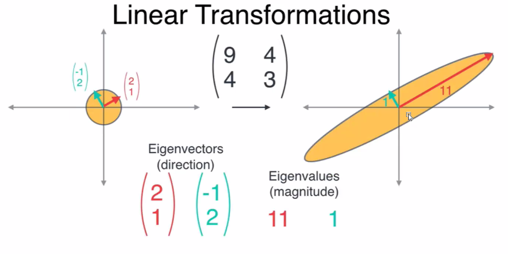

고유값이 선택되어 차원축소를 위한 cutoff기준이 세워졌음

## PCA 과정

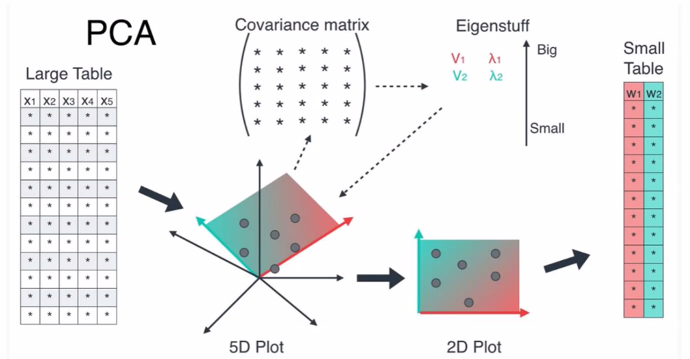

위의 그림은 형상추출의 주성분 분석(PCA)를 대략적으로 나타낸 것이다.

1. X1~X5까지 5개의 feature를 가지는 5차원이 존재

2. pca는 자체적으로 covariance matrix(공분산 매트릭스)를 통해 공분산 값을 구함

3. 고유벡터, 고유값을 얻음. 5개의 차원에서 5개의 고유값이 나올것

- λ(고유값)는 eigenvector(고유벡터)로 투영했을 때의 분산(variance)

  이때, 고유벡터의 열벡터를 주성분(PC, principal component)라고 한다.

  따라서, 고유벡터(digenvector)에 투영하는 것이 분산이 최대가 된다.

4. 고유값을 비교하여 위에서 부터 큰 값을 리턴한다.(cutoff)
5. 차원 축소를 위해 작은 3개를 cutoff 남은 2개는 살아남은 feature
6. 5차원에서 2차원으로 차원축소 완료

<u>2차원 이상의 데이터 분포에서 차원을 축소하면서 축을 찾는것</u>

## 직관적으로 이해

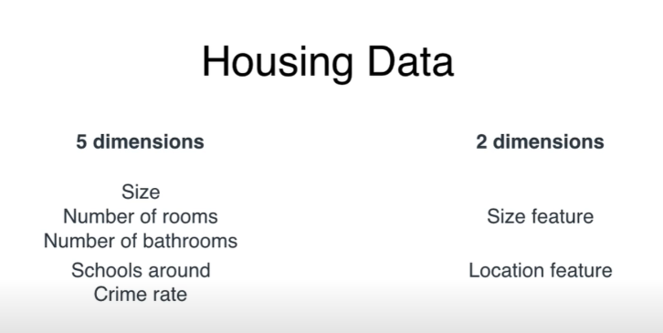

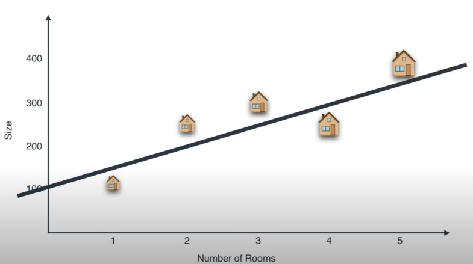

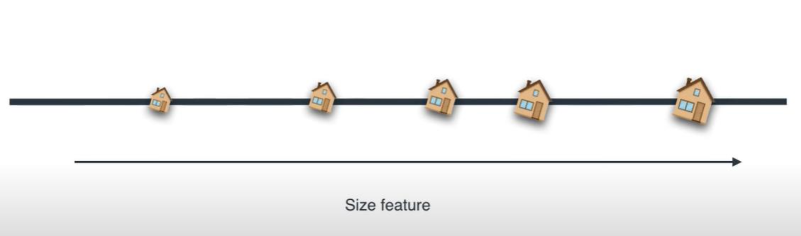

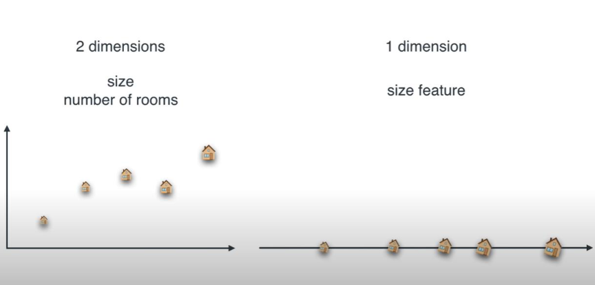

