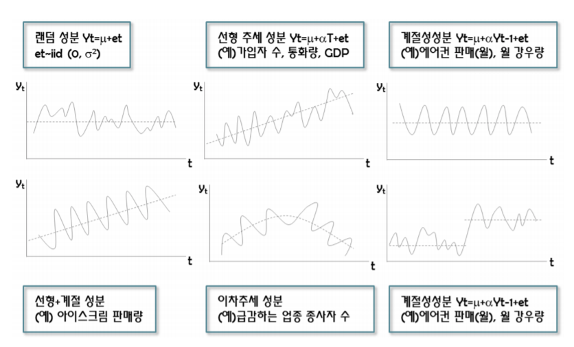
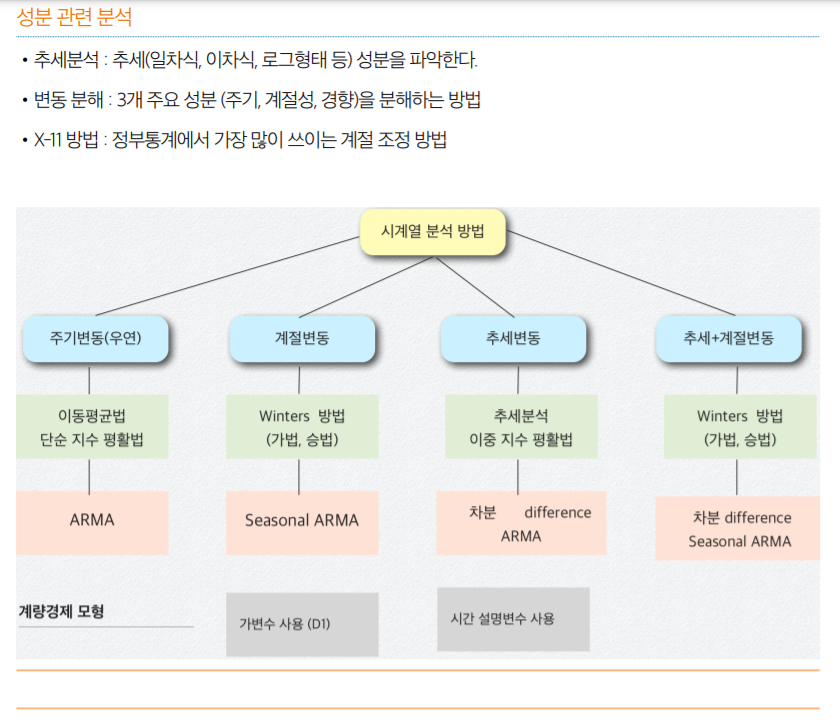
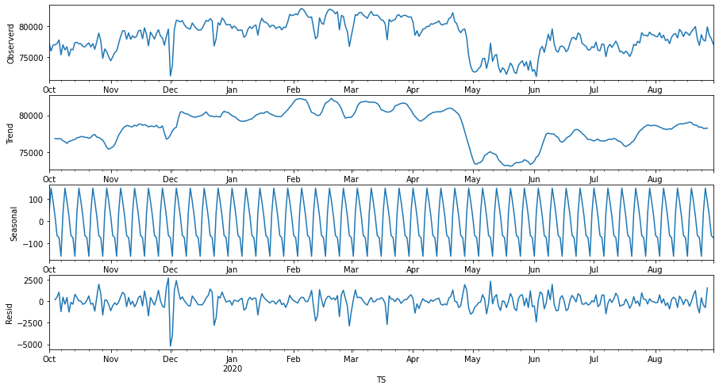

# 시계열 분석

저번에 배운 pca (feature selection) 은 여러 변수 중 중요한 변수를 뽑아낸 것 (차원 축소)

지금은 시간 - 전력량 처럼 독립변수가 하나밖에 없는 경우에 어떻게 분석하는지 알아본것

제일 흔한게 시간에 따른 변화량이니까, 이거로 확인한 것

- 아까 확인한 삼성전자 주가와 같이, 주가 하나가 시간에 따라 어떻게 변화하는지 예측


## 개요

### 개해

시계열(time series) 데이터는 관측치가 시간적 순서를 가지게 된다. 일정 시점에 조사된 데이터는 횡단(cross-sectional)자료라 한다.

- KOSPI 조사, 기업 월별 매출액, 소매물가지수, 실업률, 환율 등이 시계열 자료이다.

데이터 표현 : {Y<sub>t</sub> ; t = 1, 2,..., T}, 횡단자료의 시점 t에서의 관측 데이터는 Y<sub>t</sub> 기호를 사용한다.

시간 t는 시각을 나타내는 기호로 시, 분, 초, 일, 주, 월, 분기, 년으로 시각 순서대로 정렬


### 시계열 데이터 분석 목적

가장 중요한 목적은 미래 값을 예측 : trend analysis, smoothing, decomposition, ARMA model

시스템 시계열 데이터 이해와 특성 파악 : spectrum analysis, intervention analysis, transfer function analysis

시계열 데이터의 특성을 파악 : 경향(trend), 주기(cycle), 계절성(seasonality), 불규칙성(irregular) 등

데이터의 과거 흔적(정보)를 활용하여 미래 값을 예측하는 것이다. 

- 향후 일주일간 주가 예측, 다음 달 매출액 예측 등


## 시계열 성분

시계열 데이터, {Y<sub>t</sub> ; t = 1, 2,..., T}(데이터 표현)는 다음의 4가지 성분으로 구성되어 있다.

- 4가지 성분 중 패턴을 갖는 것 : 경향, 계절성, 순환
- 나머지 패턴이 없는 부분 : 불규칙 으로 정의
- 주기, 계절성은 차분에 의해 제거되며 순환(주기)가 패턴을 대표한다

### 성분 4개

**경향 (Trend) T<sub>t</sub>**

- (장기간 패턴) 시계열 데이터가 증가(감소)하는 경향이 있는지 혹은 안정적인지 알 수 있다. 직선 경향, 이차 경향이 있으며 장기변동 요인에 의해 발생한다.

**순환 (Cycle) C<sub>t</sub>**

- recurring up and down movement around trend levels 일정한 주기(진폭)마다 유사한 변동이 반복된다. sin커브와 같이 일정 간격으로 높은 곳과 낮은 곳이 반복

**계절성 (Seaconality) S<sub>t</sub>**

- periodic pattern that complete themselves within a specific time period 주별, 월별, 분기별, 년별 유사 패턴이 반복된다.

**불규칙성 (Irregular) I<sub>t</sub>**

- erratic movement with no recognizable pattern 일정한 패턴 없음, 오차항이 여기에 해당함




## 시계열 자료 분석 방법

회귀분석(계량경제)방법, BOX-JENKINS 방법, 지수 평활법, 시계열  분해 방법이 있다. 회귀분석 방법과 BOX-JENKINS방법 (ARMA)은 수학적 이론 모형에 의존하고 시간에 따라 변동이 많은(빠른) 시계열 자료에 적용된다.

지수 평활법이나 시계열 분해 방법은 다소 직관적인 방법이며 시간에 따른 변동이 느린 데이터를 분석하는데 사용된다.

과거의 데이터 패턴을 활용하여 미래 값을 예측, 설명변수가 있는 시계열 모형은 econometric 계량경제모형

- frequency domain : Fourier 분석에 기초, spectrum density function
- time domain : 자기상관함수 이용, 관측값들의 시간적 변화 탐색



http://wolfpack.hnu.ac.kr/Fall_2020/lecturenote/sm_time_series.pdf


## ETS Decomposition

여기서 다루는 내용은 시계열분석 중 ETS Decomposition를 다룬다.

시계열 분해 모델은 크게 Additive, Multiplicative 모델로 나눌 수 있다.


### Additive Model

$$
yt=Level+Trend+Seasonality+Noise
$$



### Multiplicative Model

multiplicative 모델을 활용하려면 데이터에 0이 존재하면 안된다. 0이 존재하면 데이터를 분해할 수 없다.
$$
yt=Level×Trend×Seasonality×Noise
$$


.png)


###  Additive or Multiplicative 

**linear trend** 를 가지고 있고 seasonality 와 trend 컴포넌트가 시간흐름에 따라 **고정적일 때** (ex 매년 승객 1만명 증가) **additive model** 을 사용합니다. 

**non-linear** 하게 증가하거나 감소하는 trend 를 보일 경우 (ex 매년 승객 수 두 배 증가) **multiplicative model** 이 더 적합합니다.

(챠트를 보면 초기에 비해 후기로 갈 수록 꾸준히 증가하는 비율로 비선형 증가 추세를 보이고 있습니다.)

이 둘의 가장 큰 차이점은 additive model은 프리퀀시와 trend가 다르다.

- 특히 장기간 분석에서는 seasonal data 결과는 trend를 따라가지 못해서 적합하지 않다.

반면, multiplecative model은 분해값들의 곱인 비율로 이루어져서 있기 때문에 trend에 맞게 seasonal data가 변화한다.

- 이는 시간이 지남에 따라 금리가 오르는 현상을 고려할 수 있는 모델로 볼 수 있다.


## Prophet 사용법

### TS1.ipynb 

1) import

```sql
import pandas as pd
from fbprophet import Prophet
```


2) 데이터를 prophet에 맞도록 가공 

​	- 필요한 컬럼은 ds, y 로 2개

```sql
df = pd.read_excel('Total_final.xlsx', index_col='TS', parse_dates=True, dtype={'Value':float})
df.drop(['Unnamed: 0','Unnamed: 0.1', 'Time', 'Max Value','Date'], axis=1, inplace=True)
df.rename(columns={'TS':'ds','Value':'y'},inplace=True)
```


3)

```sql
df_day=df.resample(rule='D').sum()
df_day=df_day.reset_index()
#df_day.columns
df_day.rename(columns={'TS':'ds','Value':'y'},inplace=True)
```


4)

```sql
df_day.drop(df_day.index[336], inplace=True)
```


5) prophet 객체 생성하고 Fit

```sql
m = Prophet(yearly_seasonality=True,daily_seasonality=True)
m.fit(df_day)
```


6) 미래 dataframe 생성 (7일 예측)

```sql
future = m.make_future_dataframe(7, freq='D') # Forecasting 7 days
future.tail()
```


7) 예측 / forecast 결과 확인 (yhat_lower, yhat_upper 같이 범위로 제공)

```sql
forecast = m.predict(future)
forecast[['ds', 'yhat', 'yhat_lower', 'yhat_upper']].tail(7)
```


8) forecatst 시각화

```sql
fig1 = m.plot(forecast)  # 시간에 따른 예측 결과
```

.png)


9) forecast components 시각화 (trend, weekly, yearly, daily)

```sql
fig2 = m.plot_components(forecast)   # 전기 사용량 하향곡선 (코로나 이후)
```

.png)


https://dodonam.tistory.com/89


