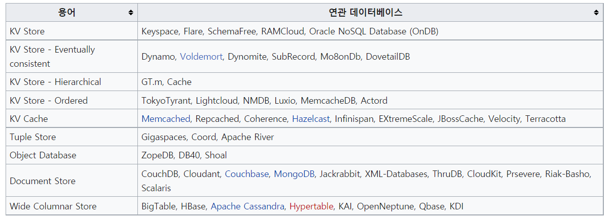
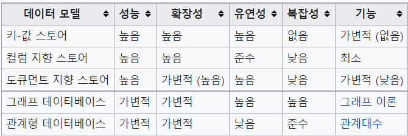
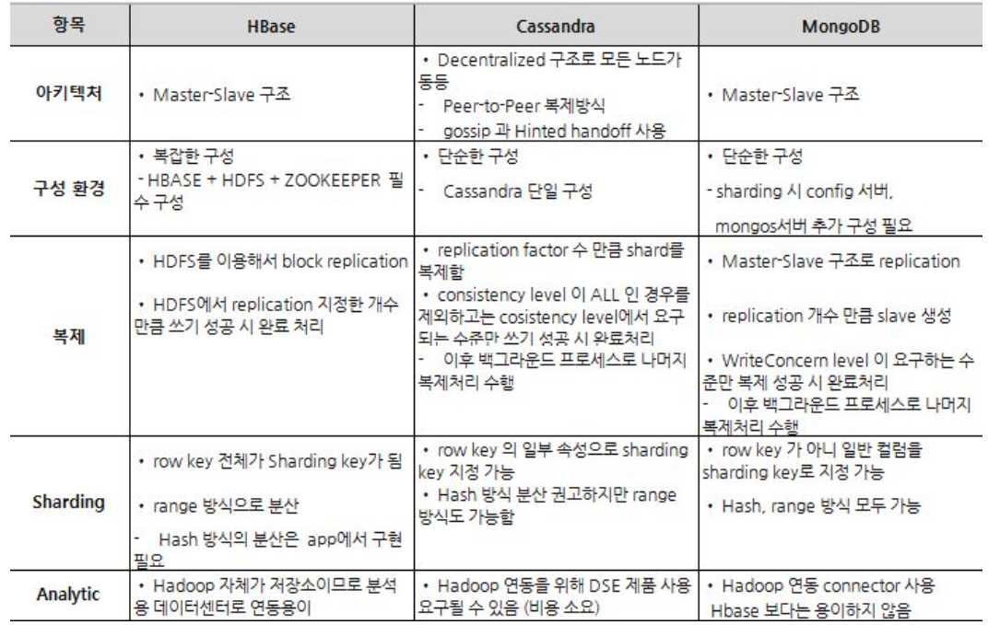
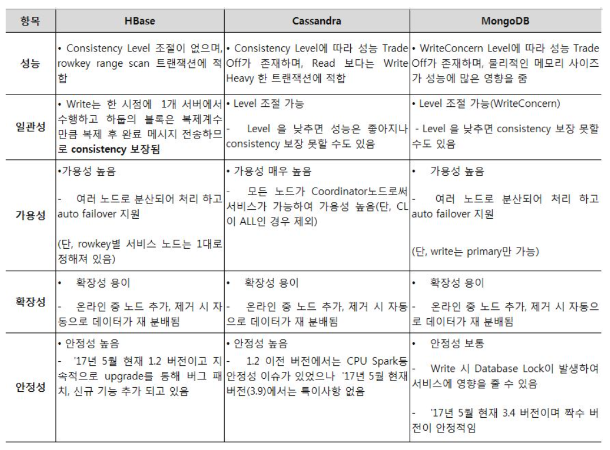

# NoSQL

살아남은 db플랫폼 

- NoSQL, Distributed SQL, Hadoop
  - hadoop : 대용량의 데이터를 적은 비용으로 더 빠르게 분석가능

## 개요

SQL : 관계형 DBMS에서 데이터를 조회, 수정, 삭제하거나 DBMS를 조작하는데 사용되는 언어

DBMS의 종류 중 하나인 NoSQL, 고성능 처리성능으로 떠오르는 ScyllaDB 솔루션

- Cassandra 호환 가능성 NoSQL, ScyllaDB중심

## NoSQL 이란?

**NoSQL**은 초고용량 데이터 처리 등 성능에 특화된 목적을 위해, 비관계형 데이터 저장소에, 비구조적인 데이터를 저장하기 위한 분산 저장 시스템이라고 볼 수 있다.

Not only SQL, 단순히 기존 관계형 DBMS가 갖고 있는 특성뿐만 아니라, 다른 특성들을 부가적으로 지원한다는 것을 의미한다.

기존 관계형 DB의 ACID 특성을 제공하지 않고, 뛰어난 확장성·성능 등 특성을 갖는 수많은 비관계형, 분산형 DB등장 후 NoSQL이라는 용어가 보편적으로 사용되었다.

관계형 데이터베이스 시스템의 주요 특성을 보장하는 ACID 특성

- Atomic
- Consistency
- Integrity
- Duarabity

NoSQL 데이터베이스의 특성을 살펴보면, 기존의 관계형 DB보다 더 융통성 있는 데이터 모델 사용하고, 데이터의 저장 및 검색을 위한 특화된 매커니즘을 제공한다.

NoSQL의 특징과 기존 관계형 DB의 차이점

- 관계형 모델을 사용하지 않으며 테이블간 조인 기능 없음
- 직접 프로그래밍을 하는 등의 비SQL 인터페이스를 통한 데이터 액세스
- 대부분 여러 대의 데이터베이스 서버를 묶어서(클러스터링) 하나의 데이터베이스를 구성
- 관계형 데이터베이스에서는 지원하는 Data처리 완결성 (Transaction ACID 지원) 미보장
- 데이터 스키마와 속성들을 다양하게 수용 및 동적 정의 (Schema-lsee)
- 데이터베이스의 중단 없는 서비스와 자동 복구 기능지원
- 다수가 Open Source로 제공
- 확장성, 가용성, 높은 성능

## NoSQL 구성

저장되는 데이터 구조(Data Model)에 따라 다음과 같이 나눌 수 있다.

#### Key Value DB

key와 value의 쌍으로 데이터가 저장되는 가장 단순한 형태의 솔루션

#### Wide Columnar Store

Big Table DB라고도 하며, Key Value 에서 발전된 형태의 Column Family 데이터 모델을 사용하고 있고, HBase, Cassandra, ScyllaDB등

#### Document DB

JSON, XML과 같은 Collection 데이터 모델 구조를 채택하고 있다. MongoDB등

#### Graph DB

Nodes, Relationship, Key-Value 데이터 모델을 채용하고 있다. 

## NoSQL의 종류

## NoSQL DB별 특성

## 주요 NoSQL 제품의 일반적 특성

## 주요 NoSQL제품의 시스템 견고성 특성

## 출처

https://www.samsungsds.com/kr/insights/1232564_4627.html?referrer=https://www.google.com/