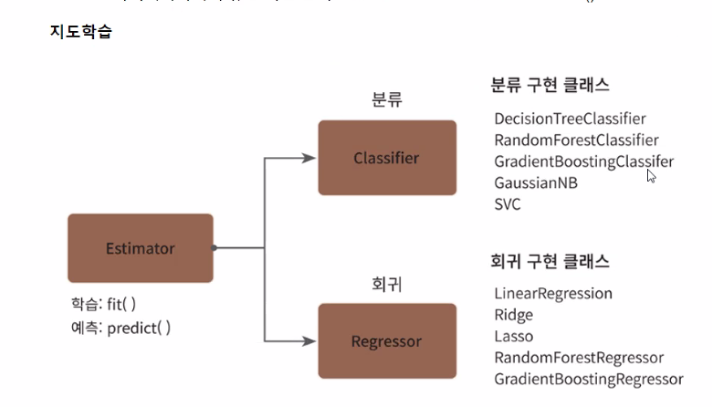
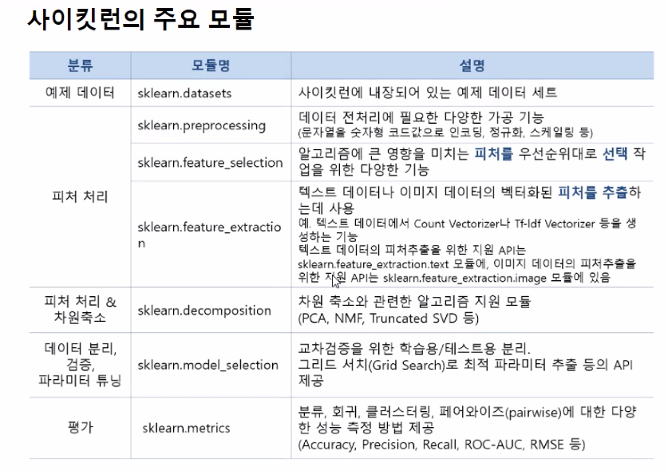
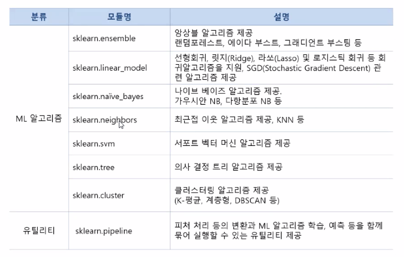
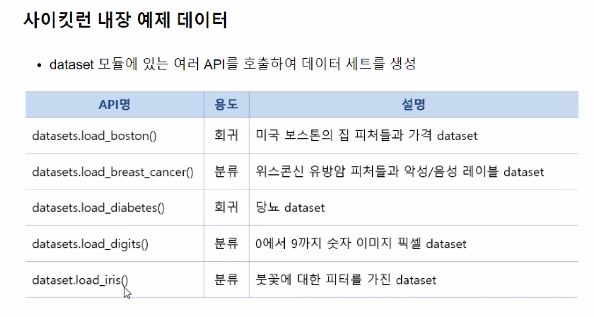
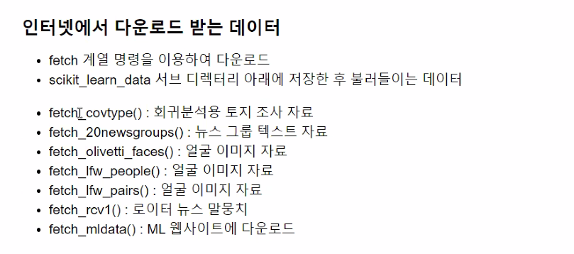
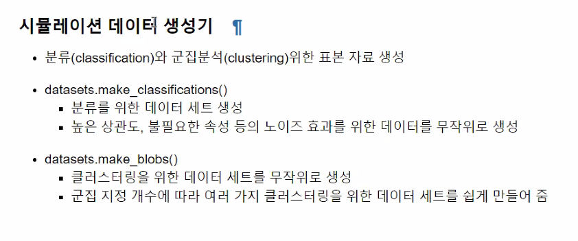

# 사이킷런 기반 프레임워크 익히기

## Estimator 클래스

머신러닝 모델(알고리즘) 클래스

학습을 위해서 fit()을 학습된 모델의 예측을 위해 predict() 메서드를 제공

- Esitimator를 인자로 받는 함수는 Estimator의 fit()과 predict()를 호출해서 평가하거나 하이퍼 파라미터 튜닝 수행
- 평가함수 cross_val_score()
- 하이퍼 파라미터 튜닝 지원 클래스 
  - GridSearch CV : GridSearchCV.fit()

