# 데이터 전처리

데이터를 분석하기에 좋은 형태로 만드는 과정

**Garbage In Garbage Out**

- 데이터 전처리가 중요한 근본적인 이유
- 데이터 품질은 분석 결과 품질의 출발점

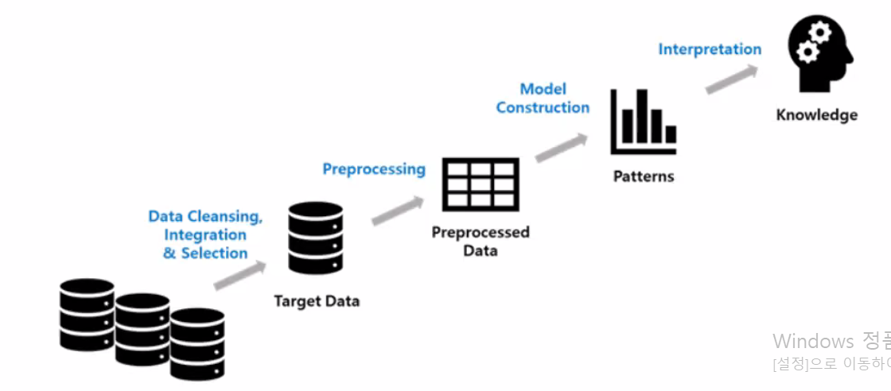

## 데이터 전처리의 필요성

데이퍼 품질이 높은 경우에도 전처리 필요

- 구조적 형태가 분석 목적에 적합하지 않은 경우
- 사용하는 툴, 기법에서 요구하는 데이터 형태
- 데이터가 너무 많은 경우
- 데이터 분석의 레벨이 데이터 저장 레벨과 다른 경우

데이터 품질을 낮추는 요인

- 불완전(incomplete) : 데이터 필드가 비어 있는 경우
- 잡음(noise) : 데이터에 오류가 포함된 경우
- 모순(inconsistency) : 데이터 간 정합성, 일관성이 결여된 경우


## 데이터 전처리 주요 기법

#### 데이터 정제

- 결측치, 이상치, 잡음

#### 데이터 결합

#### 데이터 변환

- Normalization, Scaling

#### 차원 축소

- Feature Selection (FS)
  - filter, wrapper, embedded
- Feature Extraction (FE)
  - PCA, SVD, FA, NMF

피처 수가 많아질 수록 어려운 부분이 늘어나기 때문에 차원 축소가 필요함

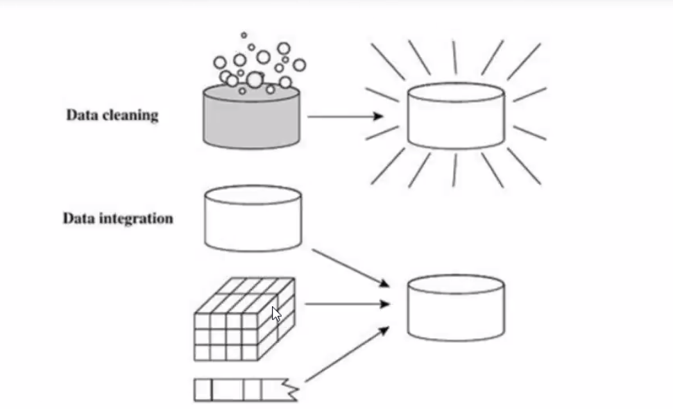

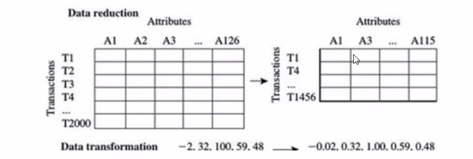


#### 결측값(missing value) 처리

- 해당 데이터 행을 모두 제거 (완전 제거법)
- 수작업으로 채워 넣음
- 특정값 사용
- 핫덱(hot-deck) 대체법
  - 동일한 조사에서 다른 관측값으로부터 얻은 자료를 이용해 대체
  - 관측값 중 결측치와 비슷한 특성을 가진것을 무작위 추출하여 대체
- 평균값 사용 (전체 평균 혹은 기준 속성 평균)
  - 표준오차 과소추정 발생
- 가장 가능성이 높은 값 사용 (회귀분석, 보간법 등)


### 데이터 인코딩

문자열을 숫자형으로 변환

- 인코딩 방식
  - 레이블 인코딩(Label encoding)
  - 원-핫 인코딩(One-Hot encoding)


#### 레이블 인코딩(Label encoding)

- 문자열 데이터를 숫자로 코드화
- 범주형 자료의 수치화
- 순서는 알파벳 a-z → 한글 ㄱ-ㅎ 오름차순으로 정렬
- 중복된 것 데이터는 하나로 분류

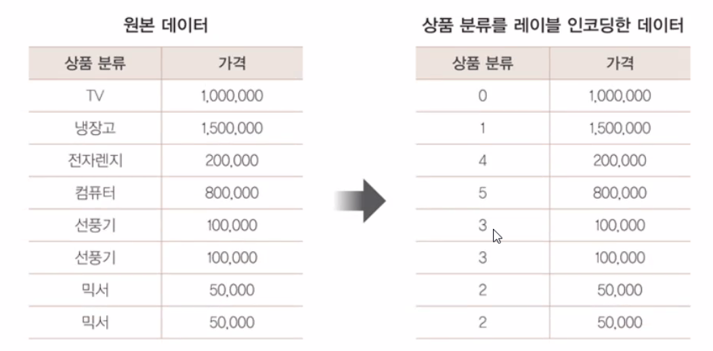

##### 사이킷런의 레이블 인코딩 클래스 : LabelEncoder

1. LabelEncoder 객체 생성
2. fit() 메서드
    - 레이블 인코더를 맞춤
3. transform() 메서드
    - 인코딩된 레이블 반환


#### 원 - 핫 인코딩 (One-Hot encoding)

- feature값의 유형에 따라 새로운 feature을 추가하여, 고유 값에 해당하는 컬럼만 1을 표시하고 나머지 컬럼에는 0을 표시
- 범주형 변수를 독립변수로 갖는 회귀분석의 경우 범주형 변수를 dummy변수(가변수)로 변환
- dummy 변수 : get_dummies() , 가짜변수, 가변수

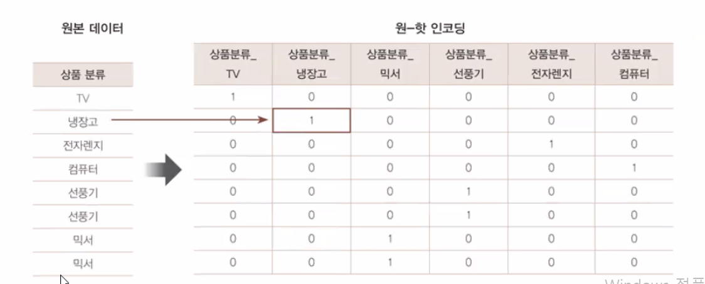

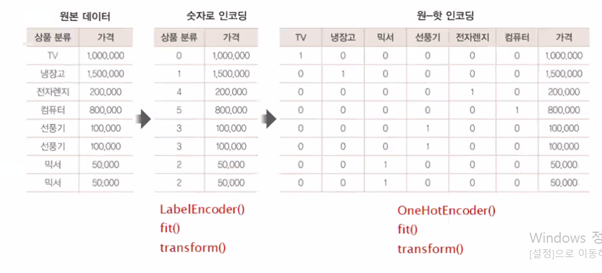

##### 사이킷런의 원-핫 인코딩 클래스 : OneHotEncoder

1. 문자열 값을 숫자형 값으로 변환
2. 입력 값을 2차원 데이터로 변환
3. OneHotEncoder 클래스로 원-핫 인코딩 적용
    - fit()
    - transform()
    
    

##### **Pandas API 사용 원-핫 인코딩 수행**

- get_dummies()메서드 사용
- 숫자형으로 변환없이 바로 변환


### 피처 스케일링과 정규화

- 피처 스케일링 (feature scaling)

  - 서로 다른 변수의 값 범위를 일정한 수준으로 맞춤

- 방식

  - Z-scaling

    - 표준화 (Standardization)

    - 평균이 0이고 분산이 1인 가우지안 정규분포로 변환

    - 정규화 (Normalization)

    - sklearn.preprocessing의 StandardScaler 모듈

    - ``` sql
      from sklearn.preprocessing import StandardScaler
      ```

  - Min-max

    - 0 ~ 1로 변환

    - sklearn.preprocessing 의 MinMaxScaler 모듈

    - ```sql
      from sklearn.preprocessing import MinMaxScaler
      ```

  - 벡터 정규화

    - Sklearn의 Nomalizer 모듈
    - 선형대수의 정규화 개념
    - 개별 벡터의 크기를 맞추기 위해 모든 피처벡터의 크기로 나누어 변환

<u>정규화는 스케일링의 한 방법</u>


#### StandardScaler

- 표준화 지원 클래스
- 개별 피처를 평균이 0이고 분산이 1인 값으로 변환


#### MinMaxScaler

- 데이터 값을 0과 1사이의 범위 값으로 변환
- 음수인 경우 -1에서 1사이의 값으로 변환
- 데이터의 분포가 가우시안 분포가 아닌 경우 Min, Max Scale 적용 가능


### 학습 데이터와 테스트 데이터의 스케일링 변환 시 유의점

- 학습 데이터와 테스트 데이터의 스케일링 기준 정보 달라지지 않게 주의
- 머신러닝 모델은 학습 데이터를 기반으로 학습되기 때문에, 반드시 테스트 데이터는 학습 데이터의 스케일러 기준에 따라야 함
- Scaler 객체를 이용해 학습 데이터 세트로 fit()과 transform()을 적용하면 테스트 데이터에 다시 fit()을 적용해서는 안 되며, 학습 데이터로 이미 fit()이 적용된 Scaler객체를 이용해 transform()으로 변환해야 함


#### fit() 과 transform()

fit()

- 데이터 변환을 위한 기준 정보를 설정
- 학습하기 위함

transform() 

- fit()에서 설정된 정보를 이용해 데이터로 변환
- scale 변환된 데이터 셋이 numpy ndarry로 반환

즉,

- 스케일링 하기 위해 **<u>fit()</u>**

- 실제 적용된 결과 가져오기 위해 데이터로 변환 <u>**transform**</u>


## [참고]

**자료 변환을 통해 자료의 해석을 쉽고 풍부하게 하기 위한 과정**

데이터 변환 목적

- 분포의 대칭화
- 산포를 비슷하게
- 변수 간의 관계를 단순하게 하기 위해

데이터 변환 종류

- 모양 변환 
  - pivot
  - unpivot
- 파생변수 / 요약변수
- Normalization (Scaling)
- 데이터의 분포 변환
  - 제곱근 변환
  - 제곱 변환
  - 지수 변환
  - 로그 변환
  - 박스콕스 변환


### 모양변환

#### Pivot

행, 열 별 요약된 값으로 정렬해서 분석을 하고자 할 때 사용

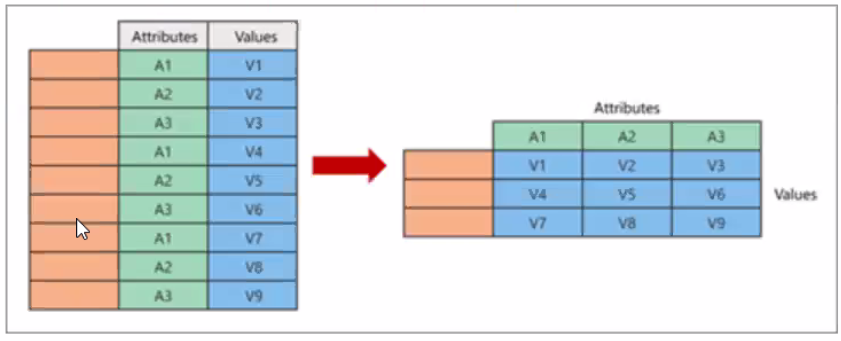

- 행과 열을 요약된 정보로 만들어줌
- 데이터를 형태를 바꾸는것

#### Unpivot

컬럼 형태로 되어 있는 것을 행 형태로 바꿀 때 사용 

wide form → long form

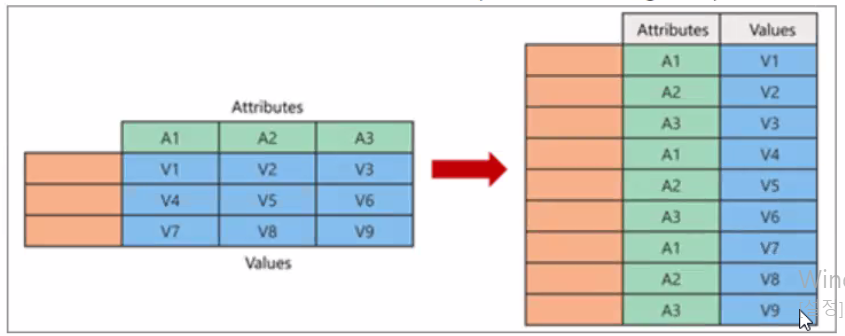


### 파생변수 / 요약변수

#### 파생변수

기준을 어떻게 주느냐에 따라 달라질 수 있음 → 수집되는 데이터 결과값이 달라지기 때문

- 이미 수집된 변수를 활용해 새로운 변수 생성하는 경우
- 분석자가 특정 조건을 만족하거나 특정 함수에 의해 값을 만들어 의미를 부여한 변수
- 주관적일 수 있으며 논리적 타당성을 갖추어 개발해야 함
- **예** ) 주구매 매장, 구매 상품 다양성, 가격 선호대, 라이프 스타일

#### 요약변수

- 원 데이터를 분석 Needs에 맞게 종합한 변수
- 데이터의 수준을 달리하여 종합하는 경우가 많음
- **예** ) 총 구매 금액, 매장별 방문 횟수, 매장 이용 횟수, 구매 상품 목록


### 평균과 중앙값의 차이

평균 : 모든 값을 더해서 모든 값의 수로 나눈것

중앙값 : 정렬했을때 가운데

- 평균은 <u>이상치에 영향을 받고</u>

- 중앙값은 <u>이상치에 영향을 안받음</u>


### 정규화 (Normalization)

단위 차이, 극단값 등으로 비교가 어렵거나 왜곡이 발생할 때, 표준화하여 비교 가능하게 만드는 방법

Scale이 다른 여러 변수에 대해  Scale을 맞춰 모든 데이터 포인트가 동일한 정도의 중요도로 비교되도록 함

Scaling 여부가 모델링의 성능에도 영향을 주기도 함

- 정규화는 스케일링의 방법 (Normalization ⪽ Scaling)

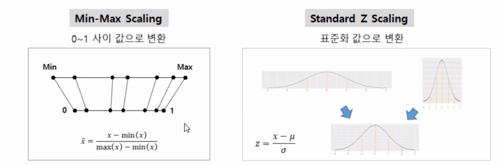


#### 대표적인 정규화(Normalization)


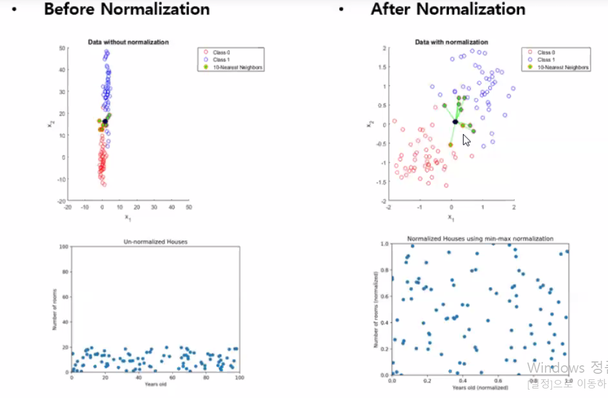

####  

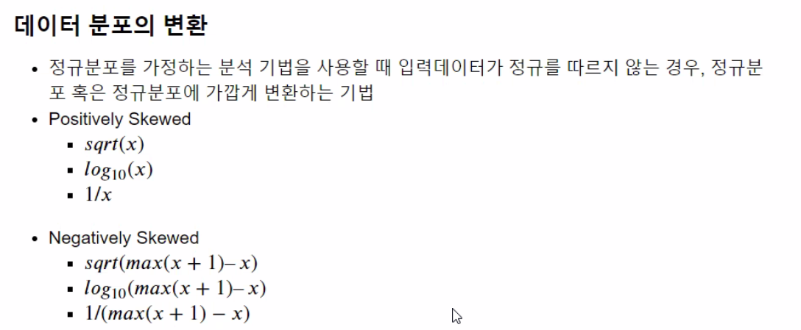

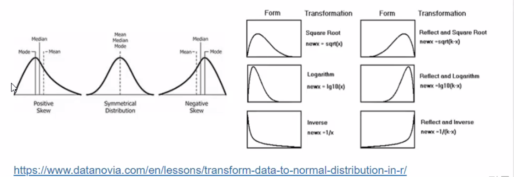

- 비대칭된 분포를 대칭화하기위한 방식

- 간격을 비슷하게 하기 위해 쓰는 방식
  - 위 그림에서 Symmetrical Distribution처럼 만들기 위함

- 한쪽으로 치우쳐진 데이터값을 거꾸로 - 대칭화 해서 변환
  - Negatively Skew를 거꾸로해서 Positive Skew처럼 대칭한 후 변환 ⇒ Symmetrical Distribution

