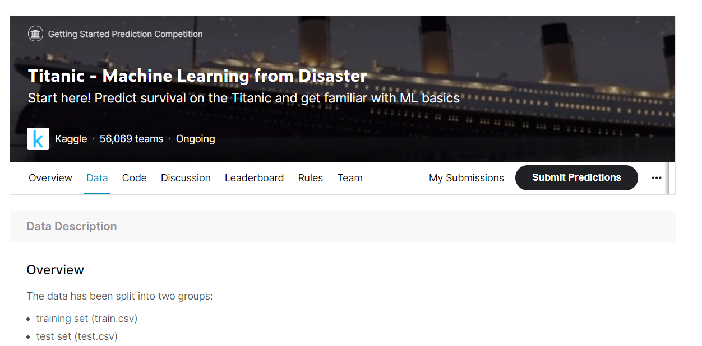

# 사이킷런으로 수행하는 타이타닉 생존자 예측

**Kaggle에서 제공하는 타이타닉 탑승자 데이터 기반으로 생존자 예측을 사이킷런으로 수행**

- Kaggle : 데이터 분석 오픈 포털
  - 세계적인 ML 기반 분석 대회를 온라인 상에서 주관



- 타이타닉 생존자 데이터
  - 머신러닝에 입문하는 데이터 분석가 / 과학자를 위한 기초 예제로 제공
  - 많은 캐글 이용자가 자신의 방법으로 타이타닉 생존자 예측을 수행하고, 수행 방법을 캐글에 공유


## 📌0722 정리

- train_test_split : 학습용 검증용으로 분할


- 교차 검증 : 분할을 하되 train / test를 한번이 아니라 여러번에 걸쳐 테스트하는 방식 활용
  - 데이터 불균형, 구성 자체가 층이 있는것을 반영해서 교차검증하는 것
  - 교차 검증 방식 : K fold, SK fold
    - SKfold : kfold의 for문 이용해서 반복 하는것을 편리하게 하기 위한 방식 


- 하이퍼 파라미터 : 모델에 있어서 알고리즘 활용할 때 초기에 주어진 파라미터 
  - 최적의 파라미터를 적용된 모델을 훈련에 적용하는 방식


- 전처리 설명
  - 데이터 결측치, 이상치를 처리하기위한 방식
  - 단위 다르거나, 편향되어 있는 데이터 변환  


- 데이터 전처리 실습 : 타이타닉 데이터로 적용
  ✔ 인코딩 부분에서 막힘 (내일 이어서)


## 📌 0723 이어서

각 빈도별 분포를 봐야함

수치를 봐야함

- 수치의 범위를 확인
- 이상치 / 오류 확인
- 변수별로 분포 확인

시각적 확인 

- 시각화 
  - 원 데이터를 탐색해서(쪼개서) 분석
  - 관련성을 제시하고 보여줌으로써 의사결정을 지원
  - 모델링에서 서비스를 할때 (고객들에게 제공)
  - 분석법 : p분석?

평균적 차이 


## 실습. 사이킷런으로 수행하는 타이타닉 생존자 예측

#### 데이터 정보 확인

``` sql
titanic_df.info()
```

#### 결측치 파악

```sql
# 각 컬럼의 Null값 확인
titanic_df['columns명'].isnull().sum()	

# 모든 컬럼의 Null값을 합산해서 Null 값이 없는지 확인
titanic_df['columns명'].isnull().sum().sum()	
```

#### 데이터 전처리 : 결측치 처리

- DataFrame()의 fillna()메서드를 사용해서 Null값을 평균 또는 고정 값으로 변경

```sql
titanic_df['column명'].fillna(titanic_df['column명'].mean(), inplace = True)
titanic_df['column명'].fillna("고정값 지정", inplace = True)	
```

#### EDA

- 머신러닝 알고리즘 적용해서 **예측 수행 전 데이터 탐색**

#### 데이터 전처리 : 구간화 (binning)

#### 데이터 전처리 : 인코딩

#### 생존자 예측 프로세스

1. 데이터 로딩
2. 데이터 전처리
3. Data Split : 학습 데이터와 테스트 데이터로 분리
4. 분류 알고리즘을 적용한 학습 / 예측 / 평가
   1. 결정트리 - DecisionTreeClassifier 클래스 (분류)
   2. 랜덤 포레스트 - RandomForestClassifier 클래스 (분류)
   3. 로지스틱 회귀 - LogisticRegression 클래스 (회귀)
5. 교차 검증을 통한 모델 성능 향상
   1. KFold
   2. cross_val_socre()
6. 하이퍼 파라미터 튜닝
   1. GridSearchCV


## 🎈정리

지금까지 사이킷런을 기반으로 머신러닝 애플리케이션을 쉽게 구현해 봤음

사이킷런은 파이썬 계열의 대표적 머신러닝 패키지

- 매우 많은 머신러닝 알고리즘을 제공하며

- 쉽고 직관적인 API프레임워크
- 편리하고 다양한 모듈 지원 등
- 많은 머신러닝 클래스와 다양한 지원 모듈과 더불어 사이킷런의 직관적인 API머신러닝 애플리케이션을 쉽게 구현

머신러닝 애플리케이션은 다음의 과정을 거친 후에 학습 데이터를 기반으로 머신러닝 알고리즘을 적용해 모델을 학습시킨다.

- 전처리 작업
  - 데이터의 가공 및 변환 과정
- 데이터 세트 분리 작업
  - 데이터를 학습 데이터와 테스트 데이터로 분리

학습된 모델을 기반으로, 다음 방식으로 구성된다.

- 테스트 데이터에 대한 예측 수행
- 예측된 결괏값을 실제 결괏값과 비교해 머신러닝 모델에 대한 평가 수행


##### 데이터 전처리 작업

머신러닝 알고리즘이 최적으로 수행될 수 있게 데이터를 사전 처리 하는 것

- 오류 데이터의 보정이나 결손값(Null)값 처리 등의 다양한 클렌징 작업
- 인코딩 작업
  - 레이블 인코딩
  - 원-핫 인코딩
- 데이터의 스케일링/정규화 작업 등


##### 학습용 데이터 / 테스트용 데이터 분리

머신러닝 모델은 학습 데이터 세트로 학습한 뒤 반드시 별도의 테스트 데이터 세트로 평가되어야 한다.

또한 <u>테스트 데이터의 건수 부족</u>이나 <u>고정된 테스트 데이터 세트를 이용</u>한 반복적인 모델의 학습과 평가는 해당 테스트 데이터 세트에만 <u>치우친</u> 빈약한 머신러닝 모델을 만들 가능성이 높다.

이를 해결하기 위해 학습 데이터 세트를 학습 데이터와 검증 데이터로 구성된 여러 개의 폴드 세트로 분리해 **교차 검증**을 수행할 수 있다.


##### 교차 검증

사이킷런은 이러한 교차 검증을 지원하기 위한 다양한 클래스와 함수를 제공

- KFold
- StratifiedKFold
- cross_val_score() 
- 등등

또한, 머신러닝 모델의 <u>최적의 하이퍼 파라미터를 교차 검증을 통해 추출</u>하기 위해 

- <u>GridSearchCV</u> 제공

