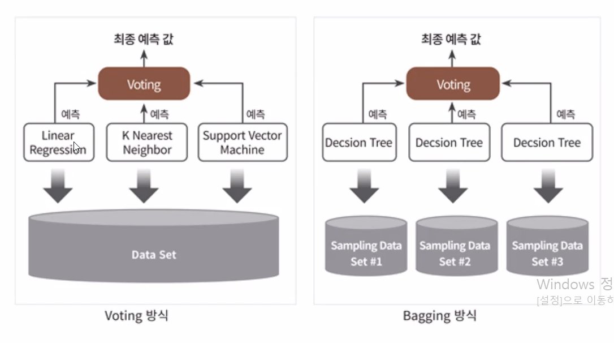
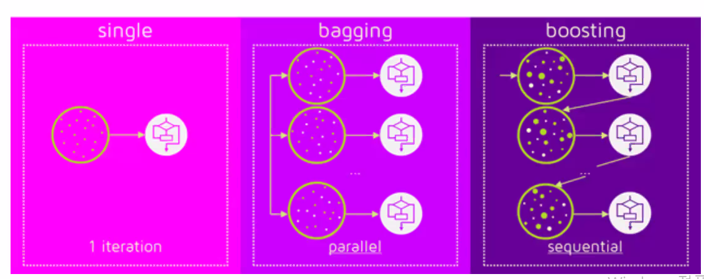
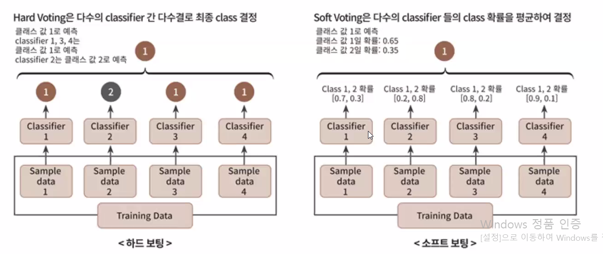
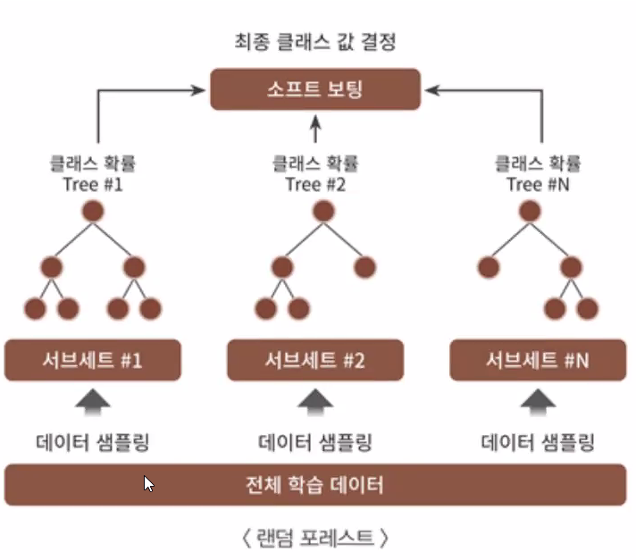
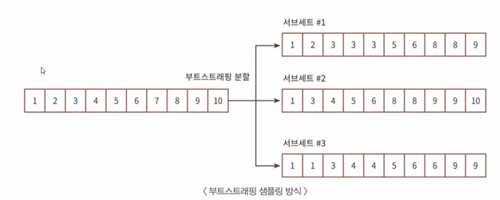
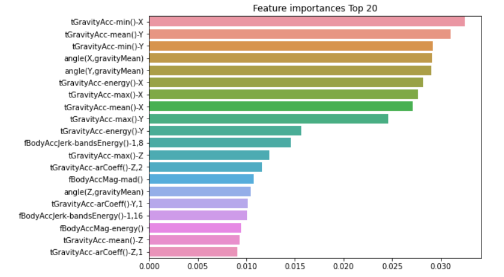
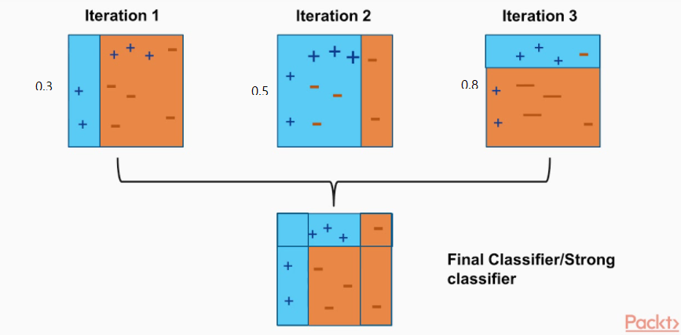

# 앙상블 학습

## 앙상블 학습 (Ensemble Learning) 개요

### 앙상블 학습을 통한 분류

여러 개의

### 대표적인 앙상블 알고리즘

### 앙상블 알고리즘 변화

#### 최신 앙상블 알고리즘

- XGBoost
- LightBGM
- Stacking

XGBoost, LightBGM과 같은

### 앙상블 학습 유형

- 보팅
- 배깅
- 부스팅
- 스태킹

#### 보팅

#### 배깅

보팅과 동일하게 여러 분류기가 투표를 통해 최종 예측 결과를 결정하는 방식

샘플링 방식 : 부트 스트래핑 분할 방식

- 개별 Classifier에게 데이터를 샘플링해서 추출하는 방식
- 각 샘플링된 데이터 내에는 중복 데이터 포함
- 교차 검증에서는 데이터 세트 간에 중첩 허용하지 않음

#### 부스팅 (Boosting)

여러 개의 분류기가 순차적으로 학습 수행하되, 앞에서 학습한 분류기가 예측이 틀린 데이터에 대해서는 올바르게 예측할 수 있도록 

다음 분류기에게는 가중치를 부여하면서 학습과 예측을 진행하는 방식

- 예측 성능이 뛰어나 앙상블 학습 주도

- Boost : 밀어 올림

##### 대표적인 부스팅 모듈

- Gradient Boost
- XGBoost
- LightGBM

#### 스태킹

여러가지 다른 모델의 예측 결과값을 

다시 학습데이터로 만들어

 다른 모델(메타 모델)로 재학습시켜 결과를 예측하는 방식

### 보팅 유형

- 하드 보팅 (Hard Voting)
- 소프트 보팅 (Soft Voting)

#### 하드 보팅(Hard Voting)

예측한 결과값들 중에서 다수의 분규기가 결정한 예측값을 최종 보팅 결과값으로 선정

- 다수결 원칙과 유사

#### 소프트 보팅 (Soft Voting)

분류기들의 레이블 값 결정 확률을 평균내서 확률이 가장 높은 레이블 값을 최종 보팅 결과값으로 선정

일반적으로 소프트 보팅이 예측 성능이 좋아서 더 많이 사용

### Voting Classifier

보팅 방식의 앙상블 예제 : 위스콘신 유방암 데이터 세트 예측 분석

**위스콘신 유방암 데이터 세트**

- 유방암의 악성종양, 양성종양 여부를 결정하는 이진 분류 데이터 세트
- 종양의 크기, 모양 등의 형태와 관련한 많은 피처 포함
- 사이킷런의 보팅 양식의 앙상블을 구현한 VotingClassifier 클래스를 이용해서 보팅 분류기 생성
- `load_breast_cancer()`함수를 통해 위스콘신 유방암 데이터 세트 생성
- 로지스틱 회귀에 KNN 기반으로 소프트 보팅 방식으로 보팅 분류기 생성

# 랜덤 포레스트

랜덤 포레스트 샘플링 방식

랜덤 포레스트 부트 부트 스트래핑 분할

랜덤 포레스트 예제

## GBM (Gradient Boosting Machine)

부스팅 (Boosting)

대표적 부스팅 알고리즘

- AdaBoost : 에이다 부스트
- GBM : 그래디언트 부스트

