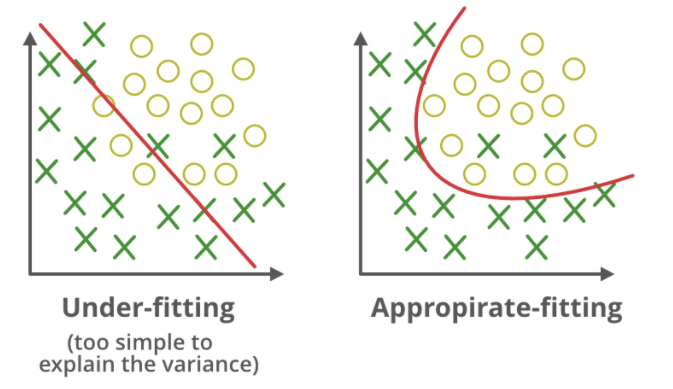

# XGBoost (eXtra Gradient Boost)

## 🧠리뷰

여러 알고리즘 쓰는 것 - 앙상블

4가지 방법 

- 배깅 : 한 알고리즘으로 여러 샘플로 나눠서 적용
  - 랜덤 포레스트 
    - 숲 : 나무마다 데이터 적용했을때 예측 결과를 반영
- 부스팅
- 보팅 : 여러 알고리즘을 한 데이터에 적용 
- 스태킹


배깅 vs 부스팅

- 부스팅은 첫번째 분류기에서의 잘못 예측 결과된 데이터셋 결과(가중치)를 주어 다음 데이터 셋에 반영 반복, 순차적 진행
  - 분류를 더 잘함 (예측 좋음)
  - 앞의 반영 결과를 받아서 하기때문에 시간이 오래걸림
- 배깅은 동시에 데이터 셋을 싹 교정해서 동시에 매치 , 결과 얻어냄


GBM

- 단점 보완한 것 - XGBoost


## XGBoost 개요

트리 기반의 앙상블 학습에서 가장 각광받고 있는 알고리즘 중 하나

압도적인 수치의 차이는 아니지만, 분류에 있어서 일반적으로 다른 머신러닝보다 뛰어난 예측 성능을 나타냄

GBM에 기반하지만, GBM의 단점인 느린 수행 시간 및 과적합 규제 부재 등의 문제 해결

- GBM 경사하강법을 이용한 부스터

특히 병렬 CPU환경에서 병렬 학습이 가능해 기존 GBM보다 빠르게 학습 완료


### XGBoost의 장점

- 뛰어난 예측 성능
- GBM 대비 빠른 수행 시간
- 과적합 규제
- 가지치기 
- 교차 검증 내장
- 결손 값 자체 처리


#### **뛰어난 예측 성능**

- 일반적으로 분류와 회귀 영역에서 뛰어난 예측 성능 발휘

#### GBM 대비  빠른 수행 시간

- 일반적인 GBM은 순차적으로 weak learner가 가중치를 증감하는 방식으로 학습하기 때문에 전반적으로 속도가 느림
- XGBoost는 병렬 수행 및 다양한 기능으로 GBM에 비해 빠른 수행 성능 보장
- 다른 머신러닝 알고리즘 (예 : 랜덤 포레스트)에 비해 빠르다는 의미느 ㄴ아님

#### 과적합 규제 (Regularization)

- 표준 GBM의 경우 과적합 규제 기능이 없으나 
- XGBoost는 자체에 과적합 규제 기능으로 과적합에 좀 더 강한 내구성이 있음

#### 가지치기 (Tree pruning)

- 일반적으로 GBM은 분할 시 부정 손실이 발생하면 분할을 더 이상 수행하지 않음에도
- 지나치게 많은 분할이 발생할 수 있음

- max_depth파라미터로 분할 깊이 조정하면
- 더 이상 긍정 이득이 없는 분할을 가지치기 해서 분할 수를 줄일 수 있음

#### 자체 내장된 교차 검증

- XGBoost는 반복 수행 시마다 내부적으로 학습 데이터 세트와 평가 데이터 세트에 대한 교차 검증 수행
- 최적화된 반복 수행 횟수를 가짐
- 지정된 반복 횟수가 아니라 교차 검증을 통해 평가 데이터 세트의 평가 값이 최적화 되면
- 반복을 중간을 멈출 수 있는 조기 중단 기능이 있음

#### 결손값 자체 처리

- 결측값 자체 처리 기능 포함


## XGBoost설치

`conda install -c anaconda py-xgboost`

 - Windows 기반에서 설치하는 경우, Anaconda Prompt 관리자 모드로 열고  설치


## XGBoost 라이브러리 

1️⃣ XGBoost는 처음에 C/C++로 작성되었음

2️⃣ 파이썬에서도 XGBoost를 구동할 수 있도록 파이썬 패키지 `xgboost`제공

- 패키지 역할 : 대부분 C/C++ 핵심 라이브러리를 호출하는 것
- 사이킷런과 호환되지 않는 독자적인 XGBoost전용 패키지
  - 즉, XGBoost고유의 프레임워크를 파이썬 언어 기반에서 구현한 것으로 별도의 API기반
- 따라서 사이킷런의 fit(), predict() 메서드 같은 사이킷런 고유 아키텍처 적용 불가
- 다양한 유틸리티 (cross_val_score, GridSearchCV, Pipeline등)도 사용 불가
- **`파이썬 래퍼 XGBoost 모듈`**로 지칭
  - xgboost패키지 내에는 XGBoost전용의 파이썬 패키지와 사이킷런과 호환되는 래퍼용 XGBoost가 함께 존재

3️⃣ 파이썬 기반의 ML이용자들이 사이킷런을 많이 사용하기 때문에 사이킷런과 연동할 수 있는 래퍼 클래스(wrapper class) 제공 모듈

- XGBoost 패키지의 사이킷런 래퍼 클래스	
  - **`XGBClassifier`**와 **`XGBRegressor`** 래퍼 클래스
- 사이킷런 estimator가 학습을 위해 사용하는 fit()과 predict() 등
- 표준 사이킷런 개발 프로세스 및 다양한 유틸리티 활용 가능
- **`사이킷런 래퍼 XGBoost 모듈`**로 지칭


### 파이썬 래퍼 XGBoost모듈 과 사이킷런 래퍼 XGBoost모듈 차이점

구분을 위해서

- 초기의 독자적인 XGBoost프레임워크 기반의 XGBoost를 : **파이썬 래퍼 XGBoost 모듈**
-  사이킷런과 연동되는 모듈을 : **사이킷런 래퍼 XGBoost 모듈**이라고 지칭

크게는 다르지 않지만, 몇 가지 주의할 점이 있음

| 파이썬 Wrapper                   | 사이킷런 Wrapper              |
| -------------------------------- | ----------------------------- |
| eta                              | learning_rate (학습률)        |
| num_boost_rounds (학습기의 개수) | n_estimators (반복 수행 횟수) |


#### 사이킷런 래퍼 XGBoost 모듈

사이킷런의 다른 Estimator와 사용법 동일

#### 파이썬 래퍼 XGBoost 모듈

파이썬 네이티브 XGBoost는 고유의 API와 하이퍼 파라미터 이용


## 파이썬 래퍼 XGBoost 하이퍼파라미터

XGBoost는 GBM과 유사한 하이퍼 파라미터를 동일하게 가지고 있고, 조기 중단, 과적합 규제하기 위한 하이퍼 파라미터 등이 추가

파이썬 래퍼 XGBoost 모듈과 사이킷런 래퍼 XGBoost 모듈의 일부 하이퍼 파라미터는 약간 다르므로 이에 대한 주의가 필요

- 정확히 표현하자면 동일한 기능을 하는 하이퍼 파라미터이지만,
- 사이킷런 파라미터의 범용화된 이름 규칙에 따라 파라미터 명이 달라진다


파이썬 래퍼 XGBoost 하이퍼 파라미터를 유형별로 나누면 다음과 같다.

1️⃣ **일반 파라미터** : 실행 시 스레드의 개수나 silent 모드 등의 선택을 위한 파라미터로서 디폴트 파라미터 값을 바꾸는 경우는 거의 없음

2️⃣ **부스터 파라미터** : 트리 최적화, 부스팅, regularization(과적합 규제) 등과 관련된 파라미터

3️⃣ **학습 태스크 파라미터** : 학습 수행 시 객체 함수, 평가를 위한 지표 등을 설정하는  파라미터

대부분의 하이퍼 파라미터는 Booster 파라미터에 속한다.

```
## 사이킷런 래퍼 XGBoost
- 사이킷런의 기본 Estimator를 그대로 상속해 만든 것
- 다른 estimator와 같이 **`fit(), predict()`**만으로 학습과 예측 가능
- GridSearchCV, Pipeline 등 사이킷런의 유틸리티 그대로 사용 가능


- 분류를 위한 XGBClassifier 클래스
- 회귀를 위한 XGBRegressor 클래스


- 파이썬 래퍼 XGBoost에서 사용하는 하이퍼파라미터와 호환성을 유지하기 위해 몇개 하이퍼파라미터를 변경
    - eta  → learning_rate
    - sub_sample → subsample
    - lambda → reg_lambda
    - alpha → reg_alpha


- xgboost의 n_estimators와 num_boost_round는 동일한 파라미터
    - 이를 동시에 사용할 경우 
        - 파이썬 래퍼 XGBoost API는 n_estimator를 무시하고 num_boost_round를 적용
        - 사이킷런 래퍼 XGBoost는 n_estimator 파라미터를 적용
```

### 주요 일반 파라미터

- booster : gbtree(tree based model) 또는 gblinear(linear model) 선택
    - 디폴트는 gbtree
- silent : 디폴트 0, 출력 메시지를 나타내고 싶지 않을 경우 1로 설정
- nthread : CPU 실행 스레드 개수 조정. 디폴트는 CPU 전체 스레드를 다 사용하는 것
    - 멀티 코어/스레드 CPU 시스템에서 전체 CPU를 사용하지 않고 일부 CPU만 사용해 ML 애플리케이션 구동하는 경우 변경

### 주요 부스터 파라미터

: 트리 최적화, 부스팅, regularization(과적합 규제) 등과 관련된 파라미터
- **eta [default=0.3, alias: learning_rate]** : GBM의 학습률(learning rate)과 같은 파라미터
    - 0 ~ 1 사이의 값을 지정. 부스팅 스텝을 반복적으로 수행할 때 업데이트 되는 학습률 값
    - 파이썬 래퍼 기반의 xgboost를 이용할 경우 디폴트는 0.3
    - 사이킷번 래퍼 클래스 이용시 eta는 learning_rate 파라미터로 대체. 디폴트는 0.1
    - 보통 0.01 ~ 0.2 사이의 값을 선호

- **num_boost_rounds**: GBM의 n_estimators와 같은 파라미터


- **<u>min_child_weight</u> [default=1]** : 트리에서 추가적으로 가지를 나눌지를 결정하기 위해 필요한 데이터들의  Weight 총합.
    - `min_child_weight가 클수록` 분할을 자제함 => **`과적합을 조절`**하기 위해 사용


- **<u>gamma</u> [default=0, alias: min_split_loss]** : 트리의 리프 노드를 추가적으로 나눌지를 결정할 최소 손실 감소 값
    - 해당 값보다 큰 손실(loss)이 감소된 경우에 리프 노드를 분리함.
    - **`값이 클수록 과적합 감소 효과`**가 있음


- **<u>max_depth</u> [default=6]** : 트리 기반 알고리즘의 max_depth와 같음
    - 0을 지정하면 깊이에 제한이 없음
    - `max_depth가 높으면` 특정 피처 조건에 특화되어 룰 조건이 만들어지므로 `과적합 가능성이 높아짐`
    - 보통 3~10 사이의 값 적용


- **sub_sample [default=1]** : GBM의 subsample과 동일
    - `트리가 커져서 과적합되는 것을 제어`하기 위해 데이터를 샘플링하는 비율을 지정
    - sub_sample=0.5로 지정하면 전체 데이터의 절반을 트리를 생성하는데 사용
    - 0 ~ 1사이의 값이 가능하나 일반적으로 0.5~1 사이의 값을 사용


- **colsample_bytree [default=1]** : GBM의 max_features와 유사
    - 트리 생성에 필요한 피처(컬럼)를 임의로 샘플링할 때 사용
    - 매우 많은 피처가 있는 경우 `과적합을 조정`하는데 적용


- **lambda [default=1, alias: reg_lambda]** : L2 Regularization 적용 값
    - 피처 개수가 많을 경우 적용을 검토하며 `값이 클수록 과적합 감소 효과`가 있음


- **alpha [default=0, alias: reg_alpha]** : L1 Regularization 적용 값
    - 피처 개수가 많을 경우 적용을 검토하며 `값이 클수록 과적합 감소 효과`가 있음


- **scale_pos_weight [default=1]** : 특정 값으로 치우친 비대칭한 클래스로 구성된 데이터 세트의 균형을 유지하기 위한 파라미터

### 학습 태스크 파라미터

: 학습 수행 시 객체 함수, 평가를 위한 지표 등을 설정하는 파라미터
- **objective** : 최소값을 가져야할 손실함수를 정의
    - XGBoost는 다양한 손실함수를 사용하는데, 주로 이진분류인지 다중분류인지에 따라 달라짐

        - **binary:logistic** : 이진분류일 때 사용

    - **multi:softmax** : 다중 분류일 때 적용
        - 손실함수가 multi:softmax일 경우 레이블 클래스의 개수인 num_class 파라미터를 지정해야 함

    - **multi:softprob** : multi:softmax와 유사하나 개별 레이블 클래스에 해당하는 예측 확률을 반환


- **eval_metric** : 검증에 사용되는 함수를 정의
    - 기본값은 회귀의 경우 mse, 분류일 경우 error
    - eval_metric 유형
        - **mse** : Mean Square Error
        - **mae** : Mean Absolute Error
        - **logloss** : Nagative log-likelihood
        - **error** : Binary classification error rate (0.5 threshold)
        - **merror** : Multiclass classification error rate
        - **mlogloss** : Multiclass logloss
        - **auc** : Area under the Curve


### 하이퍼 파라미터 튜닝

- 뛰어난 알고리즘일수록 파라미터 튜닝 필요 적음
- 파라미터 튜닝에 들이는 공수 대비 성능 향상 효과가 높지 않을 경우가 대부분임

- 파라미터를 튜닝하는 경우는 데이터 세트에 따라 여러 가지 특성이 있음

  - 피처의 수가 매우 많거나
  - 피처 간 상관되는 정도가 많거나

  

#### 과적합 문제가 심각한 경우 XGBoost에서 하이퍼 파라미터 튜닝

- eta 값을 낮추고(0.01 ~ 0.1), num_round(또는 n_estimator)는 반대로 높임
- max_depth 값 낮춤
- min_child_weight 값 높임
- gamma 값 높임
- subsample과 colsampe_bytree 조정
  - 트리가 너무 복잡하게 생성되는 것을 막아 과적합 문제에 도움이 될 수 있다


### XGBoost 조기 중단 (Early Stopping) 기능

XGBoost는 자체적으로 교차 검증, 성능 평가, 피처 중요도 등의 시각화 기능을 가지고 있다.

또한 XGBoost는 기본 GBM에서 부족한 여러 가지 성능 향상 기능이 있다.

그중에 수행 속도를 향상시키기 위한 대표적인 기능으로는 **조기 중단(Early Stopping)**기능이 있다.

기본 GBM의 경우 n_estimator(또는 num_boost_rounds)에 지정된 횟수만큼 반복적으로 학습 오류를 감소시키며 학습을 진행하면서 중간에 반복을 멈출 수 없고 n_estimator에 지정된 횟수를 다 완료해야 한다.

XGBoost는 조기 중단 기능이 있어서

- n_estimator에 지정한 수 만큼의 부스팅 반복 작업이 종료되지 않더라도 예측 오류가 더 이상 개선 되지 않으면 중간에 중지해서 수행 시간 개선
  - 즉, 오류 감소 효과 없으면 멈춤
- 학습 시간 단축 
  - 특히 최적화 튜닝 단계에서 적절하게 사용 가능
- 반복 횟수를 많이 단축할 경우 예측 성능 최적화가 안 된 상태에서 학습이 종료될 수 있으므로 주의 필요


#### 조기 중단(Early Stopping)을 위한 주요 파라미터

일반적으로 검증 데이터 세트에서 반복적으로 비용 감소 성능 평가

- early-stopping : 더 이상 비용 평가 지표가 감소하지 않는 최대 반복 횟수
- eval_metric : 반복 수행 시 사용하는 비용 평가 지표
- eval_set : 평가를 수행하는 별도의 검증 데이터 세트


## 사이킷런 래퍼 XGBoost

하이퍼 파라미터 이름의 차이점 

- 기능은 비슷


## 💻실습. 파이썬 래퍼 XGBoost 적용 - 위스콘신 유방암 예측

위스콘신 유방암 데이터 세트를 활용하여 파이썬 래퍼 XGBoost API의 사용법 실습

1️⃣ 파이썬 Wrapper XGBoost 적용

2️⃣ 사이킷런 Wrapper XGBoost 적용

**xgboost : XGBoost의 파이썬 패키지**

- 자체적으로 교차 검증, 성능 평가, 피처 중요도 등의 시각화(plotting) 기능 포함
- 조기 중단 기능 ⇒ 수행 시간 개선 기능
  - num_rounds로 지정한 부스팅 반복 횟수에 도달하지 않더라도 더 이상 예측 오류가 개선되지 않으면 반복을 끝까지 수행하지 않고 중지
  - 일반적으로 수행 성능 향상 XGBoost는 GBM와는 다르게 병렬 처리와 조기 중단 등으로 빠른 수행시간 처리가 가능하지만,
  - CPU 코어 많지 않은 개인용 PC에서는 수행시간 향상을 경험하기 어려움


XGBoost를 이용해서 위스콘신 유방암 데이터 세트에 기반해 종양의 다양한 피처에 따라 종양 분류를 예측

- 위스콘신 유방암 데이터 세트
  - 사이킷런 내장 데이터 세트 : `load_breast_cancer()`
  - 악성 종양(malignant)인지 양성 종양(benign)인지를 분류한 세트
  - 양성 : 제거하여 치유할 수 있는 종양. 성장속도 느리고 전이되지 않음
  - 악성 : 암. 빠르게 성장하고 전이되어 생명 위협


## 🎈참조 - 사이킷런

https://scikit-learn.org/stable/

데이터 전처리, 하이퍼파라미터


## 🎈 참고 - ML16 다항회귀 과대적합 과소적합

### 학습오류, 일반화 오류, 예측 오류

- 학습 오류 : 학습 데이터를 사용하여 모델을 생성하고 측정한 오류
- 일반화 오류 : 기본 데이터 분포에서 새로운 데이터를 추출, 모델에 적용할 때 예상되는 오류
- 예측 오류 : 테스트 데이터를 모델에 적용하여 측정한 오류로, 일반화 오류의 추정에 사용

**✔ Machine Learning은 학습 오류와 일반화 오류 사이의 격차를 최소화 하는 것을 목표**


### 편향 - 분산 트레이드오프

편향

- 예측값과 정답이 얼마나 다른가
- 데이터 내에 있는 모든 정보를 고려하지 않음으로 인해, 지속적으로 

분산


- 10점에 모여있음 = 편의가 적다
- 분산은 크기만 편향은 적다 = 편의가 나쁘지 않음
- 분산은 작고 편향이 높다
  - 예측 결과값이 정답과 굉장히 많이 떨어져 있음
- 목표 떨어짐
  - 실력이 제일 떨어짐


### 과소적합과 과대적합

#### 과소적합

주어진 입력 데이터에 비하여 모델의 복잡도가 너무 낮아 입력 데이터로부터 충분히 학습하지 못하는 상황




#### 과대적합

주어진 입력 데이터에 비하여 모델의 복잡도가 너무 높아 입력 데이터의 잡음까지 fitting


#### 과소적합(Underfitting)에 대한 대응

- 학습 시간을 늘린다 
  - Deep Learning이나 Auto-pararmeter Tuning경우
- 더 복잡한 모델을 구성한다
- 모델에 추가 Feature를 도입한다
- Regularization을 사용하지 않거나 영향을 줄인다
- 모델을 다시 구축한다

#### 과대적합(Overfitting)에 대한 대응

- 학습을 더 일찍 멈추게 한다
- 


일반화 오차

모델 복잡도가 높아지면, 새로운 데이터 셋이 들어올 때

- 분산이 커진다.

교차되는 지점의 모델 복잡도를 갖는 모델을 써야한다.

분산과 편향 값의 크기를 더한것 = Total Error

- 일반화 오차
  - 새로운 데이터 셋을 모델에 학습했을 때 오차
- 분산은 항상 양의 값

일반화 오차를 줄이는 것이 무척 중요

- 머신러닝의 목표


