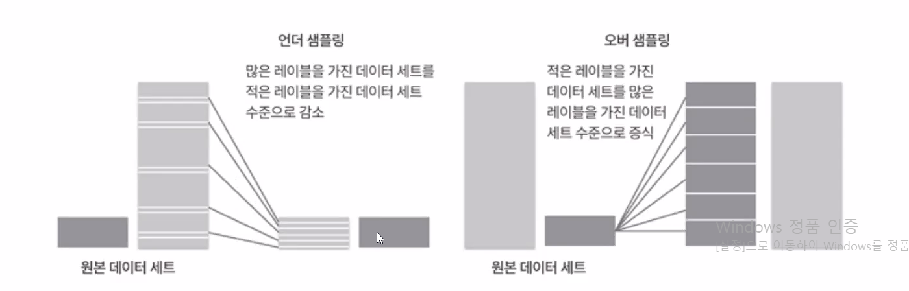
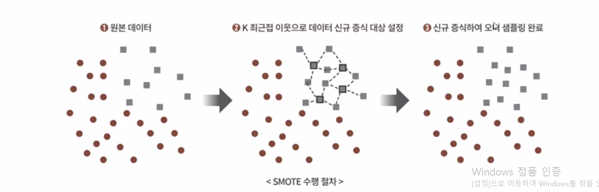
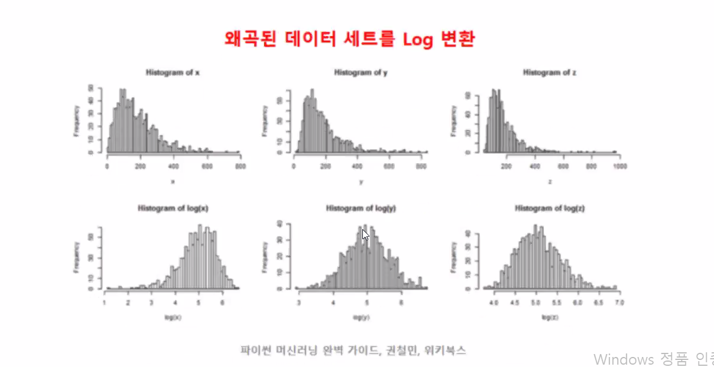
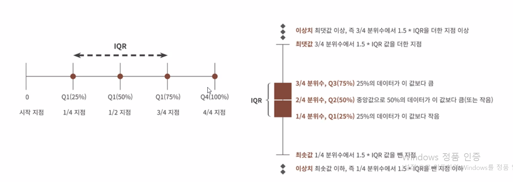
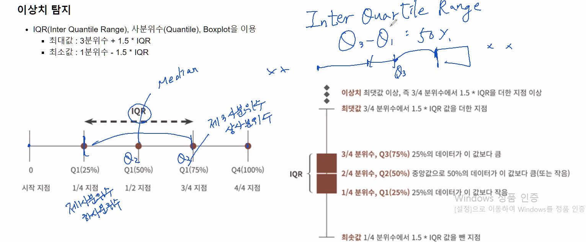
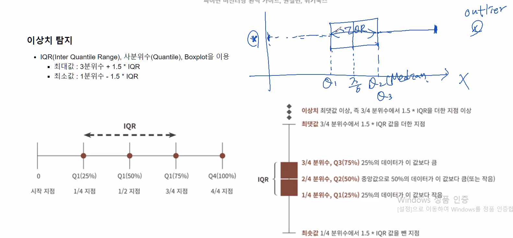
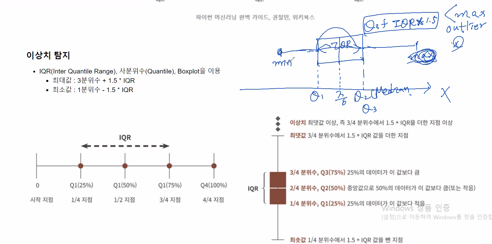
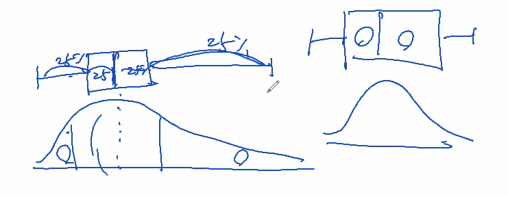
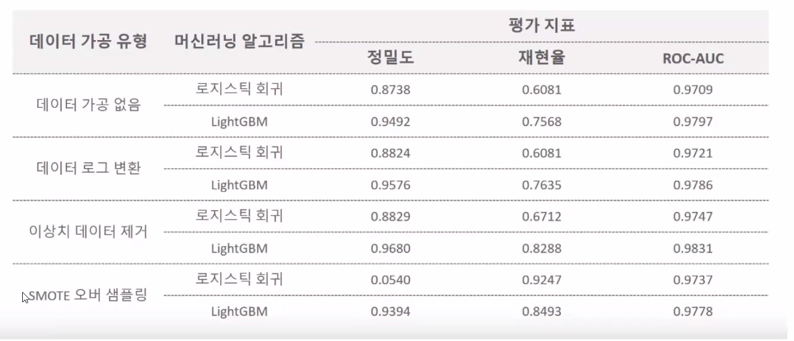

# 분류 실습 : 신용카드 사기 검출

Kaggle의 신용카드 데이터 세트를 이요해 신용카드 사기 검출 분류 실습

https://www.kaggle.com/mlg-ulb/creditcardfraud

imbalanced data set 가공을 위한 언더 샘플링 / 오버 샘플링

언더 샘플링

오버 샘플링

SMOTE

- 적은 데이터 세트

SMOTE 방식을 제공하는 패키지

- 비대칭 그래프는 log 변환을 통해 대칭으로 만들어준다

이상치 탐지

IQR(Inter Quatile Range), 사분위수(Quantile), Boxplot을 이용

- 최대값 : 3분위 수 + 1.5 * IQR
- 최소값 : 1분위 수 - 1.5 * IQR

IQR

box plot

- 큰 값이 많이 떨어져 있고, 치우쳐져 있는 데이터
- 대칭 데이터 

SMOTE

피처 엔지니어링에 따른 신용카드 사기 검출 모델 성능 비교

데이터 가공 결과

## 📌정리

분류

- KNN

- DecisionTree

- RandomForest

- GBM

- XGBoost

- LightGBM

