# 회귀

## 회귀분석 소개

회귀 : 분류와 더불어 지도학습의 가장 큰 축 중의 하나

- 현대 통계학을 이루는 주요 기능 중 하나
- 경제

## 회귀

평균으로의 회귀

부모 키와 자녀 키의 관계 연구

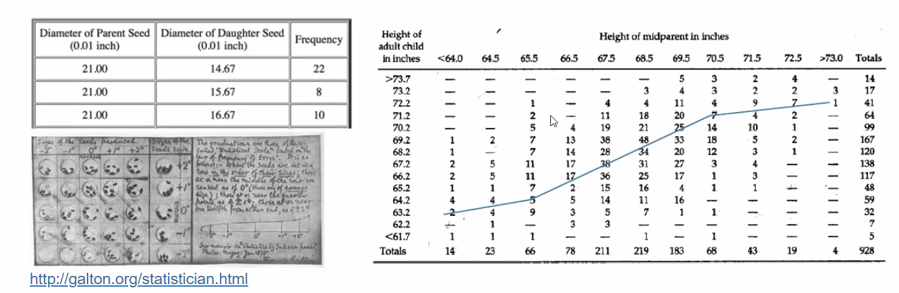

- **중심으로 회귀**하려는 경향
- **회귀분석**이라 명명

Karl Pearson(1903)

- Galton의 아이디어를 수리적 모형화 및 추정 방법 제안
- OLS (Ordinary Least Square, 최소제곱법)
- 1078명 아버지와 아들의 키 데이터 활용
  - Son_H = 33.79 + 0.516 * F_H

### 분류와 회귀 차이점 

분류와 회귀 차이점 **: 결과값의 차이**

분류 : category 반환

### 회귀모델 유형

- 선형 / 비선형 : 회귀 계수 결합에 따라

- 단순 / 다중 : <u>독립변수</u> 개수에 따라

#### OLS 회귀분석 종류 

##### 선형회귀에 들어감

단순회귀 분석

- 하나의 독립변수로 하나의 종속변수를 설명하는 모형
- 예 : 아버지의 키로 한 자녀의 키를 설명하는 경우

다중회귀 분석

- 두 개 이상의 독립변수로 하나의 종속변수를 설명하는 모형
- 예 : 아버지와 어머니의 키로 한 자녀의 키를 설명

다항회귀 분석

- 독립변수와 종속변수의 관계를 2차 이상의 함수로 설명
- 예 : 2차 함수관계 → 독립변수 = (x, x2) → 독립변수 간의 종속성에 주의

다변량회귀 분석

- 두 개 이상의 종속변수를 사용하는 모형
- 예 : 아버지와 어머니의 키로 두 자녀의 키를 설명하는 경우

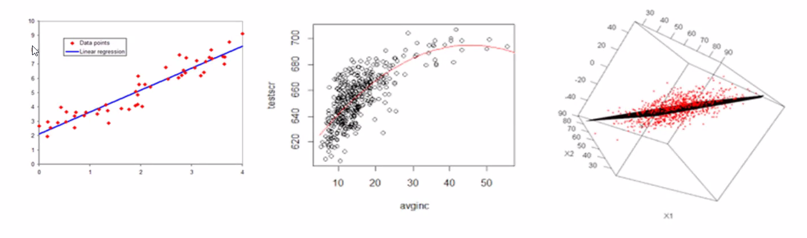

1. 선형 회귀

2. 

3. 다중 회귀

## 선형 회귀(Linear Regression)

#### 목적

- 설명 : 종속변수에 대한 설명(독립)변수의 영향을 측정, 설명함

- 예측 : 모델 함수식을 통해 설명(독립)변수 정보에 따른 종속변수의 값을 예측함

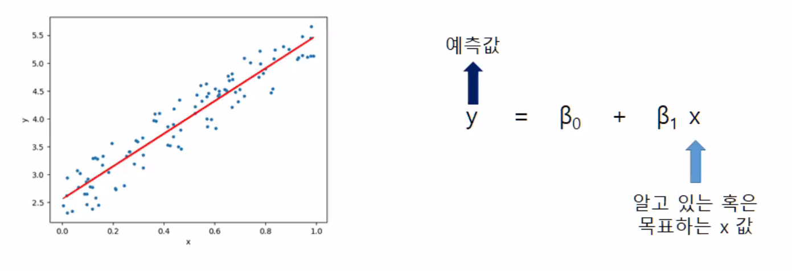

**여러 개의 독립 변수와 한 개의 종속변수 간의 상관관계를 모델링하는 기법**

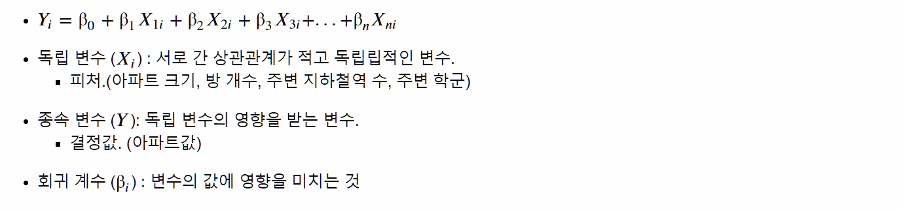

**실제 값과 예측값의 차이를 최소화하는 직선형 회귀선을 최적화하는 방식**

: 오차의 제곱합

- 오차 = 실제값 - 예측값
- 오차의 절댓값을 최소화

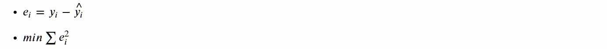

#### 선형회귀 분석의 주요 가정

- 선형성
- 정규성
- 등분산성
- 독립성

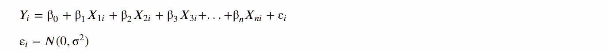

**Illustration of Simple Linear Regression Model**

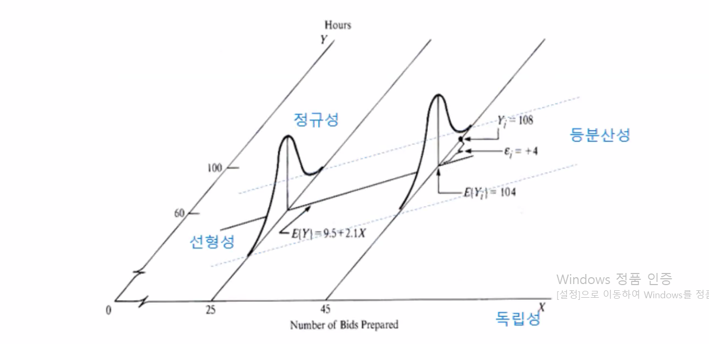

### 대표적인 선형 회귀 모델

- 일반 선형 회귀 : 규제를 적용하지 않은 모델로 예측값과 실제값의 RSS를 최소화
- 릿지 : 선형 회귀에 L2규제를 추가한 회귀 모델
- 라쏘 : 선형 회귀에 L1 규제를 적용한 모델
- 엘라스틱넷 : L2, L1 규제를 함께 결합한 모델
- 로지스틱 회귀 : 분류에서 사용되는 선형 모델

### 단순 선형 회귀를 통한 회귀 이해

독립 변수(피처)가 하나뿐인 선형 회귀

	- 베타가 웨이트로 변경됨

- 주택 가격은 주택 크기에 대해 선형(직선 형태)의 관계로 표현

- 그래프로 표현
  - X축 : 주택 크기 (평수)
  - Y축 : 주택 가격

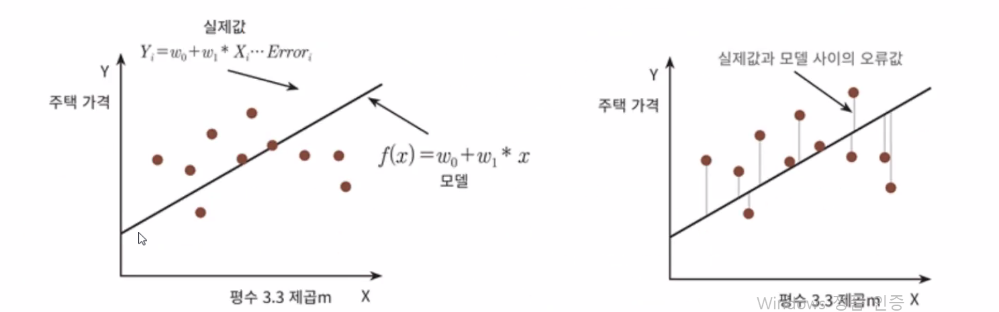

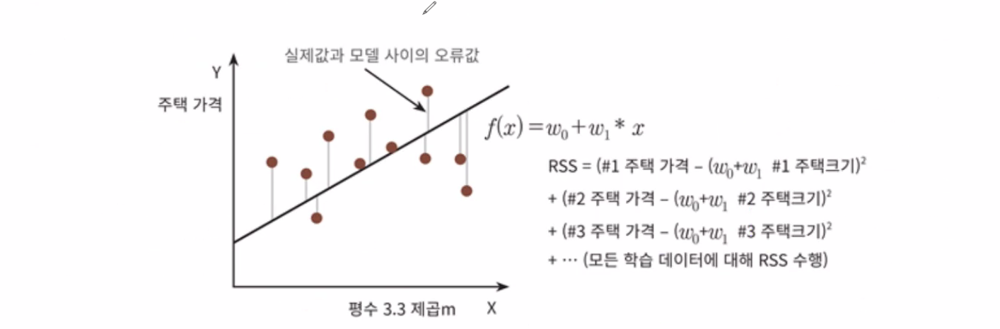

- RSS (Residual Sum of Squar) : 잔차

최적의회귀 모델

- 실제값과 모델 사이의 오류값(잔차)이 최소가 되는 모델
- 오류 값 합이 최소가 될 수 있는 최적의 회귀 계수를 찾는 것

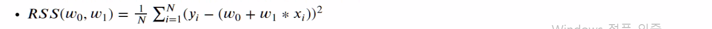

✔ 머신러닝에서는 **비용함수(Cost Function)** 라고 하며, **손실 함수 (Loss Function)** 이라고도 함

## 비용 최소화하기 : 경사하강법 (Gradient Descent)

비용함수(손실함수)가 최소가 되는 지점의 x를 계산

- 2차 함수의 미분값인 1차 함수의 기울기가 가장 최소일 때
- 최초 w에서부터 미분을 적용한 적용한 뒤 이 미분값이 계속 감소하는 방향으로 순차적으로 업데이트
- 더 이상 미분된 1차 함수의 기울기가 감소하지 않는 지점으로 비용함수의 최소인 지점을 간주하고 w를 반환
- 비용함수의 계수가 두 개 이상이므로 편미분

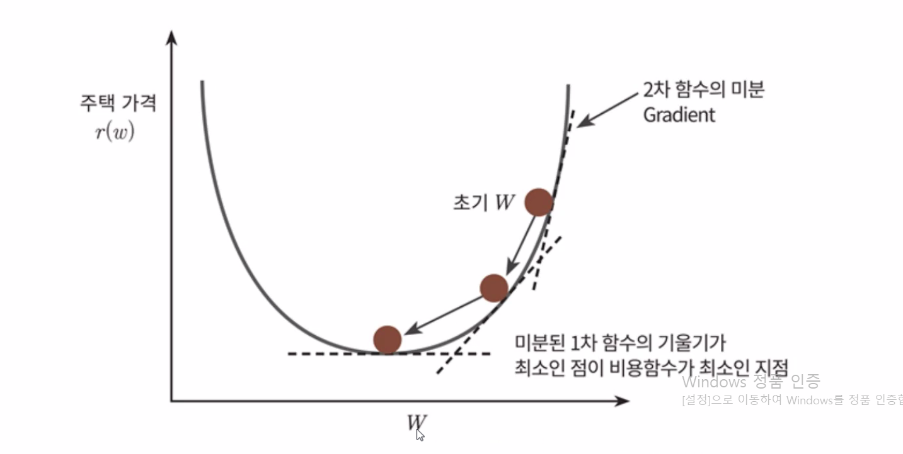

- 편미분 계산식

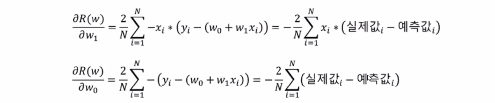

### 경사하강법 (Gradient Descent)

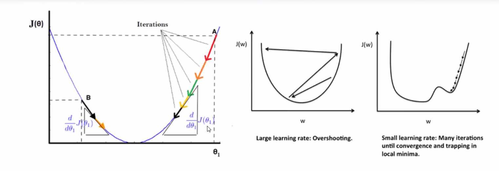

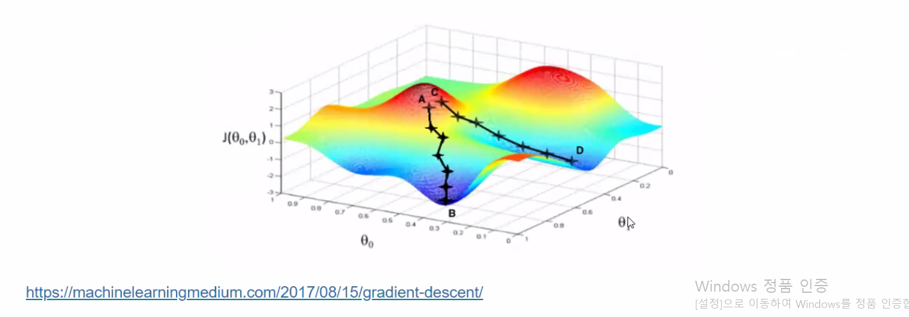

- B는 최적의 최소 값을 가지는 위치
  - 이때의 새타0, 1를 구해야함 (근사치)

#### 경사하강법의 일반적인 프로세스

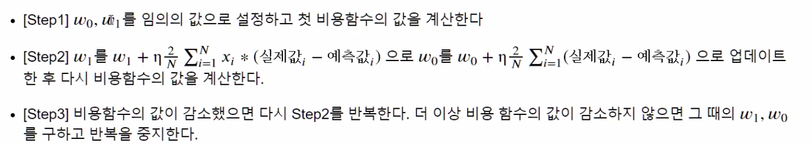

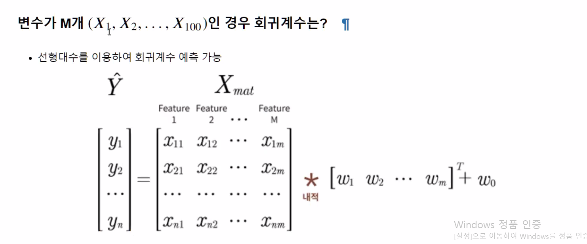

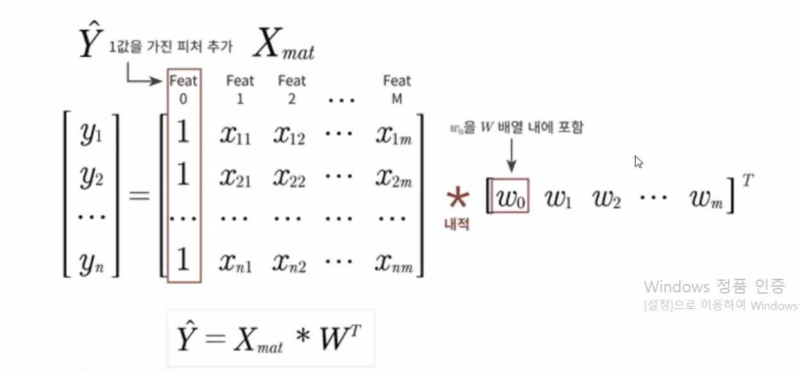

##  LinearRegression 클래스 : Ordinary Least Squares

 LinearRegression 클래스

- RSS를 최소화하는 OLS 추정 방식으로 구현한 클래스
- fit()매서드로 X, y 배열을 입력받으면 회귀계수 W를 coef_, intercep 

입력 파라미터

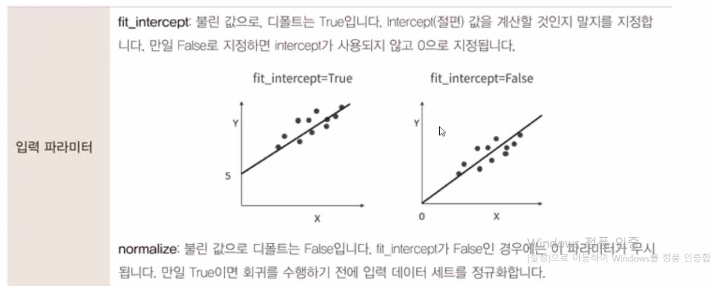

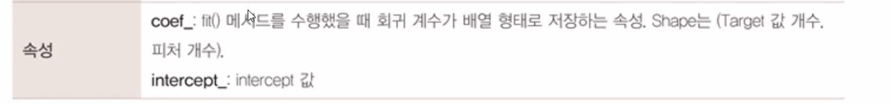

### 다중공선성 문제

- OLS 기반의 회귀계수 계산은 입력 피처의 독립성에 많은 영향을 받음
- 피처 간의 상관관계가 매우 높은 경우 분산이 매우 커져서 오류에 민감해짐

### 다중공선성 해결방방

- 독립적인 중요한 피처만 남기고 제거하거나 규제를 적용
- 매우 많은 피처가 다중공선성 문제를 가지고 있는 경우 PCA를 통해 차원축소를 수행

### 회귀 평가 지표 

MSE : 실제값과 예측값의 차이를 제곱해서 평균한 것 

RMSE 

- MSE 값은 오류의 제곱을 구하므로
- 실제 오류 평균보다 더 커지는 특성이 있으므로 MSE에 루트를 씌운 것
- 사이킷런에서는 제공하지 않기 때문에
- MSE에 제곱근을 씌어서 계산하는 함수 직접 만들어서 사용

R 제곱 : 분산 기반으로 예측 성능 평가

- 실제값의 분산 대비 예측값의 분산 비율을 지료로 하며
- 1에 가까울수록 예측 정확도가 높음

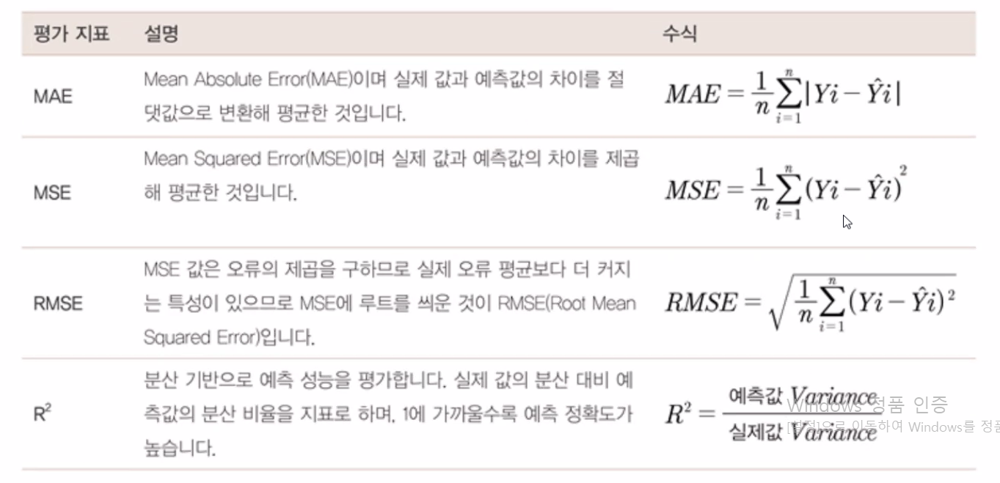

- 사이킷런은 RMSE를 제공하지 않으므로, MSE에 제곱근을 적용하여 계산하는 함수를 직접 만듬

사이킷런 API 및 cross_val_score()나 GridSearchCV에서 평가 시 사용되는 Scoring파라미터 적용 값

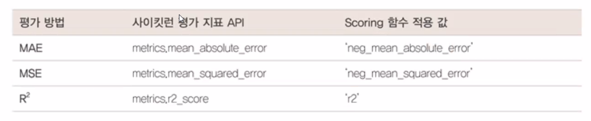

cross_val_score()나 GridSearchCV와 같은 Scoring 함수에 회귀 평가 지표를 적용할 때 유의점

: MAE, MSE의 scoring파라미터 값에 'neg'가 붙어 있음

- 이는 Negative를 의미하는데

## 단순 선형 회귀 분석

## 사이킷런 LinearRegression을 이용한 보스턴 주택 가격 예측

**사이킷런의 `linear_model` 모듈**

- 매우 다양한 종류의 선형 기반 회귀를 클래스로 구현
- http://scikit-learn.org/stable/modules/classes.html#module-sklearn.linear_model

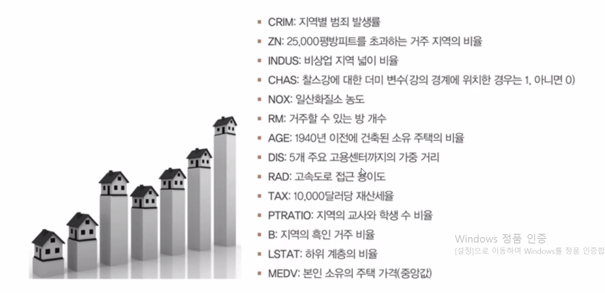

## 다항 회귀

### 다항 회귀 이해

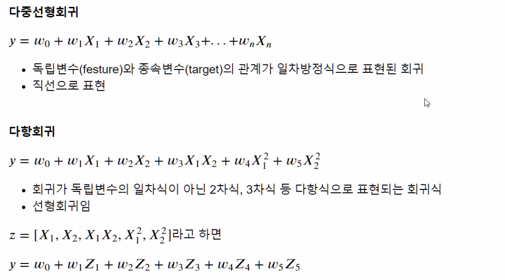

#### 🎈참고 - 선형/비선형 기준

회귀 계수가 선형/비선형인지에 따른 것이지 독립변수의 선형/비선형 여부와 무관함

사이킷런은 다항회귀를 위한 클래스를 명시적으로 제공하지 않음

- 다항 회귀가 선형 회귀이므로 

### 실습

**사이킷런 파이프라인(Pipe line)을 이용하여 3차 다항회귀 학습**

- 사이킷런의 Pipeline객체는 Feature엔지니어링 변환과 모델 학습/예측을 순차적으로결합해준다

가상 데이터 생성 및 다항 회귀 추정