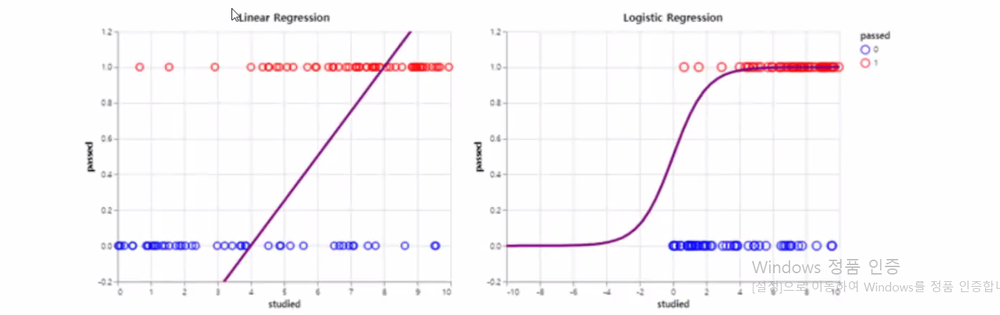
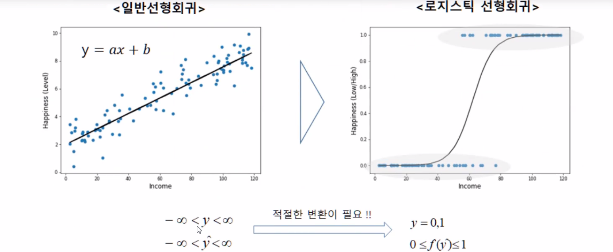
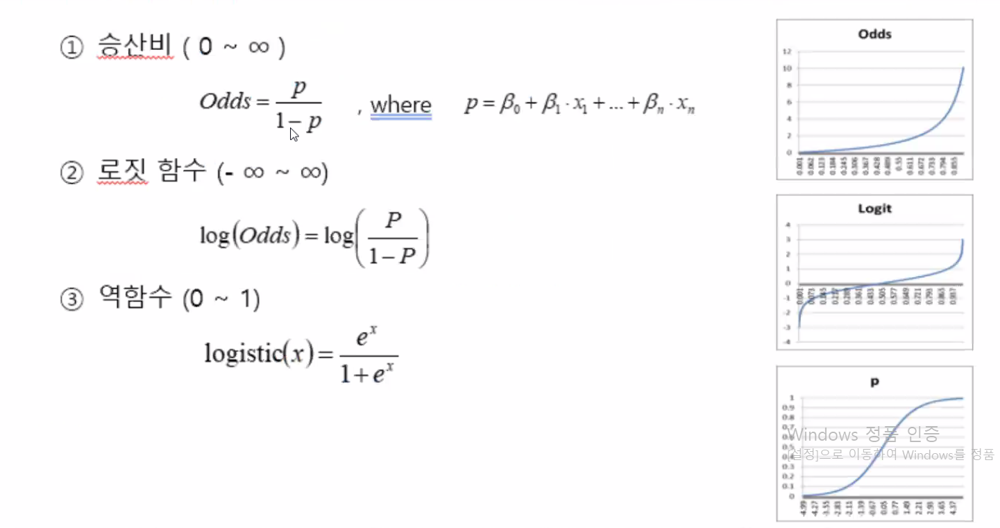
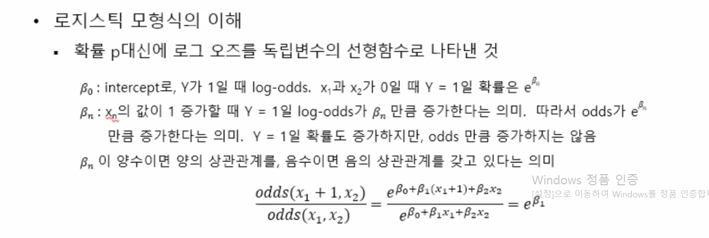
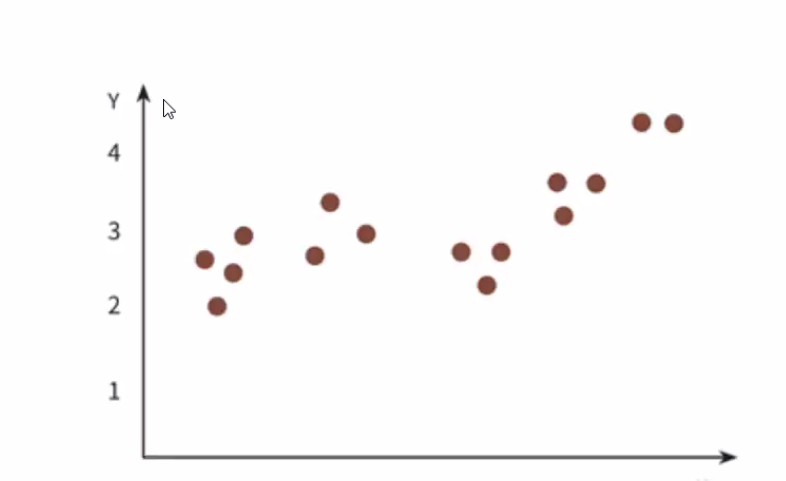
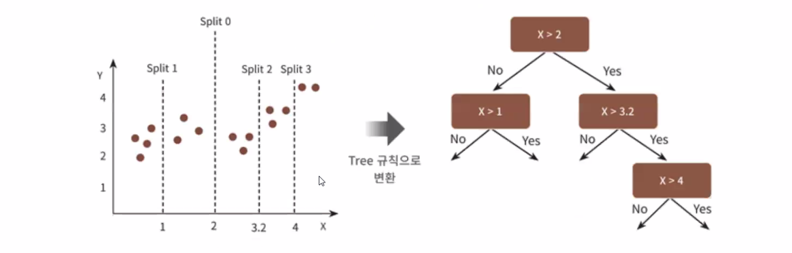
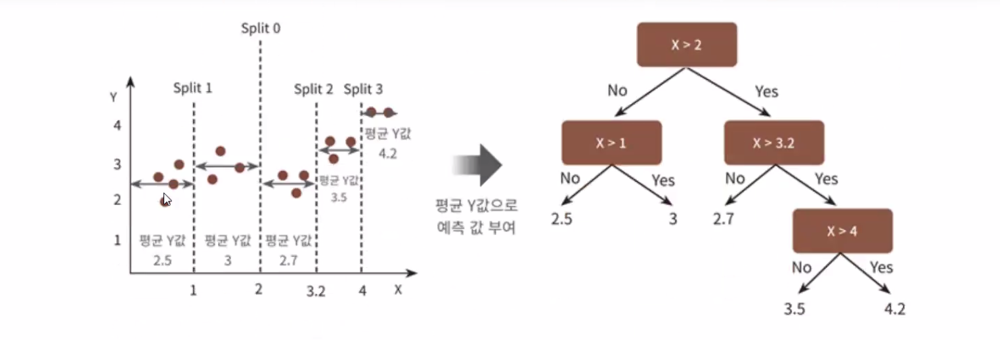
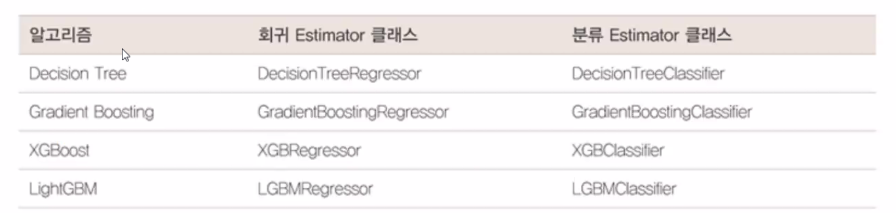

# 로지스틱 회귀

## 로지스틱 회귀 개요

선형회귀방식을 분류에 적용한 알고리즘

- 이진 분류 문제

## 로지스틱 회귀 변환 과정

- p값이 전체를 대변하지 못해서 log를 취해줌
  - Odds
- 무한대 범위
- 역함수를 취해 e값 취함

## 로지스틱 회귀 모델

- p값
  - sigmoid함수
  - log에 승산비

사이킷런의 로지스틱 회귀 클래스 LogisticRegression

## 회귀 트리

사이킷런의 회귀를 위한 결정 트리 기반의 클래스들

- 결정트리. 랜덤포레스트, GBM, XGBoost, LightGBM 모두 회귀 분석 가능

보스턴 주택 가격 예측 문제

