# 분석기법 사용 실습

## 차례

**분석기법 사용 실습**

7. 빅데이터 분석(1) - wordcloud를 활용한 분석
8. R 기본문법 (R 기본 문법 설명)
9. R packages

**공공 데이터 업무적용 실습1**

10. 빅데이터 분석(2) Correlation Analysis (상관 분석)
11. 빅데이터 분석(3) Preprocessing & Classification
12. 빅데이터 분석(4) Association Rule (연관 규칙)
13. 빅데이터 분석(5) Clustering Analysis (군집 분석)
14. 빅데이터 분석(6) 네이버 영화평 자동 크롤링
15. R 관련 site


## 빅데이터 분석(1) wordcloud를 활용한 분석

비정형데이터를 사용한 시각화

대통령 연설물 중 명사만 추출하여 시각화 (워드 클라우드)


## 💻 실습

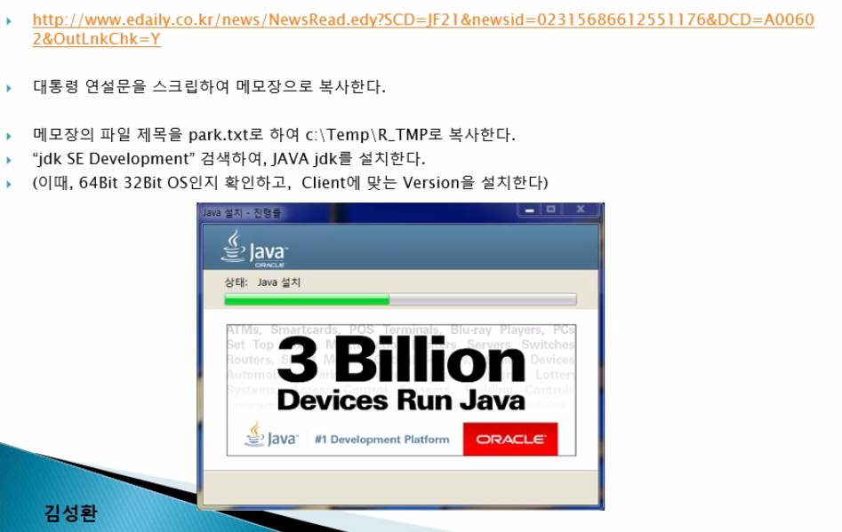


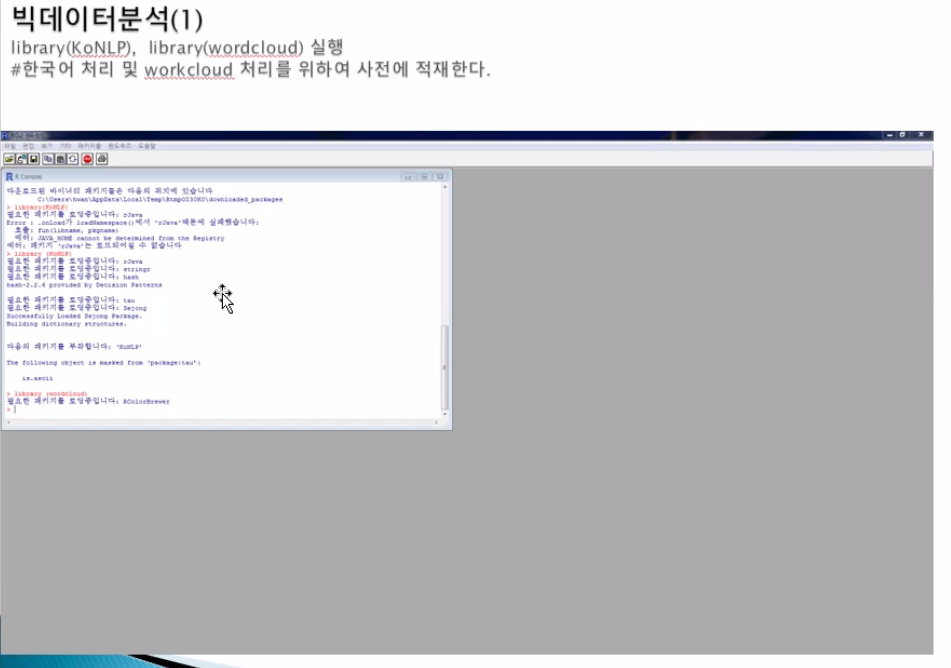


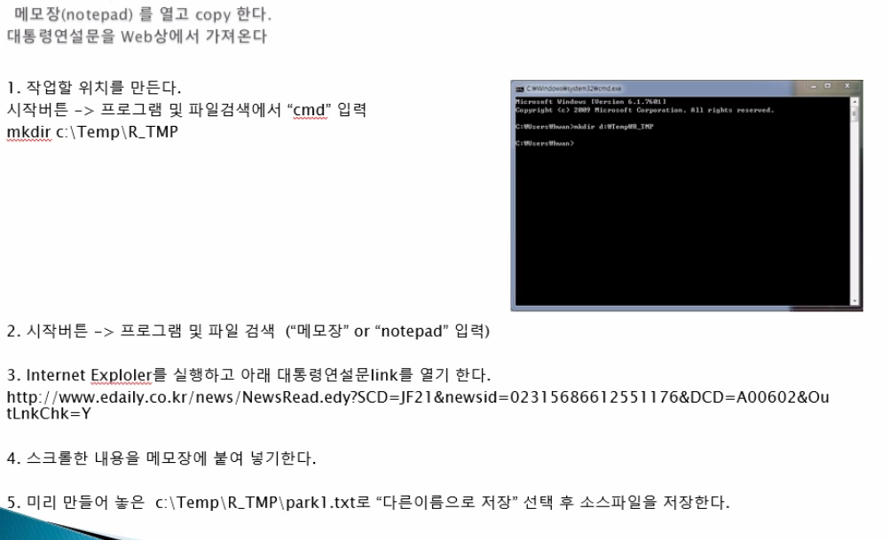


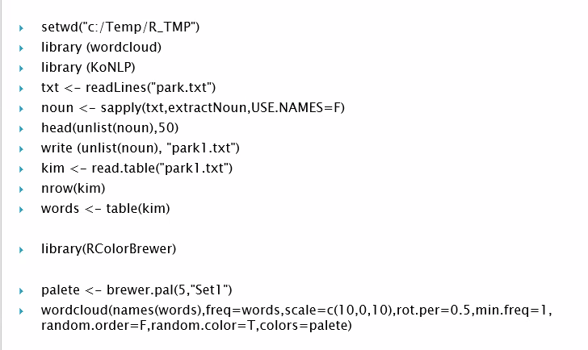


1. 메모장에 복붙

http://www.edaily.co.kr/news/NewsRead.edy?SCD=JF21&newsid=02315686612551176&DCD=A00602&OutLnkChk=Y


2. 패키지 설치

```R
install.packages("KoNLP")
install.packages("wordcloud")
```


3. 콘솔에 작성

```R
setwd("C:/Users/ftsv2/TIL/21KDT/210803")
library (wordcloud)
library (KoNLP)
txt <- readLines("park.txt")
noun <- sapply(txt,extractNoun,USE.NAMES=F) 
head(unlist(noun),50)
write (unlist(noun), "park1.txt")
kim <- read.table("park1.txt")
nrow(kim)
words <- table(kim)

library(RColorBrewer)

palete <- brewer.pal(5,"Set1")
wordcloud(names(words),freq=words,scale=c(10,0,10),rot.per=0.5,min.freq=1, random.order=F,random.color=T,colors=palete)

```


+++ KoNLP 설치 문제

```R
> install.packages("KoNLP")

‘C:/Users/ftsv2/Documents/R/win-library/4.1’의 위치에 패키지(들)을 설치합니다.
(왜냐하면 ‘lib’가 지정되지 않았기 때문입니다)
--- 현재 세션에서 사용할 CRAN 미러를 선택해 주세요 ---
경고메시지(들): 
package ‘KoNLP’ is not available for this version of 
```


KoNLP 라이브러리 직접 다운 받아  `C:\Users\ftsv2\Documents\R\win-library\4.1` 하위 폴더에 직접 설치


```R
> library (KoNLP)

에러: package or namespace load failed for ‘KoNLP’:
 package ‘KoNLP’ was installed before R 4.0.0: please re-install it
```


문제 원인 : R버전은 4.1 ↔ KoNLP 버전은 4.0

해결 방안 : KoNLP 깃허브에서 받은 코드 사용

```R
install.packages('rJava')
install.packages('memoise')
install.packages('multilinguer')
install.packages('remotes')
remotes::install_github('haven-jeon/KoNLP', upgrage='never', INSTALL_opts=c('--no-multiarch'))

library('KoNLP')
library('wordcloud')

setwd("C:/Users/ftsv2/TIL/21KDT/210803")
txt <- readLines("park.txt")
noun <- sapply(txt,extractNoun,USE.NAMES=F) 
head(unlist(noun),50)
write (unlist(noun), "park1.txt")
kim <- read.table("park1.txt")
nrow(kim)
words <- table(kim)

library(RColorBrewer)

palete <- brewer.pal(5,"Set1")
wordcloud(names(words),freq=words,scale=c(10,0,10),rot.per=0.5,min.freq=1, random.order=F,random.color=T,colors=palete)

```


## R 기본문법 (R 기본 문법 설명)


기본 문법 설명 (1)

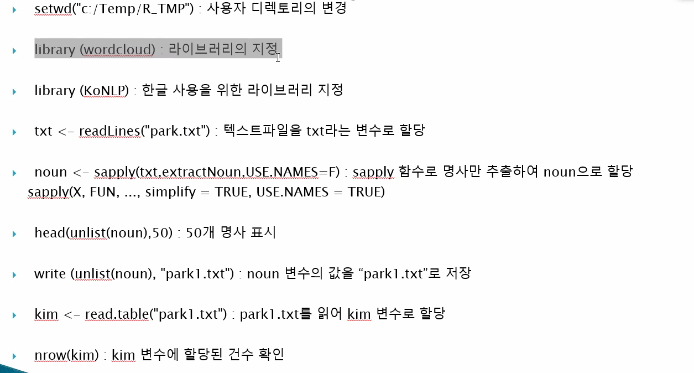


기본 문법 설명 (2)

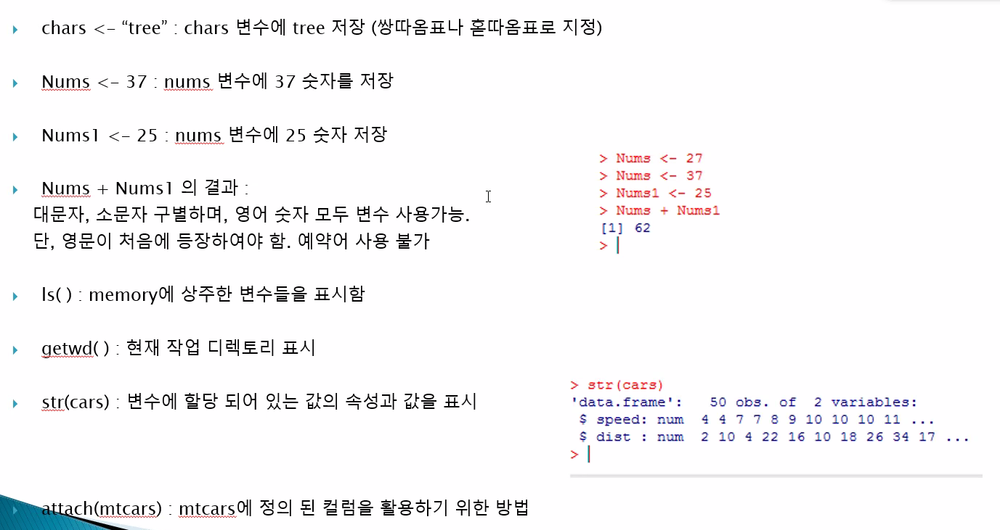


기본 문법 설명 (3)

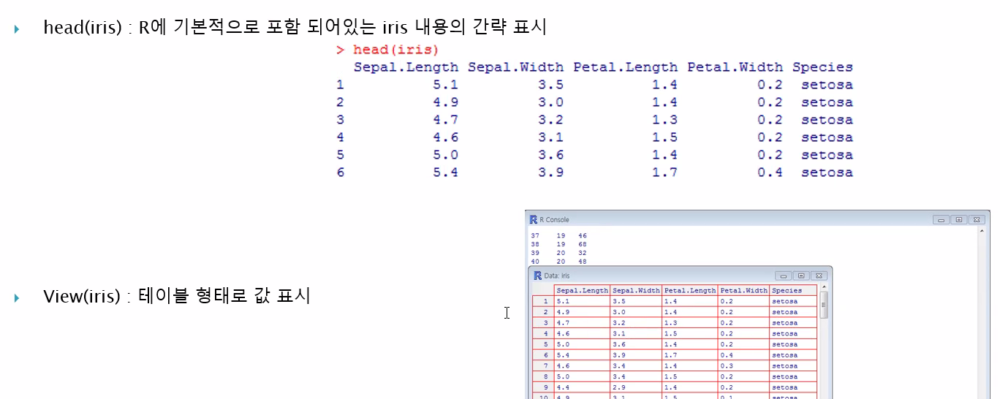


기본 문법 설명(4)

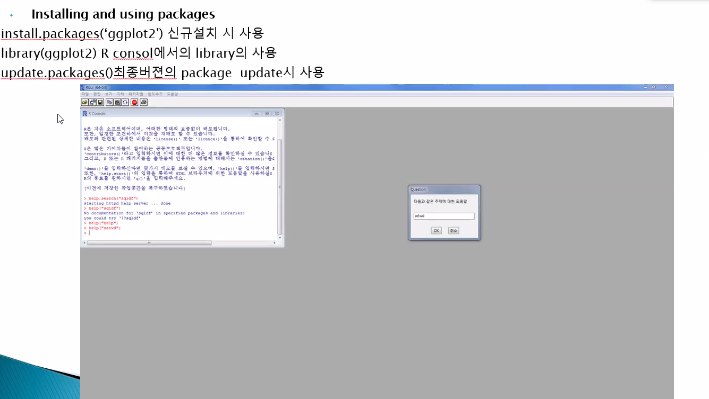


Online으로 기본 문법 표시

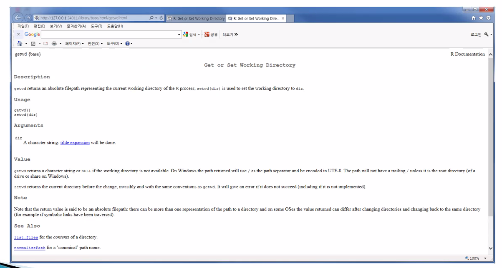


기본 문법 설명(6)

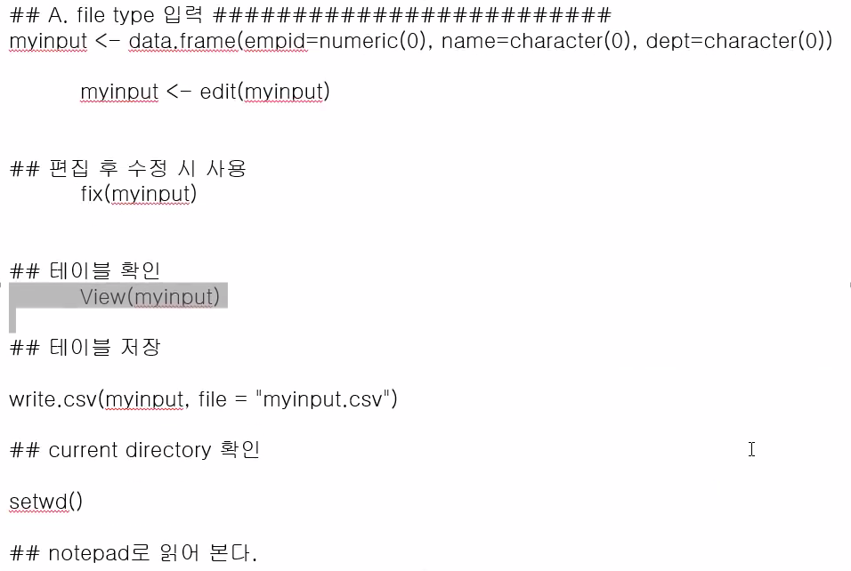


R 콘솔 창 결과


기본 문법 설명(7)

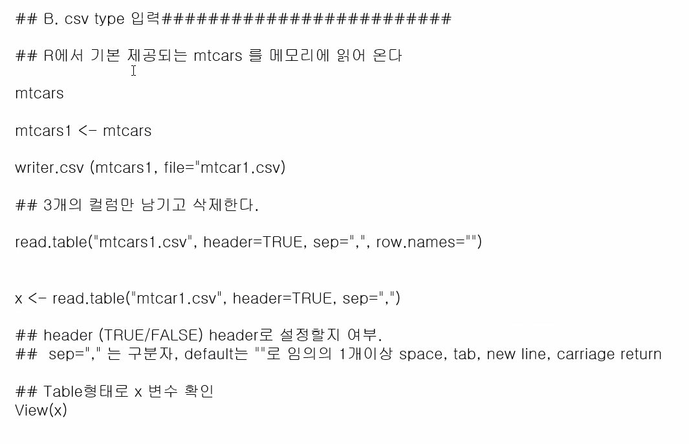


## R packages

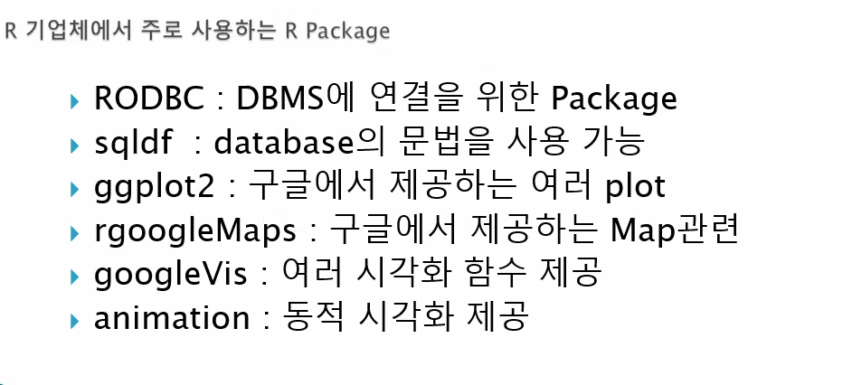


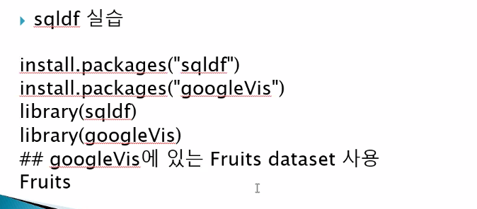


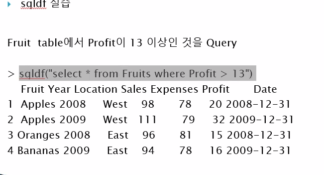


```R
install.packages("sqldf")
install.packages("googleVis")
library(sqldf)
library(googleVis)
## googleVis에 있는 Fruits dataset 사용
Fruits
```

