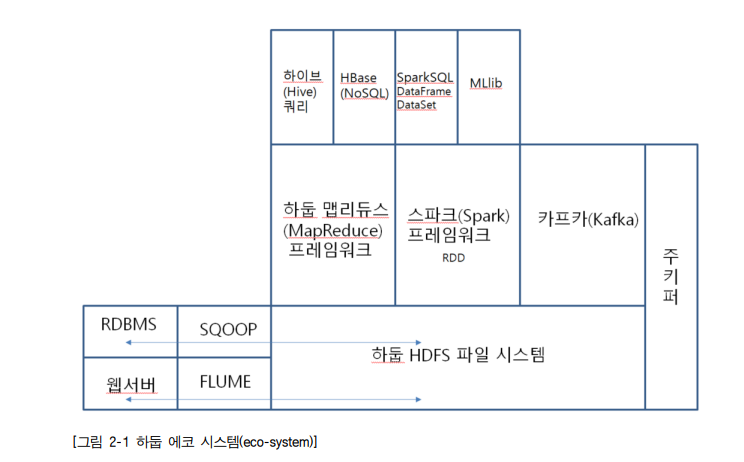
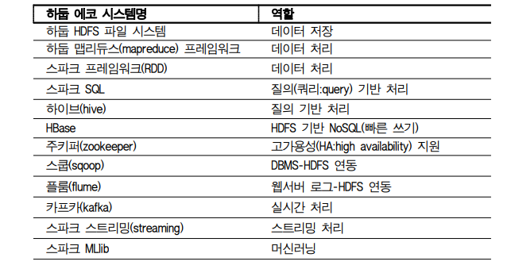
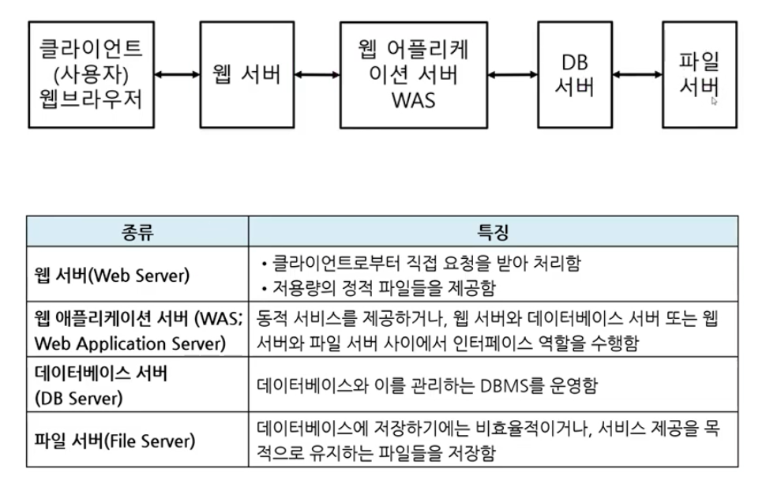

# 빅데이터 저장 시스템 개발

p15 

파일 시스템

p17 

가상화(Virtualization) 기술

- 하이퍼바이저 : Xen

p20 

관계형 데이터베이스(RDBMS:relational database management system)의 제약 조건

- Not Null : 컬럼값 널 허용 x
- Unique : 동일한 컬럼값 널 허용 x
- Primary Key : 특정 레코드 선택하는 컬럼 
- Foreign Key : 다른 테이블을 연결하는 컬럼
- Check : 레코드의 컬럼값이 조건을 만족
- Default : 컬럼값이 없을 경우 기본값을 지정
- Index : 레코드를 빨리 검색하도록 하는 보조 자료 구조
  - B트리
    - 10보다 작은 데이터는 왼쪽 링크를 따라가고 10보다 큰 값은 오 른쪽 링크를 따라간다. 이렇게 몇 번의 비교 연산을 통해 원하는 데이터를 빨리 검색할 수 있는 자료 구조를 인 덱스라고 부른다.

p22  

관계형 데이터베이스와 NoSQL : 자주 업데이트되는 환경에서는 관계형 데이터베이스가 성능이 떨어지는 경우가 많다.  이를 보완하기 위해서 NoSQL이라는 기술이 등장

- NoSQL : 주로 빠른 쓰기를 하기  위해서 고안된 기술로 관계형 데이터베이스의 약점을 보완해 주는 기술

p23 

복제(Replication) :  NoSQL에서는 샤드 단위로 복제를 하는 데  비해 하둡 파일 시스템(HDFS:hadoop file system)과 같은 빅데이터 파일 시스템에서는 파 12 일 저장 시스템의 기본인 블록(block, 보통 64-128MB) 단위로 복제해 저장한다는 것이 차 별점

p26 

HDFS-아키텍처 : 하둡 HDFS(hadoop file system)는 크게 두 가지 종류의 노드가 있다. 파일과 폴더의 메타 정보를 저장하는 네임노드(namenode)와 실제 데이터를 저장하는 데이터노드(datanode)로  구성

네임노드 고가용성(HA:high availability) : 주키퍼(zookeeper)라는 기술을 채택했다. 주키퍼에서 주-부 (active-standby) 네임노드를 뽑아(election) 운영하는 방식을 사용한다. 

p28

컴퓨터 요구 사항

p29 ~ p37 

https://www.virtualbox.org/wiki/Downloads

[Enterprise Open Source and Linux | Ubuntu](https://ubuntu.com/)

p 37

리눅스 명령어

chmod

 파일의 권한(본인/그룹/그 외)으로 나눠서 읽기/쓰기/실행 권한을 부여한다.  

ls -al을 실행하면 특정 파일/폴더의 권한을 확인할 수 있다.  

drwxrwxrwx의 형태를 가진다 

- d(폴더) l(심볼릭링크) user(rwx)group(rwx)other(rwx)의 형태 로 지정한다. 2진법으로 지정할 수 있다(r은 4로 w는 2, 실행을 1로 환산한다). 

$ chmod u+x $HOME/sample/issue(사용자에게 해당 파일의 실행 권한을 부여) 

$ chmod 777 $HOME/sample/issue(모든 사용자가 읽고 쓰고 실행할 수 있음.

## 2 빅데이터 저장 관리 시스템  구성하기 학습 

### 2-1. 빅데이터 저장 관리 시스템 구성 

#### 학습 목표 

• 빅데이터 저장 계획에 필요한 하드웨어 및 소프트웨어를 구성할 수 있다. 

• 저장 관리 시스템의 성능 향상을 위하여 주어진 매뉴얼에 따라 시스템의 환경을  설정할 수 있다. 

• 주어진 테스트 절차에 의해 데이터 저장 관리 시스템 설치 완료 여부를 확인할 수  있다

#### 필요 지식

**하둡 에코 시스템(hadoop eco-system)** 

하둡이나 스파크 외에 필요한 에코 시스템을 설치한다. 예를 들면 하둡에서 관계형 데이터베이스를 접근(읽기나 쓰기)할 때 아파치 스쿱(sqoop)이나 웹서버의 운영 로그를 하둡 쪽으로 가져올 때 사용하는 아피치 플룸(flume) 같은 에코 시스템을 설치한다. 또 SQL스타일 의 쿼리를 실행하기 위해 아파치 하이브(hive)를 사용한다. 이 밖에도 많은 하둡/스파크 관 련 에코 시스템들이 있다.

- 하둡 맵리듀스 ⇒ 디스크
- 스파크 ⇒ 메모리
  - 디스크에 비해 메모리는 속도가 수십배 빠르다
    - 스파크가 역사가 길지 않은데 각광받는 이유

- 스쿱 : 인터페이스 역할 (RDBMS ↔ 하둡 HDFS 파일 시스템)
- 플룸 : 로그 수집
  - 웹서버를 플룸을 통해 가져옴
- 파일 시스템 : DB화 되지 않고 시스템에 저장된 파일들
  - 오라클에서의 파일시스템 정보 → 테이블 스페이스

- 웹서버 :  클라이언트로부터 직접 요청을 받아 처리하는 서버. 저용량의 정적 파일(HTML, CSS 등)을 제공
  - 예.  Apache HTTP Server, IIS, Microsoft Internet Information Service 등

> ##### 맵리듀스 

데이터 처리하는 프레임워크

> ##### (R)DBMS있는 내에 있는 데이터를 내용을 어떻게 보는가?

- SQL 쿼리문 이용해서 볼 수 있음
  - 관리자(DBA) Id/password는 매우 중요한 보안 내용
    - infranet(내부망)에 접근 못하게
    - 방화벽(firewall)설치하여 외부에서 못들어오게 막음

> ##### HTTPS://

**HTTPS** (**HTTP** Secure) 는 **HTTP** protocol의 암호화된 버전이다. 이것은 대개 클라이언트와 서버 간의 모든 커뮤니케이션을 암호화 하기 위하여 SSL 이나 TLS을 사용한다. 이 커넥션은 클라이언트가 민감한 정보를 서버와 안전하게 주고받도록 해준다.

#### 개발환경 구축

`RDBMS(게시판) ↔ application ↔ WAS ↔ 웹서버 ↔ internet (pc, ...)`

`User ↔ 웹서버 ↔ WAS ↔ DBMS `

- 웹서버 + WAS ⇒ 웹 응용 시스템
- 웹 서버는 수많은 서비스 요청 처리로 인해 대용량 데이터 요청 시 WAS에게 해당 요청 넘김
- 트랜잭션 언어로 변환 후 DBMS에 전달

