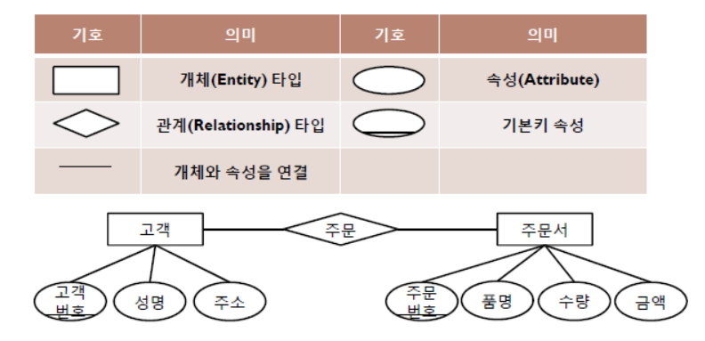

# 데이터 모델

## 데이터 모델

### 모델

모형, 축소형이라는 의미로서 사람이 살아가면서 나타날 수 있는 다양한 현상에 대해서 일정한 표기법에 의해 표현해 놓은 모형

- 어떤 목적을 달성하기 위해 커뮤니케이션 효율성을 극대화한 고급화된 표현 방법

### 데이터 모델

<u>데이터를 추상화한 것</u>

현실 세계의 정보들을 컴퓨터로 표현하기 위해 **단순화, 추상화**하여 체계적으로 표현한 **개념적 모형**

- 데이터베이스의 골격을 이해하고 
- 그 이해를 바탕으로 SQL 문장을 효율적으로 작성하기 위해 꼭 알아야 하는 핵심요소입니다.
  - 기능과
  - 성능적인 측면에서 

#### 데이터 모델에 표시할 요소

##### **구조** 

- 논리적으로 표현된 개체 타입들 간의 관계로서 데이터 구조 및 정적 성질을 표현

##### **연산**

- 데이터베이스에 저장된 실제 데이터를 처리하는 작업에 대한 명세로서 데이터베이스를 조작하는 기본 도구

##### **제약조건**

- 데이터베이스에 저장될 수 있는 실제 데이터의 논리적인 제약조건

#### 데이터 모델의 구성 요소

##### 개체 (Entity)

- 데이터베이스에 표현하려는 것
- 현실세계에서 독립적으로 존재하는 유형, 무형의 정보
- 어떤 정보를 제공하는 역할 수행
- 독립적으로 존재하거나 그 자체로서도 구별 가능

##### 속성 (Attibute)

- 데이터의 가장 작은 논리적 단위
- 개체를 구성하는 항목

##### 관계 (Relationshipt)

- 개체 간의 관계 또는 속성 간의 관계

## 데이터 모델링

정보시스템을 구축하기 위해, 

- 해당 업무에 어떤 데이터가 존재하는지 

- 업무가 필요로 하는 정보는 무엇인지를 분석하는 방법

좀 더 실무적으로 접근하자면, 

- 업무에서 필요로 하는 데이터를 시스템 구축 방법론에 의해 분석하고 설계하여 

- 정보시스템을 구축하는 과정으로 정의할 수 있습니다.

### 데이터 모델링의 주요 목적

업무 정보를 구성하는 기초가 되는 정보들을 일정한 표기법에 의해 표현함으로써

- 정보시스템 구축의 대상이 되는 업무 내용을 정확하게 분석하는 것과
- 분석된 모델을 가지고 실제 데이터베이스를 생성하여 개발 및 데이터관리에 사용하기 위한 것

### 데이터모델링 이란

- 정보시스템을 구축하기 위한 데이터관점의 업무 분석 기법
- 현실세계의 데이터(what)에 대해 약속된 표기법에 의해 표현하는 과정
- 데이터베이스를 구축하기 위한 분석/설계의 과정

### 데이터 모델링의 중요성 및 유의점

#### 1. 파급효과

프로젝트가 상당히 진행된 도중에 <u>데이터 모델의 변경이 불가피한 상황이 발생</u>한다면 프로그램의 상당수를 수정해야 되는 일이 발생한다.
이는 상당한 위험요소가 될 수 있기 때문에, 데이터 설계를 하는 데이터 모델링의 과정을 철저히 거쳐 프로젝트 도중 **데이터 모델을 변경하는 불상사를 방지**하여야 합니다.

#### 2. 복잡한 정보 요구 사항의 간결한 표현 (Conciseness)

<u>데이터 모델은</u> 구축할 시스템의 정보 <u>요구 사항</u>과 한계를 <u>가장 명확하고 간결하게 표현할 수 있는 일종의 설계도</u>입니다.
**정보 요구 사항을 파악**하는 가장 좋은 방법은 수많은 페이지의 기능적인 요구 사항을 파악하는 것보다 간결하게 그려져 있는 데이터 모델을 리뷰하면서 파악하는 것이 훨씬 빠른 방법입니다.

#### 3. 데이터 품질 (Data Quality)

데이터베이스에 담겨 있는 데이터는 기업의 중요한 자산이기 때문에 품질이 높은 정확성 있는 데이터가 저장되어 있어야 합니다.
데이터 품질의 문제가 야기되는 이유 중 하나가 **데이터 구조**인데, 

- 중복 데이터의 미정의

- 데이터 구조의 비즈니스 정의의 불충분

- 동일한 성격의 데이터를 통합하지 않고 분리함

으로써 나타나는 <u>데이터 불일치 등의 문제가 발생하지 않도록</u> 주의하여야 합니다.

## 데이터 모델링 3단계

### 개념적 데이터 모델링(Conceptual Data Modeling)

**현실 세계에 대한 인간의 이해를 돕기 위해 추상적 개념으로 표현하는 과정**

처음 현실세계에서 추상화 수준의 높은 수준을 형상화하기 위해 개념적 데이터 모델링을 한다.

조직, 사용자의 데이터 요구 사항을 찾고 분석하는 데서 시작하며, 특정 자료의 중요도와 유지 여부를 결정한다.

이 단계에 있어서 핵심은 엔티티(Entity)와 그들 간의 관계를 발견하고,

그것을 표현하기 위해 엔티티-관계 다이어그램(E-R Diagram)을 생성한다.

DBMS에 **독립적인 개념 스키마와 트랜잭션 인터페이스를 설계**

#### 엔티티-관계 다이어그램(E-R Diagram)

- 개체타입과 이들 간의 관계 타입을 이용해 현실 세계를 개념적으로 표현

### 논리적 데이터 모델링(Logical Data Modeling)

**개념적 모델링 과정에서 얻은 개념적 구조를 컴퓨터가 이해하고 처리할 수 있도록 변환하는 과정**

- **관계형 모델**, **계층형 모델**, **네트워크 모델**, **망형 모델**로 구분
  - **관계형** 데이터 모델 
    - 가장 널리 사용되는 데이터 모델
    - 표를 사용하여 데이터 상호 관계를 정의하는 DB구조
  - **계층형** 데이터 모델 
    - 데이터의 논리적 구조도가 트리 형태
    - 개체가 Tree를 구성하는 노드 역할을 함
    - 개체간의 관계를 부모-자식 관계로 표현
  - **망형** 데이터 모델 
    - 그래프를 이용하여 데이터 논리 구조를 표현한 데이터 모델

엔티티 중심의 데이터 모델이 완성되면, 업무의 구체적인 모습과 흐름에 따른 구체화된 업무 중심의 데이터 모델을 만든다.

즉, 비즈니스 정보의 논리적인 구조와 규칙을 명확하게 표현하는 기법

논리적 데이터 모델링 단계에서 

**트랜잭션 인터페이스를 설계**하고, **정규화**, **참조 무결성 규칙 정의**, **M:M 관계 해소**

 등의 작업을 진행한다.

### 물리적 데이터 모델링(Physical Data Modeling)

**논리적 모델을 실제 컴퓨터의 저장 장치에 저장하기 위한 물리적 구조를 정의하고 구현하는 과정**

데이터베이스 모델링 과정의 마지막 단계인 물리 데이터 모델링은 논리 데이터 모델이 데이터 저장소로서 어떻게 컴퓨터 하드웨에 표현될 것인가를 다룬다.

데이터베이스가 물리적으로 컴퓨터에 어떻게 저장될 것인가에 대한 정의를 **물리적 스키마**라고 한다.

물리적 데이터 모델링 단계에서는 **트랜잭션 세부사항을 설계**하고,

테이블, 칼럼 등으로 표현되는 **물리적인 저장구조에 사용될 저장 장치**,

자료를 추출하기 위해 사용될 **접근 방법** 등을 정한다.

실제 프로젝트에서는 물리적 데이터 모델링을 수행하는 경우는 드물다.

## 데이터베이스 설계

데이터베이스의 스키마를 정의하고, 이에 따라 DB를 구현하기 위한 전반적인 과정

요구 조건 분석 → 개념적 설계 → 논리적 설계 → 물리적 설계 → 구현 → 운영 및 개선

## 출처

https://blog.naver.com/PostView.nhn?blogId=qbxlvnf11&logNo=221225469375&widgetTypeCall=true