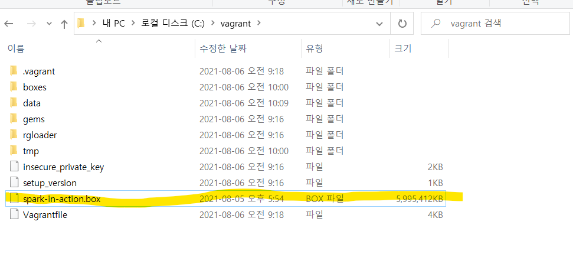

## 실습

### 설치

1. C에 vagrant파일 생성

   C:\vagrant

2. 환경 변수 설정

   VAGRANT_HOME=C:\vagrant

3. 박스 다운

   https://app.vagrantup.com/anassbo/boxes/spark-in-action-box

4. 박스 다운로드 후에 vagrant파일로 옮김

   

5. BOX 추가

   $ vagrant box add manning/spark-in-action spark-in-action-box.json

6. 가상머신 초기화

     $ vagrant init manning/spark-in-action

7. 가상머신 실행 초기화

     $ vagrant up


### 가상머신 사용

1. 가상머신 실행, 로그인

   1. 실행 - cmd

      $ vagrant up

      $ vagrant ssh -- -l spark

      `password :` spark

   2. oracla VM VirtualBox 관리자

      도구 아래 vagrant_default··· 표시

      로그인 id : spark / password: spark
      
   3. spark-shell 확인

      $ spark-shell

   4. scala> :quit

   


### PuTTY 사용

1. PuTTY 실행

   Host name : 192.168.10.2

   Port : 22

   Open 

2. 로그인 

   login as : spark 

   password : spark

3. 설치

   $ sudo apt-get install x11-apps

   password : spark

4. 깃허브 저장소 복제

   $ git clone https://github.com/spark-in-action/first-edition

   - 실행 전에 유효한 url인지 다시 한 번 확인

5. 복제 확인

   spark@spark-in-action:~$ cd fi * 

    spark@spark-in-action:~/first-edition$ ls


### XMing 설치

1. 다운로드

   https://sourceforge.net/projects/xming/ 

   Download

2. 시작 메뉴 - XLaunch

3. parameters설정

   나머지는 다 default 진행

   🌟 specify parameter settings 에서

   ​	clipboard , No Access Control 박스 체크

4. 활용

   PuTTY 실행

   Host name : localhost:0

   왼쪽 category : SSH 선택 - Auth에 X11 선택 - enable x11 forwarding 체크

   Open

   - 안되면 Host name : 192.168.10.2 설정

   로그인 spark  / spark
   
   - xclock 
   - xcalc
   - xedit


### vim 실습

vim

탈출 

- ese :q!


### 이클립스 설치

$ sudo apt-get install eclipse-platform


### 책 실습

```
val licLines = sc.textFile("/usr/local/spark/LICENSE")
val lineCnt = licLines.count()

val numbers = sc.parallelize(10 to 50 by 10)
numbers.foreach(x => println(x))
val numbersSquared = numbers.map(num => num * num)
numbersSquared.foreach(x => println(x))

#
echo "15,16,20,20
77,80,94
94,98,16,31
31,15,20" > ~/client-ids.log
#

val lines = sc.textFile("/home/spark/client-ids.log")
val idsStr = lines.map(line => line.split(","))
idsStr.foreach(println(_))
idsStr.first()
idsStr.collect()

#section 4.1.2
val tranFile = sc.textFile("first-edition/ch04/"+"ch04_data_transactions.txt")
val tranData = tranFile.map(_.split("#"))
val transByCust = tranData.map(tran => (tran(2).toInt, tran))


# 4.1.2.1 키 및 값 가져오기
transByCust.keys.distinct().count()

# 4.1.2.2 키별 개수 세기
transByCust.countByKey()
transByCust.countByKey().values.sum
val (cid, purch) = transByCust.countByKey().toSeq.sortBy(_._2).last
val complTrans = Array(Array("2015-03-30", "11:59 PM", "53", "4", "1", "0.00"))

# 4.1.2.3 단일 키로 값 찾기
transByCust.lookup(53)
transByCust.lookup(53).foreach(tran => println(tran.mkString(", ")))

# 4.1.2.4 mapValues 변환 연산자로 Pair RDD값 바꾸기
transByCust = transByCust.mapValues(tran => { 
if(tran(3).toInt == 25 && tran(4).toDouble > 1)
tran(5) = (tran(5).toDouble * 0.95).toString
tran })

```

