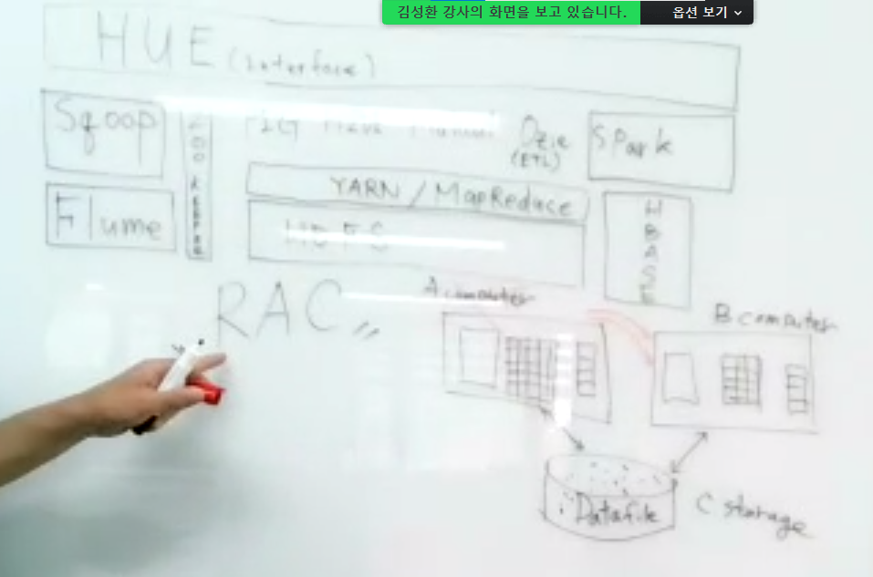

# 데이터베이스 아키텍처의 이해

> **https://dataonair.or.kr/db-tech-reference/d-guide/sql/?mod=document&uid=357** 

## 아키텍처 개관

### 모델링의 정의

DBMS마다 DB정의가 조금씩 다른데, 

Oracle에서는 디스크에 저장된 <u>데이터 집합</u>등을 DB(RDBMS)라고 부른다

```
 RDBMS는 Relational DataBase Management System의 약자로 관계형 모델을 기반으로 하는 DBMS 유형이다.
 RDBMS의 테이블은 서로 연관되어 있어 일반 DBMS보다 효율적으로 데이터를 저장, 구성 및 관리할 수 있다
```

---------------------------------------------------------------------------------------------------

> 데이터 집합

- Datafile
- Redo
  - 시스템 다운(플로)시 장애를 예방하기 위해 Redo file 생성
  - save = **commit** / don't save = **rollback**
  - db의 작업(insert, delete)을 log로 남겨서 load를 쭉 하는 것 = Redo log file
    - Redo log file - > 나중의 장애을 방어하기 위해 히스토리 
- Log File
- Contorl File 등

-----------------------------------------------------------------------------------------

SGA공유 메모리 영역과 이를 액세스하는 프로세스 집합을 합쳐서 인스턴스 (Instance)라고 부른다

> 인스턴스(Instance) = SGA 공유 메모리 영역 + 액세스하는 프로세스 집합 = 사용자 그룹

기본적으로 하나의 인스턴스가 하나의 DB에만 액세스 하지만, 

**RAC (Real Application Cluster)환경**에서는 여러 인스턴스가 하나의 DB를 액세스 할 수 있다. 

하나의 인스턴스가 여러 DB를 액세스 할 수는 없다.


1. 메모리 영역
   - 수십~수백 GB
2. 프로세스 영역
3. 파일 영역

>  1 + 2 = Instance

- cheack point : Db안전성을 위해 싱크를 맞춰주는 것
- Achiver : 백업 
- 자주 사용 = 자주 **hit** 시 io (input/output)작업 때문에 많은 어려움을 겪는다.
- io작업을 최소화하기 위해 -> 인메모리 db




**RAC**


- 서로 다른 instance에서 변경된 데이터를 디스크에 거치지 않고 바로 instance로 가져올 수 있는 **Cache Fusion(캐시 퓨전)** 이라는 기능을 사용한다.
  - Cache Fusion 개념 : 물리적으로 떨어져 있어도 하나로 만들어주는 개념
  - RAC 에서는 어떤 Instance 에서 작업을 해도 하나의 서버에서 작업을 하는 것과 같은 효과를 내게 되는데,
  -  이를 가능하게 해주는 RAC의 대표적인 두가지 서비스가 GES와 GC이다.

  

### SQL Server 아키텍처

SQL Sever는 하나의 인스턴스 당 최고 32,767개의 DB를 정의해 사용할 수 있다. 

기본적으로 master, model, MSDB, tempDB등의 시스템 DB가 만들어지며, 여기에 사용자 DB를 추가로 생성하는 구조다.


DB 하나를 만들 때마다 주(Primary또는 Main) 데이터 파일과 트랜잭션 로그 파일이 하나씩 생기는데,

전자는 확장자가 mdf이고 후자는 ldf이다.

저장할 데이터가 많으면 보조(Non-Primary) 데이터 파일을 추가할 수 있으며, 확장자는 dnf이다.

sql 

자주 사용되는 테이블은 디스크에 유치하도록 (datafile로 가지 말고)

컴퓨터끼리 묶는거 =- cluseter