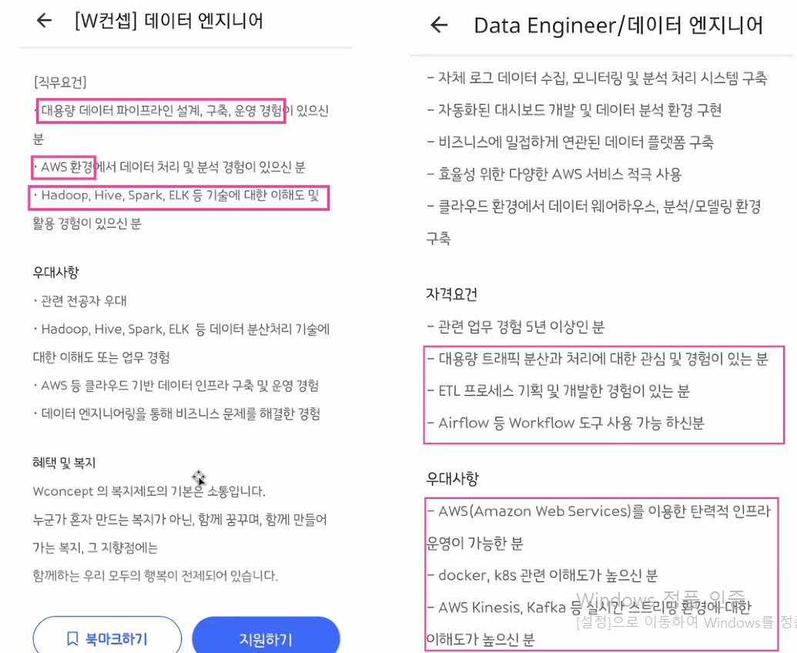
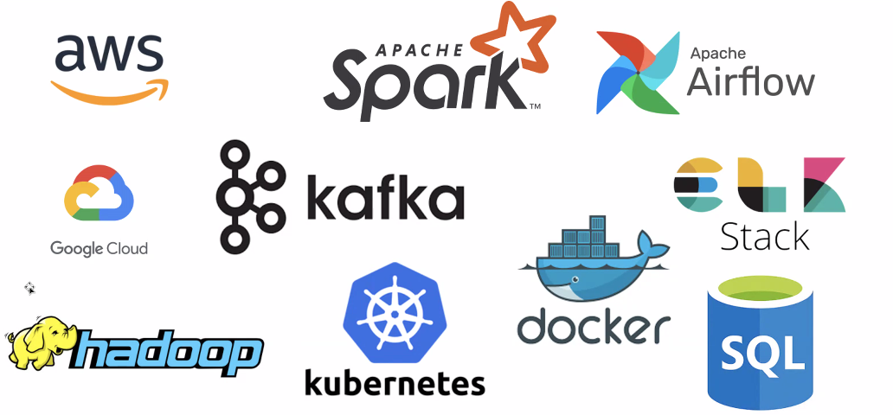
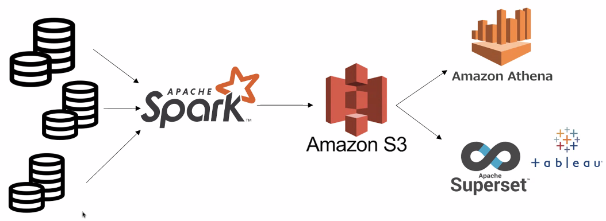
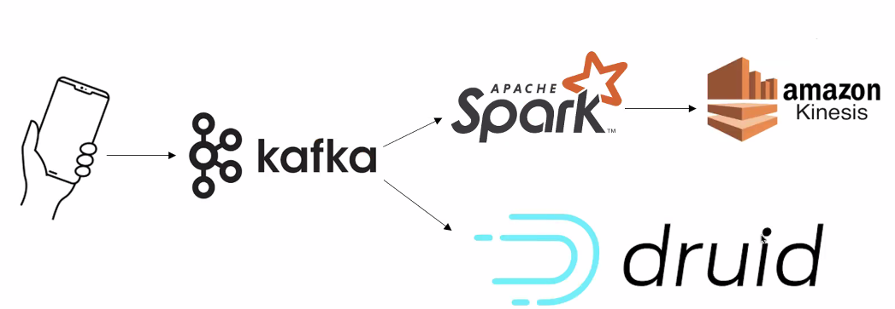
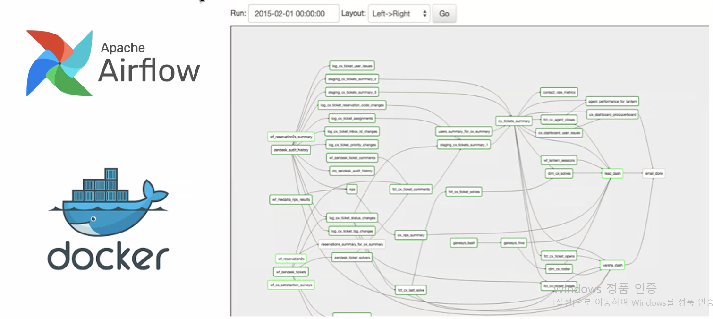
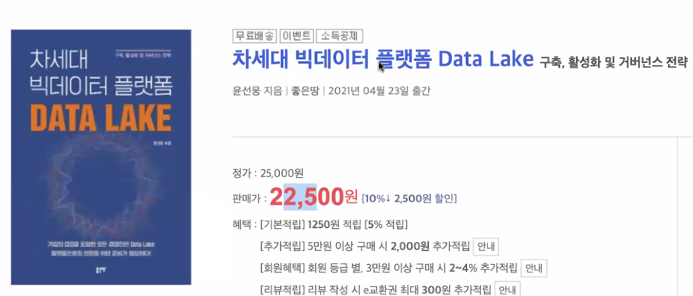
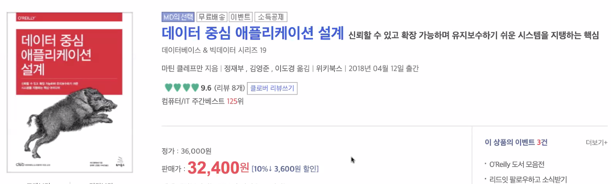
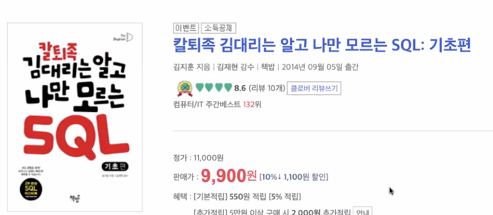
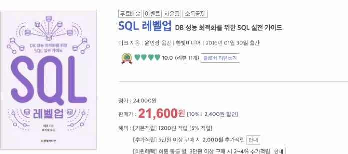

# 캐치 직업소개 - 데이터엔지니어 

## 직무의 이해

### 데이터엔지니어?

- 데이터를 **수집, 가공, 적재**하는 일을 함
  - ETL : 추출 / 변환 / 적재
- 기업이 매일 생산해내는 여러 데이터를 수집하고 관리하며 **필요한 곳에 전달하는** 역할

### 직무 소개

- 데이터가 흘러가는 파이프라인을 구축
- 데이터 파이프라인을 운영하고 모니터링 (장애 관리)
- Data Lake
  - 여러 형태의 데이터 집합
  - 분석에 용이하게
  - 대시보드 구현
- Data Engineer
  - 데이터 파이프라인, 분석 ❌ 
- Data Scientist
  - 데이터 분석  + sw스킬
- Data Analyst
  - 데이터 분석

### Data Engineer 채용 공고

- 최근 요구 기술 
  - 도커, 쿠버네티스, 카프카(open source) 기술

- 분석, 머신러닝에 대한 언급❌ ⇒ 데이터 분석가, 사이언티스트 요구 사항

- 빅데이터 분산 처리 사용 경험

- 클라우드 경험

- 컨테이너 기술 사용 경험

- 기본적 업무 (ETL)

- 회사마다 Data 3가지 직무를 이해하는것이 다름

### SKILL SET

파이프라인의 재료

### 실무예시

#### 첫번째 →  배치데이터 (한 묶음 형식) 파이프라인

- 여러 계열사에서 발생하는 데이터를 한 곳에서 분석하고 싶어요
- 그리고 어제의 매출 정보를 매일 오전 9시에 확인해야해요

- spark : 여러 데이터를 정해진 시간에 합쳐 분석할 수 있도록 데이터 전처리
- Amazon S3 : 데이터 저장 장소
- Amazon Athena : S3에 연결하여 query할 수 있도록 
- Superset : 시간에 맞춰 시각화 처리

- 파이프라인 컨트롤링 ⇒ airflow 

#### 두번째  →  실시간 데이터 파이프라인

- 쇼핑몰에서 지금 고객이 가장 많이 구경하고 있는 top10 제품이 궁금해요
- 실시간 데이터 분석, 로그 수집

- Kafka : 실시간 로그를 받아들일 메세지 queue준비, 카프카로 모이도록 개발자가 개발하여 쏴줌
- spark streaming : 실시간 스트리밍 데이터 처리, 카프카의 쌓인 실시간 데이터를 받음 
- amazon Kinesis : 실시간 분석이 가능하게 등재
- druid : 실시간 분석에 강한 DB, 실시간 탐지 가능

### 실제 사례

- airflow : workflow 등록, 관리

- docker : 서버가 다운되더라도 도커위에 있다면 같은 환경 구축 가능

### 어느 회사에 취업할 수 있나요?

경력 요구가 대부분

2번째 시간에 이어서

### 현장 Q&A

**Q.**

안녕하세요! 질문이 있습니다. 만약 클라우드, 분산 환경에 대해서 개인적으로 경험을 쌓고 싶다면 어떤 플랫폼?을 사용할 수 있나요? 예를 들어, 일반적으로 개인이 노트북/데스크탑을 하나씩 가지고 있는 경우가 대부분인데, 어떤 것을 이용하면서 경험해볼 수 있는지 궁금합니다..

**A.**

대량의 데이터는 기업 데이터이기 때문에 사실상 개인이 다룰 수 없음. 

대량의 데이터 처리 경험보다는 sw적 센스가 있는 사람 요구

- <u>나 빨리 배우고 빨리 적응할 수 있어</u> 어필해야함
- 실습한 것을 신빙성 있게 표현 
  - aws에서 하는 교육
  - aws 자격증
  - DB 제품 써본 경험
  - aws서버 docker로 감싼 airflow를 띄어서 spark로 데이터 돌림

**Q.**

ETL이라는게 웹사이트에서 문서를 크롤링을 해서 가공한 뒤 데이터베이스에 저장하는 것도 ETL이라고 볼 수 있나요??  ETL 경험이라는게 어떤걸 원하는건지 모르겠어요

**A.**

- 크롤링한 경험의 의미 
  - 파이썬 활용 경험이 있음 
  - DB에 인서트 할 수 있음 
  - 데이터 설계 과정 경험 있음

**Q.**

데이터 엔지니어로 취업하기 위해 준비하셨던 토이 프로젝트에 대해 알고 싶습니다. 재직 중이 아닌 경우에도, 데이터 엔지니어링 프로젝트를 해볼 수 있는 것들이 무엇이 있는지 궁금합니다.

**A.**

클라우드, 컨테이너기술, SQL(필수) 할 줄 알아야함

- SQL : 데이터 추출에 필수적인 요건

대용량 데이터가 아닌 sw에 대한 감각·능력을 보여줘야 함

**Q.**

여러 계열사에서 발생한 데이터를 한곳에 모아 가공해서 어떤 데이터를 만들었을 때, 데이터를 가공하는 과정에서 계산 오류? 예외 같은 오류들이 없었는지 검증하는 방법이 있을까요?

**A.**

데이터 정합성 검사해야함. 모델러 or 데이터분석가들의 업무

**Q.**

제조업에서 빅데이터 솔루션개발 직업도 데이터엔지니어가 하는 일인지 궁금합니다.

**A.**

전반적인 업계 분위기

- 오픈소스로 잘 나와있고, 오픈소스로 구성하는것이 많음
- 새로운 솔루션 개발 보다는, 잘 나와있는 오픈소스를 이용하여 잘 구성하는 업무가 대부분임

**Q.**

현재 ERP 쪽 쿼리 개발을 주로 하고 있는 개발자인데, 데이터 엔지니어로 전향하려고 준비중입니다. SQL만 할줄알아서 다른 기술들을 더 공부해서 도전해보려고 하는데 어떤데 중점을 두고 준비를 하면 좋을까요? 또 어떤 방식으로 배우는게 좋을지? 조언 부탁드립니다~

**A.**

SQL을 잘하는 개발자는 큰 장점

컴퓨터 언어 한개는 자유롭게 해야한다. 

- python 또는 java 선택 추천
- docker 사용 경험 추천 
  - 컨테이너 기술이므로 docker설치해서 같이 진행하는 것

**Q.**

혹시 주관적인 질문이지만, 언어를 자유롭게 다룰 수 있다는 게 어느 정도 수준일까요?

**A.**

코테 가볍게 통과할 수 있는 정도. 삼성, 카카오는 제외

데이터 핸들링이 자유로움, 코딩 알고리즘 이해, DB 조작 (insert), API 활용

**Q.**

엔지니어링 채용공고에서 "데이터를 분석 목적/방법론에 적합한 형태로 가공하는 능력"이라는 말이 있는데 어떤 뜻인지 와닿지가 않습니다. 선생님이 느끼시기엔 어떤 의미인지 설명해주실 수 있을까요??

**A.**

적합한 형태로 가공하는 능력 ⇒ 로그 (json형태)등으로 나온 원시데이터를 needs에 맞춰서 가공하는 능력

배치성 데이터 구성일 때,

- 아키텍처 설계 능력 
  - 서버 몇개, DB 어떤거, 어디서 사용하는지
  - 파이프라인 구축 감각 능력

**Q.**

인공지능 모델을 위한 서비스하는 MLOps분야가 많이 핫한데, 이러한 분야도 데이터 파이프라인을 구축한다는 점에서
데이터 엔지니어와 유사하게 보이는데 혹시 데이터 엔지니어가 MLOps를 포함하는 개념인가요? 
kubeflow, bentoml, mlflow 등등 사용하는 스킬셋이 조금 다른것같아서 질문드립니다.

**A.**

머신러닝을 위한 파이프라인 구축, 모델 서빙 역할도 함 ⇒ MLOps 

MLOps과 같이 특이한 도메인 요구를 할때는 따로 명시가 되어 있음

기술들의 맥락이 비슷

반드시 포함되는 것은 아니지만, 데이터 엔지니어링의 일이긴 하고, 그런 경우에는 요구사항에 적혀 있음

**Q.**

데이터엔지니어의 포트폴리오는 보통 어떤 식으로 만드시나요? 활용하시는 사이트를 알고싶습니다.저는 비전공에 회사에서 sql로만 회사에서 만들어진 테이블 내에서 데이터 검증만 했었습니다. 데이터 엔지니어 방향으로 가고 싶은데 어떤 언어부터 해야 될지 추천부탁드립니다.

**A.** 

내일 포트폴리오 관련 내용 준비해뒀음

**Q.**

데이터 엔지니어 분야에서 혹시 추천해주실 책있을까요?

**A.**

엔터프라이즈 데이터 레이크 구축

차세대 빅데이터 플랫폼 Data Lake

<u>데이터 중심 애플리케이션 설계</u>

- 데이터 엔지니어 필독서

국비지원 프로그램을 참여해서 프로젝트 경험하고 포트폴리오 

<u>모든 목적은 프로젝트 경험</u>

팀의 주니어는 필요하다

- 시니어 잡업무 담당 사람 필요

프로그래밍 언어 우선 순위

1. python
2. SQL

신입에게 요구하는 SQL 수준

한 단계 나아간다면

프로젝트 때 시각화 경험 필요

- Tableau 경험 매우 좋음 

**Q.**

명쾌한 해답 감사드려요!
또하나 궁금한 점이 저는 비전공자학사생으로 취업을 준비중이라 빅분기나 adp 둘중에 하나 따려고 고민중인데 어떤게 좀 더 좋을까요..! 빅분기는 adp보다 좀 더 쉽게 취득할 수 있을것같고 adp는 어려워서 인정받기는 좋으나 r기반이구 그러하여 고민입니다!

**A.**

회사에서 사실 자격증을 쳐주지는 않는다....sw 감각이 있다고 생각하지는 않는다.

실드 필드와는 동떨어진 시험이라고 생각함. 노력에 비해 인정 받지는 않음

자격증보다는 프로젝트 1개라도 더 해라

차라리 aws자격증 추천

- 클라우드 경험 어필 가능

**Q.**

아까 말씀주신 다양한 툴 중에서 어떤걸 먼저 배우면 좋을까요? 혼자 공부해보려고 하는데 우선순위를 정하고 싶어서요! (Spark, Amazon S3, Airflow, Amazon Athena, Kafka, Hadoop, Tableau 등등...)

**A.**

하둡은 대체가 많이 되고 있음. 즉 우선 순위는 아님

스파크는 추천

- 데이터를 긁어와서 데이터 처리를 해서 S3에 쌓기

아마존 추천

아테나는 분석 환경 만들어주는것이므로 애매함

python spark airflow docker 

Tableau하면 좋긴한데 필수는 아님

**Q.**

그리고 혹시 데이터엔지니어로 취업을 준비할 때도 깃허브에 꾸준히 소스를 정리하는게 중요할까요?

**A.**

깃허브할꺼면 꾸준하게, 깃허브 능력 보여주는 것은 plus 

**Q.**

업무에 대한 전반적 질문입니다! 그럼 보통 업무가 기존 파이프라인 유지 보수 및 새로운 파이프라인 연결 이렇게 크게 두 가지 인 것으로 보이는데, 첫번째 업무의 경우 주기적으로 이루어질 것이고, 두번째 업무 같은 경우는 보통 시간 단위가 어떻게 걸리나요? 경우에 따라 다른건가요?

**A.**

