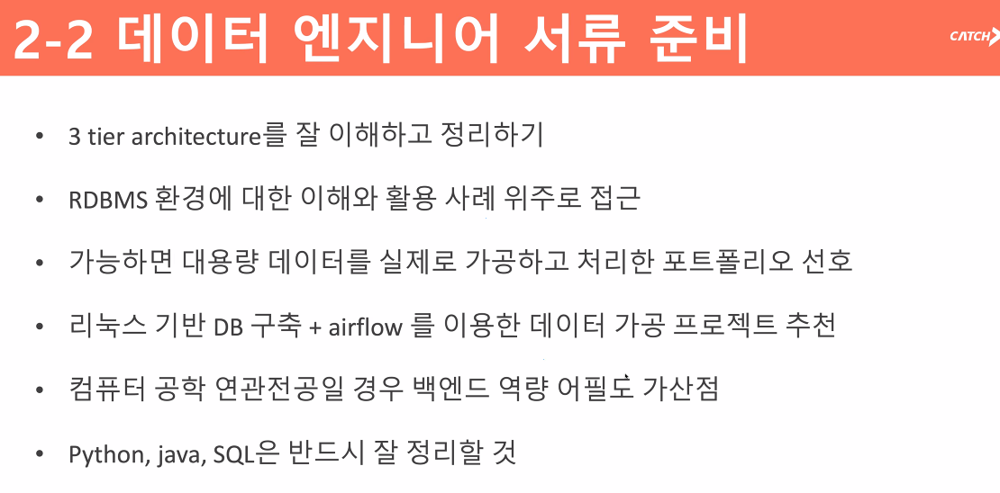

Q. 회귀모형 가설 세워보고 설명해보세요

정규분포 정리

분류모델 (Classification)과 클러스터 차이

- 각 분류의 알고리즘 하나 정도는 시뮬레이션 가능해야함

knn 알고리즘 어떻게 데이터를 분류하는지 설명

- front, back, db 어떻게 동작하는지 확실히 정확하게 공부해야함
  - was, web 동작 방식 - 기초중 찐 기초 모르면 절대 안됨
  - db 정확하게 알아야 함
    -  rdbms 중요
- 데이터 수에 따라 쿼리가 달라짐
  - 1000건 <> 1000만건 <> 1000억건 데이터 어떻게 효율적으로/ 안정적으로 처리해야하는지 실제로 고민한 사람을 엄청 선호

- 리눅스 환경 위에서 db구축 + airflow + api로 백엔드 연결해서 + 대쉬보드로 시각화 프로젝트가 베스트
- 쿼리를 직접 쳐서 데이터를 만든다

Q. 하둡 같은 맵리듀스 기반 분산처리나 스파크, 카프카는 너무 오버스펙인가요? 아니면 엔지니어한테는 좀 불필요한가요 그리고 NoSQL은 잘 안보나요?

A. 학부 기준 신입에게는 최선

​	스파크 <> 하둡 다른 개념

- 하둡 : 스토리지 , HDFS, 분산 네트워크 스토리지, 대용량 데이터를 안정적 저장, 필요할때마다 연산 후 끄집어 내는것 = 속도가 빠르지 않음, 대용량 데이터가 끊임없이 들어오는 사이트들이 주로 사용
- 스파크 : 인메모리 = 연산 빠름, 인메모리에서 데이터를 처리하는데 특화, 빠르 연산이 필요로 하는 대용량 데이터에서 주로 사용. 머신러닝 프레임워크가 되어있음 = 인터페이스에서 가능. 
- 카프카 : 실시간 데이터를 처리하기 위함. 큐를 관리. 큐가 실시간으로 넘어갈 수 있도록 정리
- 데이터가 db에서 출발할때 쿼리가 처리가 안됨 - 전처리 로직 필요

신입 기준 쿼리 짜는 질문

- join 쿼리, sub쿼리 + where절(+sub쿼리)
- select, where(조건절) 어떻게 내가 의도한대로 데이터를 뽑는가 
- 두개 이상 테이블에서 내 의도대로 쿼리를 뽑아낼 수 있는가

kaggle competition 상위 5% - 매우 이상적 (자격증, 공모전 스펙보다 훨씬 나음)