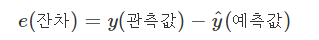
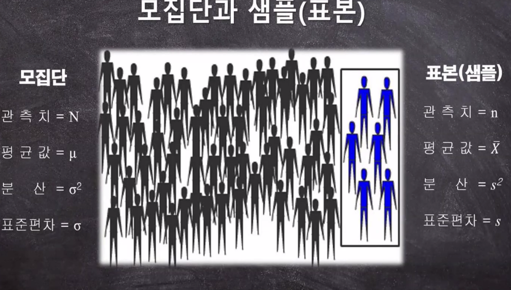
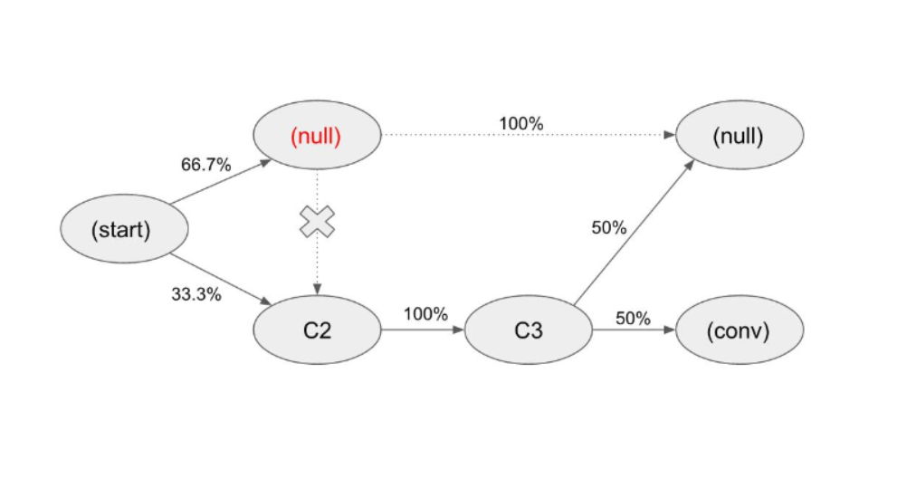
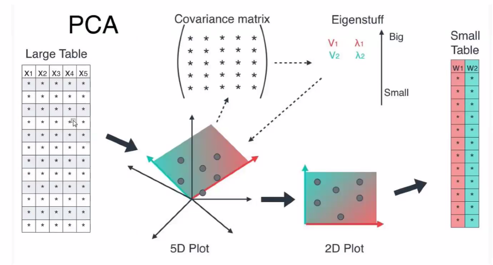

# TIL

## 데이터 분석

전체적인 패턴을 찾고, 그 다음 패턴에서 벗어난 것을 검사하는 것.

## 평균(mean)

평균값, 다 더해서 전체수로 나누는 것

## 편차 (deviation)

**평균값으로부터의 차이**

평균값 기준으로 차이를 게산 

+ **합계**는 **0**

합계를 이용하여 <u>흩어진 정도를 파악할 수 없음</u>

## 분산 (variance)

흩어진 정도를 파악하고자 할때, 편차는 합계가 0이라 이용할 수 없음

**편차에서 부호를 없애고 사용하기 위해 제곱을 하고 다시 평균**을 내는 것

## 표준편차 (standard deviation)

분산(variance)는 단위도 함께 제곱되는데, 이를 개선 위해  **분산(variance)의 제곱근**인 표준편차를 이용

## 공분산 (covariance)

분산과 표준편차들은 하나의 변수를 위한 값인 반면, 공분산은 **서로 다른 두 변수 사이의 관계를 보기 위한 값**

두 변수의 단위가 서로 다르더라도 상관 없음

+ 서로 다른 데이터 간 관계를 표현하는 지표를 사용했기 때문

**공분산의 절대값 크기는 아무런 의미가 없다.**

: X의 평균 ,  : Y의 평균

- **Cov(X, Y) > 0** : 양의 관계에 있다고 표현. --> 어느 하나가 증가하면 다른 하나도 증가함
- **Cov(X, Y) < 0** : 음의 관계에 있다고 표현. --> 어느 하나가 증가하면 다른 하나는 감소함
- **Cov(X, Y) = 0** : 선형관계 없음

## 잔차 (residual)

회귀선: 설명변수와 반응변수의 직선 관계에 대한 전체적인 패턴

관측값과 회귀직선의 예측값과의 차이를 **잔차(residual)**라고 하며, 보통  **e**로 표기한다.

#### 오차(error)

+ 어떤 모집단에서 회귀식을 얻었다면, 그 회귀식을 통해 얻은 예측값과 실제 관측값이 차이
+ 오차 = 실제 관측값 - 예측값 

#### 오차와 잔차의 차이

표본 집단에서 회귀식을 얻었다면, 그 회귀식을 통해 얻은 예측값과 셀제 관측값이 차이를 잔차라고 한다.

사실상 우리는 <u>대부분 표본집단에서 회귀식을 얻기 때문에</u>, 잔차를 가지고 회귀식의 최적의 파라미터 값들을 추정한다. 즉, 잔차들의 제곱들을 더한 것(잔차제곱합)을 최소로 만들어주는 파라미터를 찾는 것이다. 이것이 바로 **최소제곱법(least squares method)**이다. 최소제곱법은 최소자승법과 동의어다.

최소제곱 회귀직선은 관측값과 예측값과의 오차 제곱합을 최소화한다.

## Cost or Loss

모델을 학습할 때는 비용(Cost) 즉, 오류를 최소화하는 방향으로 진행

비용이 최소화되는 곳 = 성능이 가장 잘 나오는 부분

**최적화(Optimization)** : 가능한 비용이 적은 부분을 찾는 것, <u>일반화(Generalization)</u>의 방법.

신경망 분야에서는 손실함수의 값을 최소화하는 <u>하이퍼 파라미터(Hyper Parameter)</u>의 값을 찾는 것

+ **일반화(Generalization)** : 학습데이터와 Input data가 달려져도 출력에 대한 성능 차이가 나지 않게 하는 것 

  + 모델링 목적 : 외부의 data를 모델에 집어 넣어도, 학습된 모델이 얻은 Accuracy(정확도)와 비슷한 값을 가지게 하는 것

+ **하이퍼 파라미터(Hyper Parameter)** : 사용자가 직접 정의할 수 있는 파라미터. 즉, 사람이 파라미터값을 조절할 수 있는 것들을 말한다.

  + 최적화 방법: 확률적 경사하강법 (SGD)

    + 경사하강법: 2차 함수가 있을때, Learning-rate(lr)에 따라 하강을 한다. 

      ​                       lr 작을때: 하강하는 속도가 느려져 학습을 시키는데 시간이 많이 걸린다.

      ​                       lr 너무 클때: 하강하는 폭이 커져 결국 학습이 발산적으로 이루어진다. 

      ​                       <u>따라서 적절한 lr을 줘야한다.</u>

비용(cost) 혹은 손실(loss)이 얼마나 있는지 나타나는 것이 **비용 함수(Cost Funcion), 손실함수 (Loss Function)** 이다. linear regression으로 예를 들자면, 직선에서 데이터가 얼마나 떨어져 있는지 계산하는 함수

### 비용(손실)을 표시하는 함수

1. 비용 함수(Cost Funcion)
2. 손실 함수 (Loss Function)
3. 목적 함수 (Objective Function) 

#### 비용 함수(Cost Funcion)

#### 손실 함수 (Loss Function)

#### 목적 함수 (Objective Function) 

모델(함수)에 대하여 우리가 가장 일반적으로 사용하는 용어로서 최댓값, 최솟값을 구하는 함수를 말한다.

#### 결론

손실함수는 비용함수의 한 부분이고, 비용함수는 목적 함수의 한 타입이다.

즉, **<u>loss function <= cost function <= objective function</u>**

## 통계의 자유도(degree of freedom : df)

주어진 조건 하에서 통계적 제한을 받지 않고 자유롭게 변화를 줄 수 있는 <u>원소의 수</u>를 뜻한다.

## 모분산은 n으로 표본분산은 n-1로 나눈다

### 표본 분산의 기댓값은 모분산이 되어야 한다.

통계학에서는 어떤 모수를 추정하기 위해 추정량을 사용

+ 대표적 모수: 모평균, 모분산, 모비율

이상적으로, 표본의 크기가 커질수록 표본으로부터 계산하여 추정하는 값은 추정하고자 하는 모수와 같아지기를 바란다. 따라서, **이상적인 추정량**은 그 **추정량의 기대값이 모수와 같은것**이라 할 수 있다.

+ **표본분산의 기대값 = 모분산의 값**

  

  + n: 표본의 크기,  ¯X¯: 표본 평균, s^2: 표본 분산, m: 모평균의 값,  σ^2: 모분산의 값

### 표본분산

대표적인 표본 통계량 중 하나

n대신 n-1로 나눠 표본 통계량을 정의한 것은 이렇게 모분산을 정의했을 때, 비로소 표본 분산의 기대값이 모분산과 같아지기 때문이다.

## 모집단과 표본

### 모집단

모집단(population) : 추상적 개념으로, 연구자가 알고 싶어하는 대상/ 집단 전체

### 표본

표본(sample) : 연구자가 측정 또는 관찰한 결과들의 집합. 전수조사를 통해 모집단(모집단의 분포)을 완전하게 파악할 수 있겠지만, 경제적,공간적,시간적 문제로 인해 실제적으로는 불가능하다. 이때, 연구자들은 표본(smaple)을 측정 또는 관찰해서 연구자가 알고 싶어하는 모집단(효과/대상)을 추정. 표본을 이용하면 모집단 전체를 조사하는 것보다 효율적이고 효과적이다.

## 추상화

컴퓨터 과학에서 추상화란 

+ 복잡한 자료, 모듈, 시스템 등으로부터 핵심적 개념 또는 기능을 간추려 내는 것. 구체적인 것의 반대의 개념. 즉, 복잡한 것을 단순하게 표현하는것이라고 말할 수 있다.

+ 추상화를 높이는 작업: 모델링, 코드의 재사용성, 코드의 가독성, 일관성 방향성

## 기여모델(attribution model)

### 규칙 기반(rule-based) 기여 모델

+ Last-click
+ First-click
+ position-based
+ 등등

### 데이터 기반(data-driven) 기여모델

**샤플리 값(Shapley value)**와 **마르코프체인(Markov Chain)** 이 작동원리

+ 샤플리 값(Shapley value): 경제학에서 다루는 협조적 게임이론에 기반, 공동의 성과물에 대해 각 참여자에게 기여도를 분배하는 방법론. 구글에서 제공하는 데이터 기반 기여모델의 기초이론으로 채택된 방법론이기도 하다.
+ 마르코프체인(Markov Chain): 특정 상태(state)에서 다른 상태로 전이하는 확률(transition probability)을 다루는 수학 이론. 

###### 마르코프체인(Markov Chain)에 기반한 기여모델(attribution model)을 설명하는 다이어그램

## 분류성능평가지표

기계학습에서 모델이나 패턴이 평가해야하는 요소와 그것을 수치화한 지표들, 관련개념

어느 모델이든간 발전을 위한 feedback은 현재 모델의 performance를 올바르게 평가하는 것에서부터 시작한다.

### 모델의 분류와 정답

모델을 평가하는 요소는 결국, 모델이 내놓은 답과 실제 정답의 관계로써 정의를 내릴 수 있습니다. 정답이 True와 False로 나누어져있고, 분류 모델 또한 True False의 답을 내놓습니다. 그렇게 하면, 아래와 같이 2x2 matrix로 case를 나누어볼 수 있겠네요.

### 

**<Fig1. Confusion matrix>**

- True Positive(TP) : 실제 True인 정답을 True라고 예측 (정답)
- False Positive(FP) : 실제 False인 정답을 True라고 예측 (오답)
- False Negative(FN) : 실제 True인 정답을 False라고 예측 (오답)
- True Negative(TN) : 실제 False인 정답을 False라고 예측 (정답)

### Precision (정밀도)

모델이 **True**라고 분류한 것 중에 **실제 True인 비율**

Positive 정답률, PPV(Positive Predictive Value)라고도 불린다.

### Accuracy (정확도)

모델이 **True**라고 분류한 것 중에 **실제 True**라고 예측한 경우와 **False**라고 분류한 것 중에 **실제 False**라고 예측한 경우는 모두 옳은 경우이다.

정확도는 가장 직관적으로 모델을 성능을 나타낼 수 있는 평가지표이다.

### Recall (재현율)

실제 **True**인 것 중에서 모델이 **True**라고 예측한 것의 비율

## 차원의 저주 (The curse of dimensionality)

데이터 학습을 위해 **차원이 증가**하면서 학습데이터 수가 차원의 수보다 적어져 **성능이 저하되는 현상**

+ 학습데이터 수 < 차원의 수

데이터 용량이 커지면서 불필요한 샘플이 많아지는 것

차원이 증가할수록 개별 차원 내 학습할 데이터 수가 **적어지는(sparse) 현상 발생**

즉, 차원이 증가함에 따라(= 변수의 수 증가) 모델의 성능이 안 좋아지는 현상을 의미한다.

무조건 변수의 수가 증가했다고 해서 차원의 저주 문제가 있는게 아니라, **관측치 수보다 변수의 수가 많아지면** 발생한다.

위의 그림에서 점은 데이터 or 관측치이다.  차원이 증가하면서 점들 사이에 빈 공간이 생기는 것을 차원의 저주라고 한다.

### 발생하는 문제

컴퓨터 상에서는 "**빈 공간이 생겼다 = 0으로 채워졌다.**" 라고 볼 수있다. 정보가 없다는 것으로, 정보가 적으니 당연히 모델을 돌릴때 성능이 저하된다.

머신러닝 모델 구축시,  **"차원 = 각 샘플을 정의하는 정보 개수"** 를 뜻한다. 

차원의 저주에 치명적인 알고리즘: **KNN**

+ KNN(K-Nearest Neighborhood)알고리즘은 자신과 가까운 이웃 K개를 보고 라벨(= 결과값)을 정하게 되는데, 차원이 커질수록 이웃을 찾아볼 수 없게 된다.
+ 따라서 너무 큰 차원이면 KNN알고리즘 말고 다른 알고리즘을 쓰거나 차원을 줄이는 방법으로 데이터를 한 번 정제해야 한다.

### 해결책

 데이터를 많이 획득하거나, 차원을 줄여야함 (**차원 축소를 목표로 설정**)

목적에 적합한 샘플 수만 남기가 나머지를 없애 데이터 사용량을 줄이는 한편 머신러닝 모델은 더욱 단순하고 효율적으로 구축할 수 있다.

#### 차원축소 (Dimensionality Reduction)의 방법

##### 1. 형상선택·특징선택(Feature Selection)

'요점만 분류' 하는 작업. 대상 변수와 가장 관련성이 높은 형상의 하위 집합을 식별해 제외시킨다. 여러 형상의 공분산(두 가지 변수 사이 관계를 나타내는 양) 을 시각화 할 수 있다. 두 형상이 높은 상관관계를 갖는다면 둘 다 대상 변수에 유사한 영향을 미치기 때문에 머신러닝 모델에 모두 포함시킬 필요가 없다. 따라서 모형 성능에 부정적인 영향을 주지 않고도 둘 중 하나를 제거할 수 있다.

##### 2. **형상추출·특징추출(Feature Extraction)**

개별 기능을 제거할 수 없는 경우에는 형상추출·특징추출(Feature Extraction)이라고 하는 투영기술로 여러 형상을 저차원 공간으로 압축해 모델을 단순화 한다.

가장 잘 알려진 추출 방법으로는 ‘주성분분석(Principal Component Analysis, PCA)'이 있다. PCA란 데이터의 특성을 가장 잘 표현하는 '주성분'을 추출해 데이터 양을 줄이는 방법이다. 고유값, 고유벡터, 공분산 등 다양한 선형대수 이론을 활용해야 하기 때문에 수학적 전개가 매우 어렵다.

PCA를 사용해 MNIST 데이터세트를 95% 보존하면서 기능은 줄인 효과를 보여주는 사진. 

## 기계학습(Machine Learning)이론

기계학습(Machine Learning): 데이터를 정보로 변환하는 것

### 목표변수 (target variable)

모델을 만들 때 사용자가 예측하고 하는 값

기계학습 알고리즘을 가지고 예측하고자 하는것

### 회귀분석 (Regression)

주어진 데이터가 어떤 함수로부터 생성됐는가를 알아보는 **함수 관계**를 추측하는 것

어떤 자료에 대해 그 값에 영향을 주는 조건을 고려하여 구한 평균

+ 선형 / 비선형 회귀 모델: 모델링 대상을 **회귀 계수**의 선형 결합만으로 표현할 것인지(회귀계수가 선형인지 아닌지) 여부에 따라 구분
+ 독립 변수 개수에 따른 구분
  + 단일 회귀: 독립변수의 개수가 하나
  + 다중 회귀: 독립 변수의 개수가 여러개
+ 종속 변수 개수에 따른 구분
  + 단변량(univariate): 종속 변수가 하나인 회귀 모델
  + 다변량(multivariate): 종속 변수가 2개 이상인 경우의 회귀 모델

### 배깅 (Bagging)

배깅은 Bootstrap Aggregation의 약자로 샘플을 여러번 뽑아 (Bootstrap) 각 모델을 학습시켜 집계(Aggregration)하는 방법이다.

### 다중공선성(multicolinearity)

어떠한 변수가 다른 여러변수들의 결합과 선형적인 관계를 가지는 정도

+ 예를들어, 동기부여라는 변수가 능력, 과제, 난이도, 주변 분위기 등 여러 변수들을 모두 결합한 값에 의해서 선형적으로 설명되는 정도가 높으면 동기부여는 다중공신성이 높은 것

### 범주형 반응자료

##### 범주형 자료의 정의

관측값이 **질적자료(qualitiative data)**또는 어떤 속성에 따라 분류되어 범주(category)에 속하는 도수(frequency)로 주어질 경우 이를 범주형 자료(categorical data)라고 한다.

범주형 변수는 측정척도가 범주집합으로 구성된다.

+ 예를 들어,
  + 성별 - 여자, 남자
  + 선호도 - 좋음, 보통, 나쁨
  + 소득수준 - 높음, 중간, 보통
  + 색깔 - 빨강 파랑

##### 범주형 변수 측정척도

명목(nominal)변수: 결과 변수 간에 순위, 대소 관계가 존재하지 않는것

순서(ordinal)변수: 결과 변수 간에 순위, 대소 관계가 존재하는 것

위의 예에서, 

+ **명목형** - 성별, 색깔
+ **순서형** - 선호도, 소득수준

##### 연속형 변수

등간(interval)변수, 비율(ratio)변수가 있다.

+ 등간변수: 그 값들끼리 덧셈 뺄셈이 가능한 척도
  + 예) 온도 등
+ 비율변수: 그 값들끼리 덧셈, 뺄셈 그리고 곱하기, 나누기까지 가능한 척도. 또한 등간척도에는 없는 절대 '0'점이 존재한다.

**<u>명목 → 순서 → 등간 → 비율 → ...</u>** 

우측으로 갈수록 고차원 척도로써 측정방법 폭이 넓다.

