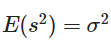

# 데이터 분석

전체적인 패턴을 찾고, 그 다음 패턴에서 벗어난 것을 검사하는 것.

## 평균(mean)

평균값, 다 더해서 전체수로 나누는 것

## 편차 (deviation)

**평균값으로부터의 차이**

평균값 기준으로 차이를 게산 

+ **합계**는 **0**

합계를 이용하여 <u>흩어진 정도를 파악할 수 없음</u>

## 분산 (variance)

흩어진 정도를 파악하고자 할때, 편차는 합계가 0이라 이용할 수 없음

**편차에서 부호를 없애고 사용하기 위해 제곱을 하고 다시 평균**을 내는 것

## 표준편차 (standard deviation)

분산(variance)는 단위도 함께 제곱되는데, 이를 개선 위해  **분산(variance)의 제곱근**인 표준편차를 이용

## 공분산 (covariance)

분산과 표준편차들은 하나의 변수를 위한 값인 반면, 공분산은 **서로 다른 두 변수 사이의 관계를 보기 위한 값**

두 변수의 단위가 서로 다르더라도 상관 없음

+ 서로 다른 데이터 간 관계를 표현하는 지표를 사용했기 때문

**공분산의 절대값 크기는 아무런 의미가 없다.**

: X의 평균 ,  : Y의 평균

- **Cov(X, Y) > 0** : 양의 관계에 있다고 표현. --> 어느 하나가 증가하면 다른 하나도 증가함
- **Cov(X, Y) < 0** : 음의 관계에 있다고 표현. --> 어느 하나가 증가하면 다른 하나는 감소함
- **Cov(X, Y) = 0** : 선형관계 없음

## 잔차 (residual)

회귀선: 설명변수와 반응변수의 직선 관계에 대한 전체적인 패턴

관측값과 회귀직선의 예측값과의 차이를 **잔차(residual)**라고 하며, 보통  **e**로 표기한다.

### 오차(error)

+ 어떤 모집단에서 회귀식을 얻었다면, 그 회귀식을 통해 얻은 예측값과 실제 관측값이 차이
+ 오차 = 실제 관측값 - 예측값 

### 오차와 잔차의 차이

표본 집단에서 회귀식을 얻었다면, 그 회귀식을 통해 얻은 예측값과 셀제 관측값이 차이를 잔차라고 한다.

사실상 우리는 <u>대부분 표본집단에서 회귀식을 얻기 때문에</u>, 잔차를 가지고 회귀식의 최적의 파라미터 값들을 추정한다. 즉, 잔차들의 제곱들을 더한 것(잔차제곱합)을 최소로 만들어주는 파라미터를 찾는 것이다. 이것이 바로 **최소제곱법(least squares method)**이다. 최소제곱법은 최소자승법과 동의어다.

최소제곱 회귀직선은 관측값과 예측값과의 오차 제곱합을 최소화한다.

## Cost or Loss

모델을 학습할 때는 비용(Cost) 즉, 오류를 최소화하는 방향으로 진행

비용이 최소화되는 곳 = 성능이 가장 잘 나오는 부분

**최적화(Optimization)** : 가능한 비용이 적은 부분을 찾는 것, <u>일반화(Generalization)</u>의 방법.

신경망 분야에서는 손실함수의 값을 최소화하는 <u>하이퍼 파라미터(Hyper Parameter)</u>의 값을 찾는 것

+ **일반화(Generalization)** : 학습데이터와 Input data가 달려져도 출력에 대한 성능 차이가 나지 않게 하는 것 

  + 모델링 목적 : 외부의 data를 모델에 집어 넣어도, 학습된 모델이 얻은 Accuracy(정확도)와 비슷한 값을 가지게 하는 것

+ **하이퍼 파라미터(Hyper Parameter)** : 사용자가 직접 정의할 수 있는 파라미터. 즉, 사람이 파라미터값을 조절할 수 있는 것들을 말한다.

  + 최적화 방법: 확률적 경사하강법 (SGD)

    + 경사하강법: 2차 함수가 있을때, Learning-rate(lr)에 따라 하강을 한다. 

      + lr 작을때: 하강하는 속도가 느려져 학습을 시키는데 시간이 많이 걸린다.
      +   lr 너무 클때: 하강하는 폭이 커져 결국 학습이 발산적으로 이루어진다. 

      ​                       <u>따라서 적절한 lr을 줘야한다.</u>

비용(cost) 혹은 손실(loss)이 얼마나 있는지 나타나는 것이 **비용 함수(Cost Funcion), 손실함수 (Loss Function)** 이다. linear regression으로 예를 들자면, 직선에서 데이터가 얼마나 떨어져 있는지 계산하는 함수

+ 엔트로피가 loss function(손실 함수) or cost function(비용함수) 로써 많이 사용된다.

### 비용(손실)을 표시하는 함수

1. 비용 함수(Cost Funcion)
2. 손실 함수 (Loss Function)
3. 목적 함수 (Objective Function) 

#### 비용 함수(Cost Funcion)

#### 손실 함수 (Loss Function)

#### 목적 함수 (Objective Function) 

모델(함수)에 대하여 우리가 가장 일반적으로 사용하는 용어로서 최댓값, 최솟값을 구하는 함수를 말한다.

#### 결론

손실함수는 비용함수의 한 부분이고, 비용함수는 목적 함수의 한 타입이다.

즉, **<u>loss function <= cost function <= objective function</u>**

## 통계의 자유도(degree of freedom : df)

주어진 조건 하에서 통계적 제한을 받지 않고 자유롭게 변화를 줄 수 있는 <u>원소의 수</u>를 뜻한다.

## 모분산은 n으로 표본분산은 n-1로 나눈다

### 표본 분산의 기댓값은 모분산이 되어야 한다.

통계학에서는 어떤 모수를 추정하기 위해 추정량을 사용

+ 대표적 모수: 모평균, 모분산, 모비율

이상적으로, 표본의 크기가 커질수록 표본으로부터 계산하여 추정하는 값은 추정하고자 하는 모수와 같아지기를 바란다. 따라서, **이상적인 추정량**은 그 **추정량의 기대값이 모수와 같은것**이라 할 수 있다.

+ **표본분산의 기대값 = 모분산의 값**

  

  + n: 표본의 크기,  ¯X¯: 표본 평균, s^2: 표본 분산, m: 모평균의 값,  σ^2: 모분산의 값

### 표본분산

대표적인 표본 통계량 중 하나

n대신 n-1로 나눠 표본 통계량을 정의한 것은 이렇게 모분산을 정의했을 때, 비로소 표본 분산의 기대값이 모분산과 같아지기 때문이다.

## 모집단과 표본

### 모집단

모집단(population) : 추상적 개념으로, 연구자가 알고 싶어하는 대상/ 집단 전체

### 표본

표본(sample) : 연구자가 측정 또는 관찰한 결과들의 집합. 전수조사를 통해 모집단(모집단의 분포)을 완전하게 파악할 수 있겠지만, 경제적,공간적,시간적 문제로 인해 실제적으로는 불가능하다. 이때, 연구자들은 표본(smaple)을 측정 또는 관찰해서 연구자가 알고 싶어하는 모집단(효과/대상)을 추정. 표본을 이용하면 모집단 전체를 조사하는 것보다 효율적이고 효과적이다.

