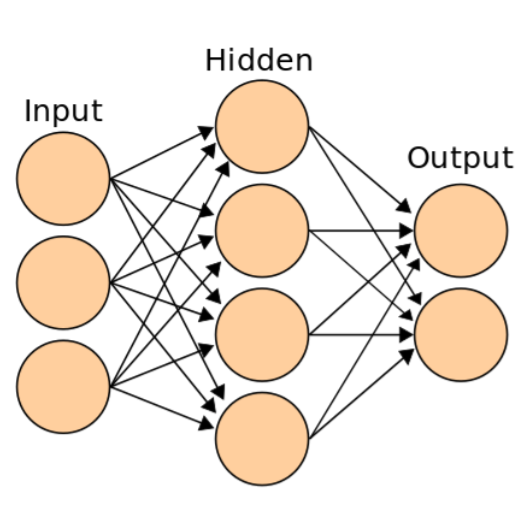
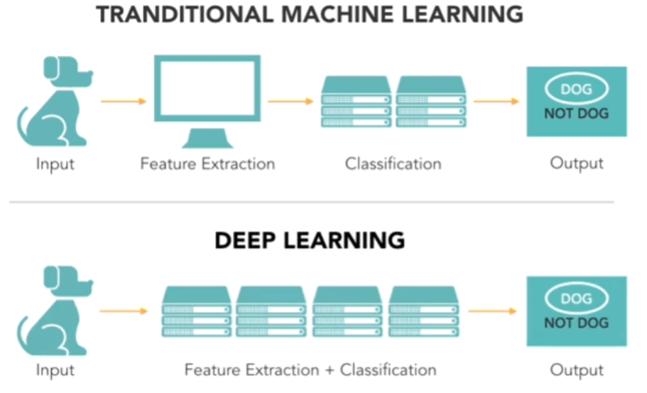
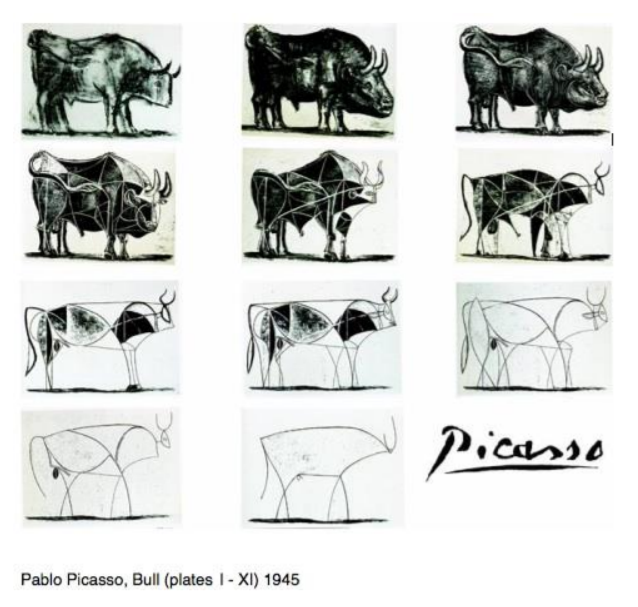
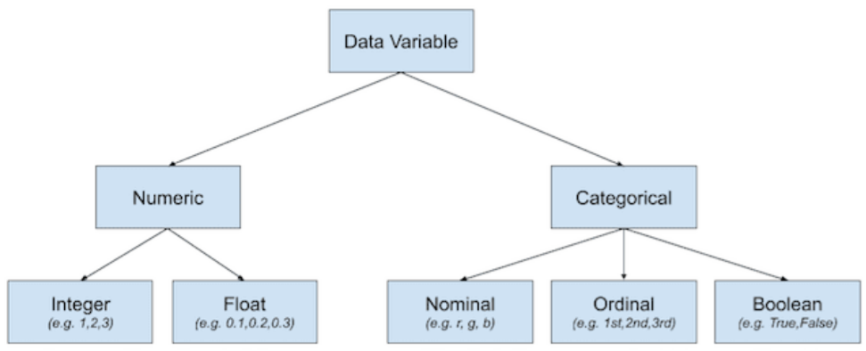

# 기계학습(Machine Learning)이론

## 기계학습(Machine Learning)

데이터를 정보로 변환하는 것.

인간이 다양한 경험과 시행착오를 통해 지식을 배우는 것처럼, 컴퓨터에게 충분히 많은 데이터를 주고, 거기에서 일반적인패턴을 찾아내게 하는 방법 (머신러닝의 대표적 알고리즘이 <u>딥러닝</u>이다.)

## 딥러닝

머신러닝의대표적 학습법이 아래 그림(인공 신경망)처럼 여러 층을 거쳐 점점 추상화 단계로 접어드는 알고리즘 형태인 '딥 러닝(Deep Learning)' 이다.

머신러닝의 패턴을 찾기 위해서는, 패턴을 견고하게 만드는 일종의 수많은 학습용 훈련데이터 필요

## 추상화

컴퓨터 과학에서 추상화란 

+ 복잡한 자료, 모듈, 시스템 등으로부터 핵심적 개념 또는 기능을 간추려 내는 것. 구체적인 것의 반대의 개념. 즉, 복잡한 것을 단순하게 표현하는것이라고 말할 수 있다.

+ 추상화를 높이는 작업: 모델링, 코드의 재사용성, 코드의 가독성, 일관성 방향성

## 엔트로피 (Entropy)

엔트로피는 불순도를 수치화한 지표 중 하나로 확률 변수의 불확실성을 수치로 나타낸 것. 또한 정보량의 기댓값이라고 할 수 있다.

엔트로피란 데이터의 분포의 순도(purity)를 나타내는 척도이다.

+ 데이터의 순도가 높다 = 엔트로피 값은 낮다
+ 데이터의 불순도가 높다 = 엔트로피 값은 높다 = 정보가 많다 = 불확실성 증가

loss function(손실 함수) or cost function(비용함수) 로써 많이 사용된다.

## 데이터 변수 타입 분류

## 머신러닝에서 일반적 Data Preparation 과정 정리

1. 데이터 준비 과정의 중요성
2. 결측지의 처리 방법
3. 특징 추출 (Recursive Feature Elimination)
4. 데이터 정규화
5. 원 핫 인코딩으로 범주 변환 (One Hot Encoding)
6. 숫자 변수의 범주형 변수로 변환
7. PCA를 통한 차원 축소

### 결측치의 처리 방법

실제 데이터에는 종종 결측값이 존재. 

데이터에는 기록되지 않은 관찰 및 데이터 손상과 같은 여러 가지 이유로 인해 누락 된 값이 있을 수 있다.

많은 기계 학습 알고리즘이 결측값이 있는 데이터를 지원하지 않기 때문에, 이 누락된 데이터 처리가 중요

누락된 값을 데이터로 채우는 것 => 데이터 대치

데이터 대치에 대한 일반적 접근 방식은 각 열( ex. 평균)에 대한 통계 값을 계산하고 해당 열의 모든 누락 된 값을 통계로 바꾸는 것

### 데이터 정규화

많은 기계 학습 알고리즘은 숫자 입력 변수가 표준 범위로 조정될 때 더 잘 수행. 기계 학습을 위해 숫자 데이터를 확장하는것이 좋음

선형 회귀와 같은 입력의 가중 합계를 사용하는 알고리즘과 k-최근 접이웃과 같은 거리 측정을 사용하는 알고리즘 포함

#### 정규화(normalization)

데이터를 통일된 지표로 변환하는 것

모델링 전 수치 데이터를 스케일링하는 가장 널리 사용되는 기술 중 하나로 정규화는 각 입력 변수를 [0,1] 범위로 개별적으로 조정하는 것 (0과 1사이로 매핑하는 것)

+ 이 범위는 가장 정밀도가 높은 부동 소수점 값의 범위이다.

각 변수에 대한 최소 및 최대 관찰 가능 값을 알고 있거나 정확하게 추정 할 수 있어야 한다.

+ 종모양 그래프 나오도록 모든 값들을 정규분포 만들때 정규화

#### 표준화 (standardization)

데이터에서 평균을 빼고 표준편차로 나누는 것

어떤 스케일이던지 평균을 0으로, 분산을 1으로 가져다 두는 것

데이터가 0의 의미를 가지게 하거나 1(분산의 단위)의 표준 편차을 가지게 변환하는 것을 의미

+ 딥러닝은 반드시 표준화를 시키고 진행해야함
+ 평균0, 분산1로 다 맞춰주려 할때 즉, 표준정규분포로 만들 때 표준화

어떤 스케일이던지 평균을 0 분산을 1로 가져다 두는것

