# Matplotlib

Matplotlib은 python에서 그래프를 그릴때 사용하는 패키지이다. Numpy와 더불어 필수 패키지라 할 수 있다.

https://matplotlib.org/stable/tutorials/introductory/usage.html#sphx-glr-tutorials-introductory-usage-py


## 기본 사용법

### 간단한 2차원 플롯

matplotlib은 2차원 그래픽 패키지다. matlab과 같이 커맨드 방식(matplotlib에서는 Pyplot API라고 한다)으로 그래피를 그릴 수 있으며, 커맨드 함수의 이름도 유사도록 설계되어있다.


```sql
# example 1
import matplotlib.pyplot as plt
import numpy as np

x = np.linspace(0,1,50)

y1 = np.cos(4*np.pi*x)
y2 = np.cos(4*np.pi*x)*np.exp(-2*x)

plt.plot(x,y1)
plt.plot(x,y2)

plt.show()
```

- `plt.plot(x,y)`로 이차원 선 그래프를 그릴 수 있다.
- `plt.show()`는 화면에 표시하는 기능을 한다. 

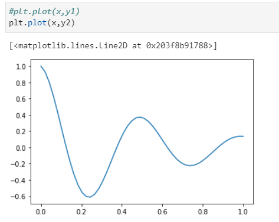


### 꾸미기

```sql
# example 2
import matplotlib.pyplot as plt
import numpy as np

x = np.linspace(0,1,50)

y1 = np.cos(4*np.pi*x)
y2 = np.cos(4*np.pi*x)*np.exp(-2*x)

plt.plot(x,y1,'r-*', label=r'$sin(4 \pi x)$',lw=1)
plt.plot(x,y2,'b--o', label=r'$ e^{-2x} sin(4\pi x) $',lw=1)
plt.title(r'$sin(4 \pi x)$ vs. $ e^{-2x} sin(4\pi x)$')
plt.xlabel('x')
plt.ylabel('y')
plt.text(0.5,-1.0,r'This is sample')
plt.axis([0,1,-1.5,1.5])
plt.grid(True)
plt.legend(loc='upper left')
plt.tight_layout()
plt.show()
```

- `plt.plot(x,y1,'r-*', label=r'$sin(4 \pi x)$',lw=1)`

  - `r-*`은 문자열 색상, 선타입, 마커 속성을 나타낸다.
    - `r` : red / `-` : solid line style / `*` : star marker
  - `label` 은 레전드에 표시 될 내용
  - `lw`는 line width

  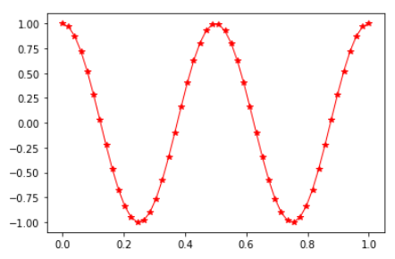

- `plt.plot(x,y2,'b--o', label=r'$ e^{-2x} sin(4\pi x) $',lw=1)`

  - `b--o` 문자열 색상, 선타입, 마커 속성을 나타낸다.
    - `b` : blue / `--` : dashed line style / `o` : circle marker
  - `label` 은 레전드에 표시 될 내용
  - `lw`는 line width

  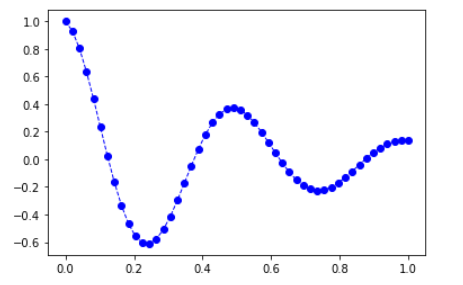

- `plt.title(r'$sin(4 \pi x)$ vs. $ e^{-2x} sin(4\pi x)$')`, `plt.xlabel('x')` ,`plt.ylabel('y')`

  - `plt.title(title)` : 제목
  - `plt.xlabel(xlabel)` : X축 제목
  - `plt.ylabel(ylabel)` : Y축 제목

  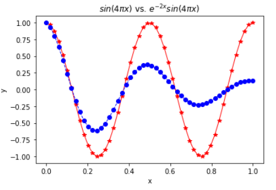

- `plt.text(0.5,-1.0,r'This is sample')`

  - `plt.text(x,y,text)` 로 (x,y)위치에 text 출력

  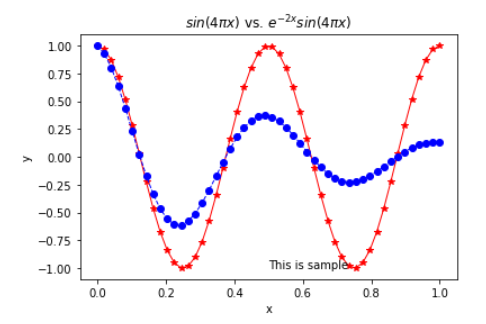

- `plt.axis([0,1,-1.5,1.5])`

  - `plt.axis([xmin, xmax, ymin, ymax])` 는 축의 범위를 지정한다.

  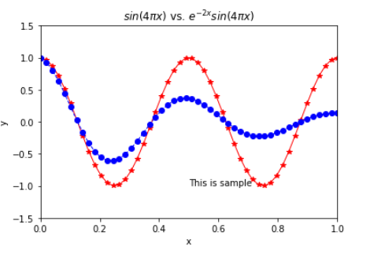

- `plt.grid(True)`

  - `plt.grid(True)`는 격자를 그림

  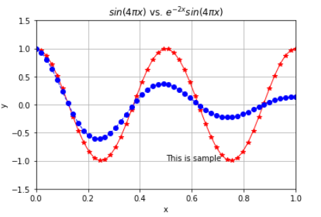

- `plt.legend(loc='upper left')`

  - `plt.legend(loc=' ')`는 레전드 표현

  - ```
            ===============   =============
            Location String   Location Code
            ===============   =============
            'best'            0
            'upper right'     1
            'upper left'      2
            'lower left'      3
            'lower right'     4
            'right'           5
            'center left'     6
            'center right'    7
            'lower center'    8
            'upper center'    9
            'center'          10
            ===============   =============
    ```

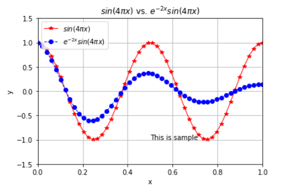

- `plt.tight_layout()`은 여백 조정하는 역할

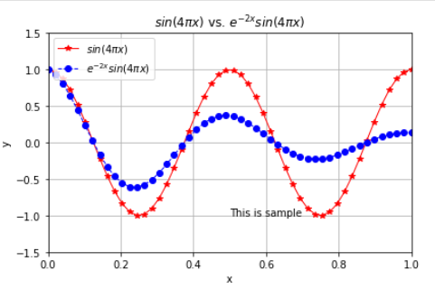

- `latex`수식을 `title()`, `xlabel()`, `ylabel()`, `text()` 등에 지정할 수있다. 다만 r'text'등과 같은 r을 앞에 기입하여 raw문자열이어야 한다.


#### 결과

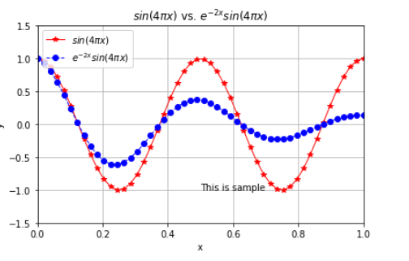


텍스트를 출력하는 `plt.text(x, y, text, ...)`는 추가 인자를 통해 보다 세밀하게 조절 가능

- `plt.text(20,30,"test')`     # 일반

- ```sql
  plt.text(0.2,0.3, horizontalalignment='center',verticalalignment='center',transform=plt.gca().transAxes)   # transform=ax.transAxes
  ```
  - text 정렬 속성을 center, center로
  - 좌표계는 0~1 사이의 relative coordinate를 사용한 것


### 주로 사용하는 선과 마커


## subplot

subplot는 Matlab처럼 `plt.subplot(nrow, ncol, inum)`을 호출하는 것으로 그릴 수 있다.

```sql
import matplotlib.pyplot as plt
import numpy as np

x = np.linspace(0,1,50)

y1 = np.cos(4*np.pi*x)
y2 = np.cos(4*np.pi*x)*np.exp(-2*x)

plt.subplot(2,1,1)
plt.plot(x,y1,'r-*',lw=1)
plt.grid(True)
plt.ylabel(r'$sin(4 \pi x)$')
plt.axis([0,1,-1.5,1.5])   #축범위 정의 ([xmin, xmax, ymin, ymax])


plt.subplot(2,1,2)
plt.plot(x,y2,'b--o',lw=1)
plt.grid(True)
plt.xlabel('x')
plt.ylabel(r'$ e^{-2x} sin(4\pi x) $')
plt.axis([0,1,-1.5,1.5]) 

plt.tight_layout() 
plt.show()
```

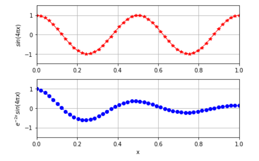

## 주요 함수 요약

커맨드 방식의 함수인 Pyplot API 중 주로 사용하는 함수를 정리하면 다음과 같다.

- `plot()`
- `subplot()`
- `title()`
- `xlabel()`
- `ylabel()`
- `axis()`
- `xlim()`
- `ylim()`
- `tight_layout()`
- `grid()`
- `legend()`
- `show()`
- `figure()`
- `text()`
- `subplots()`

