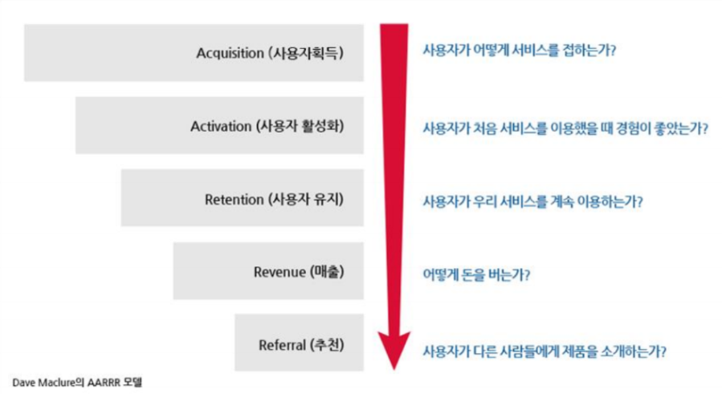
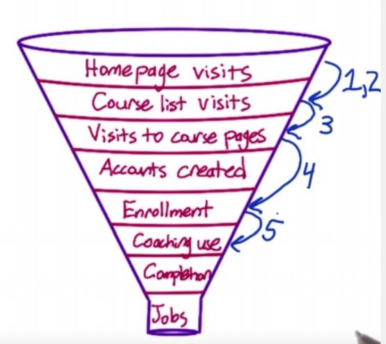
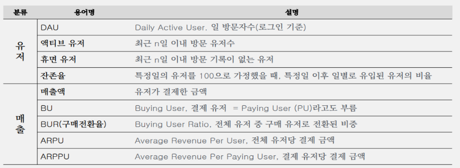
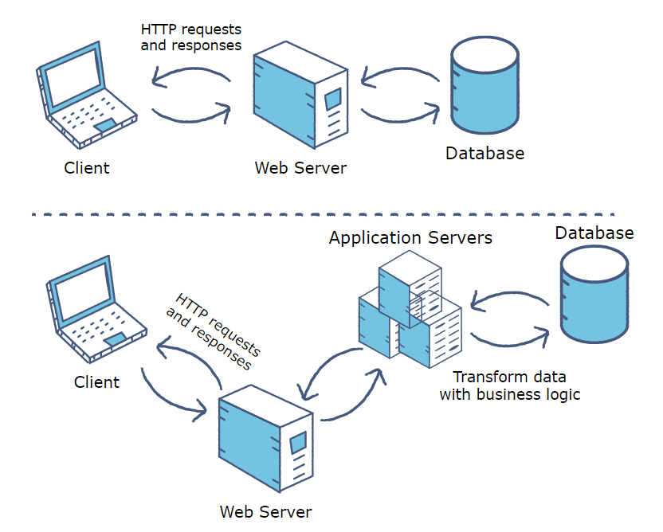

# Data understanding

## 분석 입문

Data Driven 서비스는 시나리오 기반으로 비즈니스 모델 개입하여 최적화하고 플랫폼 기능을 데이터(추천, 예측, 시뮬레이션 등)로 제공하는 것

**인사이트(insight, 통찰)는 가설기반 접근으로 고객의 경험을 숫자로 표현하는 것**

- 방법 : 탐색, 모델링, 시각화

## AARRR

Funnel 중에서 마케팅, Growth 관련해서 가장 유명한 개념

실리콘 밸리의 스타트업 투자 및 엑셀러레이터인 500 Startups의 Dave McClure라는 사람이 이야기해서 유명해졌음

## Funnel Analysis

EX) MOOC (Massive Open Online Course)

Business Objective : Helping students get jobs. Financial sustainability

홈페이지 접속 유니크 숫자 100,000명

강의 리스트 접속 유니크 숫자 80,000

계정 생성 유니크 숫자 60,000

강의 등록 유니크 숫자 40,000

강의 완료 유니크 숫자 5,000

직업 구한 유니크 숫자 1,000

## KPI 지표분석

KPI = Key Performance Indicator, 핵심 지표

## 데이터베이스 (DB)

**데이터 베이스(Data Base)**는 여러 사람에 의해 공유되어 사용할 목적으로 통합하여 관리되는 데이터의 집합, 줄여서 **DB**

**관계형 데이터베이스 (RDBMS)**는 데이터를 **로우(Row: 행)**, **컬럼(Column: 열)**과 같이 일종의 표 형태로 저장하고 종속성은 **관계(Relation)**으로 표현함

컬럼의 구조와 데이터의 관계가 테이블 **스키마 (Schema)**로 사전 정의되고, **SQL(구조화 질의 언어)**에 의해서 정교한 검색쿼리를 제공하며 상상하는 거의 모든 방식으로 데이터를 다룰 수 있게 됨

## SQL

**2차원의 정형데이터를 다루는 가장 효율적인 언어**

- data를 사용하는 거의 모든 프로그램에서 sql을 사용하지 않고 효율적인 개발 불가
- DBMS, Hive, Spark, R(sqldf), ···

**Data의 처리 과정을 기술하는 방법이 아닌 원하는 Data의 요건을 기술하는 방식**

- sql = data 요건 정의서 
- 단순성, 높은 생산성

**Data의 요건이 기술된 요건 정의서 형태이므로 요견의 변경시 적은 수정으로 요건을 반영할 수 있음**

- 효율적인 유지보수

## Web Server vs Application Server

**웹 서버는** 받아 웹 사이트에서 정적 컨텐츠 (즉, HTML 페이지, 파일, 이미지, 동영상)에 대한 클라이언트의 만족 요청. 웹 서버는 HTTP 요청과 응답 *만*처리 *합니다* .

**응용 프로그램 서버를** 노출하는 *비즈니스 로직* 동적 콘텐츠를 생성하는 클라이언트. 비즈니스, 서비스 또는 애플리케이션에서 제공하는 특수 기능을 제공하기 위해 데이터를 변환하는 소프트웨어 프레임 워크입니다. 응용 프로그램 서버는 요청의 컨텍스트에 따라 다르게 나타날 수있는 웹 사이트의 대화 형 부분을 향상시킵니다.

아래 그림은 아키텍처의 차이점을 강조합니다.

### Web Server

deliver static content 

content is delivered using the HTTP protocol only

Serves only web-based applications 

No support for multi-threading 

Web server facilitates website traffic, which is not very resource-intensive. 

- 정적 콘텐츠를 제공합니다.
- 콘텐츠는 HTTP 프로토콜을 사용해서 만 전달됩니다.
- 웹 기반 애플리케이션 만 제공합니다.
- 멀티 스레딩을 지원하지 않습니다.
- 리소스 집약적이지 않은 웹 트래픽을 촉진합니다.

### Application Server

delivers dynamic content (동적 내용 전달)

provides business logic to application programs using several protocols (including HTTP) 

can serve web and enterprise-based applications ()

Uses multi-threading to support multiple requests in parallel

Facilitates longer running processes that are very resource-intensive

- 동적 콘텐츠를 제공합니다.
- 여러 프로토콜 (HTTP 포함)을 사용하여 애플리케이션 프로그램에 비즈니스 로직을 제공합니다.
- 웹 및 엔터프라이즈 기반 애플리케이션을 제공 할 수 있습니다.
- 다중 스레딩을 사용하여 여러 요청을 병렬로 지원합니다.
- 매우 리소스 집약적 인 더 오래 실행되는 프로세스를 촉진합니다.

## SQL vs NoSQL

### 관계형 데이터 베이스

관계형 데이터베이스 관리 시스템(RDBMS)

<u>IBM</u> 산호세 연구소 연구소의 에드거 F. 커드가 도입한 <u>관계형 모델</u>을 기반으로 하는 <u>데이터베이스 관리 시스템</u>

현재 사용되는 대부분의 데이터베이스는 <u>관계형 데이터베이스</u> 모델을 기반함

**기업형 DBMS**

- 오라클 데이터베이스
- 마이크로소프트 SQL서버
- MySQL (오라클)
- IBM DB2
- IBM informix
- SAP Sybase Adaptive Server Enterprise
- SAP Sybase IQ
- 테라데이터

**Top 3 오픈 소스 DBMS**

- MySQL
- PostqreSQL
- SQLite

MySQL이 오라클에 인수된 이후 가장 많이 사용되는 MySQL의 포크는 MariaDB

### NoSQL

NoSQL 데이터베이스는 전통적인 <u>관계형 데이터베이스</u> 보다 덜 제한적인 <u>일관성 모델</u>을 이용하는 데이터의 저장 및 검색을 위한 매커니즘 제공

NoSQL 데이터베이스는 단순 검색 및 추가 작업을 위한 매우 최적화된 키 값 저장 공간

NoSQL 데이터베이스는 <u>빅데이터</u>와 <u>실시간 웹 애플리케이션</u>의 상업적 이용에 널리 쓰임

<u>SQL</u> 계열 쿼리 언어를 사용할 수 있다는 사실을 강조한다는 면에서 "Not only SQL"로 불림

- 컬럼 : H베이스, 아큐물로
- 도큐먼트 : 몽고DB, 카우치베이스
- 키 값 : 디이나모, 리악, 레디스, 캐시, 프로젝트 볼드모트
- 그래프 : Neo4J, AgensGraph, 알레그로그래프, 버투오소