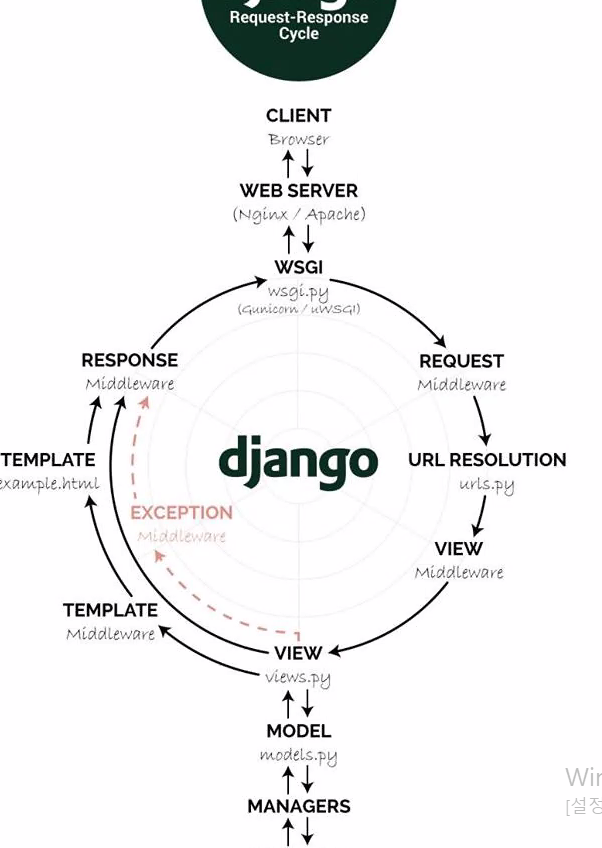

# Django

장고는 파이썬으로 작성된 오픈 소스 웹 프레임 워크. 모델 - 뷰 - 컨트롤러(MVC) 패턴을 따른다. 하지만 전통적 MVC디자인 패턴에서의 컨트롤러의 기능을 프레임워크에서 자체적으로 하기때문에 모델(Model), 템플릿(Template), 뷰(View)로 분류해 **MTV** 프레임워크라고 보기도 한다.

- MVC 디자인 패턴
  - Model : 파이썬으로 코딩한 모델을 관계형 데이터베이스로 구축해주는 모델
  - View : HTTP 요청을 처리하는 웹 템플릿 시스템인 뷰
  - Controller : URL의 라우팅을 처리하는 URL 컨트롤러

DRY (Don't Repeat Yourself: 중복배제)원칙을 따른다.

## MTV 

### 구성

#### Model(모델)

모델은 데이터에 관한 정보를 담는다. 데이터에 대한 접근, 검증, 작동과 데이터 사이의 관계를 정의한다.

일반적으로 각각의 모델은 데이터베이스에서 테이블에 해당

Django에서는 모델을 정의할 때 필드의 종류를 지정해줘야 하는데, 이것이 데이터베이스에게 컬럼 타입을 알려주고 HTML 폼으로 표시 될 때의 입력 타임도 내포하는 역할을 한다. 또한 Django의 폼 자동 생성 API를 이용할 때 데이터 검증에 쓰이기도 한다.

#### Template(템플릿)

데이터가 어떻게 표시되는 지를 정의한다.

템플릿은 사용자에게 실제로 보여지는 웹 페이지나 문서를 다룬다.

흔히 HTML에 기반해서 템플릿을 만들며, HTML에 동적인 요소를 추가하기 위해 파이썬의 일부 기능을 쓰게 도와주는 Django 템플릿 태그가 존재한다.

#### View(뷰)

어떤 데이터가 표시될 것인지를 정의한다. 뷰는 HTTP응답(response)를 반환해야 하는 응답의 종류는 웹 페이지, 리디렉션, 문서 등의 다양한 형태가 가능하다.

Django에는 자주 사용되는 형태의 뷰를 패턴화하여 추상화 해둔 재사용 가능한 뷰들을 내장해 놓았는데, 이들은 제네릭 뷰(generic view)라고 하며 원하는 제네릭 뷰를 상속한 클래스 뷰를 생성하여 사용할 수 있다.

https://ko.wikipedia.org/wiki/%EC%9E%A5%EA%B3%A0

### 코딩 순서

.module명 

.(점)은 현재 패키지라는 뜻

현재캐키지에서 모듈을 가져오게 만든다

from . import 모듈

https://dojang.io/mod/page/view.php?id=2450