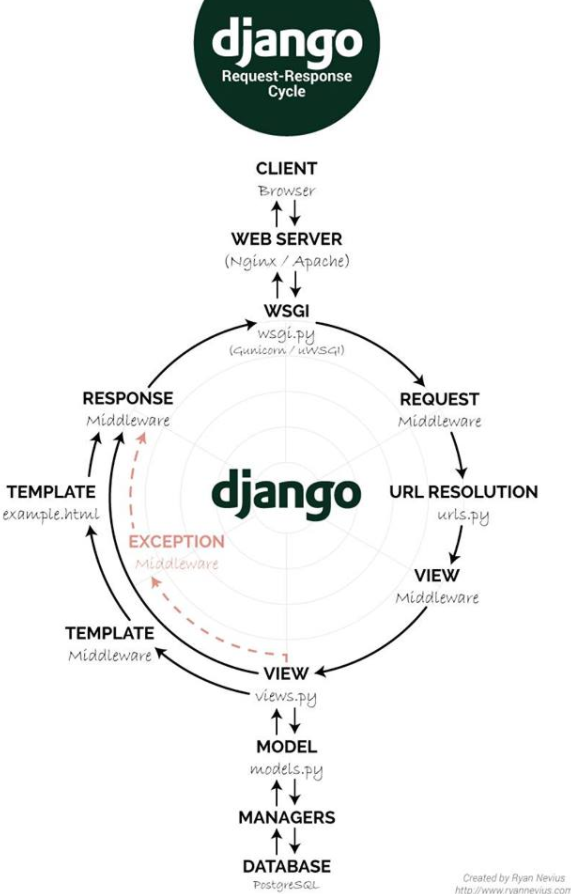

# Django

장고는 파이썬으로 작성된 오픈 소스 웹 프레임 워크. 모델 - 뷰 - 컨트롤러(MVC) 패턴을 따른다. 하지만 전통적 MVC디자인 패턴에서의 컨트롤러의 기능을 프레임워크에서 자체적으로 하기때문에 모델(Model), 템플릿(Template), 뷰(View)로 분류해 **MTV** 프레임워크라고 보기도 한다.

- MVC 디자인 패턴
  - Model : 파이썬으로 코딩한 모델을 관계형 데이터베이스로 구축해주는 모델
  - View : HTTP 요청을 처리하는 웹 템플릿 시스템인 뷰
  - Controller : URL의 라우팅을 처리하는 URL 컨트롤러

DRY (Don't Repeat Yourself: 중복배제)원칙을 따른다.

## MTV 

### 구성

#### Model(모델)

모델은 데이터에 관한 정보를 담는다. 데이터에 대한 접근, 검증, 작동과 데이터 사이의 관계를 정의한다.

일반적으로 각각의 모델은 데이터베이스에서 테이블에 해당

Django에서는 모델을 정의할 때 필드의 종류를 지정해줘야 하는데, 이것이 데이터베이스에게 컬럼 타입을 알려주고 HTML 폼으로 표시 될 때의 입력 타임도 내포하는 역할을 한다. 또한 Django의 폼 자동 생성 API를 이용할 때 데이터 검증에 쓰이기도 한다.

#### Template(템플릿)

데이터가 어떻게 표시되는 지를 정의한다.

템플릿은 사용자에게 실제로 보여지는 웹 페이지나 문서를 다룬다.

흔히 HTML에 기반해서 템플릿을 만들며, HTML에 동적인 요소를 추가하기 위해 파이썬의 일부 기능을 쓰게 도와주는 Django 템플릿 태그가 존재한다.

#### View(뷰)

어떤 데이터가 표시될 것인지를 정의한다. 뷰는 HTTP응답(response)를 반환해야 하는 응답의 종류는 웹 페이지, 리디렉션, 문서 등의 다양한 형태가 가능하다.

Django에는 자주 사용되는 형태의 뷰를 패턴화하여 추상화 해둔 재사용 가능한 뷰들을 내장해 놓았는데, 이들은 제네릭 뷰(generic view)라고 하며 원하는 제네릭 뷰를 상속한 클래스 뷰를 생성하여 사용할 수 있다.

https://ko.wikipedia.org/wiki/%EC%9E%A5%EA%B3%A0

### 코딩 순서

**모델(Model)**: 데이터베이스에 저장되는 데이터를 의미

**템플릿(Template)**: 사용자에게 보여지는 UI부분을 의미

**뷰(View)**: 실질적으로 프로그램 로직이 동작하여 데이터를 가져오고 적절하게 처리한 결과를 템플릿에 전달하는 역할을 수행

- 클라이언트로부터 요청을 받으면 `URLconf`를 이용하여 URL분석
- URL분석 결과를 통해 해당 URL에 대한 처리를 담당할 `View`를 결정
- `View`는 자신의 로직을 실행하면서, 만일 데이터베이스 처리가 필요하면 `Model`을 통해 처리하고 그 결과를 반환 받는다.
- `view`는 자신의 로직 처리가 끝나면 `template`을 사용하여 클라이언트에 전송할 HTML 파일을 생성
- `view`는 최종 결과로 HTML파일을 클라이언트에게 보내 응답

모델, 뷰, 템플릿 셋 중에서 무엇을 먼저 코딩해야 하는지에 대해 정해진 순서는 없다. MVT방식에 따르면 화면 설계는 뷰와 템플릿 코딩으로 연결, 테이블 설계는 모델 코딩에 반영. 

따라서 독립적으로 개발할 수 있는 모델을 먼저 코딩하고, 뷰와 템플릿은 서로 영향을 미치므로 모델 이후에 같이 코딩하는 것이 일반적이다.

뷰와 템플릿의 코딩 순서도 굳이 정할 필요는 없지만, UI화면을 생각하면서 로직을 풀어나가는 것이 쉽기 때문에 보통 템플릿을 먼저 코딩한다.

다만 클래스형 뷰(CBV)처럼 뷰의 코딩이 매우 간단한 경우에는 뷰를 먼저 코딩하고, 그 다음 템플릿을 코딩한다.

함수형 뷰를 사용할때는 모델, 템플릿, 뷰 순서로 코딩을 진행하고, 클래스형 뷰를 사용할때는 모델, 뷰, 템플릿 순서로 진행한다.

코딩 순서 참고

- 프로젝트 뼈대 만들기 : 프로젝트 및 앱 개발에 필요한 디렉토리와 파일 생성
- 모델 코딩 : 테이블 관련 사항을 개발(models.py, admin.py파일)
- URLconf 코딩 : URL 및 뷰 매핑 관계를 정의 (urls.py파일)
- 템플릿 코딩 : 화면 UI개발 (templates/ 디렉토리 하위의 *.html 파일들)
- 뷰 코딩 : 애플리케이션 로직 개발 (views.py파일)