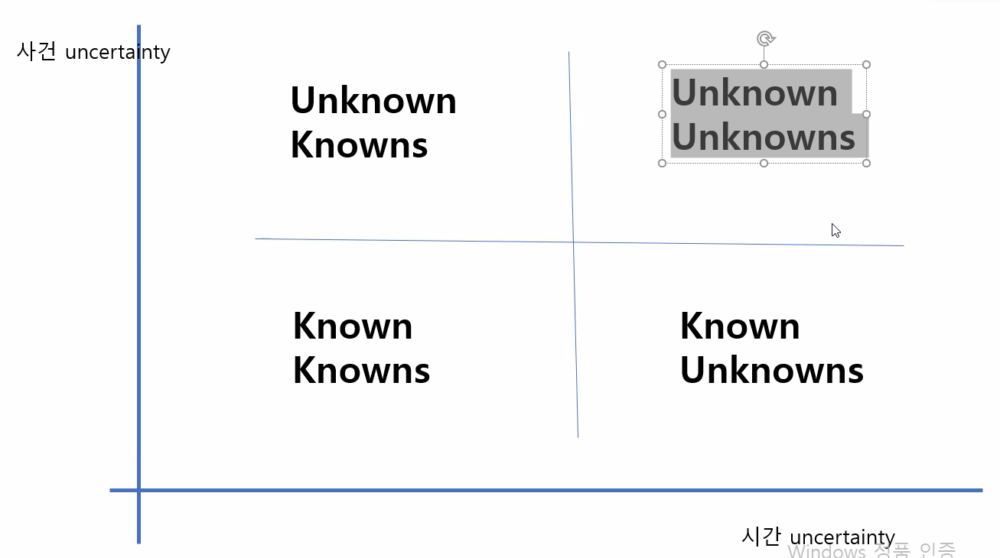

openai.com

- clip : connection text and images
- 이미지와 텍스트의 결합

vision ai

CNNs 모델

- shape (통, 원, 선?)
- 이거를 가지고 feature봄

Attention Is All You Need

- 추상적 이미지를 인식하는 방법과 언어가 어떤 상관 관계가 있나요? 

zero shot text classification

- 자료 수집 안해도 됨

할거 : 인공지능 개념, 목차, Attention Is All You Need정, uncertainty - probabilistic Layer Regression

- prophet??
- 210624.dir 참고

