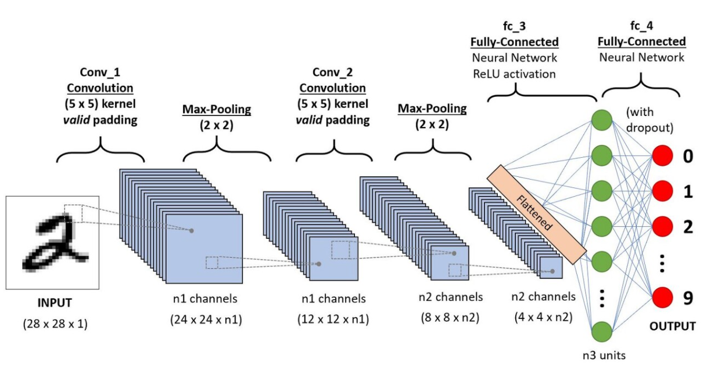

# CNN(**Convolutional neural networks** )

https://www.asimovinstitute.org/neural-network-zoo/

input cell - kernel - convolution or Pool - Hidden Cell - output cell

CNN은 주로 신경망에 이미지를 주면 그 신경망이 이미지에 맞는 데이터를 구분하는데 사용된다.

- 일반 Deep Neural Network에서 이미지나 영상과 같은 데이터를 처리할 때 발생하는 문제점을 보완

CNN은 생명체의 시각 처리 방식을 모방하기 위해 convolution이라는 연산을 인공신경망에 도입했다.

입력 및 출력 부분에서 뉴런들이 느슨히 연결되어 있는 특징이 있다. 따라서 CNN은 DFN이나 RNN에 배해 학습해야하는 가중치 수가 적으며, CNN의 강력한 예측 성능과 계산상의 효율성을 바탕으로 이미지 뿐 아니라 시계열 데이터에도 적용되고 있다. 

CNN은 보통 정보추출, 문장분류, 얼굴인식 등의 분야에서 널리 사용되고 있다.

기존의 방식은 데이터에서 지식을 추출해 학습이 이루어졌지만, CNN은 데이터의 특징을 추출하여 특징들의 패턴을 파악하는 구조이다. 이 CNN알고리즘은 Convolution과정과 Pooling과정을 통해 진행된다. Convolution Layer와 Pooling Layer를 복합적으로 구성하여 알고리즘을 만든다.

https://untitledtblog.tistory.com/154?category=823331

사진 데이터로 전연결(Fully Connected)신경망을 학습시켜야 할 경우에, 3차원 사진 데이터를 1차원으로 평면화시켜야 한다. 사진 데이터를 평면화 시키는 과정에서 공간 정보가 손실될 수 밖에 없다. 

결과적으로 이미지 공간 정보 유실로 인한 정보 부족으로 인공 신경망이 특징을 추출 및 학습이 비효율적이고 정확도를 높이는데 한계가 있다. 이미지의 공간 정보를 유지한 상태로 학습이 가능한 모델이 바로 CNN(Convolution Neural Network)이다.

#### CNN(Convolution Neural Network) vs Fully Connected Neural Network

CNN방식을 기존의 FCNN 방식과 비교하여 차별성은 다음과 같다.

- 각 레이어의 입출력 데이터의 형상 유지
- 이미지의 공간 정보를 유지하면서 인접 이미지와의 특징을 효과적으로 인식
- 복수의 필터로 이미지의 특징 추출 및 학습
- 추출한 이미지의 특징을 모으고 강화하는 Pooling Layer
- 필터를 공유 파라미터로 사용하기 때문에, 일반 인공 신경망과 비교하여 학습 파라미터가 매우 적음

### CNN에서 구분

- 이미지의 특징을 추출하는 부분 
  - 특징 추출 영역
- 클래스를 분류하는 부분

#### 특징 추출 영역

**convolution layer**와 **pooling layer**를 여러 겹 쌓는 형태로 구성된다.

- Convolution Layer는 필수요소로, 입력 데이터에 필터를 적용한 후 활성화 함수를 반영한다.

- Pooling Layer는 선택요소

CNN의 마지막 부분에는 이미지 분류를 위한 Fully Connected 레이어가 추가된다. 이미지의 특징을 추출하는 부분과 이미지를 분류하는 부분 사이에 이미지 형태의 데이터를 배열 형태로 만드는  **Flatten Layer**가 위치한다.

## Convolution

데이터의 특징을 추출하는 과정

데이터에 각 성분의 인접 성분들을 조사해 특징을 파악하고 파악한 특징을 한장으로 도출시키는 과정이다.

여기서 도출된 장을 Convolution Layer라고 한다. 이 과정은 하나의 압축 과정이며 파라미터의 갯수를 효과적으로 줄여주는 역할을 한다.

압축 과정에서 손실되는 부분이 발생한다고 생각하는 경우가 많기 때문에 이러한 문제를 해결하기 위해 padding이라는 값을 주게 된다.

### Padding

이미지의 양옆에 0값을 갖는 데이터를 추가하여 과정이후에도 원래의 크기와 동일한 이미지를 유지하도록 해주는 방법

Convolution 레이어의 출력 데이터가 줄어드는 것을 방지하는 방법

입력 데이터의 외각에 지정된 픽셀만큼 특정한 값으로 채워 넣는 것을 의미한다.

- 보통 padding값으로 0으로 채워 넣는다.

데이터를 외각에 2 pixel 추가하여 (36, 36, 3) 행렬을 만드는 예제이다.

padding을 통해 convolution 레이터의 출력 데이터의 사이즈를 조절하는 기능 외에, 외각을 '0값'으로 둘러싸는 특징으로 부터 인공 신경망이 이미의 외각을 인식하는 학습 효과도 있다.

## Pooling

CNN의 문제점 중 하나를 교정해주는 작업

convolution과정을 거치면 5배씩 이미지가 생성되고, 이미지의 크기도 줄지 않아 문제가 생김

이미지 분석 중 Null값과 유사한, 즉 correlation이 낮은 영역을 판단해야함

convolution과 유사한 과정이지만, 이미지를 5배씩 생성하는것이 아니라, 1개의 이미지에 1개의 출력을 만들면서 동시에 기존 이미지에 padding없이 Filter만 적용해서 크기를 줄이는 방법이 **Pooling**이다.

Pooling Layer는 convolution Layer의 출력 데이터를 입력으로 받아서 출력 데이터(Activation Map)의 크기를 줄이거나 특정 데이터를 강조하는 용도로 사용된다. 

Pooling Layer를 처리하는 방법으로는 Max Pooling과 Average Pooling, Min Pooling이  있다. 정사각 행렬의 특정 영역 안에 값의 최댓값을 모으거나 특정 영역의 평균을 구하는 방식으로 동장한다.

Convolution 과정을 거친 Layer의 사이즈를 줄여주는 과정으로, 단순히 데이터의 사이즈를 줄어주고, 노이스를 상쇄시키고, 미세한 부분에서 일관적인 특징을 제공한다.

https://ebbnflow.tistory.com/119

### Convolution Layer vs. Pooling Layer

비교시 Pooling Layer의 특징

- 학습 대상 파라미터가 없음
- Pooling 레이어를 통과하면 행렬의 크기 감소
- Pooling 레이어를 통한 채널 수 변경 없음

**CNN에서는 주로 Max Pooling사용**

## Flatten

Convolution과 Pooling을 반복해주면 이미지의 숫자는 많아지면서 크기를 점점 줄어들게 된다.

최종적으로 도출된 n x n 이미지는 이미지라는 의미의 특정 이미지에서 얻어온 하나의 특이점 데이터가 된다는 것이다. 즉, 이것은 2차원이 아닌 1차원 Row데이터로 취급해도 무관한 상태이다.

따라서 하나의 이미지로부터 다양한 특이점들을 뽑아내고 이것을 1차원 데이터로 변형하는 것이 **Flatten**이다.

Flatten과정을 거지면 이후에는 DNN과 동일하게 만들어진 Network를 통해서 Output을 추력하게 된다.

https://youngq.tistory.com/40

## 요약

CNN(Convolution Neural Network)은 이미지의 공간 정보를 유지하면서 인접 이미지와의 특징을 효과적으로 인식하고 강조하는 방식으로 이미지의 특징을 추출하는 부분과 이미지를 분류하는 부분으로 구성된다.

특정 추출 영역은 Filter를 사용하여 공유 파라미터 수를 최소화하면서 이미지의 특징을 찾는

- Convolution Layer
- Pooling Layer

로 구성된다.

CNN은 Filter의 크기, Stride, Padding과 Pooling 크기로 출력 데이터 크기를 조절하고, 필터의 개수로 출력 데이터의 채널을 결정한다.

CNN는 같은 레이터 크기의 Fully Connected Neural Network와 비교해 볼 때, 학습 파라미터양은 20% 규모이다. 은닉층이 깊어질수록 학습 파라미터의 차이는 더 벌어진다. CNN은 Fully Connected Neural Network와 비교하여 더 작은 학습 파라미터로 더 높은 인식률을 제공한다.

