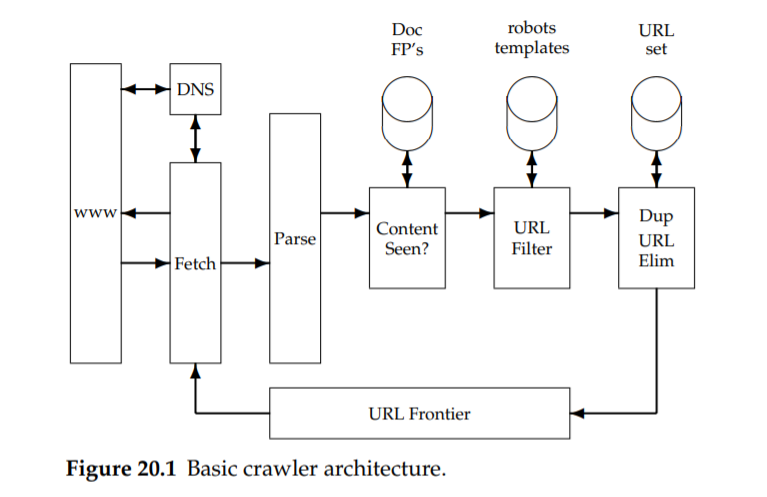

# Web Crawling

- Web Crawling
- Marplotlib, Seaborn
- Visulaization

## 크롤링과 스크레이핑

### 크롤러(Crawler)와 크롤링(Crawling)

**크롤러**는 자동으로 웹 페이지에 있는 정보를 수집하는 프로그램이다.

**크롤러**는 사람이 브라우저로 웹 페이지를 조회하고, 정보를 수집하는 것과 비교할 수 없을 정도로 대규모의 정보를 단시간에 수집한다.

**크롤러**는 다른 이름으로 '봇', '로봇', '스파이터' 라고도 부른다.

<u>크롤러로 정보를 수집하는 일</u>을 **'크롤링'** 이라고 부른다.

크롤러로 가장 쉽게 생각해볼 수 있는 것은 구글 등의 검색 엔진이다.

검색 엔진은 크롤러를 사용해 전 세계에 있는 웹 페이지의 정보를 모아서 축적한다. 그리고 사용자가 키워드를 검색하면 축적된 방대한 정보에서 적당한 웹 페이지를 찾아 제공한다.

#### 크롤링 서버 구성도

### 스크레이핑

크롤러는 정보를 수집한다. 스크레이핑은 수집한 정보를 분석해서 필요한 정보를 추출한다. 

예를 들어, 전자상거래 사이트 웹 페이지를 크롤러로 내려받는 것이고, 그렇게 내려받은 웹 페이지에서 상품 이름과 가격 등 필요한 정보를 추출하는 것을 스크레이핑이라고 부른다.

웹페이지 → 필요한 데이터 추출 → 스크래핑

크롤링과 스크레이핑은 떼놓을 수 없다. 

웹 페이지의 정보는 다음과 같은 일련의 흐름으로 이루어진다.

- 수집 → 분석 → 추출 → 가공 → 저장 → 출력
  - 크롤링과 스크레이핑의 흐름

## Web Crawler (웹 크롤러)

웹 크기가 증가함에 따라 인터넷에서 정보를 얻는 수단으로 **검색엔진**의 존재는 매우 중요하다.

- 검색엔진 : 웹페이지를 수집하고, 수집된 웹 페이지에 색인을 구성, 이를 바탕으로 검색 결과를 사용자에게 전달하는 역할
  - 대표적인 예 : Google, Naver, Yahoo 등

##### 웹 크롤러(Web Crawler)

검색엔진의 근간이 되는 것

인터넷상에 존재하는 웹 문서들을 추적하여 필요한 정보를 수집하는 기술 

검색 시스템, 전자상거래 상품검색, 인트라넷 검색 소프트웨어 등 현재 대부분 인터넷 산업의 근간이 되는 핵심 기술

##### 웹 크롤러의 한계와 고려해야 할 점

인터넷이 계속적으로 성장함에 따라 웹 문서의 양이 매우 거대해지면서 기존의 단일 시스템 환경 기반의 웹크롤러 기술을 한계에 직면하게 되었다. 따라서 고 성능의 웹크롤러 시스템을 구현하기 위해 다음과 같은 내용을 고려해야 한다.

- 웹에 대한 최신 정보를 제공하기 위해 다운로드 성능을 높이는 속도 문제
- 한 번 다운로드 받은 문서를 다시 다운로드 하지 않게 막도록하는 유일성 문제
- 과거에 다운로드 받은 문서가 아직 유효한지, 혹은 변해서 없어졌는지를 알아내는 현행화 문제
- 크롤러배제 표준과 저작권 문제

##### 웹 크롤러의 성능?

웹 크롤러의 기본적인 요구사항으로 문서 수집 속도가 빠른 웹 크롤러 = **가장 성능이 우수한 웹 크롤러**

동일한 네트워크 환경에서 웹 크롤러가 문서 수집을 할 경우, 성능을 향상시킬 수 있는 방법은 오직

- 웹 크롤러 시스템 내의 처리 속도를 최대화 시키는 방법 

##### 웹 크롤러 시스템의 성능을 향상시키는 방법

- 일반적으로 멀티프로세스 (또는 멀티스레드)를 사용한다.
  - 하지만 멀티 프로세스로 동작하는 웹 크롤러 시스템에서 다수의 프로세스가 동시에 한 개의 웹 서버에 문서를 요청하게 된다면, 상대 시스템과 네트워크에 과부하를 발생시킬 수 있다.
    - DDoS 공격으로 보일 수 있음
  - 따라서 웹 크롤러는 이러한 상황을 방지하기 위해 **동일한 웹 서버에는 일정 시간 간격을 두고 접근하도록 통제**해야 함

##### 과부하를 방지하는 또 다른 방법

과부하 방지를 위한 방법으로는 위에서 언급한 동일한 웹 서버에 일정 시간 간격을 두고 접근하도록 통제하는 방법과 **배제규약**이 있다.

**배제규약** : 상대 시스템에 계속적인 접근으로 인해 과부하, 일시적인 정보, CGI 등의 적당치 않은 부분을 검색하는 것을 막아보고자 제안된 규약

-  robots.txt 파일에 규칙을 정의하게 된다. 모든 웹 크롤러는 가장 먼저 웹 서버에 존재하는 robots.txt 파일을 읽어와 특정 URL을 통과시켜야 할지 결정할 수 있어야 한다.

## Web Crawler 구조

웹 크롤러란 검색엔진의 구축 등을 위하여 웹 페이지를 수집하는 프로그램으로, 제한된 자원 내에서 짧은 시간 동안 최대한 많은 웹 페이지를 수집하는것이 목표

##### 웹 크롤러의 구조

stanford_IR_ch20

##### 웹 크롤러는

- URL을 관리하기 위한 Frontier와 

- URL을 통해 웹문서를 Fetch하기 위한 Agent로 구분할 수 있다.

##### Frontier는 내부적으로 2개의 자료구조를 유지해야 한다. 

1.  방문했던 URL 목록
2.  방문해야할 URL 목록

시스템이 최초 구동하며 **방문해야할 URL 목록**에는 

- 초기입력으로 한 개 이상의 Seed URL을 가지고 있다. 그러나 Frontier에서 URL이 Agent로 전달되고 Agent는 웹 문서를 Fetch해 온다. 
  - Fetch된 웹 문서에서 본문과 링크를 추출하고 본문은 색인을 위한 인덱서로 전달되고 링크는 다시 Frontier로 전달된다. 
  - Frontier로 새롭게 입력되는 URL을 방문했던 URL목록과 비교하여 중복되지 않은 새로운 URL을 방문해야할 URL목록에 추가한다. 
  - Frontier의 방문해야할 URL목록이 존재하는 동안 위의 과정을 반복하며 웹 문서를 수집하게 된다.

##### Master(Frontier)

- 각 Agent가 방문해야 할 URL과 다운로드해야 하는 Resource URL 목록을 보관
- Agent가 새로 수집한 URL을 전송하면 필터링을 수행한 후 남겨진 URL을 방문해야 할 URL 목록에 추가
- Agent로 방문해야 할 URL을 분배
- 방문해야 할 URL목록이 모두 소진될 때까지 위 3단계를 반복

##### Slave(Agent)

- Frontier로부터 전송받은 URL을 HTTP프로토콜을 이용해 접근
- HTTP응답으로 HTML문서를 얻어 분석
- HTML 문서 분석 결과로 다음 방문한 URL Link와 수집해야할 Resource URL Link를 추출
- 새로 수집된 모든 URL을 Frontier로 전송

##### Monitor

- Frontier와 Agent의 동작상태를 모터니링하며 데이터를 시각적으로 재구성 출력
- Frontier와 Agent의 이상(anomaly)상태 파악
- Monitor를 통해 Frontier의 일부 기능을 실시간으로 제어

## 정리

웹 크롤러의 구조는 매우 단순하며 명확하지만, 최적을 성능을 내기 위해서 매우 세밀한 작업을 필요로 한다.

가장 먼저 **방문해야할 URL 목록**과 **방문할 URL목록**을 저장할 자료구조를 결정해야 한다.

또한 이들 자료구조는 시간이 지날수록 매우 방대해지기 때문에 메모리상에 모든 데이터를 저장할 수 없으므로, 자료구조의 일부분은 디스크상으로 내리고 일부분만 메모리에 유지하기 위한 테크닉이 필요하다.

URL의 효과적인 저장과 중복검사를 위해 URL을 문자열 그대로 저장하기 보다는 64bit 해쉬함수등을 이용해 정수형의 데이터로 변환하기 위한 과정 역시 필요하다.

웹 크롤러 시스템에서 DNS 변환은 상당한 과부하를 초래하기 때문에, 적절한 DNS캐쉬 시스템을 필요로 한다. 

- 웹 크롤러 시스템에서 DNS 변환 : Agent에서는 DNS서버를 이용해 도메인명을 IP주소로 변환

이 외에도 웹 크롤러 시스템 최적화 하기 위한 여지는 곳곳에 남아있으며, 웹 크롤러 개발자의 노하우에 따라 같은 구조를 지니고도 웹 크롤러의 성능이 달라질 수 있다.
