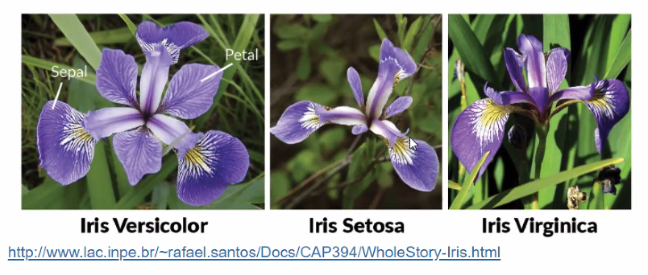
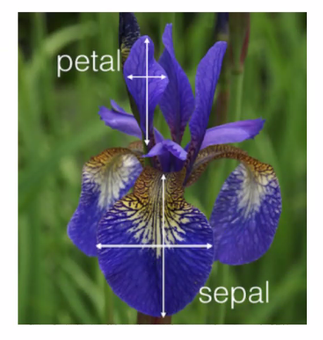
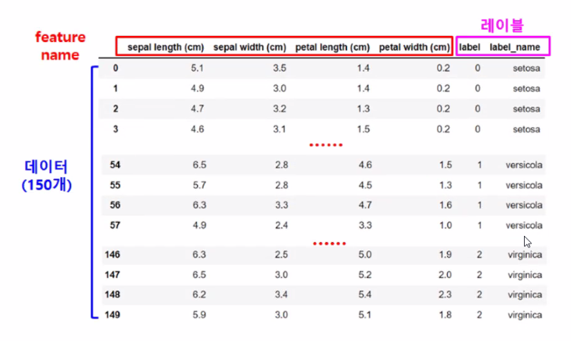

# 사이킷런을 이용한 머신러닝

붓꽃 품종 분류

## 사이킷런을 이용한 머신러닝

- 파이썬스러운 API
  - 파이썬 기반의 다른 머신러닝 패키지도 사이킷런 스타일 API지향
- 머신러닝을 위한 다양한 알고리즘 개발을 위해 편리함 프레임워크와 API제공
- 오랜 기간 실전 환경에서 검증, 매우 많은 환경에서 사용된 라이브러리

## 사이킷런을 이용한 붓꽃(iris) 데이터 분류

- 붓꽃 데이터 세트를 사용해서
- 붓꽃의 품종을 분류 (Classification)

### 붓꽃 데이터 세트

- sklearn.datasets 에 들어 있음
- load_iris()를 통해 로드해서 사용
- 머신러닝 각 분야에서 알고리즘을 측정하기 위한 기본 자료로 다양하게 활용
- 4가지 속성(피처)을 가진 3가지 붓꽃 품종의 50개 샘플 포함

#### 3가지 붓꽃 품종

- Setosa
- Versicolor
- Virginica

#### 붓꽃 데이터 피처

- Sepal length
- Sepal width
- Petal length
- Petal width

#### 붓꽃 데이터 셋 요약

자료데이터 유형 

1. 명목형
2. 순서형
3. 구간형
4. 비율형

### 분류를 위한 학습 및 예측 프로세스

- 0

