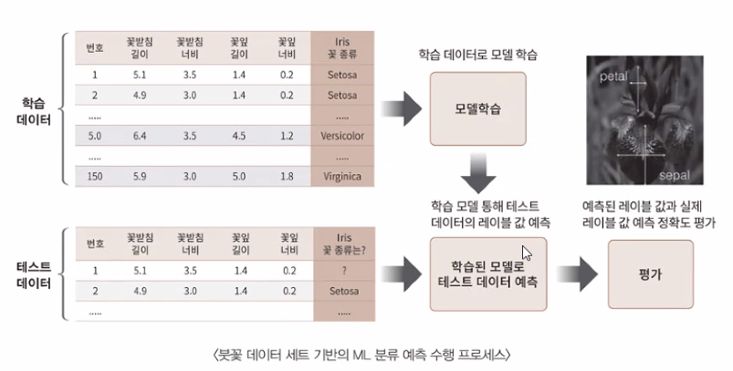
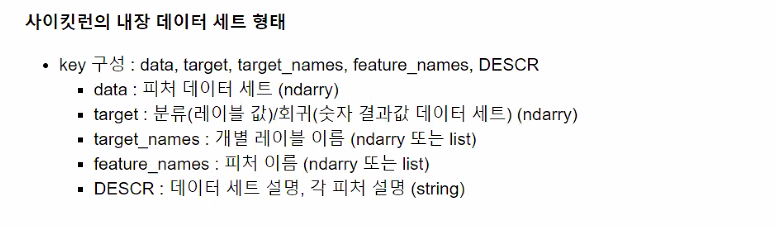
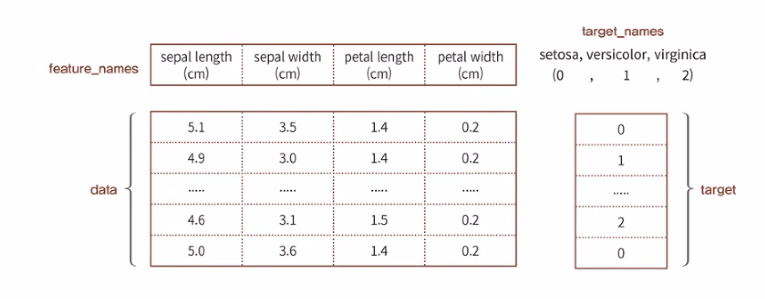

# 사이킷런을 이용한 머신러닝

붓꽃 품종 분류

## 사이킷런을 이용한 머신러닝

- 파이썬스러운 API
  - 파이썬 기반의 다른 머신러닝 패키지도 사이킷런 스타일 API지향
- 머신러닝을 위한 다양한 알고리즘 개발을 위해 편리함 프레임워크와 API제공
- 오랜 기간 실전 환경에서 검증, 매우 많은 환경에서 사용된 라이브러리

## 사이킷런을 이용한 붓꽃(iris) 데이터 분류

- 붓꽃 데이터 세트를 사용해서
- 붓꽃의 품종을 분류 (Classification)

### 붓꽃 데이터 세트

- sklearn.datasets 에 들어 있음
- load_iris()를 통해 로드해서 사용
- 머신러닝 각 분야에서 알고리즘을 측정하기 위한 기본 자료로 다양하게 활용
- 4가지 속성(피처)을 가진 3가지 붓꽃 품종의 50개 샘플 포함

#### 3가지 붓꽃 품종

- Setosa
- Versicolor
- Virginica

#### 붓꽃 데이터 피처

- Sepal length
- Sepal width
- Petal length
- Petal width

#### 붓꽃 데이터 셋 요약

자료데이터 유형 

1. 명목형
2. 순서형
3. 구간형
4. 비율형

### 분류를 위한 학습 및 예측 프로세스

- 0 단계 : 데이터 세트 준비
  - 데이터 세트 로딩, 데이터 프레임으로 변환
- 1단계 : 데이터 세트 분리
  - 데이터를 학습 데이터와 테스트 데이터로 분리
- 2단계 : 모델 학습
  - 학습 데이터를 기반으로 ML알고리즘을 적용해 모델 학습
- 3단계 : 예측 수행
  - 학습된 ML모델을 이용해 테스트 데이터 분류(붓꽃 종류) 예측
- 4단계 : 모델 성능 평가
  - 예측된 결과값과 테스트 데이터 실제 값 비교하여 ML모델 성능 평가

### 용어 정리

피처(Feature) : 데이터 세트 속성

 - feature_names : 'sepal length (cm)', 'sepal width (cm)', 'petal length (cm)', 'petal width (cm)'

레이블(Label) :

- 품종 ('setosa' 'versicolor' 'virginica')
- 학습 : 결정값(주어진 정답)
- 테스트 : 타겟(target)값 (예측해야 할 값)
- target(숫자) : 0, 1, 2
- target_names : 'setosa' 'versicolor' 'virginica'
- 레이블  = 결정값 = 타겟값

### 학습 데이터와 테스트 데이터 세트로 분리

**train_test_split() 함수** 사용

- train_test_split(iris_data, iris_label, test_size = 0.3, random_state = 11)
- train_test_split(피처 데이터 세트, 레이블 데이터 세트, 테스트 데이터 세트 비율, 난수 발생값)
    - 피처 데이터 세트 : 피처 만으로 된 데이터(numpy)
    - 레이블 데이터 세트 : 레이블(결정 값) 데이터 (numpy)
    - test_size (테스트 데이터 세트 비율) : 전체 데이터 세트 중 테스트 데이터 세트 비율
    - random_state (난수 발생값) : 수행할 때마다 동일한 데이터 세트로 분리하기 위해 시드값 고정

**train_test_split()** 반환값 
- X_train : 학습용 피처 데이터 세트 (feature)
- X_test : 테스트용 피처 데이터 세트 (feature)
- y_train : 학습용 레이블 데이터 세트 (target)
- y_test : 테스트용 레이블 데이터 세트 (target)
- feature : 대문자 X_
- label(target) : 소문자 y_

### **학습 데이터 세트로 학습(Train) 수행**

ML알고리즘으로 의사결정 트리 알고리즘을 이용해서 학습과 예측 수행
DecisionTreeClassifier클래스의 fit() / predict() 메소드 사용
fit() : 학습 수행 (학습용 데이터)

- fit(학습용 피처 데이터, 학습용 레이블(정답) 데이터)
- fit(X_train, y_train)
predict() : 예측 수행
- predict(테스트용 피처 데이터)
- predict(X_test)

### 예측 정확도(accurancy) 평가

- 예측 결과를 기반으로
- 의사 결정 트리 기반의 DecisionTreeClassifier의 예층 성능 평가
- 머신러닝 모델의 여러 성능 평가 방법 중 정확도 측정
- 정확도 : 예측 결과 실제 레이블 값과 얼마나 정확하게 맞는지 평가하는 지표
- 예측한 붓꽃 품종과 실제 테스트 데이터 세트의 붓꽃 품종이 얼마나 일치하는지 확인
  - 정확도 측정을 위해 사이킷런에서 제공하는 accurancy_score()함수 사용
  - accurancy_score(실제 테스트용 레이블 데이터 세트, 예측된 레이블 데이터 세트)

