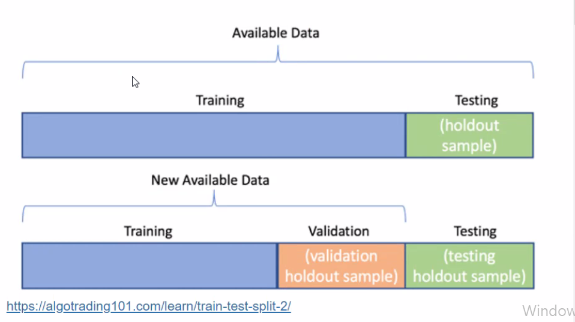
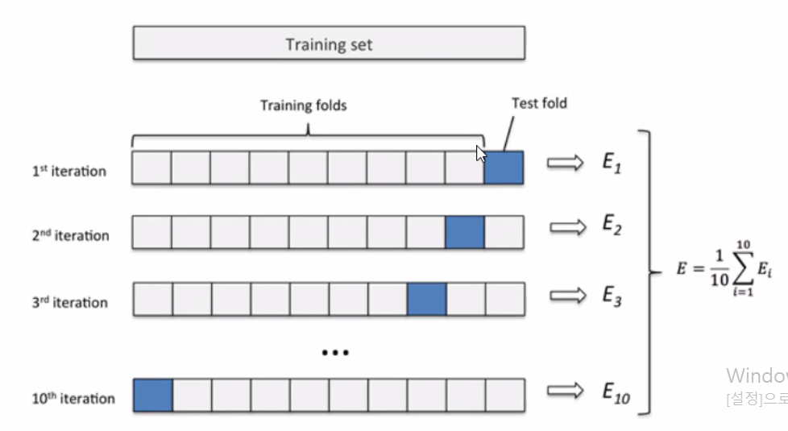
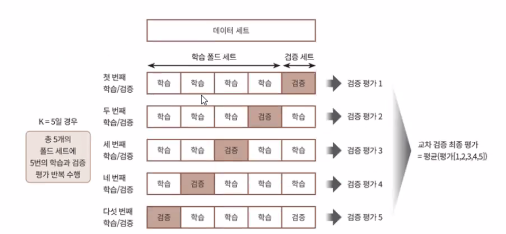
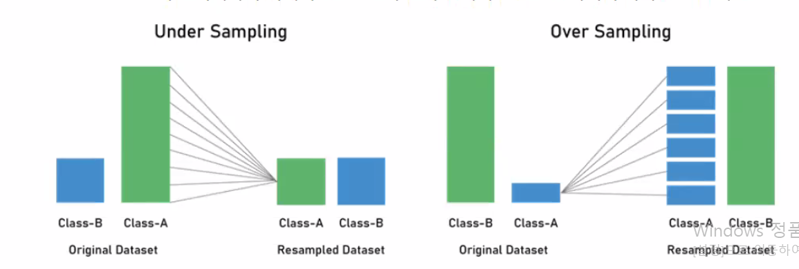
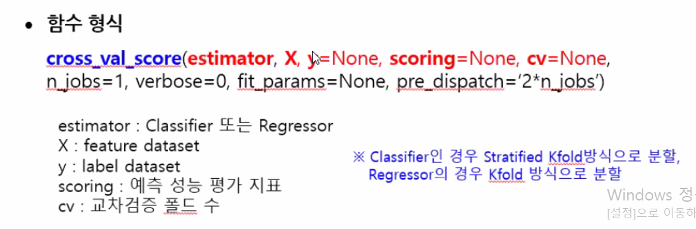
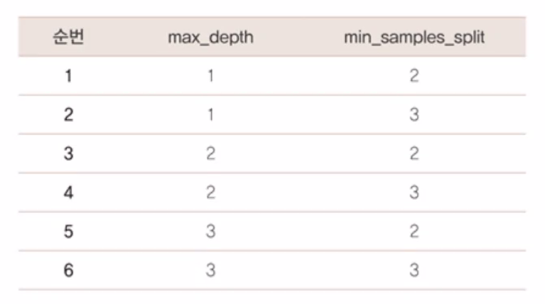

## 🧠리뷰

#### 머신러닝의 종류

감독 하에 훈련하는가?

- 지도 학습
- 비지도 학습
- 준지도 학습
- 강화 학습
- 전이 학습

실시간으로 점진적인 학습을 하는지?

- 온라인 학습
  - 많은 양을 데이터를 부분으로 나눔
  - 개별적 또는 소그룹으로 데이터를 순차적으로 공급하여 점진적으로 훈련
- 배치 학습
  - 시스템이 점진적으로 학습할 수 없음
  - 모든 데이터를 사용해 학습
  - 오프라인으로 수행(많은 수행시간)

데이터 비교 vs 모델 기반인지?

- 인스턴스 기반 학습
  - 사례 기반
  - 데이터 끼리의 비교
- 모델 기반 학습
  - 분류


#### 지도 ↔ 비지도 학습 차이

지도 : 정답을 줌

비지도 : 정답 안줌

회귀모델 : 수치형

분류모델 : 범주형

독립변수은 보통 수치형? ❌

- 비정형 데이터가 훨씬 많다.  
- 범주형(문자형) 데이터가 많음

현실 데이터는 수치형보다 범주형 데이터가가 훨씬 많다.

비정형 데이터 ➡ 정형 데이터 변환 후 분석해가는 과정이 issue 

체계화 되가며 이미지 - 뭐가 알맞고 등등


#### 분류를 위한 학습 및 예측 프로세스

- 0 단계 : 데이터 세트 준비
  - 데이터 세트 로딩, 데이터 프레임으로 변환
- 1단계 : 데이터 세트 분리
  - 데이터를 학습 데이터와 테스트 데이터로 분리
  - 보통 7 : 3 비율로 구분
- 2단계 : 모델 학습
  - 학습 데이터를 기반으로 ML알고리즘을 적용해 모델 학습
- 3단계 : 예측 수행
  - 학습된 ML모델을 이용해 테스트 데이터 분류(붓꽃 종류) 예측
- 4단계 : 모델 성능 평가
  - 예측된 결과값과 테스트 데이터 실제 값 비교하여 ML모델 성능 평가


#### 홀드-아웃 방식

- 데이터를 두 개 세트로 나누어 각각 Train과 Test세트로 사용
- Train과 Test의 비율을 7:3 ~ 9:1로 널리 사용하나, 알고리즘의 특성 및 상황에 따라 적절한 비율을 사용
- Train - Vaildation -Test로 나누기도 함




# Model Selection 모듈 소개

## 학습 / 테스트 데이터 셋 분리 train_test_split()

### 사이킷런 model_selection 모듈의 주요 기능

- 학습 데이터와 테스트 데이터 세트 분리
- 교차 검증 분할 및 평가
- Estimator의 하이퍼 파라미터 튜닝


#### 학습 데이터와 테스트 데이터 세트 분리

특성을 반영하는 샘플 데이터는 무척 중요

- train_test_split() 함수 사용

#### 학습 데이터 세트

- 머신러닝 알고리즘의 학습을 위해 사용
- 데이터의 속성(피처)와 결정값(레이블) 모두 포함
- 학습 데이터를 기반으로 머신러닝 알고리즘이 데이터 속성과 결정값의 패턴을 인지하고 학습

#### 테스트 데이터 세트

- 학습된 머신러닝 알고리즘 테스트용
- 머신러닝 알고리즘은 제공된 속성 데이터를 기반으로 결정값 예측
- 학습 데이터와 별도의 세트로 제공


#### train_test_split() 함수

train_test_split(feature_dataset, label_dataset, test_size, train_size, random_state, shuffle, stratify)

train_test_split(iris_data.data, iris_data.target, test_size = 0.3, random_state = 4)

- feature_dataset : 피처 데이터 세트
  - 피처(feature) 만으로 된 데이터 (numpy)
- label_dataset : 레이블 데이터 세트
  - 레이블(결정 값) 데이터 (numpy)
- test_size : 테스트 데이터 세트 비율
  - 전체 데이터 세트 중 테스트 데이터 세트 비율
  - 지정하지 않으면 ⇒ 0.25
- train_size : 학습용 데이터 세트 비율
  - 굳이 설정 안해도 됨
- random_state : 난수 발생값
  - 수행할 때마다 동일한 데이터 세트로 분리하기 위해 시드(seed)값 고정
  - 0 또는 4가 가장 많이 사용
  - 하이퍼 파라미터 튜닝시 이 값을 고정해두고 튜닝해야 매번 데이터셋이 변경되는 것을 방지할 수 있음
- shuffle : 분할하기 전에 섞을지 지정
  - default = True (보통은 디폴트 값으로 놔둠)
- stratify : 지정된 레이블의 클래스 비율에 맞게 분할
  - default = None
  - classification을 다룰 때 매우 중요한 옵션값
  - stratify값을 target으로 지정해주면 각각의 class비율(ratio)을 train / validation에 유지해 줌(한 쪽에 쏠려서 분배되는 것을 방지)
  - 이 옵션을 지정해 주지 않고 classification 문제를 다룬다면, 성능의 차이가 많이 날수 있음


#### **train_test_split()** 반환값 

- X_train : 학습용 피처 데이터 세트 (feature)
- X_test : 테스트용 피처 데이터 세트 (feature)
- y_train : 학습용 레이블 데이터 세트 (target)
- y_test : 테스트용 레이블 데이터 세트 (target)
- feature : 대문자 X_
- label(target) : 소문자 y_


### 학습  / 테스트 데이터 셋 분리 시 문제점 

홀드-아웃 방식 사용시 문제점 발생

- 과적합 문제 발생
- 부적합한 데이터 선별로 인한 알고리즘 성능 저하

#### 과적합 (Overfitting)

모델이 학습 데이터에 과도하게 최적화 되어 다른 데이터로 실제 예측을 수행할 경우 예측 성능이 과도하게 떨어지는 것

#### 과적합 문제 발생

고정된 학습 데이터와 테스트 데이텅만 최적의 성능을 발휘할 수 있도록 편향되게 모델을 유도하는 경향 발생

결국, 해당 테스트 데이터만 과적합 되는 학습 모델이 만들어져서 다른 테스트용 데이터가 들어올 경우 성능 저하 발생

#### 부적합한 데이터 선별로 인한 문제점

ML은 데이터에 기반하고, 데이터는 이상치·분포도·다양한 속성값·피처 중요도 등 ML에 영향을 미치는 다양한 요소를 가지고 있음

특정 ML알고리즘에 최적으로 동작할 수 있도록 데이터를 선별해서 학습한다면 실제 데이터 양식과는 많은 차이가 있을 것이고 결국 성능 저하로 이어질 것임


#### 문제점 개선

**교차 검증**을 이용해 더 다양한 학습 평가 수행


## Data split과 모델 검증

### 교차검증 (Cross Vaildation, CV)

- k-fold Cross Vaildation 이라고도 함
- 전체 데이터 세트를 임의로 k개의 그룹으로 나누고, 그 가운데 하나의 그룹을 돌아가면서 테스트 데이터 세트로, 나머지 k-1개 그룹은 학습용 데이터 세트로 사용하는 방법
- 별도의 여러 세트로 구성된 학습 데이터 세트와 검증 데이터 세트에서 학습과 평가를 수행

10번 반복



#### 교차 검증 사용 목적

- 데이터에 적합한 알고리즘인지 평가하기 위해 
- 모델에 적절한 hyperparameter 찾기 위해
- 과대적합 예방
- <u>데이터 편중을 막기 위해</u>


#### 교차 검증 방법

- K 폴드 교차 검증
- Stratified K 폴드 교차 검증


### K 폴드 교차 검증

- K개의 데이터 폴드 세트를 만들어서
- K번 만큼 각 폴드 세트에 학습과 검증 평가를 반복적으로 수행
- 가장 보편적으로 사용되는 교차 검증 기법

5-폴드 교차 검증




#### K 폴드 교차 검증 프로세스 구현을 위한 사이킷런 클래스

1️⃣ KFold 클래스 : 폴드 세트로 분리하는 객체 생성

 - kfold = KFold(n_splits = 5)

2️⃣ split() 메소드 : 폴드 데이터 세트로 분리

	- kfold.split(features)
	- 각 폴드마다 학습용, 검증용, 테스트 데이터 추출
	- 학습용 및 예측 수행
	- 정확도 측정

3️⃣ 최종 평균 정확도 계산


### 불균형한 데이터(imbalanced)

관심 대상 데이터가 상대적으로 매우 적은 비율로 나타나는 데이터의 문제

- 분류 문제인 경우 : 클래스들이 균일하게 분포하지 않은 문제를 의미
  - 예. 불량률이 1%인 생산라인에서 양품과 불량품을 예측하는 문제
  - 사기감지탐지, 이상거래탐지, 의료진단 등에서 자주 나타남

- 회귀 문제인 경우 : 극단값이 포함되어 있는 "<u>치우친</u>" 데이터 차례
  - 예. 산불에 의한 피해 면적을 예측하는 문제

#### 우회 / 극복하는 방법

데이터 추가 확보

Re-Sampling 

- Under Sampling (**과소표집**)
  - 다른 클래스에 비하여 상대적으로 많이 나타나는 클래스의 개수를 줄임
  - 균형은 유지할 수 있으나 유용한 정보에 대한 손실이 있을 수 있음

- Over Sampling (**과대표집**)
  - 상대적으로 적게 나타나는 클래스의 데이터를 복제하여 데이터의 개수를 늘림
  - 정보 손실은 없이 학습 성능은 높아지는 반면, 과적합의 위험이 있음
  - 이를 회피하기 위해서 SMOTE와 같이 임의의 값을 생성하여 추가하는 방법 사용



- 먼저 K 폴드 문제점 확인하고, 사이킷런의 Stratified K 폴드 교차 검증 방법으로 개선
- 붓꽃 데이터 세트를 DataFrame으로 생성하고 레이블 값의 분포도 확인


### Stratified K 폴드 교차 검증

불균형한 분포도를 가진 레이블(결정 클래스) 데이터 집합을 위한 K폴드 방식


#### StratifiedKFold 클래스

원본 데이터의 레이블 분포를 고려한 뒤 이 분포와 동일하게 학습과 검증데이터 세트를 분배

KFold 사용법과 거의 비슷

- 차이점
  - 레이블 데이터 분포도에 따라 학습 / 검증 데이터를 나누기 때문에,
  -  split() 메서드에 인자로 피처 데이터 세트 뿐 아니라 <u>레이블 데이터 세트도 반드시 필요</u>


#### Stratified K 폴드의 경우

원본 데이터의 레이블 분포도 특성을 반영한 학습 및 검증 데이터 세트를 만들 수 있으므로 왜곡된 레이블 데이터 세트에서는 반드시 Stratified K 폴드를 이용해서 교차 검증해야 함

일반적으로 분류(Classification)에서의 교차 검증은 K 폴드가 아니라 Stratified K 폴드로 분할 되어야 함

회귀(Regression)에서는 Stratified K 폴드 지원되지 않음

- 이유 : 회귀의 결정값은 이산값 형태의 레이블이 아니라 연속된 숫자값이기 때문에 결정값별로 분포를 정하는 의미가 없기 때문


## 교차검증을 보다 간편하게

### cross_val_score() 함수

- 1 ~ 3단계의 교차 검증 과정을 한꺼번에 수행
- 내부에서 Estimator를 학습(fit), 예측(predict), 평가(ecaluation) 시켜주므로 간단하게 교차 검증 수행 가능

#### 함수 형식

cross_val_score(esimator, X, y = None, scoring = None, cv = None, n_jobs = 1, verbose = 0, fit_params = None, pre_dispatch = '2*n_jobs')

 **cross_val_score(dt_clf, feature, label, scoring='accuracy', cv = 3)**

- estimort : Classifier 또는 Regressor
- X : feature dataset
- y : lable dataset
- scoring : 예측 성능 평가 지표
- cv : 교차 검증 폴드 수

Classifier인 경우

- Stratified KFold 방식으로 분할

Regress인 경우

- KFold 방식으로 분할



#### 함수 반환값

- scoring 파라미터로 지정된 성능 지표 측정값을 담은 배열


#### 붓꽃 자료를 3개 폴드로 분할하여 학습 및 검증 (cv = 3)

- cross_val_score()는 cv로 지정된 횟수만큼
- scoring 파라미터로 지정된 평가 지표로 평가 결과값을 배열로 반환
- 일반적으로 평가 결과값 평균을 평가 수치로 사용


### 교차 검증과 최적의 하이퍼 파라미터 튜닝을 한번에

#### 하이퍼 파라미터(Hyper parameter)

- 머신러닝 알고리즘을 구성하는 요소
- 이 값들을 조정해 알고리즘의 예측 성능을 개선할 수 있음


#### 사이킷런의 GridSearchCV 클래스

Classifier 나 Regressor와 같은 알고리즘에 사용되는 하이퍼 파라미터를 순차적으로 입력하면서 최적의 파라미터를 편리하게 도출할 수 있는 방법 제공

- Grid는 격자라는 의미 
  - 촘촘하게 파라미터를 입력하면서 테스트 하는 방식
  - 격자 점이 x와 y에 해당하는 값

즉, 머신러닝 알고리즘의 여러 하이퍼 파라미터를 순차적으로 변경하면서 최고 성능을 가지는 파라미터를 찾고자 한다면 파라미터의 집합을 만들어 순차적으로 적용하면서 최적화 수행


#### GridSearchCV 클래스 생성자의 주요 파라미터

```sql
GridSearchCV(dt_clf, param_grid = parameters, cv = 3, refit = True, return_train_score = True)
```

- estimator : classifier, regressor, peipeline
- param_grid : key + 리스트 값을 가지는 딕셔너리 (estimator 튜닝을 위한 하이퍼 파라미터)
  - key : 파라미터명
  - 리스트 값 : 파라미터 값
- scoring : 예측 성능을 측정할 평가 방법
  - 성능 평가 지표를 지정하는 문자열
  - 예 : 정확도인 경우 'accuracy'
- cv : 교차 검증을 위해 분할되는 학습 / 테스트 세트의 개수
- refit : 최적의 파라미터를 찾은 뒤 입력된 estimator 객체를 해당 하이퍼 파라미터로 재학습 여부
  - 디폴트 : True


#### 파라미터(parameter)

하이퍼 파라미터는 딕셔너리 형식으로 지정

key : 하이퍼 파라미터

value : 하이퍼 파라미터의 값

```sql
parameters = {'max_depth' : [1, 2, 3], 'min_samples_split' : [2, 3]}
```

min_samples_split : 자식 규칙 노드를 분할해서 만드는데 필요한 최소 샘플 데이터 개수

- min_samples_split = 4 로 설정하는 경우
  - 최소 샘플 개수가 4개 필요한데, 3개만 있는 경우에는 더 이상 자식 규칙 노드를 위한 분할을 하지 않음

트리 깊이도 줄어서 더 간결한 결정 트리 생성




gridSearch에서 파라미터 값을 다르게 주었을때 변화 알고있어야함


### 일반적인 머신러닝 모델 적용 방법

일반적으로 학습 데이터를 GridSearchCV를 이용해,

 최적 하이퍼 파라미터 튜닝을 수행한 뒤에 별도의 테스트 세트에서 이를 평가하는 방식


## 📌실습

매개변수를 어떻게 주느냐에 따라 결과값이 달라지는것을 실습을 통해 익히기

테스트 학습 데이터로 나눔 - sklearn의 train test split 사용

편향적일수 있어 정확도가 떨어지므로

나누어서 반복해서 테스트 - 교차검증

분할, 나누어서 학습하는 관점

Kfold 방법 장단점

skfold 방법

for문 사용하지 않고 효율적임 <u>score</u>

최적의 상태를 찾는 하이퍼파라미터 - 

하이퍼파라미터에 튜닝까지하는 교차 검증 방식이 gridsearchCV

- validation

