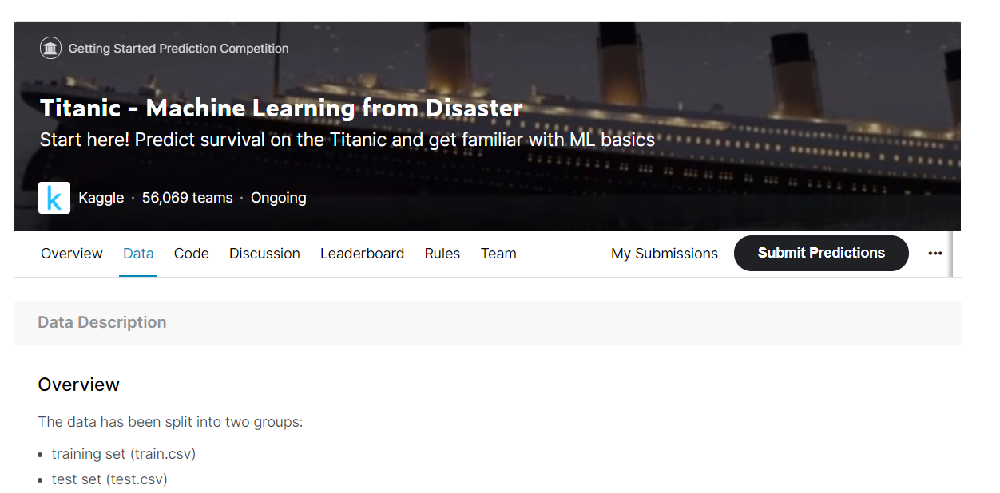

# 사이킷런으로 수행하는 타이타닉 생존자 예측

**Kaggle에서 제공하는 타이타닉 탑승자 데이터 기반으로 생존자 예측을 사이킷런으로 수행**

- Kaggle : 데이터 분석 오픈 포털
  - 세계적인 ML 기반 분석 대회를 온라인 상에서 주관

- 타이타닉 생존자 데이터
  - 머신러닝에 입문하는 데이터 분석가 / 과학자를 위한 기초 예제로 제공
  - 많은 캐글 이용자가 자신의 방법으로 타이타닉 생존자 예측을 수행하고, 수행 방법을 캐글에 공유

## 📌0722 정리

- train_test_split : 학습용 검증용으로 분할

- 교차 검증 : 분할을 하되 train / test를 한번이 아니라 여러번에 걸쳐 테스트하는 방식 활용
  - 데이터 불균형, 구성 자체가 층이 있는것을 반영해서 교차검증하는 것
  - 교차 검증 방식 : K fold, SK fold
    - SKfold : kfold의 for문 이용해서 반복 하는것을 편리하게 하기 위한 방식 

- 하이퍼 파라미터 : 모델에 있어서 알고리즘 활용할 때 초기에 주어진 파라미터 
  - 최적의 파라미터를 적용된 모델을 훈련에 적용하는 방식

- 전처리 설명
  - 데이터 결측치, 이상치를 처리하기위한 방식
  - 단위 다르거나, 편향되어 있는 데이터 변환  

- 데이터 전처리 실습 : 타이타닉 데이터로 적용
  ✔ 인코딩 부분에서 막힘 (내일 이어서)

## 📌 0723 이어서

각 빈도별 분포를 봐야함

수치를 봐야함

- 수치의 범위를 확인
- 이상치 / 오류 확인
- 변수별로 분포 확인

시각적 확인 

- 시각화 
  - 원 데이터를 탐색해서(쪼개서) 분석
  - 관련성을 제시하고 보여줌으로써 의사결정을 지원
  - 모델링에서 서비스를 할때 (고객들에게 제공)
  - 분석법 : p분석?

평균적 차이 - 

