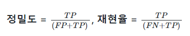
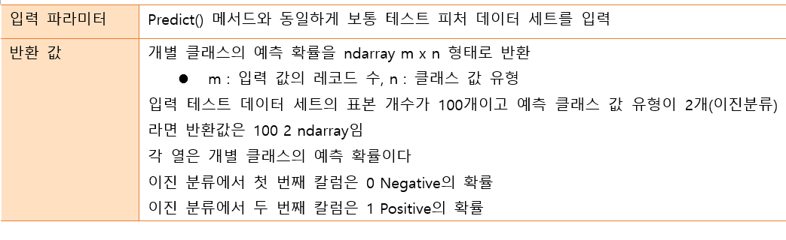
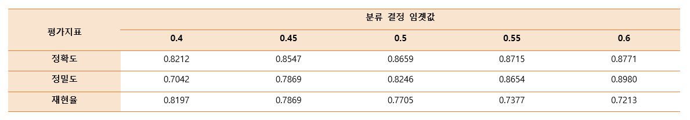
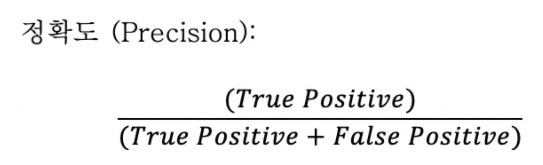
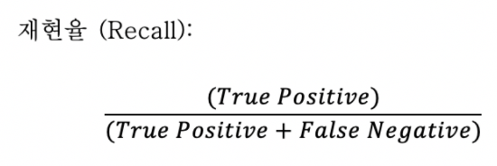
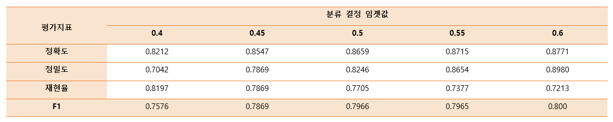
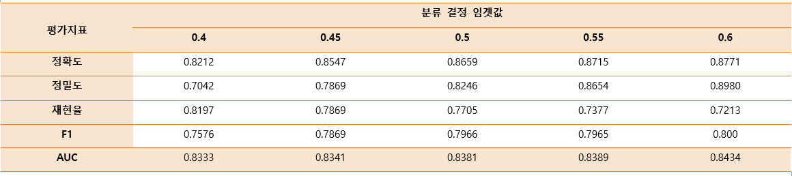

# 분류 모델 평가 지표

머신러닝 지도학습의 대표적인 한 축인 분류(Classification)을 학습하기 전에 분류의 예측 성능을 평가하는 다양한 방법을 배움


## 🧠리뷰

학습 데이터와 테스트 데이터 세트 분리

- train_test_split() 함수 사용


분리시 문제점 => 과적합

과적합 해결 => 교차검증

교차검증 => k폴드, sk폴드

- k폴드는 k번 만큼 반복 수행
- 이를 개선한 방법인 sk폴드


하이퍼 파라미터 - 머시러닝 알고리즘을 구성, 이를 조정해 알고리즘 예측 성능 개선 가능

그리드 서치 : 하이퍼 파라미터를 순차적으로 변경하면서 최고 성능을 가지는 파라미터 찾는것

- 하이퍼 파라미터 튜닝 지원 클래스
- 최적의 상태를 찾는 하이퍼파라미터

데이터 전처리

- 주요기법 : 데이터정제 / 결합 / 변환, 차원 축소

+) 분류를 위한 학습 예측 프로세스

- 데이트 세트 준비 - 데이터 세트 분리 - 모델 학습 - 예측 수행 - 모델 성능 평가


통계적 가정 기법 만족도를 봐야함

데이터 자체가 한 변수만 가지고 분석하지 않고 다양한 피처를 가지고있는 데이터 셋을 

동시에 보기 때문에 변수마다 가지고있는 범위가 다름 => 같은 기준으로 봐야함 -> 변환

새로운 변수 추가 = > 변환

데이터 분포 대칭형이 아니라 비대칭형 인 경우 => 변환

대칭형이 분석에 더 용이

스케일링 방법론

minmax

stardardscaler 평균 0 표준편차 1

데이터를 같은 잣대로 변환

데이터 인코딩 방식 


## 모델 성능 평가

머신러닝 프로세스 구성

- 데이터 가공 / 변환
- 모델 학습 / 예측
- 평가

머신러닝 모델은 여러 가지 방법으로 예측 성능을 평가할 수 있다. 성능 평가 지표는 일반적으로 모델이 분류/회귀냐에 따라 여러 종류로 나뉨

- 분류의 성능 평가 지표 유형
  - 일반적으로 실제 결과 데이터와 예측 결과 데이터가 얼마나 정확하고 오류가 적게 발생하는가에 기반
    - 단순히 이런 정확도만 가지고 판단했다가는 잘못된 평가에 빠질 수 있음
  - 이진 분류의 성능 평가 지표
    - 0과 1로 결정값이 한정
    - 긍정 / 부정 판단
    - 이진 분류에서는 정확도보다는 다른 성능 평가 지표가 더 중요시되는 경우가 많음
- 회귀의 성능 평가 지표 유형
  - 대부분 실제값과 예측값의 오차 평균에 기반
  - 기본적으로 예측 오차를 가지고 정규화 수준을 재가공하는 방법
  - 예를 들어, 오차에 절댓값을 씌운 뒤 평균 오차를 구하거나 오차의 제곱에 제곱 값에 루트를 씌운 뒤 평균 오차를 구하는 방법

### 분류 모델의 평가 

예측 대상이 범주형 데이터인 경우

- 정확도 (Accuracy)
- 재현율 (Recall)
- 정밀도 (Precision)
- F1 measure
- G measure
- ROC curve
- AUC

분류는 결정 클래스 값 종류의 유형에 따라 나눌 수 있다.

- 긍정/부정과 같은 2개의 결괏값만을 가지는 이진분류와

- 여러개의 결정 클래스 값을 가지는 멀티 분류


### 회귀 모델의 평가 지표

예측 대상이 수치 데이터인 경우

- MSE (Mean Square Error)
- RMSE (Root Mean Square Error)
- MAE (Mean Absolute Error)
- MAPE (Mean Absolute Percentage Error)
- R<sup>2</sup>


## 분류 모델의 성능 평가 지표

### Accuracy (정확도)

- 실제 데이터와 예측 데이터가 얼마나 같은지를 판단하는 지표
- 직관적으로 모델 예측 성능을 나타내는 평가 지표
- 그러나 이진 분류의 경우 데이터의 구성에 따라 ML모델의 성능을 왜곡할 수 있기 때문에
  - 정확도 수치 하나만 가지고 성능을 평가하지는 않음
- 특히 정확도는 불균형한 레이블 값 분포에서 ML모델의 성능을 판단할 경우, 적합한 지표가 아님


#### 정확도 문제 예

1. 타이타닉 생존자 예측
2. MNIST 데이터 세트


#### 💻실습. 타이타닉 생존자 예측

정확도 지표가 어떻게 ML모델의 성능을 왜곡하는지에 대한 예제

##### 💻실습 정리

특히 정확도는 불균형한(imbalanced)레이블 값 분포에서 ML모델의 성능을 판단할 경우, 적합한 평가 지표가 아니다.

예를 들어, 100개의 데이터가 있고 이 중에 90개의 데이터 레이블이 0, 단 10개의 데이터 레이블이 1이라고 한다면 무조건 0으로 예측 결과를 반환하는 ML모델이라도 정확도가 90%로 표시된다.


### MNIST 데이터 세트

0~9까지의 숫자 이미지의 픽셀 정보를 가지고 있고, 이를 기반으로 숫자 Digit을 예측하는 데 사용

사이킷런의 load_digits() API를 통해 MNIST 데이터 세트 제공

원래 MNIST 데이터 세트는 레이블 값이 0부터 9까지 있는 **멀티 레이블 분류**를 위한 것


#### 이진 분류 문제로 변환

- 불균형한 데이터 세트로 변형
- 레이블 값이 7인 것만 True, 나머지 값은 모두 False로 변환
- True : 전체 데이터의 10%
- False : 90%

**입력되는 모든 데이터를 False, 즉 0으로 예측하는 classifier를 이용해**

- 정확도를 측정하면 약 90%에 가까운 예측 정확도를 나타냄

#### 정확도 평가 지표의 맹점

- 아무것도 하지 않고 무조건 특정한 결과로 찍어도
- 데이터가 균일하지 않은 경우 높은 수치가 나타날 수 있음


#### 💻실습. MNIST 데이터 세트

MNIST데이터 세트를 변환해 불균형한 데이터 세트로 만든 뒤에 정확도 지표 적용 시 어떤 문제가 발생할 수 있는지 살펴보는 예제

- 사이킷런 load_digits() API를 통해 MNIST데이터 세트 제공

##### 💻실습 정리

정확도 평가 지표는 불균형한 레이블 데이터 세트에서는 성능 수치로 사용돼서는 안된다.

정확도가 가지는 분류 평가 지표로서 이러한 한계점을 극복하기 위해 여러 가지 분류 지표와 함께 적용해야 한다.

먼저 True/False, Positive/Negative의 4분면으로 구성되는 **오차 행렬**에 대해 설명해야 한다.


### Confusion Matrix(오차 행렬)

오차 행렬(Confusion Matrix : 혼동 행렬)

- 학습된 분류 모델이 예측을 수행하면서 얼마나 헷갈리고(confused)있는지도 함께 보여주는 지표

- 이진 분류의 예측 오류가 얼마인지와 더불어 어떠한 유형의 예측 오류가 발생하고 있는지를 함께 나타내는 지표
- 4분면 행렬에서 실제 레이블 클래스 값과 예측 레이블 클래스 값이 어떤 유형을 가지고 맵핑되는지 나타냄
- 예측 클래스와 실제 클래스의 값 유형에 따라 T<sub>n</sub>, F<sub>p</sub>, F<sub>n</sub>, T<sub>p</sub> 형태
- T<sub>n</sub>, F<sub>p</sub>, F<sub>n</sub>, T<sub>p</sub> 값을 다양하게 결합해 분류 모델 예측 성능의 오류가 어떤 모습으로 발생하는지 알 수 있음

1종 오류, 2종오류

전체 비중중 옳게 예측한거 보는 것 = 정확도


T<sub>n</sub>, F<sub>p</sub>, F<sub>n</sub>, T<sub>p</sub>는 예측 클래스와 실제 클래스의

- Positive결정 값(값 1)과 Negative 결정 값(값 0)의 결합에 따라 결정
- 앞 문자 T/F(True/False) : 예측값과 실제값이 '같은가 / 틀린가' 의미
- 뒤 문자 n/p(Negative/Positive) : 예측 결과 값이 부정(0) / 긍정(1) 의미
- 예 : T<sub>n</sub> (Ture Negative) 
  - 앞 True : 예측 클래스 값과 실제 클래스 값이 같다는 의미
  - 뒤 Negative : 예측 값이 Negative값이라는 의미

#### T<sub>n</sub>, F<sub>p</sub>, F<sub>n</sub>, T<sub>p</sub> 구분

- T<sub>n</sub> : 예측값을 Negative값 0으로 예측했고, 실제값 역시 Negative값 0 (같음)
- F<sub>p</sub> : 예측값을 Positive값 1으로 예측했는데, 실제값은 Negative값 0 (틀림)
- F<sub>n</sub> : 예측값을 Negative값 0으로 예측했는데, 실제값은 Positive값 1 (틀림)
- T<sub>p</sub> : 예측값을 Positive값 1으로 예측했고, 실제값 여깃 Positive값 1 (같음)


#### 💻실습. Confustion Matirx(오차 행렬)

##### 실행 결과

```sql
array([[405,   0],
       [ 45,   0]], dtype=int64)
```


- 잘못 예측한거 45개 (10%)
  - F<sub>n</sub> : 예측값을 Negative값 0으로 예측했는데, 실제값은 Positive값 1 (틀림)
- 제대로 예측한거 405개 (90%)
  - T<sub>n</sub> : 예측값을 Negative값 0으로 예측했고, 실제값 역시 Negative값 0 (같음)


##### 실행 결과 설명


MyFakeClassifier는 load_digits()에서 target = 7인지 아닌지에 따라

클래스 값을 True/False 이진 분류로 변경한 데이터 세트를 사용해서 무조건 Negative로 예측하는 Classifier였고,

테스트 데이터 세트의 클래스 값 분포는 0이 450건, 1이 45건 이였음

- T<sub>n</sub> : 전체 450건 데이터 중 무조건 Negative 0으로 예측해서 True가 된 결과 450건  
  - 실제값/예측값 동일, Negative로 예측  

- F<sub>p</sub> : Positive 1로 예측한 건수가 없으므로 0건    
  - 실제값/예측값 다름, Positive로 예측  

- F<sub>n</sub> : Positive 1인 건수 45건을  Negative 0으로 예측해서 False가 된 결과 45건   
  - 실제값/예측값 다름, Negative로 예측  

- T<sub>p</sub> : Positive 1로 예측한 건수가 없으므로 0건   
  - 실제값/예측값 동일, Positive로 예측  


#### T<sub>n</sub>, F<sub>p</sub>, F<sub>n</sub>, T<sub>p</sub>값은 Classifier성능의 여러 면모를 판단할 수 있는 기반 정보 제공

- 이 값을 조합해 Classifier의 성능을 측정할 수 있는 주요 지표 값을 알 수 있음
  - 정확도(Accuracy)
  - 정밀도(Presion)
  - 재현율(Recall)

#### 오차 행렬 상에서 정확도


- 정확도 = 예측 결과와 실제 값이 동일한 건수
  - 예측 값과 실제 값이 얼마나 동일한가에 대한 비율만으로 결정
- 즉, 오차 행렬에서 True값에 해당하는 값인T<sub>n</sub>과 T<sub>p</sub>에 좌우된다.

정확도 = 예측 결과와 실제 값이 동일한 건수 / 전체 데이터 수 = (T<sub>n</sub> +  T<sub>p</sub>) / (T<sub>n</sub>, F<sub>p</sub>, F<sub>n</sub>, T<sub>p</sub>)


#### 불균형한 이진 분류 모델

불균형한 레이블 클래스를 가지는 이진 분류 모델에서는 

많은 데이터 중에서 중점적으로 찾아야 하는 매우 적은 수의 결과 값에 Positive를 설정해 1값을 부여하고,

그렇지 않은 경우는 Negative로 0을 부여하는 경우가 많음

- 예 1. 사기 행위 예측 모델
  - 사기 행위 : Positive 양성으로 1
  - 정상 행위 : Negative 음성으로 0
- 예 2. 암 건진 예측 모델
  - 암이 양성 : Positive 양성으로 1
  - 암이 음성 : Negative 음성으로 0


#### 불균형한 이진 분류 데이터 세트에서 정확도의 맹점

**Positive 데이터 건수가 매우 작아서 Positive보다는 Negative로 예측 정확도가 높아지는 경향이 발생**

- 10,000건의 데이터 세트에서 9,900건이 Negative이고 100건이 Positive라면 Negative로 예측하는 경향이 더 강해져서 T<sub>n</sub>은 매우 커지고 T<sub>p</sub>는 매우 작아지게 됨
- 또한 Negative로 예측할 때 정확도가 높기 때문에 F<sub>n</sub>(Negative로 예측할 때 틀린 데이터 수)이 매우 작고, Positive로 예측하는 경우가 매우 작기 때문에 F<sub>p</sub> 역시 매우 작아짐
- 정확도 지표는 비대칭한 데이터 세트에서 Positive에 대한 예측 정확도를 판단하지 못한 채 Negative에 대한 예측 정확도만으로도 분류의 정확도가 매우 높게 나타나는 수치적인 판단 오류를 일으키게 됨


##### 💻실습 정리

정확도는 분류(Classification) 모델의 성능을 측정할 수 있는 한 가지 요소일 뿐이다.

불균형한 데이터에서 정확도만으로는 모델 신뢰도가 떨어질 수 있는 사례를 실습으로 확인함

다음으로 불균형한 데이터 세트에서 정확도보다 더 선호되는 평가 지표인 **정확도**와 **재현율**에 대해 알아봄

**불균형한 데이터 세트에서 정확도보다 더 선호되는 평가 지표**

- 정밀도와 재현율


### 정밀도(Precision)와 재현율(Recall)

- Positive 데이터 세트의 예측 성능에 좀 더 초점을 맞춘 평가 지표
- 앞의 MyFakeClassifier는 Positive로 예측한 T<sub>p</sub> 값이 하나도 없기 때문에 정밀도와 재현율 값이 모두 0

#### 정밀도와 재현율 계산 공식




#### 정밀도 :  T<sub>p</sub> / (F<sub>p</sub> + T<sub>p</sub>)

- 예측을 Positive로 한 대상 중에 예측과 실제 값이 Positive로 일치한 데이터 비율
- 맞춘 양성 / 예측한 양성 
  - 예측한 양성 대 예측한(맞춘) 양성 비율
- 분모인 (F<sub>p</sub> + T<sub>p</sub>)는 예측을 Positive로 한 모든 데이터 건수 (예측한 양성)
- 분자인 T<sub>p</sub>는 예측과 실제 값이 Positive로 일치한 데이터 건수 (맞춘 양성)

Positive 예측 성능을 더욱 정밀하게 측정하기 위한 평가 지표로 양성 예측도라고도 불림


#### 재현율 :  T<sub>p</sub> / (F<sub>n</sub> + T<sub>p</sub>)

- 실제 값이 Positive인 대상 중에 예측과 실제 값이 Positive로 일치한 데이터의 비율
- 맞춘 양성 / 실제 양성 
  - 실제 양성 대율 대 예측한(맞춘)양성 비율
- 분모인 (F<sub>n</sub> + T<sub>p</sub>)는 실제 값이 Positive인 모든 데이터 건수 (실제 양성)
- 분자인 T<sub>p</sub>는 예측과 실제 값이 Positive로 일치한 데이터 건수 (맞춘 양성)
- 민감도(Sensitivity) 또는 TPR(True Positive Rate)라고도 불림


#### 정밀도와 재현율 평가 지표

정밀도와 재현율 지표 중에 이진 분류 모델의 업무 특성에 따라서 특정 평가 지표가 더 중요한 지표로 간주될 수 있다.

보통은 재현율이 정밀도보다 상대적으로 중요한 업무가 많지만, 정밀도가 더 중요한 지표인 경우도 있다.


##### 재현율이 상대적으로 더 중요한 지표인 경우

실제 Positive 양성인 데이터 예측을 Negative로 잘못 판단하게 되면 업무상 큰 영향이 발생하는 경우

- 예 1. 암 판단 모델 
  - 재현율이 훨씬 중요한 지표
  - 실제 Positive인 암 환자를 Positive양성이 아닌 Negative음성으로 잘못 판단했을 경우 오류의 대가가 생명을 앗아갈 정도로 심각
  - 반면에 실제 Negative인 건강한 환자를 암 환자인 Positive로 예측한 경우라면 다시 한번 재검사를 하는 수준의 비용이 소모될 뿐
- 예 2. 보험사기와 같은 금융 사기 적발 모델
  - 실제 긍융거래 사기인 Positive건을 Negative로 잘못 판단하게 되면 회사에 미치는 손해가 클 것임
  - 반면, 정상 금융거래인 Negative를 금융사기인 Positive로 잘못 판단하더라도 다시 한 번 금융 사기인지 재확인하는 절차를 가동하면 된다.
  - 물론 고객에게 금융 사기 혐의를 잘못 씌우면 문제가 될 수 있기에 정밀도도 중요 평가지표지만, 업무적인 특성을 고려하면 재현율이 상대적으로 더 중요한 지표


##### 정밀도가 상대적으로 더 중요한 지표인 경우

실제 Positive 양성인 데이터 예측을 Negative로 잘못 판단하게 되면 업무상 큰 영향이 발생하는 경우

-  예. 스팸메일 여부 판단 모델
  - 정밀도가 더 중요한 지표
  - 실제 Positive인 스팸 메일을 Negative인 일반 메일로 분류하더라도 사용자가 불편함을 느끼는 정도이지만,
  - 실제 Negative인 일반 메일을 Positive인 스팸 메일로 분류할 경우에는 메일을 아예 받지 못하게 돼 업무에 차질이 생긴다.


#### 재현율과 정밀도의 보완적 관계


재현율과 정밀도 모두 T<sub>p</sub>를 높이는 데 동일하게 초점을 맞춤

- 재현율은 F<sub>n</sub>(실제 Positive, 예측 Negative)를 낮추는데 초점을 맞춤
- 정밀도는 F<sub>p</sub>(실제 Negative, 예측 Positive)를 낮추는데 초점을 맞춤

재현율과 정밀도는 서로 보완적인 지표로 분류의 성능을 평가하는 데 적용

가장 좋은 성능 평가는 재현율과 정밀도 모두 높은 수치를 얻는 것

반면에 둘 중 어느 한 평가 지표만 매우 높고, 다른 수치는 매우 낮은 결과를 나타내는 경우는 바람직하지 않음


##### 수업 내용 대충 정리한거

positive로 예측한거 ⇒ 예측 (Precision)

FP - 스팸메일 케이스 

- 스팸메일함에 들어있지만 스팸메일이 아님
- 포지티브로 잘못 예측한 경우

재현율 (Recall) - 의료 진단 (코로나 , 암)

- 음성인줄 알았는데 양성
- 실제로는 양성인데 음성으로 판단하면 안된다

정밀도와 재현율은 반비례 관계

- 적절 수준으로 맞추는게 중요
- 불균형적으로 편중되면 안됨 


#### 💻실습. 정밀도와 재현율

##### MyFakeClassifier의 예측 결과로 정밀도와 재현율 측정

타이타닉 예제로 오차 행렬 및 정밀도, 재현율 구해서 예측 성능 평가

- 사이킷런 API사용
  - 정밀도 계산 : percision_score()
  - 재현율 계산 : recall_score()
  - 오차행렬 : confusion_matrix()

평가 간편 적용하기 위한 함수 작성

- confusion_matrix / percision / recall 등의 평가를 한꺼번에 호출

타이타닉 데이터를 로지스티 회귀로 분류 수행

##### 💻실습 정리

재현율 또는 정밀도를 좀 더 강화할 방법으로 **Trade-off**방법


### Precision / Recall Trade-off

#### 정밀도 / 재현율 트레이드 오프 (Trade-off)

- 업무에 따라 정밀도 / 재현율 중요도 다름

- 분류하려는 업무의 특성상 정밀도 또는 재현율이 특별히 강조돼야 할 경우 분류의 경정 임계값(Threshold)을 조절해 정밀도 또는 재현율의 수치를 높일 수 있다.
- 정밀도와 재현율은 상호 보완적인 평가 지표이기 때문에 어느 한쪽을 강제로 높이면 다른 하나의 수치는 떨어지기 쉬움
- 이를 정밀도 / 재현율의 트레이드오프(Trade-off)라고 부른다.


사이킷런의 분류 알고리즘은 예측 데이터가 특정 레이블(Label, 결정 클래스 값)에 속하는지를 계산하기 위해 먼저 개별 레이블별로 결정 확률을 구한다.

그리고 예측 확률이 큰 레이블값으로 예측하게 된다.

가령 이진 분류 모델에서 특정 데이터가 0이 될 확률이 10%, 1이 될 확률을 90%로 예측됐다면 

- 최족 예측은 더 큰 확률을 가진, 즉 90% 확률을 가진 1로 예측

일반적으로 이진 분류에서는 이 임곗값을 0.5, 즉 50%로 정하고

- 이 기준 값보다 확률이 크면 Positive로 결정하고,
- 이 기준 값보다 확률이 작으면 Negative로 결정한다.


#### predict_proba() 메소드

사이킷런은 개별 데이터별로 예측 확률을 반환하는 메서드인 predict_proba()를 제공

- 학습이 완료된 사이킷런 Classifier객체에서 호출이 가능
- 테스트 피처 데이터 세트를 파라미터로 입력해주면 
  - 테스트 피처 레코드의 개별 클래스 예측 확률을 반환
- predict() 메서드와 유사하지만 단지 반환 결과가 예측 결과 클래스값이 아닌 <u>예측 확률 결과</u>



```sql
array([[0.85252649, 0.14747351],
       [0.89303676, 0.10696324],
       [0.93352957, 0.06647043]])
```

이진 분류에서 predict_proba()를 수행해 반환하는 ndarray는 

- 첫 번째 칼럼이 클래스 값 0에 대한 예측 확률 (Negative)
- 두 번째 칼럼이 클래스 값 1에 대한 예측 확률 (Positive)

predict()메서드는 predict_proba()  메서드에 기반해 생성된 API이다.

predict()는 predit_proba()호출 결과로 반환된 배열에서 분류 결정 임계값 보다 큰 값이 들어오는 칼럼의 위치 (첫 번째 칼럼 혹은 두 번째 칼럼)를 받아서 최종적으로 예측 클래스를 결정하는 API

- 이를 이해하는 것은 사이킷런이 어떻게 정밀도/재현율 트레이드오프를 구현했는지를 이해하는데 도움을 준다.

사이킷런은 분류 결정 임곗값을 조절해 정밀도와 재현율의 성능 수치를 상호 보완적으로 조정할 수 있다.


#### Binarizer 클래스 활용

사이킷런의 predict()는 predict_proba()메서드가 반환하는 확률 값을 가진 ndarray에서 정해진 임곗값(바로 앞에서는 0.5였음)을 만족하는 ndarray의 칼럼 위치를 최종 예측 클래스로 결정한다고 하였음

이러한 구현을 위한 사이킷런의 Binarizer클래스를 이용

- 분류 결정 임계값을 조절하여
- 정밀도와 재현율의 성능 수치를 상호 보완적으로 조정 가능

Binarizer 클래스 이용 예측값 변환 예제

- threshold변수를 특정 값으로 설정하고
- Binarizer 클래스를 객체로 생성
- 생성된 Binarizer 객체의 fit_transform() 메서드를 이용해 넘파이 ndarray를 입력
- 입력 값을 지정된 threshold보다 같거나 작으면 0값으로,
- threshold보다 크면 1으로 변환해 반환


#### 💻실습. Binarizer (이항변수화)

분류 결정 임계값 변경 : 0.5 → 0.4 기반에서 어떻게 변하는지 확인

임계값을 낮추니까 정밀도는 떨어지고 재현율 값은 올라감
- 분류 결정 임곗값은 Positive 예측값을 결정하는 확률의 기준
- 확률이 0.5가 아닌 0.4부터 Positive로 예측을 더 너그럽게 하기 때문에 임곗값 값을 낮출수록 True값이 많아 지게 된다.


Positive 예측값이 많아지면 상대적으로 재현율 값이 높아진다.

- 양성 예측을 많이 하다 보니 실제 양성을 음성으로 예측하는 횟수가 상대적으로 줄어들기 때문


##### 실습 결과

임곗값이 0.5에서 0.4로 낮아지면서

- TP가 47에서 50으로 늘었고
- FN이 14에서 11로 줄었다
  - 그에 따라 재현율이 0.770에서 0.820으로 좋아졌다
- 하지만 FP는 10에서 10에서 21로 늘면서
  - 정밀도가 0.825에서 0.704로 많이 나빠졌다


##### 여러개의 분류 결정 임곗값을 변경하면서  Binarizer를 이용하여 예측값 변환

- 임곗값을 0.4에서부터 0.6까지 0.05씩 증가시키며 평가 지표 조사




#### 임곗값에 따른 정밀도 / 재현율 값 추출

지금까지 임곗값 변화에 따른 평가 지표를 알아보는 코드를 작성

사이킷런은 이와 유사한 precision_recall_curve() API 를 제공한다.

precision_recall_curve() API의 입력 파라미터와 반환 값은 다음과 같다.


#### 💻실습. precision_recall_curve()

percision_recall_curve()를 이용해 타이타닉 예측 모델의 임곗값별 정밀도와 재현율 구함

- precision_recall_curve(실제값, 레이블 값이 1일 때의 예측 확률값)

precision_recall_curve()의 인자로 아래의 값 입력

- 실제 값 데이터 세트

- 레이블 값이 1일 때의 예측 확률

  - ```sql
    predict_proba(X_test)[:, 1] 로
    ```

  -  predict_proba()의 반환 ndarray의 두 번째 칼럼 (즉, 칼럼 엔덱스 1)값에 해당하는 데이터 세트

precision_recall_curve()는 

- 일반적으로 0.11 ~ 0.95정도의 임곗값을 담은 넘파이 ndarray와 
- 이 임곗값에 해당하는 정밀도 및 재현율 값을 담은 넘파이 ndarray를 반환


##### 실행 결과

임계값이 낮을수록
- 많은 수의 양성 예측으로 인해 재현율이 극도로 높아지고 정밀도 값이 극도로 낮아진다.

임계값이 계속 증가시킬수록
- 재현율 값이 낮아지고 정밀도 값이 높아지는 반대의 양상이 된다.

앞 예제의 로지스틱 회귀 기반의 타이나틱 생존자 예측 모델의 경우 임곗값이 약 0.45지점에서 재현율과 정밀도가 비슷해지는 모습을 보였다.


#### 정밀도와 재현율의 맹점

Positive예측의 임곗값을 변경함에 따라 정밀도와 재현율의 수치가 변경된다.

임껫값의 이러한 변경은 업무 환경에 맞게 정밀도와 재현율 수치를 상호 보완할 수 있는 수준에서 적용되어야 함

단순히 하나의 성능 지표 수치를 높이기 위한 수단으로 사용 돼서는 안됨

정밀도 또는 재현율 평가 지표 수치 중 하나를 극단적으로 높이는 방법

##### 정밀도가 100%가 되는 방법

확실한 기준이 되는 경우만 Positive로 예측하고 나머지는 모두 Negative로 예측

예를들어,

환자가 80대 이상이고 비만이며 이전에 암 진단을 받았고 암 세포의 크기가 상위 0.1% 이상이면 무조건 Positive, 다른 경우는 Negative로 예측



정밀도 = T<sub>p</sub> / (F<sub>p</sub> + T<sub>p</sub>) = 맞춘 양성 / 예측한 양성 

전체 환자 1000명 중 확실한 Positive징후만 가진 환자는 단 1명이라고 하면 이 한 명만 Positive로 예측하고 나머지는 모두 Negative로 예측하더라도 

- F<sub>p</sub>는 0,  T<sub>p</sub>는 1이 되므로
- 정밀도는 1 / (0 + 1)으로 100%가 된다.


##### 재현율이 100%가 되는 방법

예를 들어,

모든 환자를 Positive로 예측하면 된다.



재현율 = T<sub>p</sub> / (F<sub>n</sub> + T<sub>p</sub>) = 맞춘 양성 / 실제 양성 

전체 환자 1000명을 다 Positive로 예측하여

- 이 중 실제 양성인 사람이 30명 정도라도 T<sub>n</sub>이 수치에 포함되지 않고, F<sub>n</sub>은 아예 0이므로
- 재현율은 30 / (0 + 30)으로 100%가 된다.


#### 정밀도와 재현율 조합

이처럼 정밀도와 재현율 성능 수치도 어느 한쪽만 참조하면 극단적인 수치 조작이 가능하다.

따라서 정밀도 또는 재현율 중 하나만 스코어가 좋고 다른 하나는 스코어가 나쁜 분류는 성능이 좋지 않은 분류로 간주할 수 있다.

물론 앞의 예제에서와 같이 분류가 정밀도 또는 재현율 중 하나에 상대적인 중요도를 부여해 각 예측 상황에 맞는 분류 알고리즘을 튜닝할 수 있지만,

그렇다고 정밀도 / 재현율 중 하나만 강조하는 상황이 돼서는 안된다.

- 예를 들어, 암 예측 모델에서 재현율을 높인다고 걸핏하면 양성으로 판단할 경우, 
  - 환자의 부담과 불평이 커진다.

정밀도와 재현율의 수치가 적절하게 조합돼 분류의 종합적인 성능 평가에 사용될 수 있는 평가 지표가 필요 ⇒ **F1 스코어**


#### 💻실습 정리

분류의 종합적인 성능 평가에 사용하기 위해서는 **정밀도와 재현율의 수치를 적절하게 조합하는 것이 필요**함


### F1 스코어(Score)

F1 스코어는 정밀도와 재현율을 결합한 지표이다.

- 정밀도와 재현율의 <u>조화평균</u>
- 정밀도와 재현율이 어느 한 쪽으로 치우치지 않는 수치를 나타낼때 상대적으로 높은 값을 가짐


#### 예 : 두 예측 모델 비교

##### A 예측 모델

- 정밀도 : 0.9
- 재현율 : 0.1 (극단적 차이)
- F1 스코어 : 0.18


##### B모델

- 정밀도 : 0.5
- 재현율 : 0.5 (큰 차이 없음)
- F1 스코어 : 0.5

B 예측 모델

역수 취함


B모델의 스코어가 훨씬 크다  = 훨씬 낫다

**B모델의 F1스코어가 A모델에 비해 매우 우수**


#### 💻실습. 사이킷런의 F1스코어 API : f1_score()

타이타닉 생존자 예측에서 F1 스코어

##### 💻실습정리




### G measure


### ROC Curve와 AUC

ROC 곡선과 이에 기반한 AUC 스코어는 이진 분류의 예측 성능 측정에서 중요하게 사용되는 지표

#### ROC (Reciver Operating Characteristic)

- 수신자 판단 곡선
- 2차대전 때 통신 장비 성능 평가를 위해 고안된 수치
- 일반적으로 의학 분야에서 많이 사용
- ML의 이진 분류 모델의 예측 성능을 판단하는 중요 평가 지표

ROC곡선은 FPR(False Positive Rate)이 변할 때 TPR(True Positive Rate)이 어떻게 변하는지를 나타내는 곡선이다.

- FPR을 X축, TPR을 Y축
- FPR의 변화에 따른 TPR의 변화가 곡선 형태로 나타난다.

##### TPR (True Positive Rate)

- 재현율과 같으며, 민감도(Sensitivity)라 부름
- 민감도(TPR)는 실제값 Positive(양성)가 정확히 예측돼야 하는 수준
  - 질병이 있는 사람은 질병이 있는 것으로 양성 판정

##### TNR (True Negative Rate)

- 민감도에 대응하는 지표, 특이성(Specificity)이라 부름
- 특이성(TNR)은 실제값 Negative(음성)가 정확히 예측돼야 하는 수준
  - 질병이 없는 건강한 사람은 질병이 없는 것으로 음성 판정

##### FPR (False Positive Rate)

- 1 - TNR

- 1 - 특이성(Specificity)
- 질병이 없는 건강한 사람이 질병이 있는것으로 예측돼야 하는 수준


##### ROC곡선 예시

ROC 곡선 (수신자 작동 특성 곡선)은 다양한 확률 임계 값에서 분류 모델의 성능을 보여주는 그래프


- 가운데 직선은 ROC곡선의 최저 값
- 왼쪽 하단과 오른쪽 상단을 대각선으로 이은 직선은 동전을 무작위로 던져 앞/뒤를 맞추는 랜덤 수준의 이진 분류의 ROC직선이다.
  - AUC는 0.5임
- ROC곡선이 가운에 직선이 가까울수록 성능이 떨어지는 것이며, 멀어질수록 성능이 뛰어남


ROC곡선은 FPR을 0부터 1까지 변경하면서 TPR의 변화 값을 구한다.

분류 결정 임곗값은 Positive예측하는 확률의 기준

- FPR은 0부터 1까지 변경하면서 TPR의 변화 값을 구함
  - 분류 결정 임계값(Positive 예측값을 결정하는 기준)을 변경하면서 결정


- FPR을 0으로 만들려면 분류 결정 임계값을 1로 지정
  - Positive 예측 기준이 높아 분류기(Classifier)가 임곗값보다 높은 확률을 가진 데이터를 Positive로 예측할 수 없음
  - Positive로 예측하지 않기 때문에 F<sub>p</sub>값이 0이 되므로, Positive를 예측할 수 없어 FPR이 0이 됨

- FPR을 1로 만들려면  T<sub>n</sub>을 0으로 만들면 됨
- 분류 결정 임계값을 0으로 지정하여,  T<sub>n</sub>을 0으로 만듬
- 분류기(Classifier)의 Positive 확률 기준이 너무 낮아 다 Positive로 예측
- Negative를 예측할 수 없으므로  T<sub>n</sub>이 0이 되고, FPR은 1이 됨

이렇게 임곗값을 1부터 0까지 변화시키면서 FPR을 구하고 이 FPR값의 변화에 따른 TPR값을 구하는 것이 ROC곡선

- 그래서 임곗값을 1부터 0까지 거꾸로 변화시키면서 구한 재현율 곡선의 형태와 비슷하다.


#### 💻실습. roc_curve() API

roc_curve() API를 이용한 타이타닉 생존자 예측 모델의 FPR, TPR, 임곗값 구하기

앞의 정밀도와 재현율에서 학습한 LogisticRegression 객체의 predict_proba()결과를 이용해 roc_curve()의 결과 도출

##### 💻실습정리

일반적으로 ROC곡선 자체는 FPR와 TPR의 변화 값을 보는 데 이용하며 분류의 성능 지표로 사용되는 것은 ROC곡선 면적에 기반한 **AUC**값으로 결정한다.


#### AUC (Area Under the Curve)

- ROC곡선 아래 면적
- 1에 가까울수록 좋은 ROC AUC 성능 수치
  - 가운데 직선에서 멀어지고, 왼쪽 상단 모서리 쪽으로 가파르게 곡선이 이동할 수록 직사각형에 가까운 곡선이 됨
- AUC수치가 커지려면
  - FPR이 작을 때 얼마나 큰 TPR을 얻는지에 따라 결정
- 대각선의 직선에 대응되면 AUC는 0.5
  - 가운데 대각선 직선은 랜덤 수준의(동전 던지기 수준) 이진 분류 ACU값으로 0.5
  - 따라서 보통의 분류는 0.5이상의 AUC값을 가진다.


#### 💻실습. AUC

roc_auc_score() API 이용하여 타이타닉 생존자 예측 로지스틱 회귀 모델의 ROC AUC 값 확인

``` sql
get_clf_eval(y_test, pred = None, pred_proba = None)
```

get_clf_eval()함수의 인자로 정확도, 정밀도, 재현율, F1 스코어, ROC AUC값까지 출력

##### 💻실습정리

임계값 0.4~0.6별로 정확도, 정밀도, 재현율, F1 스코어, ROC AUC 확인




민감도 = 6 + 0 /6 = 1


## 평가지표 연습


Q1. 

감별사 A: 90/100=0.9

감별사 B: 180/200=0.9

Q2. 

감별사 A:  45/50=0.9

감별사 B: 100/120 = 0.8333

Q3. 

감별사 A:  45/50=0.9

감별사 B: 100/100=1

Q4. 

감별사 A: 45(TP)*100=4500

감별사 B: 100*100 = 10000

Q5. 

감별사 A: 5(FP)*400=2000

감별사 B: 20*400=8000


## 평가지표 연습 정답


## 🎈참고

https://hsm-edu.tistory.com/1033


## 📌 정리 (7.23)

타이타닉 데이터 

- 전처리 과정진행
- 문자열 데이터를 수치화
- 수치화 데이터를 문자화
- 데이터의 문자열을 첫번째 열로 변환
- 라벨 인코더
- 데이터 삭제
- 데이터별 분포 확인 후 의미있는 열만 처리
- 데이터를 다룬다 = 손코딩 필수
- 데이터 준비 되면 split해서 교차검증해서 비교
- 여러 esimator방법으로 예측해서 평가
- 교차검증해서 grid searchCV로 최적 파라미터 찾는 과정


모델에 대한 평가

지도학습에서

- 분류 : 범주형

- 회귀 : 수치형
- 분류모델에서 컴퓨전 메트릭스 오차 행렬 이용해서 
  - 4가지 케이스 (이진 분류)
  - 정확도 - 포지티브로 예측한 것들 중에 실제 포지티브인것?
  - 재현율 - 실제로 포지티브인데 포지티브로 예측 했는가?
  - 이 두개를 동시에 고려해야함
  - 여러개의 기준치로 나누어 임계점을 높게 <> 낮게 해서 확인
  - 상호보안위해 제시
  - 기하평균 g
  - 조화평균 f1
  - 정확도를 평균 지표에 표현
- 회귀모델에서 작아질 수록 좋아짐


인수는 모두 동일 (y_test, pred)

정확도의 맹점 이유

- 불균형 
  - 한쪽에 치우쳐진 데이터
- 관심있는 데이터가 작으면 묻혀버림
- 제대로 분류되어있는지 보안 - 크리스션, 리콜


리콜 연관

- 민감도


ROC 

- tpr, spr?
- 전체 포지티브 예측에서~
- 최적 위치 찾기 - 임계점 설정 기준


AUC 

- 종합적으로 제시
- 0.5~1사이로 주어짐
- 1에 가까울수록 좋다
- 0.5보다는 커야함


임계점 값 바꾸면서 정밀도, 리콜 변화


사이킷런 패키지에서 필요로하는 모듈 익숙해지기


평가지표는 matirx에 있음


3일간 2, 3장 공부


당뇨병 예측 실습 - 다음주에 이어서 