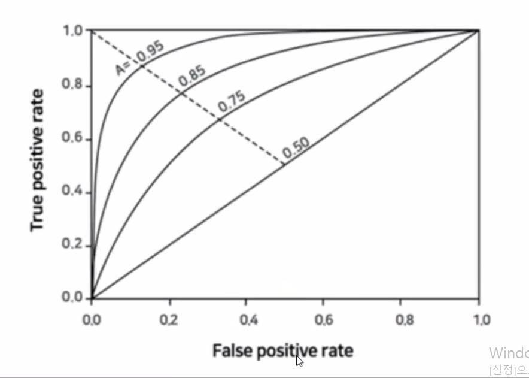

## 🧠리뷰

학습 데이터와 테스트 데이터 세트 분리

- train_test_split() 함수 사용


분리시 문제점 => 과적합

과적합 해결 => 교차검증

교차검증 => k폴드, sk폴드

- k폴드는 k번 만큼 반복 수행
- 이를 개선한 방법인 sk폴드


하이퍼 파라미터 - 머시러닝 알고리즘을 구성, 이를 조정해 알고리즘 예측 성능 개선 가능

그리드 서치 : 하이퍼 파라미터를 순차적으로 변경하면서 최고 성능을 가지는 파라미터 찾는것

- 하이퍼 파라미터 튜닝 지원 클래스
- 최적의 상태를 찾는 하이퍼파라미터

데이터 전처리

- 주요기법 : 데이터정제 / 결합 / 변환, 차원 축소

+) 분류를 위한 학습 예측 프로세스

- 데이트 세트 준비 - 데이터 세트 분리 - 모델 학습 - 예측 수행 - 모델 성능 평가


통계적 가정 기법 만족도를 봐야함

데이터 자체가 한 변수만 가지고 분석하지 않고 다양한 피처를 가지고있는 데이터 셋을 

동시에 보기 때문에 변수마다 가지고있는 범위가 다름 => 같은 기준으로 봐야함 -> 변환

새로운 변수 추가 = > 변환

데이터 분포 대칭형이 아니라 비대칭형 인 경우 => 변환

대칭형이 분석에 더 용이

스케일링 방법론

minmax

stardardscaler 평균 0 표준편차 1

데이터를 같은 잣대로 변환

데이터 인코딩 방식 


각 빈도별 분포를 봐야함

수치를 봐야함

- 수치의 범위를 확인
- 이상치 / 오류 확인
- 변수별로 분포 확인

시각적 확인 

- 시각화 
  - 원 데이터를 탐색해서(쪼개서) 분석
  - 


# 분류 모델 평가 지표

## 모델 성능 평가

### 분류 모델의 평가 지표

예측 대상이 범주형 데이터인 경우

- 정확도 (Accuracy)
- 재현율 (Recall)
- 정밀도 (Precision)
- F1 measure
- G measure
- ROC curve
- AUC


### 회귀 모델의 평가 지표

예측 대상이 수치 데이터인 경우

- MSE (Mean Square Error)
- RMSE (Root Mean Square Error)
- MAE (Mean Absolute Error)
- MAPE (Mean Absolute Percentage Error)
- R<sup>2</sup>


## 분류 모델의 성능 평가 지표

### Accuracy (정확도)

- 실제 데이터와 예측 데이터가 얼마나 같은지를 판단하는 지표
- 직관적으로 모델 예측 성능을 나타내는 평가 지표
- 그러나 이진 분류의 경우 데이터의 구성에 따라 ML모델의 성능을 왜곡할 수 있기 때문에
  - 정확도 수치 하나만 가지고 성능을 평가하지는 않음
- 특히 정확도는 불균형한 레이블 값 분포에서 ML모델의 성능을 판단할 경우, 적합한 자료가 아님


#### 정확도 문제 예

1. 타이타닉 생존자 예측
2. MNIST 데이터 세트


#### MNIST 데이터 세트

- 0~9까지의 숫자 이미지의 픽셀 정보를 가지고 있고
- 


##### 이진 분류 문제로 변환

- 불균형한 데이터 세트로 변형
- 레이블 값이 7인 것만 True, 나머지 값은 모두 False로 변환
- True : 전체 데이터의 10%
- 


### Confustion Matirx(오차 행렬)


1종 오류 2종오류

전체 비중중 옳게 예측한거 보는 것 = 정확도

T<sub>n</sub>, FP, FN, TP는

#### 실행 결과

```sql
array([[405,   0],
       [ 45,   0]], dtype=int64)
```


- 잘못 예측한거 45개 (10%)
- 제대로 예측한거 405개 (90%)


불균형한 이진 분류 모델

많은 데이터 중에서 중점적으로 찾아야 하는 매우 적은 수의 


### 정밀도(Precision)와 재현율(Recall)

#### 정밀도와 재현율 계산 공식

- 정밀도
- 재현율 = T<sub>p</sub> / (F<sub>n</sub> + T<sub>p</sub>)


positive로 예측한거 ⇒ 예측 (Precision)

FP - 스팸메일 케이스 

- 스팸메일함에 들어있지만 스팸메일이 아님
- 포지티브로 잘못 예측한 경우

재현율 Recall - 의료 진단 (코로나 , 암)

- 음성인줄 알았는데 양성
- 실제로는 양성인데 음성으로 판단하면 안된다

정밀도와 재현율은 반비례 관계

- 적절 수준으로 맞추는게 중요


불균형적으로 편중되면 안됨 

정밀도 :

재현율 : 실제값이 포지티브로 예측한거


보통은 재현율이 정밀도보다 상


재현율이 상대적으로 더 중요한 지표인 경우

정밀도가 상대적으로 더 중요한 지표인 경우


재현율과 정밀도의 보완적 관계


MyFakeClassifier의 예측 결과로 정밀도와 재현율 측정

타이타닉 예제로 오차 행렬 및 정밀도, 재현율 구해서 예측 성능 평가

- 사이킷런 API사용
  - 정밀도 계산
  - 재현율 계산
  - 오차행렬

평가 간편 적용하기 위한 함수 작성


### Precision / Recall Trade-off

0.1에 가까워질 수록

재현율 높아짐

정밀도 떨어짐


### F1 Score

- 정밀도와 재현율의 <u>조화평균</u>
- 정밀도와 재현율이 어느 한 쪽으로 치우치지 않는 수치를 나타낼때 상대적으로 높은 값을 가짐


#### 예 : 두 예측 모델 비교

A 예측 모델

- 정밀도 : 0.9


B 예측 모델

역수 취함


b모델의 스코어가 훨씬 크다  = 훨씬 낫다


사이킷런의 F1스코어 API : f1_score()


### G measure


### ROC Curve와 AUC

#### ROC (Reciver Operating Characteristic)

특이성, 민감도 위치로 판단

수신자 판단 곡선

2차 대전 때 통신장비 성능평가를 위해 고안된 척도


- 재현율은 민감도와 같은 위치
- FPR은 0부터 1까지 변경하면서 TPR의 변화값을 구함


민감도 = 6 + 0 /6 = 1





Q1. 

감별사 A: 90/100=0.9

감별사 B: 180/200=0.9

Q2. 

감별사 A:  45/50=0.9

감별사 B: 100/120 = 0.8333

Q3. 

감별사 A:  45/50=0.9

감별사 B: 100/100=1

Q4. 

감별사 A: 45(TP)*100=4500

감별사 B: 100*100 = 10000

Q5. 

감별사 A: 5(FP)*400=2000

감별사 B: 20*400=8000


## 🎈참고

https://hsm-edu.tistory.com/1033


## 📌 정리 (7.23)

타이타닉 데이터 

- 전처리 과정진행
- 문자열 데이터를 수치화
- 수치화 데이터를 문자화
- 데이터의 문자열을 첫번째 열로 변환
- 라벨 인코더
- 데이터 삭제
- 데이터별 분포 확인 후 의미있는 열만 처리
- 데이터를 다룬다 = 손코딩 필수
- 데이터 준비 되면 split해서 교차검증해서 비교
- 여러 esimator방법으로 예측해서 평가
- 교차검증해서 grid searchCV로 최적 파라미터 찾는 과정


모델에 대한 평가

지도학습에서

- 분류 : 범주형

- 회귀 : 수치형
- 분류모델에서 컴퓨전 메트릭스 오차 행렬 이용해서 
  - 4가지 케이스 (이진 분류)
  - 정확도 - 포지티브로 예측한 것들 중에 실제 포지티브인것?
  - 재현율 - 실제로 포지티브인데 포지티브로 예측 했는가?
  - 이 두개를 동시에 고려해야함
  - 여러개의 기준치로 나누어 임계점을 높게 <> 낮게 해서 확인
  - 상호보안위해 제시
  - 기하평균 g
  - 조화평균 f1
  - 정확도를 평균 지표에 표현
- 회귀모델에서 작아질 수록 좋아짐


인수는 모두 동일 (y_test, pred)

정확도의 맹점 이유

- 불균형 
  - 한쪽에 치우쳐진 데이터
- 관심있는 데이터가 작으면 묻혀버림
- 제대로 분류되어있는지 보안 - 크리스션, 리콜


리콜 연관

- 민감도


ROC 

- tpr, spr?
- 전체 포지티브 예측에서~
- 최적 위치 찾기 - 임계점 설정 기준


AUC 

- 종합적으로 제시
- 0.5~1사이로 주어짐
- 1에 가까울수록 좋다
- 0.5보다는 커야함


임계점 값 바꾸면서 정밀도, 리콜 변화


사이킷런 패키지에서 필요로하는 모듈 익숙해지기


평가지표는 matirx에 있음


3일간 2, 3장 공부


당뇨병 예측 실습 - 다음주에 이어서 