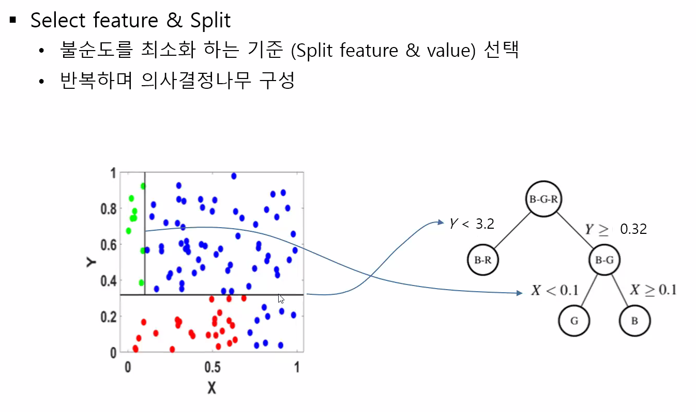

# 결정 트리 Ver01

## 🧠리뷰

정확도

불균형한 데이터 셋 

- 작은 영향력이 드러나지 않아 분류 시 

  정밀도, 재현율과 수치를 같이 비교해야함

  제대로 맞은 건수만 판단


재현율 관점

정밀도 관점

- 상호보완적 
- 적정선 찾기


predic_proba()함수

임곗값 - 기준치 조절


예측 << 분류

데이터 대부분 범주형 => 분류

분류에 좋은 성능을 보여주는 알고리즘

- 이진분류, 사진분류....
- 기본적 개념 이해


## 분류(Classification)

**지도학습**

- 레이블(정답)이 있는 데이터가 주어진 상태에서 학습하는 머신러닝 방식
- 레이블이 수치로 주어짐 ⇒ 회귀
- 레이블이 범주로 주어짐 ⇒ 분류

**분류(Classificaion)**

- 지도학습의 대표적 유형
- 학습 데이터로 주어진 데이터의 피처와 레이블값(결정값, 클래스값)을 머신러닝 알고리즘으로 학습해 모델을 생성하고 생성된 모델에 새로운 값이 주어졌을 때 미지의 레이블 값을 예측하는 것
- 기존 데이터가 어떤 레이블에 속하는지 알고리즘을 통해 패턴을 인지한 뒤 새롭데 관측된 데이터에 대한 레이블을 판별


### 대표적인 분류 알고리즘

- 결정 트리 : 데이터 균일도(불순도)에 따른 규칙 기반
- 나이브 베이즈 : 확률 기반으로 사전-사후 확률 분류 / 베이즈 통계와 생성 모델의 기반
- 로지스틱 회귀 : 독립변수와 종속변수의 선형 관계성
- 서포트 벡터 머신 : 비선형 형태 (선형X) 이용해 분류 / 개별 클래스 간의 최대 분류 마진을 효과적으로 찾음
- 최소 근접 알고리즘
- 신경망 : 심층 연결 기반
- 앙상블 : 여러 머신러닝 알고리즘 결합

 / 정답이 주어지고 이게 기반, 


## 결정 트리(Decision Tree)

분류 + 회귀 분석까지도 가능

### Tree 구조


- Depth = 3
- 이진 트리 형태

노드 

분류된 결과 - 분홍

루트 노드 - 초록

상대적 하위에 있는 노드 - 자식노드 / 부모노드

최하위 노드 - 단말노드, 더이상 나눠지지 않음 - 분홍 

나누어지는 노드 = 자식노드

자신노드의 상위 노드 = 부모노드

하위에 속하는 노드 = sub-tree


### 결정트리에서 중요한 이슈

- 규칙이 많아지면 결정 방식이 복잡해지고 과정합 발생
- 어떻게 트리를 분할할 것인가가 중요
  - 최대한 균일한 데이터 세트를 구성할 수 있도록 분할하는 것이 필요
  - 순도가 높은것 = 불순도를 낮추는 것
  - 불순도는 낮추는 관점에서 데이터를 분할

### 가지치기

특정 노드에서 계속 분할 되다가, 예측 성능이 좋아지지 않는 부분이 오면 가지치기 (예측 정확도를 높이는데 효과가 없을 때) , 일반화 성능

- 특정 노드 밑의 하부 트리를 제거하여 일반화 성능을 높이는 방법
- 깊이가 줄어들고 결과의 개
- 과적합을 막기 위한 방법


### 결정트리의 장단점

#### 장점

- 매우 쉽고 유연하게 적용될 수 있는 알고리즘

#### 단점

- 규칙이 많아지면 결정 방식이 복잡해지고 과적합(overfit)발생


### 결정트리 알고리즘 성능


### 균일도


균일도를 높이는 것

불순도는 낮추는 것


#### 엔트로피

- 데이터 분

#### 정보 이득 지수

- 1 - 엔트로피 지수
  - 얼마나 순도가 높아졌는지

#### 지니 계수

- 불평등도
  - 평등 = 0
- 결정 트리 에서는 최대치 0.5

#### 결정 트리 알고리즘에서 지니 계수 이용

지니 계수를 기반으로 데이터 셋 분류

- 기본적으로 지니 계수를 이용해서 데이터 세트 분할
- 데이터 세트를 분할하거나 가장 좋은 조건
  - 정보 이득이 높거나 지니 계수가 낮은 조건


- p값에 따라 그래프 변화
- 평균에 대해서 말하는 것 => 분산을 최소화 , 데이터 분할
- 분산 : 데이터 평균으로부터의 거리 개념
  - 얼마나 퍼져 있는지?
  - 같은 데이터값끼리 있으면 분산은 거의 0에 가까움
  - 분산이 작아지는 방향으로 회귀 분류에서는 사용된다
  - 분산을 분할의 지표로 사용
- 불순도 측정 수식으로 이해
- 0에 가까울 수록 순도에 가까움 = 같은 클래스의 데이터끼리 모여 있다


### 결정 트리 알고리즘에서 분류를 결정하는 과정


### 사이킷런의 결정트리 알고리즘 클래스

- ㅇ


### 💻실습

#### 결정 트리 모델의 시각화

#### 붓꽃 데이터 세트에 결정 트리 적용 및 시각화

DecisionTreeClassifier 이용해 학습한 뒤 규칙 트리 시각화

##### export_graphviz()함수

sklearn.tree 모듈은 Graphviz를 이용하기 위한 export_graphviz()함수 제공

```sql
from sklearn.tree import export_graphviz

export_graphviz(dt_clf, 
                out_file = 'tree.dot', 
                class_names = iris_data.target_names, 
                feature_names = iris_data.feature_names, 
                impurity = True, 
                filled = True)
```

매개변수
- 학습이 완료된 estimator 
    - dt_clf = DecisionTreeClassifier
- output 파일명
    - out_file = 'tree.dot'
    - export_graphviz()의 호출 결과로 out_file로 지정된 tree.dot파일을 생성함
- 결정 클래스 명칭
    - class_names = iris_data.target_names
- 피처 이름
    - feature_names = iris_data.feature_names
- impurity = True 
    - 각 노드에 불순도 표시 (Gini계수, 디폴트 : True) 
- filled = True 
    - 노드 색상 표시 (디폴트 : False)

**생성된 dot파일 출력 방법 2가지**
1. Graphviz 시각화 툴 사용 : .dot 파일 읽어서 출력
2. 이미지 파일로 변환해서 저장 후 출력


##### 실행 결과


### 결정 트리 과적합


### 결정 트리 실습


## 🎈참조 Decision Tree


초록 / 파랑 / 빨강 데이터 분류

더 불순도를 낮출 수 있는 기준 선택 (X축 점선 or Y축 점선 = 기준)


Y값 기준으로 나누어짐 X값 기준으로

분류 규칙 - 균일도 계산



ㅇ


균일도 = 반대 순도


- 불순도가 0에 가까울수록 좋음
  - 왼쪽이 오른쪽보다 좋음


불순도 = 0.4278


- 같은 순도의 엔트로피 = 0

나아진 정도 


가지치기


예시


지니계수 이용 예시


- 0 = 2개 (2/5)
- 1= 3개 (3/5)

- 지니 계수 = 0.48

- X1, X2 모두 범주형 데이터

성별에 따라 분리 (X1)


학력에 따라 분리 (X2)


정리

- 학력 기준이 훨씬 큼 (약 0.2)


과적합


2번이 더 데이터 적합

- 1번이 과소
- 2번 너무 흔들리는거 과대


정지규칙 3가지 꼭 기억 


수직 방면으로 분류 경계면


데이터가 2차 

mse : 회귀에서의 지표 

- 원래 값 - 예측 값 차이, 잔차
- mse 줄이는것 = 좋은것 = 예측을 잘하는 것


