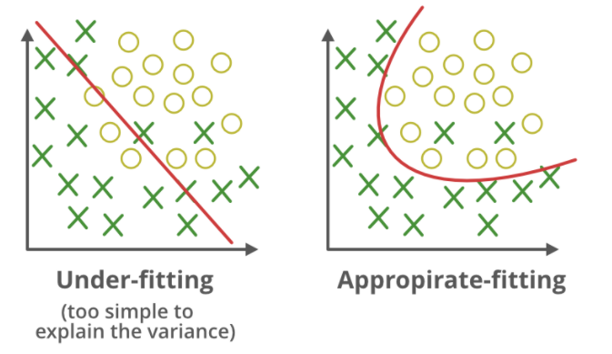
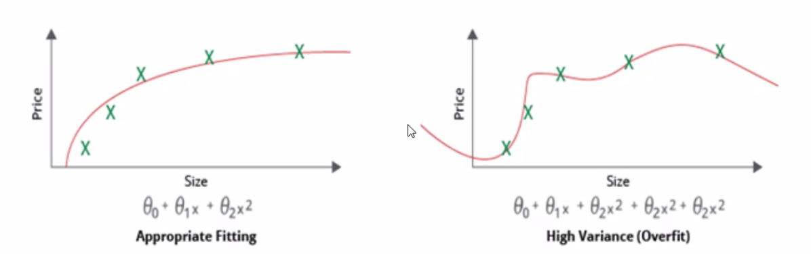
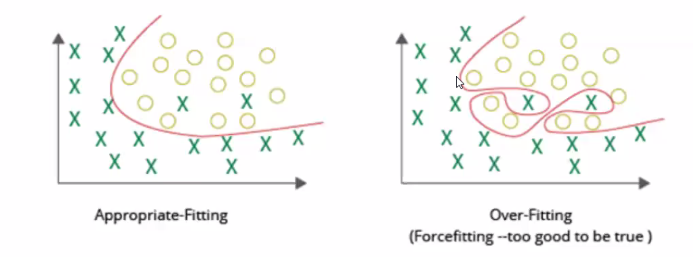
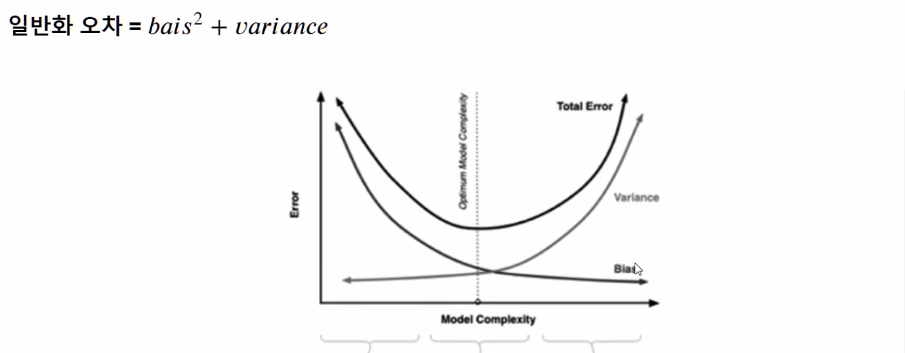
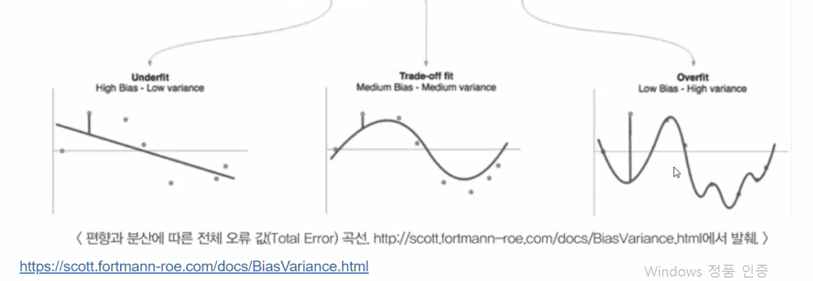

# XGBoost (eXtra Gradient Boost)

## 🧠리뷰

여러 알고리즘 쓰는 것 - 앙상블

4가지 방법 

- 배깅 : 한 알고리즘으로 여러 샘플로 나눠서 적용
  - 랜덤 포레스트 
    - 숲 : 나무마다 데이터 적용했을때 예측 결과를 반영
- 부스팅
- 보팅 : 여러 알고리즘을 한 데이터에 적용 
- 스태킹

배깅 vs 부스팅

- 부스팅은 첫번째 분류기에서의 잘못 예측 결과된 데이터셋 결과(가중치)를 주어 다음 데이터 셋에 반영 반복, 순차적 진행
  - 분류를 더 잘함 (예측 좋음)
  - 앞의 반영 결과를 받아서 하기때문에 시간이 오래걸림
- 배깅은 동시에 데이터 셋을 싹 교정해서 동시에 매치 , 결과 얻어냄

GBM

- 단점 보완한 것 - XGBoost

## XGBoost 개요

트리 기반의 앙상블 학습에서 가장 각광받고 있는 알고리즘 중 하나

압도적인 수치의 차이는 아니지만, 분류에 있어서 일반적으로 다른 머신러닝보다 뛰어난 예측 성능을 나타냄

GBM에 기반하지만, GBM의 단점인 느린 수행 시간 및 과적합 규제 부재 등의 문제 해결

- GBM 경사하강법을 이용한 부스터

특히 병렬 CPU환경에서 병렬 학습이 가능해 기존 GBM보다 빠르게 학습 완료

## XGBoost의 장점

- 뛰어난 예측 성능
- GBM 대비 빠른 수행 시간
- 과적합 규제
- 가지치기 
- 교차 검증 내장
- 결손 값 자체 처리

뛰어난 예측 성능

- 일반적으로 분류와 회귀 영역에서 뛰어난 예측 성능 발휘

GBM 대비  빠른 수행 시간

- 일반적인 GBM은 순차적으로 weak learner가 가중치를 증감하는 방식으로 학습하기 때문에 전반적으로 속도가 느림

- XGBoost

과적합 규제

- 

가지치기

- max_depth파라미터로 분할 깊이 조정

결손값 자체 처리

- 결측값 자체 처리 기능 포함

## XGBoost 라이브러리 

1️⃣ XGBoost는 처음에 C/C++로 작성되었음

2️⃣ 파이썬에서도 XGBoost를 구동할 수 있도록 파이썬 패키지 `xgboost`제공

- 패키지 역할 : 대부분 C/C++ 핵심 라이브러리를 호출하는 것
- 사이킷런과 호환되지 않는 독자적인 XGBoost전용 패키지
- 따라서 사이킷런의 fit(), predict() 메서드 같은 사이킷런 고유 아키텍처 적용 불가
- 다양한 유틸리티 (cross_val_score, GridSearchCV, Pipeline등)도 사용 불가
- `파이썬 래퍼 XGBoost 모듈`로 지칭

3️⃣ 파이썬 기반의 ML이용자들이 사이킷런을 많이 사용하기 때문에 사이킷런과 연동할 수 있는 래퍼 클래스 제공 모듈

- `XGBClassifier`와 `XGBRegressor` 래퍼 클래스
- 사이킷런 estimator가 학습을 위해 사용하는 fit()과 predict() 등
- 표준 사이킷런 개발 프로세스 및 다양한 유틸리티 활용 가능
- `사이킷런 래퍼 XGBoost 모듈`로 지칭

### 파이썬 래퍼 XGBoost모듈 과 사이킷런 래퍼 XGBoost모듈 차이점

### 하이퍼파라미터 튜닝

- 뛰어난 알고리즘일수록 파라미터 튜닝 필요 적음
- 파라미터 튜닝에 들이는 공수 대비 성능 향상 효과가 높지 않을 경우가 대부분임

### 과적합 문제가 심각한 경우 XGBoost에서 하이퍼 파라미터 튜닝

## XGBoost설치

conda install -c anaconda py-xgboost

## 파이썬 래퍼 XGBoost 하이퍼파라미터

1️⃣ 일반 파라미터

2️⃣ 부스터 파라미터

3️⃣ 학습 태스크 파라미터

대부분의 하이퍼 파라미터는 Booster 파라미터에 속한다.

### 주요 일반 파라미터

- booster
- silent
- nthread

### 주요 부스터 파라미터

- eta
- num_boost_rounds
- min_child_weight
- gamma
- max_depth
- sub_sample
- colsample_bytree
- lambda
- alpha
- scale_pos_weight

### 학습 태스크 파라미터

- objective : 손실함수를 정의
  - 손실함수 = 오차 줄이는 함수
- binary:logistic
- multi:softmax
- multi:softprob
- eval_metric
  - rmse
  - mae
  - logloss
  - error
  - merror
  - mlogloss
  - auc

### 과적합 문제가 심각할 경우 파이썬 래퍼 XGBoost의 조정할 하이퍼 파라미터들

- eta값을 낮춤

## 사이킷런 래퍼 XGBoost

하이퍼 파라미터 이름의 차이점 

- 기능은 비슷

## 💻실습. 위스콘신 유방암 예측

## 🎈참조 - 사이킷런

https://scikit-learn.org/stable/

데이터 전처리, 하이퍼파라미터

## 🎈 참고 - ML16 다항회귀 과대적합 과소적합

### 학습오류, 일반화 오류, 예측 오류

- 학습 오류 : 학습 데이터를 사용하여 모델을 생성하고 측정한 오류
- 일반화 오류 : 기본 데이터 분포에서 새로운 데이터를 추출, 모델에 적용할 때 예상되는 오류
- 예측 오류 : 테스트 데이터를 모델에 적용하여 측정한 오류로, 일반화 오류의 추정에 사용

**✔ Machine Learning은 학습 오류와 일반화 오류 사이의 격차를 최소화 하는 것을 목표**

### 편향 - 분산 트레이드오프

편향

- 예측값과 정답이 얼마나 다른가
- 데이터 내에 있는 모든 정보를 고려하지 않음으로 인해, 지속적으로 

분산

- 10점에 모여있음 = 편의가 적다
- 분산은 크기만 편향은 적다 = 편의가 나쁘지 않음
- 분산은 작고 편향이 높다
  - 예측 결과값이 정답과 굉장히 많이 떨어져 있음
- 목표 떨어짐
  - 실력이 제일 떨어짐

### 과소적합과 과대적합

#### 과소적합

주어진 입력 데이터에 비하여 모델의 복잡도가 너무 낮아 입력 데이터로부터 충분히 학습하지 못하는 상황

#### 과대적합

주어진 입력 데이터에 비하여 모델의 복잡도가 너무 높아 입력 데이터의 잡음까지 fitting

#### 과소적합(Underfitting)에 대한 대응

- 학습 시간을 늘린다 
  - Deep Learning이나 Auto-pararmeter Tuning경우
- 더 복잡한 모델을 구성한다
- 모델에 추가 Feature를 도입한다
- Regularization을 사용하지 않거나 영향을 줄인다
- 모델을 다시 구축한다

#### 과대적합(Overfitting)에 대한 대응

- 학습을 더 일찍 멈추게 한다
- 

일반화 오차

모델 복잡도가 높아지면, 새로운 데이터 셋이 들어올 때

- 분산이 커진다.

교차되는 지점의 모델 복잡도를 갖는 모델을 써야한다.

분산과 편향 값의 크기를 더한것 = Total Error

- 일반화 오차
  - 새로운 데이터 셋을 모델에 학습했을 때 오차
- 분산은 항상 양의 값

일반화 오차를 줄이는 것이 무척 중요

- 머신러닝의 목표

