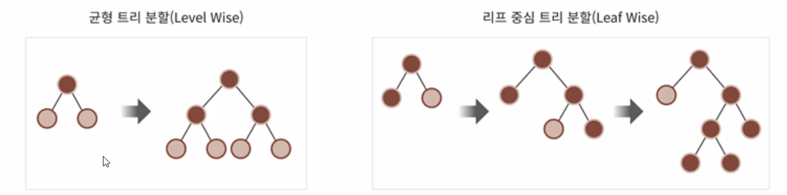
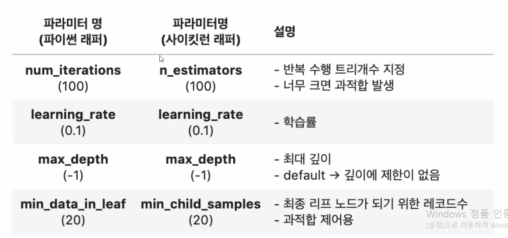
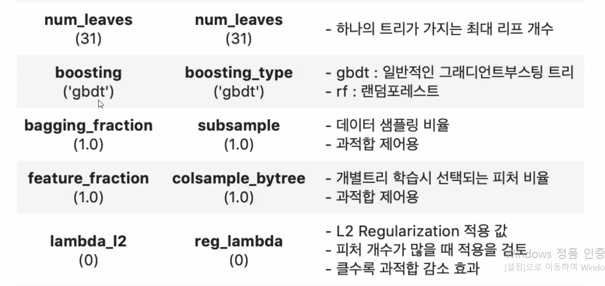
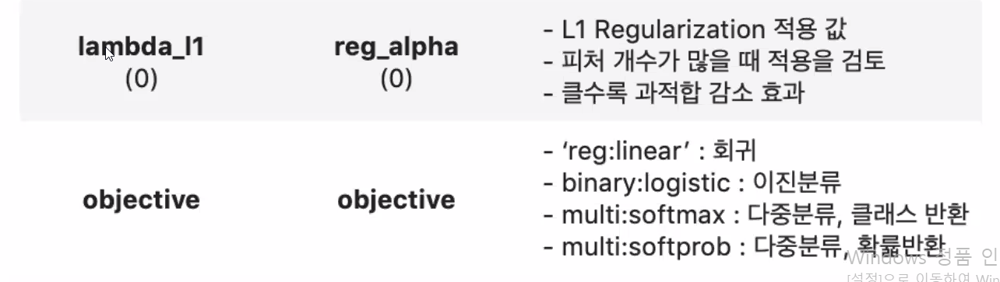
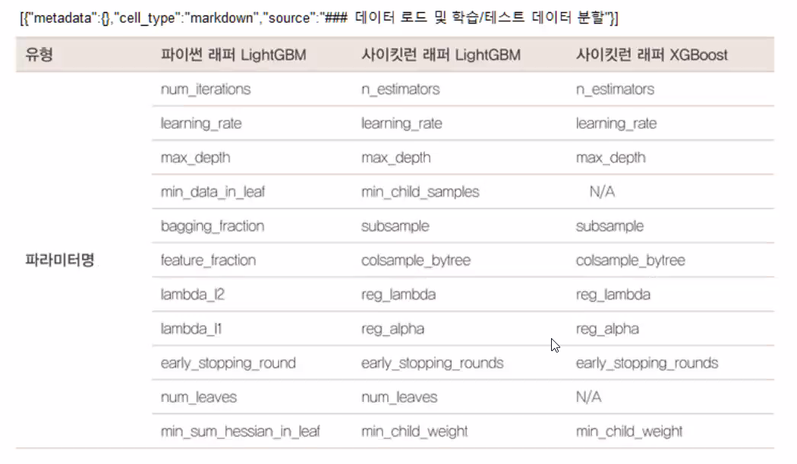

# LightGBM

- XGBoost와 부스팅 계열 알고리즘에서 가장 각광을 받고 있음
- XGBoost 보다 학습에 걸리는 시간이 훨씬 적음

## LightGBM 장점

- XGBoost 대비 더 빠른 학습과 예측 수행 시간
- 더 작은 메모리 사용량
- 카테고리형 피처의 자동 변환과 최적 분할
  - 원-핫 인코딩 등을 사용하지 않고도 카테고리형 피처를 최적으로 변환하고 이에 따른 노드 분할 수행

## LightGBM 단점

- 적은 데이터 세트에 적용할 경우 과적합이 발생하기 쉬움
- 공식 문서상 대략 10,000건 이하의 데이터 세트

## 기본 GBM과의 차이점

사이킷런의 Estimator를 상속받아 fit(), predict() 기반의 학습과 예측, 사이킷런의 다양한 유틸리티 활용 가능

## LightGBM 설치

`conda install -c conda-forge lightgbm`

Visual Studio 2019용 Build Tools

https://visualstudio.microsoft.com/ko/downloads/#build-tools-for-visual-studio-2019

LightGBM 하이퍼 파라미터

하이퍼 파라미터 튜닝 방안

[방안1] num_leaves개수를 중심으로

[방안2] learning_rate를 작게 하면서

[방안3]

[방안4]

파이썬 래퍼 LightGBM과 사이킷런 래퍼 XGBoost, LightGBM 하이퍼 파라미터 비교

💻실습. LightGBM 적용한 위스콘신 유방암 예측

