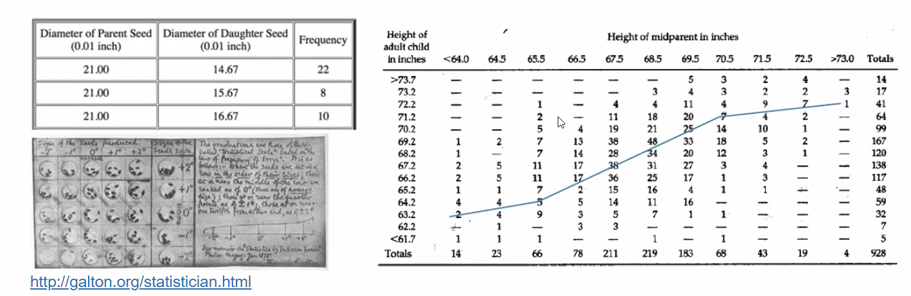
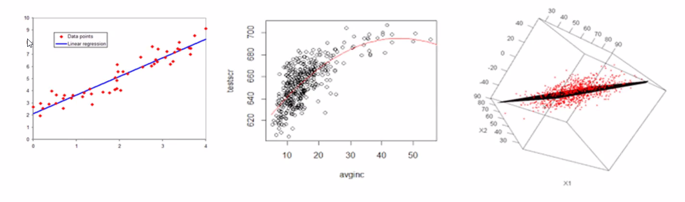
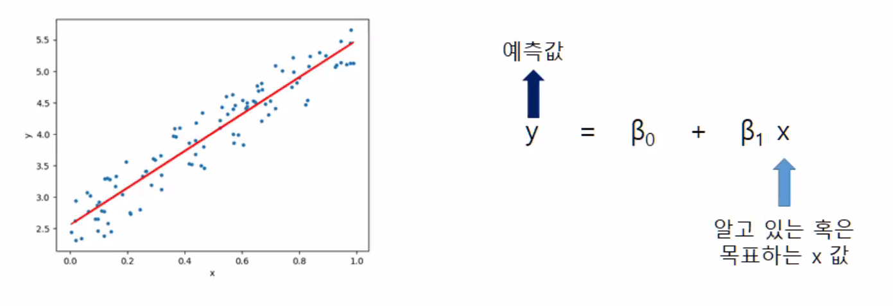
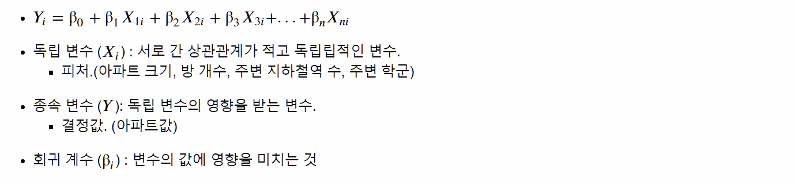
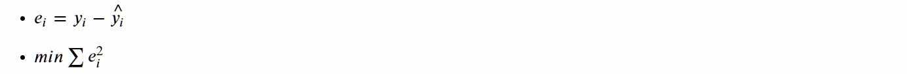
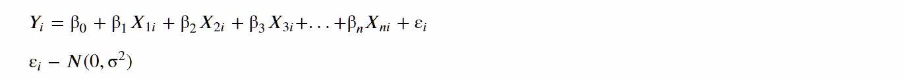
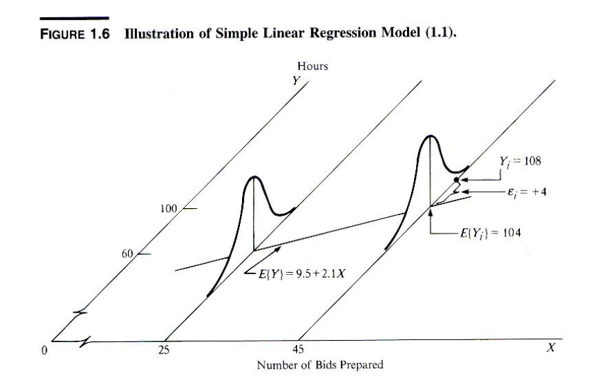

# 회귀

## 회귀분석 소개

회귀 : 분류와 더불어 지도학습의 가장 큰 축 중의 하나

- 현대 통계학을 이루는 주요 기능 중 하나
- 경제

## 회귀

평균으로의 회귀

부모 키와 자녀 키의 관계 연구

- **중심으로 회귀**하려는 경향
- **회귀분석**이라 명명

Karl Pearson(1903)

- Galton의 아이디어를 수리적 모형화 및 추정 방법 제안
- OLS (Ordinary Least Square, 최소제곱법)
- 1078명 아버지와 아들의 키 데이터 활용
  - Son_H = 33.79 + 0.516 * F_H

### 분류와 회귀 차이점 

분류와 회귀 차이점 **: 결과값의 차이**

분류 : category 반환

### 회귀모델 유형

- 선형 / 비선형 : 회귀 계수 결합에 따라

- 단순 / 다중 : <u>독립변수</u> 개수에 따라

#### OLS 회귀분석 종류 

##### 선형회귀에 들어감

단순회귀 분석

- 하나의 독립변수로 하나의 종속변수를 설명하는 모형
- 예 : 아버지의 키로 한 자녀의 키를 설명하는 경우

다중회귀 분석

- 두 개 이상의 독립변수로 하나의 종속변수를 설명하는 모형
- 예 : 아버지와 어머니의 키로 한 자녀의 키를 설명

다항회귀 분석

- 독립변수와 종속변수의 관계를 2차 이상의 함수로 설명
- 예 : 2차 함수관계 → 독립변수 = (x, x2) → 독립변수 간의 종속성에 주의

다변량회귀 분석

- 두 개 이상의 종속변수를 사용하는 모형
- 예 : 아버지와 어머니의 키로 두 자녀의 키를 설명하는 경우

1. 선형 회귀

2. 

3. 다중 회귀

### 선형 회귀(Linear Regression)

#### 목적

여러 개의 독립 변수와 한 개의 종속변수 간의 상관관계를 모델링하는 기법

실제 값과 예측값의 차이를 최소화하는 직선형 회귀선을 최적화하는 방식

: 오차의 제곱합

선형회귀 분석의 주요 가정

- 선형성
- 정규성
- 등분산성
- 독립성

