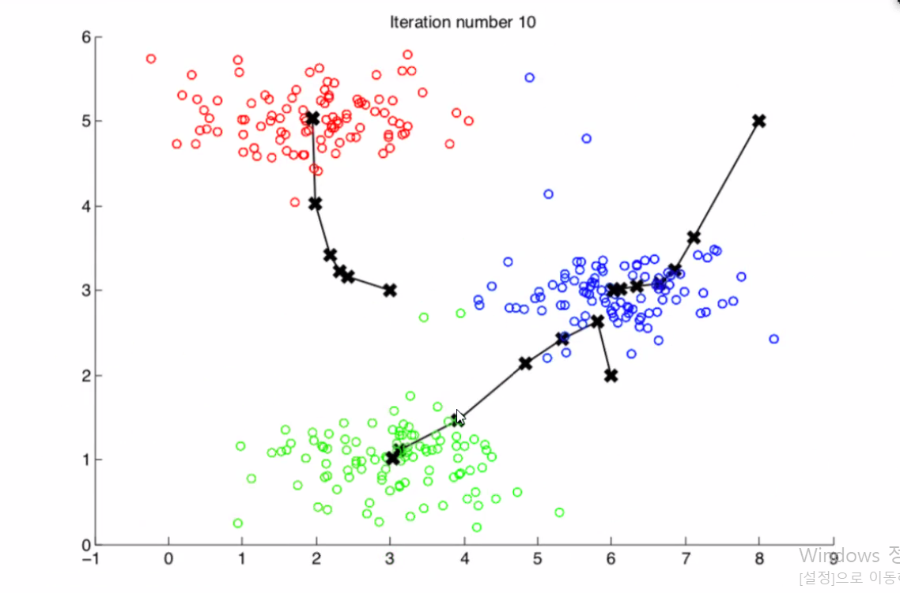
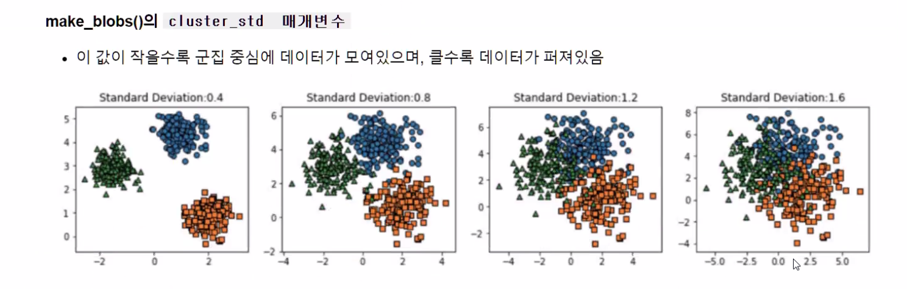
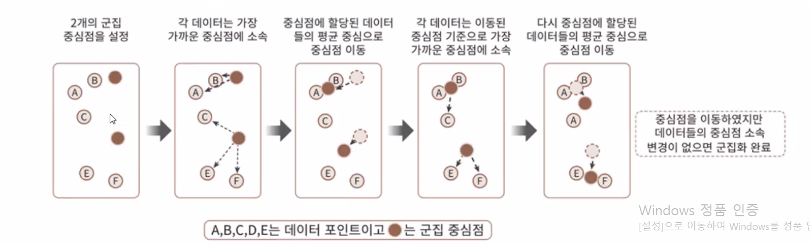
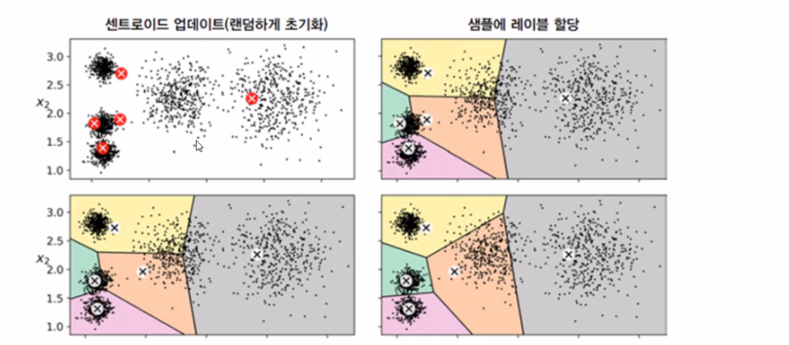
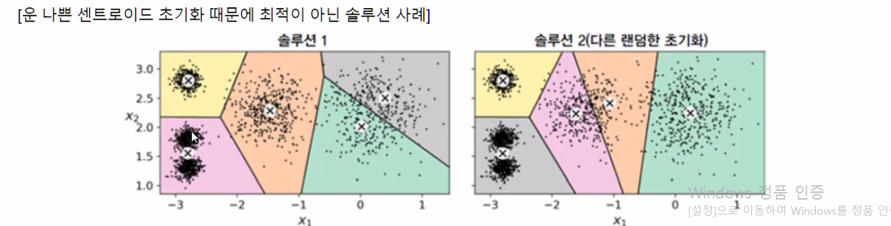
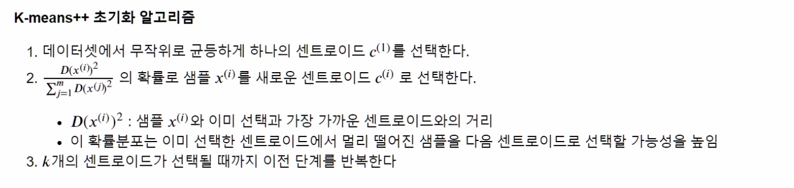
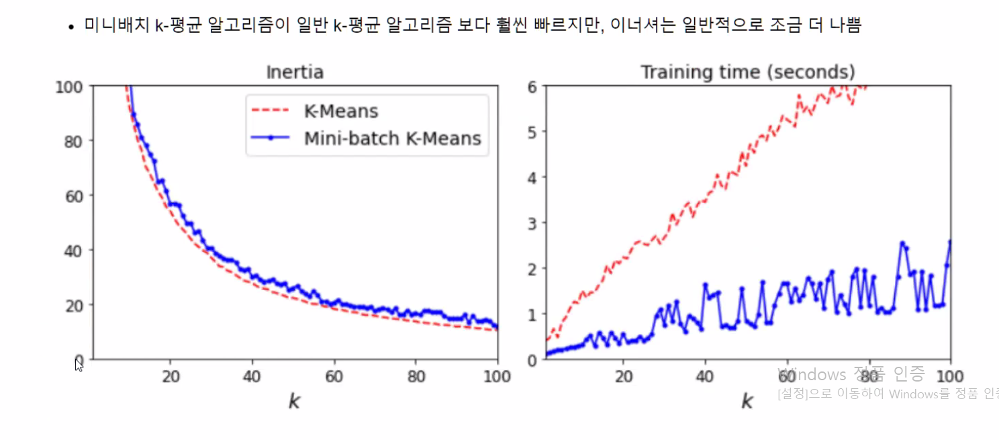
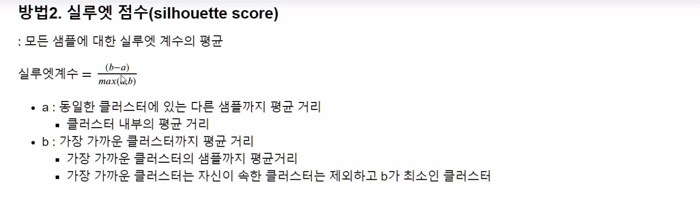
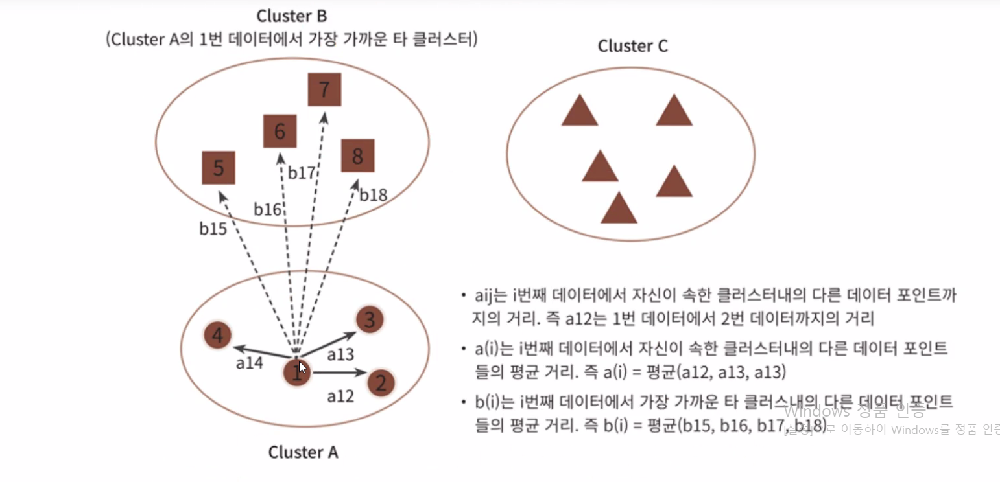

# K-평균 알고리즘 이해 

# 02 군집평가

## 비지도 학습

입력 특성 X는 있으나 레이블 y는 없는 데이터

**비지도 학습을 사용하는 이유**

- 알려지지 않은 모든 종류의 패턴을 찾으려는 시도

### 비지도 학습 알고리즘

#### 군집(Clustering)

- 비슷한 샘플을 클러스터(cluster)로 모음
- 데이터 분석, 고객 분류, 추천 시스템, 검색 엔진, 이미지 분할, 준지도 학습, 차원축소 등에 사용

#### 이상치 탐지 (outlier detection)

- '비정상' 데이터 감지
- 결함 제품 감지, 시계열 분석에서 새로운 트렌드 탐색

#### 밀도 추정 (density estimation)

- 데이터 셋 생성 확률 과정 (random process)의 확률밀도함수(Probability Density Function) 추정
- 이상치 탐지
  - 밀도가 매우 낮은 영역에 놓인 샘플이 이상치일 가능성이 높음
- 데이터 분석과 시각화

## 군집 (clustering)

- 비슷한 샘플을 구별해 하나의 클러스터 또는 비슷한 샘플의 그룹으로 할당하는 작업
- 비지도 학습

### 💻실습 iris dataset

 

### 군집을 사용하는 어플리케이션

고객분류

데이터 분석

차원축소

이상치 탐지

준지도 학습

검색엔진

이미지 분할

## K-평균

몇번의 반복으로 데이터셋을 빠르고 효율적으로 클러스터로 묶는 알고리즘

1957년 Bell Lab. 스튜어트 로이드가 펄스부호 변조 기법으로 제안

- 1982년 외부에 공개

1965년 에드워드 포지도 동일한 알고리즘 발표

k-평균을 로이드-포지 알고리즘이라 부름

- 3개의 그룹으로 구성

### 군집화 알고리즘 테스트를 위한 데이터 생성

## 사이킷런의 군집 알고리즘 클래스 KMeans

**sklearn.cluster의 KMeans**

### K-평균 군집화 알고리즘

군집의 중심이 되는 k개 seed점들을 선택하여 이 seed와 가까운 개체들을 그룹화하는 방법

#### 알고리즘

1. k개 중심점(centroid)을 임의로 배치
   - 무작위로 k개 샘플을 선택하여 중심점으로 결정
2. 모든 자료와 k개의 중심점과 거리를 계산하여 가장 가까운 중심점의 군집으로 할당
3. 군집의 중심을 구한다 (평균을 구한다)
4. 정지 규칙에 이를 때까지 2~3단계를 반복한다
   - 군집의 변화가 없을 때
   - 중심점의 이동이 임계값 이하일 때

- 중심점 조절
- 세번만에 최적으로 보이는 클래스터에 도달함

## K-평균 장점과 단점

k정하는것이 중요

#### 장점

#### 단점

### 센트로이드 초기화

센트로이드 초기화에 따라 알고리즘 수렴의 최적화를 보장하지 못할 수 있다

### 센트로이드 초기화 방법

센트로이드 위치를 근사하게 알 수 있다면 최적의 솔루션을 반환할 수 있다

#### 방법1

#### 방법2

## K-means++ 알고리즘

- 최적의 솔루션을 찾기 위한 실행 알고리즘

비지도 군집 k-mean 

사이킷런

make_blobs 9() 3개

- 5짜리

중심점 잡는것이 중요

- 중심점 잡는데
- 임의의 점
- 랜덤
- k-means ++ 알고리즘으로 적용

각각의 클러스터들 성능을 이너셔 

- 음수값은 score메소드로 출력

센터정보는 cluster_contes_속성

군집분석시 자주 사용되는 인스턴스(속성) 기억해두기

### **K-평균 속도 개선과 미니배치 K-평균**
- Kmeans알고리즘 속도 개선
- 미니배치를 사용한 K-평균

