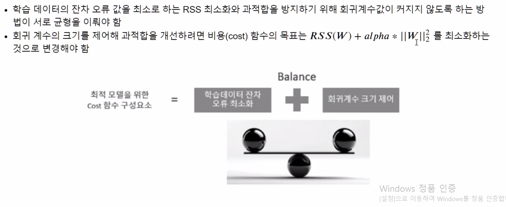
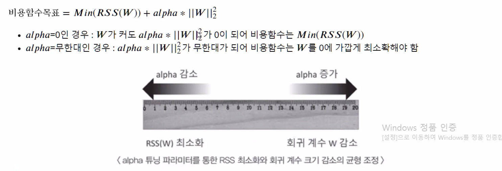
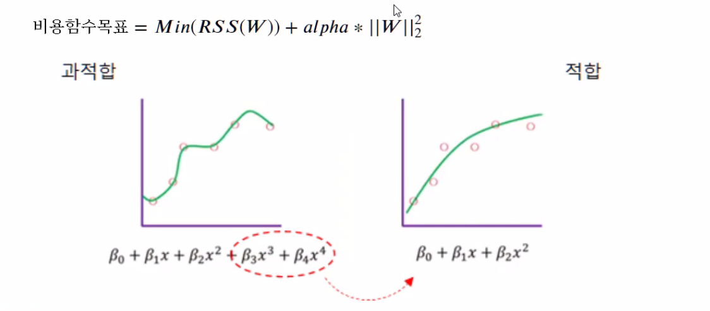
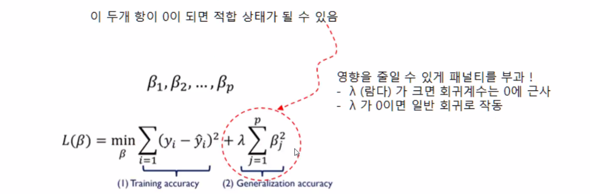
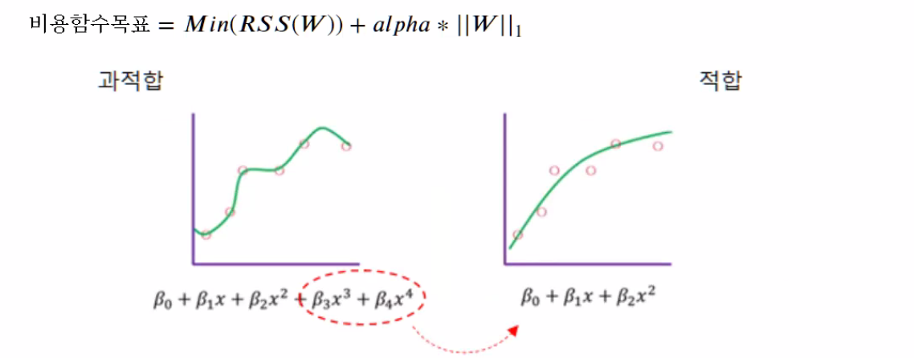
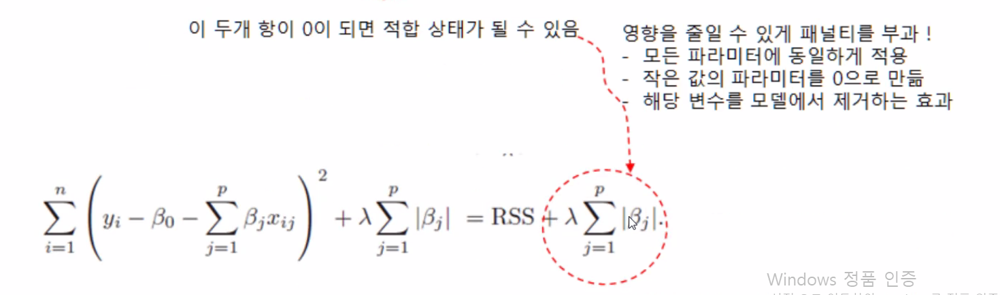
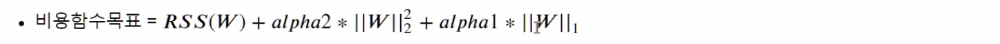
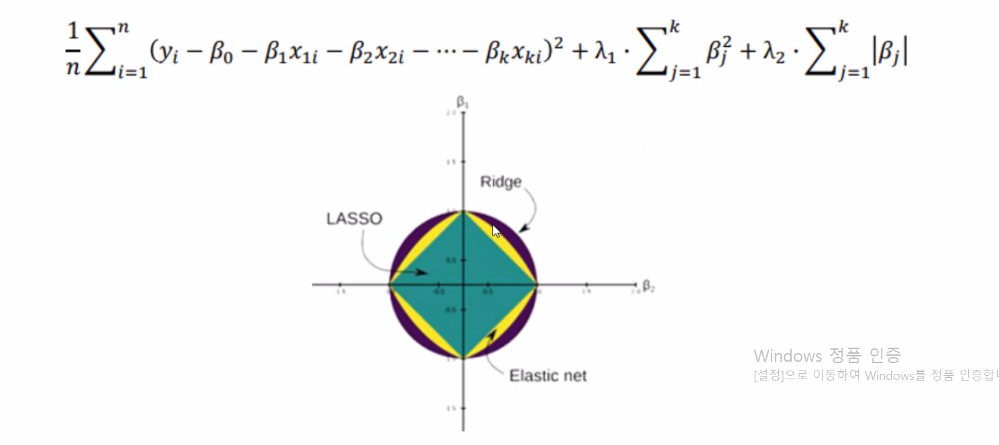
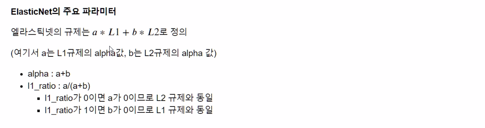

# 규제선형모델

## 규제 선형 모델의 개요

## 릿지 회귀

### 릿지 회귀의 특징

- 변수 간 상관관계가 높은 상황(다중공선성)에서 좋은 예측 성능
- 회귀계수의 크기가 큰 변수를 우선적으로 줄이는 경향이 있음
- 변수 선택 불가능
- 제약범위가 원의 형탠

**사이킷런에서 릿지회귀 클래스 `Rdige`**

## 라쏘 회귀

### 라쏘 회귀의 특징

- 제약 범위가 각진 형태
- 회귀 계수 일부가 0이 되어 변수 선택 기법으로 활용
- 변수 간 상관관계 높은 상황엣 Ridge에 비해 상대적으로 예측 성능이 떨어짐

### 라쏘 회귀를 위한 클래스

### 라쏘회귀와 릿지회귀

## 엘라스틱넷 회귀

- <u>수행시간이 오래 걸리는 단점</u>이 있음

- L1과 L2 규제를 결합한 회귀
- 

## 선형 회귀 모델을 위한 데이터 변환

- 

1. StandardScaler 클래스
   - 값 차이가 많을 때 같은 비중으로
2. MinMaxSclaer 클래스
3. 스케일링/정규화를 수행한 데이터 세트에 다시 다항특성을 적용하여 변환
   - 스케일링/정규화를 했으나 예측 성능에 향상이 없는 경우
4. 비대칭분포(오른쪽으로 꼬리가 긴 분포)의 경우 로그 변환