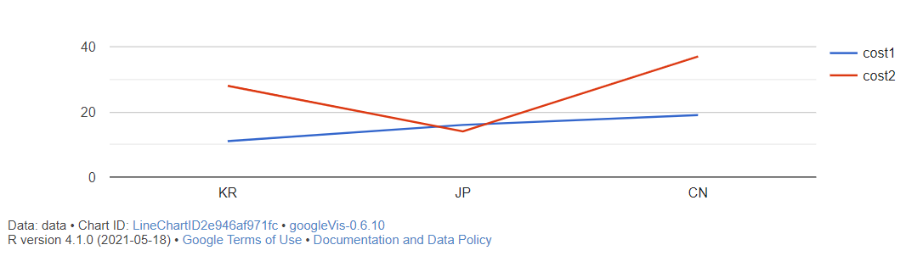

# why? BIGDATA & what? R프로그램


## 과정 소개

data의 중요성이 점차 커지고 있다.

4차 산업혁명의 시대에 인공지능, 사물인터넷, 바이오기술, 가상현실, 증강현실, 드론, 블록체인 등 여러 기술과 페러다임 중심에 빅데이터 분석 기술이 있다.

데이터의 중요성은 현 새대에 매우 중요하게 인식 되고 있다. 데이터를 효과적으로 이용하고 응용하는 것은 매우 경쟁력을 상승 시키는 효과를 가져올 수 있으며, 큰 자산으로써의 역할을 할 수 있다. 공공데이터 개방, IT운영과 발전으로 생산된 많은 정형, 반정형, 비정형의 데이터를 개방하고 있다. 

과거에는 IT기술이 효과적인 알고리즘 개발과 디자인에 있었다고 한다면, 현시대에는 발전된 IT알고리즘과 하드웨어 기술로 데이터를 분석하여 각 분야에서 많은 데이터를 바탕으로 기술 고도화와 인사이트들을 창출하고 있다.

최근 IT전문가 또는 비전문가가 데이터를 활용할 수 있는 도구로 R프로그래밍이 주목되고 있으며, 본 과정에서는 big data의 기본 개념을 알아보고, R프로그래밍을 활용한 기본 분석 기법을 학습한다. 설치 밎 예제를 활용한 실습으로 공공데이터의 활용방법, data의 표현 방법, text처리 방법, 지도 정보의 응용 등 예제를 바탕으로 주요 기법을 익힐 수 있다. 또한, 개인 PC에서 직접 R을 설치하고, 기본 명령어와 핵심 기능을 살펴보는 과정으로 Data분석가의 첫 시작 과정이다.


## 용어

data warehouse(DW) 

- 사용자의 의사 결정을 도와주기 위해, 기간 시스템의 데이터베이스에 축적된 데이터를 공통의 형식으로 변환해서 관리하는 데이터베이스

- 급증하는 **다량의 데이터**를 효과적으로 분석하여 정보화하고 이를 **여러 계층의 사용자들이 효율적으로 사용**할 수 있도록 한 **데이터베이스**.

빅데이터 : 막대한 양의 정형 또는 비정형 데이터 집합

정형 : 비형형 비율 : 약 4 : 6

구글이 많은 데이터를 디지털화 한 이유?

- 휴면 + 컴퓨터(인공지능) 위해

비정형 데이터 저장고?

- 클라우드
- 데이터 센터 

AWS (아마존 웹 서비스)

- 클라우드 시장에서 필요한 것

- 아마존 웹 서비스는 아마존닷컴의 클라우드 컴퓨팅 사업부다. 아마존 웹 서비스는 다른 웹 사이트나 클라이언트측 응용 프로그램에 대해 온라인 서비스를 제공하고 있다.

메타버스 : 가상 공간

- 초월이란 의미를 가진 메타(meta)와 현실세계를 뜻하는 ‘유니버스(universe)’를 합성한 용어로서, 기존의 가상현실보다 확장된 개념으로 주목받고 있다.

클라우드

- 많은 데이터 저장
- IoT
- 사람들의 기억장치 (집단지성)
- 모든 데이터가 디지털화 되서 저장되는 것


## 데이터

물품 결제시 정보 소유자는? 

- 카드 회사 데이터 : 금액만 앎, 물품 정보 모름
- 마트 데이터 : 금액, 물품을 알 수 있음

스마트폰의 출현

- 스마트폰, IT기술의 발달로 환경요인에 따라 수많은 데이터 발생

데이터란?

- 현존하는 현찰(cash)보다도 중요한 것
- 미래에 데이터 많이 확보한 기업 / 개인 / 국가가 초일류가 될 것

개인정보 규제

- 데이터 보호

메타버스와 클라우드가 어떤 연관성이 있나요?

- vr환경에서 클라우드 데이터 사용은 필수적이다.


## 차례

**4차 산업 혁명의 현 주소**

0. 4차 산업혁명의 패러다임 변화 

1. 아날로그 시대와 디지털 시대의 특성

**빅데이터 개요 및 소개**

2. 빅데이터의 중요성
3. 빅데이터 활용을 위한 3대 요소

**빅데이터 활용사례 소개**

4. 실 사용사례 소개
5. 빅데이터의 오해와 진실
6. 분석 적용 사례
7. 정부 3.0

**Data Science**

1. Gartner가 선정한 10대 전략 기술
2. 미래의 기술
3. Data Scientist가 되기 위해서는..
4. Seven Process
5. Analytics

**R Programming**

1. R소개
2. 빅데이터 infra structure

**간편 분석도구 구축 및 사용법**

1. R 설치
2. R Studio 설치
3. R 기본 사용 방법

**공공 빅데이터 수집, 활용 실습**

4. Data Mining 소개(지하철 노선도 표시)

**엑셀보다 쉬운 분석 기법**

5. googleVis package를 사용한 시각화 (서울 온도 표시)
6. ggmap을 사용한 시각화 (놀이동산 분포도)

**분석기법 사용 실습**

7. 빅데이터 분석(1) - wordcloud를 활용한 분석
8. R 기본문법 (R 기본 문법 설명)
9. R packages

**공공 데이터 업무적용 실습1**

10. 빅데이터 분석(2) Correlation Analysis (상관 분석)
11. 빅데이터 분석(3) Preprocessing & Classification
12. 빅데이터 분석(4) Association Rule (연관 규칙)
13. 빅데이터 분석(5) Clustering Analysis (군집 분석)
14. 빅데이터 분석(6) 네이버 영화평 자동 크롤링
15. R 관련 site


## 4차 산업 혁명의 현 주소

### 0. 4차 산업혁명의 패러다임 변화

CONNECTIVITY

**4차 산업 혁명?** 

"디지털 혁명인 3차 산업혁명에 기반을 두고 있으며 디지털, 물리적, 생물학적인 기존 영역의 경계가 사라지면서 융합되는 기술적 혁명"

1차 산업 혁명 : 18세기 증기기관 / 기계화

2차 산업 혁명 : 19세기 전기 사용 / 대량 생산

3차 산업 혁명 : 20세기 컴퓨터 발명 / 정보화, 자동화

4차 산업 혁명 : 21세기 산업의 융복합 / AI, IoT, Bio


### 1. 아날로그 시대와 디지털 시대의 특성

4차 산업 혁명의 허 와 실

**4차 산억 혁명의 허** 

- 3D printer (모든 가정과 공장에 3D printer를 이용한 제조업의 혁명)
- 드론 (드론의 활성화로 일상 생활에 편의성 제공)
- MOOC (Massive Open Online Course, Online 교육)
- Wearable Device (착용하는 device의 대중화)
- 스마트카 (자율주행 자동차)

**4차 산업 혁명의 실**

- 인공지능 (기계학습의 진화로 기대 이상의 발전)
- 의료산업
- 신약개발
- 우주산업
- 블록체인 (중앙집중 원장에서 분산처리 원장으로의 진화)

많은 데이터의 확보가 대단히 중요하며, 

- 인간에게는 **의사결정(insight)**
- 기계에게는 **학습(learning)재료**로 사용된다.


#### 수업 내용

3D printer의 보급의 실패 원인?

- 재료의 비용이 비쌈
- 오래걸리는 시간

드론 보급 실패 원인?

- 안전

- 허용 공간의 제한 
- 사용의 제약이 많음
  - 사생활 침해
  - 소방 업무에 방해

기계가 사람보다 뛰어난 것?

- 계산
  - 예. 우주 비행 기술


## 빅데이터 개요 및 소개

**수집 → 저장 → 처리/분석 → 구현**

### 2. 빅데이터의 중요성

#### **수집**

빅데이터를 태어나게 한 사회적 요인 

- IoT(Internet of Things)

5G 대중화를 통한 4차 산업혁명의 기반 인프라 구축 (사물 인터넷을 기반으로 4차 산업혁명의 융복합 체계 구축)


5G란? 

- 대용량 전송에 특화된 통신방법

- 기지국을 중심으로통신망에 접속할 수 있는 모든 기기가 통합
  -  모든 디바이스가 몰림 (노트북, 스마트폰, 자동차 등등) 
- 스마트폰의 5g
  - 모든 사물이 통신장비(허브) 중심으로 스마트폰을 가지고 통화할 때 스마트폰에 기지국이 붙어있음 
  - 즉, 기지국과 기지국의 통신
- IoT
  - 모든 디바이스가 하나로 연결되는 것


#### 저장

빅데이터를 태어나게 한 사회적 요인

CLOUD CENTER

- 노트북
- 데스크탑PC
- 데이터베이스
- 프린터
- 스마트폰

Cloud Computing

- Client : brower, mobile app, thin client, terminal, emulator, ···
- SaaS : CRM, Email, virtual desktop, Comm, ···
- PaaS : Execution runtime, DB, Web, Dev Tools, ···
- IaaS : virtual machines, servers, storages, NLB, network, ··· 


#### 처리/분석

빅데이터를 태어나게 한 사회적 요인

클라우드, IoT, 빅데이터 

🍺 🥛 맥주와 분유

- 맥주 : 성인용품
- 분유 : 유아용품
- 상관관계가 없음


#### <u>4차 산업혁명을 주도 할 패러다임 ICBM</u> 

 **🌟ICBM🌟** 기억할 것

- **I**oT
- **C**loud
- **B**ig Data
- **M**obile / **M**L

stage1: 수집 (Internet of Things)

stage2: 저장 (Cloud)

stage3: 처리/분석 (Big Data)

stage4: 구현(Mobile / ML)

**수집 → 저장 → 처리/분석 → 구현**


#### 빅데이터 처리를 가능하게 하는 기술(Hardware관점)

- CPU의 진화

- GPGPU 기술 (General Purpose computing on Graphic Processing Units)

  - CUDA (Compute Unified Device Architecture)

- 무어의 법칙

  1. 메모리용량, CPU속도가 1년반에서 2년 마다 2배씩 증가
  2. 컴퓨팅 속도는 1년반 마다 2배씩 증가
  3. 컴퓨팅 가격은 1년반 마다 절반씩 떨어짐

  - 그러나 Memory의 속도는 10년 전에 비하여 2배 증가 하여 메모리 속도와 CPU의 속도가 문제가 됨
  - 해결책은?

빅데이터 분석이 주목 받은 시기는 2010년 정도. computing power가 매우 획기적으로 개선 되었기 때문이고, 2010년 이전에는 bigdata의 개념으로 data를 분석하려 했으나, 이를 분석하기에는 IT infra의 한계가 있었다. 현재는 CPU의 경우 퀴드코어, 옥토코어 등으로 발전 되어지고 있으며, memory의 경우 기가를 거쳐 테라의 메모리 처리가 가능해졌다. cloud의 등장으로 data의 한계가 거의 무대한으로 늘어가고 있는 상황이고, NVIDA와 같은 그래픽 전문회사가 CUDA기술을 더욱 발전시켜 GPU자체의 computing power로 수많은 데이터의 처리를 가능하게 하고 있다. 또한, HADOOP의 등장, Google, Amazon, Micorsoft등 대형 세계적 기업은 data를 기반으로 하는 서비스를 제공하여 과거와 비교하여 상상을 초월하는 data처리 기술의 사용이 가능해졌다.


##### 백신 예약시 문제가 생기는 이유?

컴퓨터 속도 계산 속도는 매우 빠르지만 (cpu는 매우 빠르지만), 디스크 속도가 느림

cpu와 메인 메모리 사이의 캐시에 따라 컴퓨터 속도 결정

- 캐싱작업
- 하드 디스크에 저장
- io (input/output)
  - CPU ↔ 메모리 
  - 메모리 ↔ 디스크 이동하는 것 

io폭이 매우 작아서 트랜지션을 감당하지 못함


##### 컴퓨터의 가장 큰 문제점

- 하드웨어 관점에서 봤을 때 io가 문제가 됨
  - 데이터가 왔다갔다 하는 시간

- 수행시간은 매우 빠름 (메모리가 매우 빠름)

- 디스크는 메모리에 비해 약 10배 느림


##### 디스크, 메모리 중 컴퓨팅 작업에 쉬운 곳은? (데이터 처리에 좋은 장소는?)

- 메모리 (cpu사이 io가 매우 빠름)


##### 컴퓨터 문제가 되는 이유

- io (데이터가 왔다 갔다 하는 시간)
- bandwidth (대역폭)

문제 해결 방법 : 트랜지션 분산

- 예. 백신 접종시 주민등록번호 뒷자리에 따라 나누는 것

메모리와 디스크 사이를 읽어오는 것이 느림


##### 스파크  

메모리상에서 작동 

- 메모리 상에서 수 많은 데이터 처리함
- 메모리 차이(속도 차이)로 인해 가장 각광받는 기술


##### <u>스케일 아웃 과 스케일 업</u> 🌟 기억하기

- 서버를 **스케일 아웃**

  - 접속된 서버의 대수를 늘려 처리 능력을 향상시키는 것
  - 수평 스케일 
  - 💻💻💻💻💻💻

- 서버를 **스케일 업**

  - 서버 그 자체를 증강(확장)하는 것에 의해 처리 능력을 향상시키는 것

  - 수직 스케일

  - 💻

    ## 💻

    # 💻

DB는 스케일 업 해야한다.

- 스케일 아웃한다면, 
  - 쿼리도 다 옮겨야 함 
  - 구성이 복잡해짐
  - 로드밸런싱 불가능


##### 로드밸런싱

웹서버는 로드밸런싱 가능

- 로드밸런싱 : 로드밸런서는 서버에 가해지는 부하(=로드)를 분산(=밸런싱)해주는 장치 또는 기술을 통칭합니다. 클라이언트와 서버풀(Server Pool, 분산 네트워크를 구성하는 서버들의 그룹) 사이에 위치하며, 한 대의 서버로 부하가 집중되지 않도록 트래픽을 관리해 각각의 서버가 최적의 퍼포먼스를 보일 수 있도록 합니다.
- 부하분산 또는 **로드 밸런싱**(**load balancing**)은 컴퓨터 네트워크 기술의 일종으로 둘 혹은 셋이상의 중앙처리장치 혹은 저장장치와 같은 컴퓨터 자원들에게 작업을 나누는 것을 의미한다. 이로써 가용성 및 응답시간을 최적화 시킬 수 있다.


##### NVIDIA

초기 그래픽카드(GPU) 회사. 현재는 인공지능 개발


##### GPU사용 이유

수많은 데이터가 들어오고, 분산 처리하는 집이 필요

- **딥러닝 알고리즘**은 본질적으로 **많은 양의** **단순 사칙연산(행렬 곱셈 등)**을 수행한다.
- GPU는 이러한단순 사칙연산(행렬 곱셈 등)에 특화되어 있다.
  - **단순 사칙연산**은 병렬화가 아주 쉽기 때문에, GPU 를 통해 한꺼번에 여러 코어에서 계산이 가능하다.
  - 하지만, GPU 는 복잡한 연산은 거의 못하며, 복잡한 연산은 CPU 가 유리하다.
- 따라서, 딥러닝 시 GPU 를 사용하면 보다 효율적으로 최적화 할 수 있다.


##### CPU와 GPU 

- CPU
  - 복잡한 연산에 우수, 단일 성능이 높음 (Clock Speed)
- GPU
  - 단순한 연산에 우수, 단일 성능이 낮음
  - ALU 동시에 구동 가능, 프로그래밍에 제한이 있음

##### CPU와 GPU 차이

- **산술논리연산장치(ALU)**는 산술연산을 진행하는 장치이다.
- **CPU** 에는 **제어장치(CU)**가 존재하는 대신, **산술논리연산장치(ALU)**가 **한 개** 뿐이다.
- 반면에, **GPU** 는 **산술논리연산장치(ALU)**가 **여러 개**이다.
- 따라서, 산술논리연산에서 GPU 는 CPU 보다 성능이 좋다.
  - "GPU 에는 제어장치가 없는데, 어떻게 연산이 가능하냐"는 질문을 할 수 있는데, GPU 에게 명령을 내리는 것은 CPU 이다.
- 하지만, GPU 는 CPU 와 달리 복잡한 연산은 진행하지 못한다.


## R Programming

### R 소개

- 메모리 중심의 컴퓨팅 파워 (In-Memory)
- 빠른 연산이 가능한 구조. 
  - CPU, Main Memory크기에 영향을 받음
- Robert Gentleman과 Ross lhaka 등 2명의 저자 앞자리 철자를 따서 명명
- R software는 Freeware (**open source**의 강점)
- 데이터와 함수가 object로 관리되어 Object-oriented programming이 가능
- Big Data 분석 software 1위
- community site를 통한 library활용 및 배포
- R은 가장 최신의, 가장 많은 알고리즘을 보유 
  - 9000여개 이상의 R package등록
- SPSS Statistice 17버전 (권장은 18 이후) 이후 R의 결합으로 상호 win-win달성
- 분석 결과 (Insight)를 여러 형태의 그래픽으로 표현 가능하며, 포함된 sample로 바로 참조 가능
- 다양한 플랫폼과 언어와 연동 (Java, .Net, Python, etc.)


**R의 태동**

통계학자를 위한 통계분석과 그래픽 작성을 위한 프로그래밍 언어

데이터 입력, 처리, 분석, 시각화 등 수 많은 알고리즘 및 방법론을 위한 분석 소프트웨어로 출발


**분석 / 프로그래밍 툴로써의 위치**

Google등 수 많은 기업과 community site에서 library제공

1. R
2. Python
3. SQL
4. Java
5. SAS


**Library**

1만개의 Package 제공으로 프로그래밍 코딩 없이 데이터를 대입하여 원하는 결과를 출력 가능

- googleVis


**상용분석 도구**

1. SAS
2. SPSS
3. MATlab
4. STAT


**R결과물 예시**

- 공공데이터를 활용한 지하철 3호선 시각화 예제


- 비정형데이터를 사용한 시각화

  대통령 연설물 중 명사만 추출하여 시각화 (워드 클라우드)


- R sample을 통한 움직이는 chart 작성 예


- 기상청 공공 데이터를 R로 구현한 예


🟥는 이상치 / 결측치

- 해결방안 : 없애거나 수가 적으면 평균,중간값으로 대체


**워드 클라우드 (Word Cloud)**

문서의 키워드, 개념 등을 직관적으로 파악할 수 있도록 핵심 단어를 시각적으로 돋보이게 하는 기법

예를 들면 많이 언급될수록 단어를 크게 표현해 한눈에 들어올 수 있게 하는 표현기법

주로 방대한 양의 정보를 다루는 빅데이터(big data)를 분석할 때 데이터의 특징을 도출하기 위해 활용하고 있다.


**로우 vs 컬럼**

- 컬럼이 더 중요
- 로우는 단순히 건수

수 많은 컬럼 중 중요 컬럼을 선택해서 컴퓨터에 분석(일)을 시키는 사람 ⇒ 데이터 사이언티스트


**Null**

모르는 값


**Data Mining 소개**

R Progarm source

데이터 마이닝 : **데이터 마이닝**(**data mining**)은 대규모로 저장된 **데이터** 안에서 체계적이고 자동적으로 통계적 규칙이나 패턴을 분석하여 가치있는 정보를 추출하는 과정이다. 다른 말로는 KDD(데이터베이스 속의 지식 발견, knowledge-discovery in databases)라고도 일컫는다.


## 💻실습1

R설치

https://cloud.r-project.org/

R  Console창에서 패키지 설치

```R
> install.packages("ggplot2")

> install.packages("googleVis")
```


```R
> library(googleVis)
> df<-data.frame(country=c("KR","JP","CN"),
+ cost1=c(11,16,19),
+ cost2=c(28,14,37))
> df
```


```R
> Line <- gvisLineChart(df)
> plot(Line)
```




```R
> Line5 <- gvisLineChart(df,"country",c("cost1","cost2"),
+ options=list(gvis.editor="Edit me!"))
> plot(Line5)
```


```R
> Bar <- gvisBarChart(df)
> plot(Bar)
```


```R
> popu <- data.frame(area=c("Gyeonggi-do","Gangwon-do","Chungcheonnam-do","Chungcheonbuk-do","Gyeongsangnam-do","Gyeongsangbuk-do","Jeollanam-do","Jeollabuk-do","Jeju-do"),
+ population=c(1280,155,212,159,338,269,190,185,650))
> popu
```


```R
> pie <- gvisPieChart(popu)
> plot(pie)
```


```R
> Gauge <- gvisGauge(popu,
+options=list(min=0,max=800,greenFrom=500,greenTo=800,yellowFrom=300,yellowTo=500,redFrom=0,redTo=300,width=300,width=400,height=300))
> plot(Gauge)
```


## 💻실습2

### googleVis package를 사용한 시각화


1. 기상자료 다운로드

https://data.kma.go.kr/data/grnd/selectAsosList.do?pgmNo=34

2. 2018 ~ 2021년 서울시 데이터 merge
3. merge된 파일 중 최고온도 column제외 제거
4. C:\temp\temp3year2.csv 파일명, 저장경로 지정 저장
5. 일시 → dates , 최고기온 → maxtemp로 컬럼명 변환 후 저장
6. R console 사용하여 스크립트 실행

```R
> library(googleVis)
> setwd("C:/Users/ftsv2/TIL/21KDT/210802")
> df <- read.csv("temp3year2.csv",header=T)
> df$dates <- as.Date(df$dates,format="%Y-%m-%d")
> Cal <- gvisCalendar(df,datevar="dates",numvar="maxtemp",
+ options=list(title="Daily temperature in Seoul",height=320,calendar="{yearLabel:  {fontName: 'Times-Roman',fontSize: 32,color: '#1A8763',bold: true},cellSize: 10,cellColor: {stroke: 'red',strokeOpacity: 0.2},focusedCellColor: {stroke: 'red'}}") )
```

or

```R
> library(googleVis)
> setwd("C:/Users/ftsv2/TIL/21KDT/210802")
> df <- read.csv("temp3year2.csv",header=T)
> df$dates <- as.Date(df$dates,format="%Y-%m-%d")
> Cal <- gvisCalendar(df,datevar="dates",numvar="maxtemp",
+ options=list(title="Daily temperature in Seoul",
+ height=320,
+ calendar="{yearLabel: { fontName: 'Times-Roman',
+ fontSize: 32,color: '#1A8763', bold: true},
+ cellSize: 10,
+ cellColor: {stroke: 'red', strokeOpacity: 0.2 },
+ focusedCellColor: {stroke: 'red'}}") )
```

7. 시각화 확인

```R
plot(Cal)
```


++ 추가

```R
calendar를 calender라고 오타 쳤을 때 결과
```


```R
setwd("C:\Users\ftsv2\TIL\21KDT\210802")
에러: ""C:\U"로 시작하는 문자열들 가운데 16진수가 아닌 '\U'가 사용되었습니다
```


## 🎈참조

위키닥스

https://wikidocs.net/


