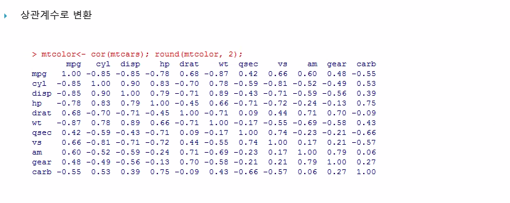
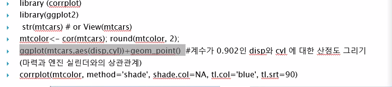
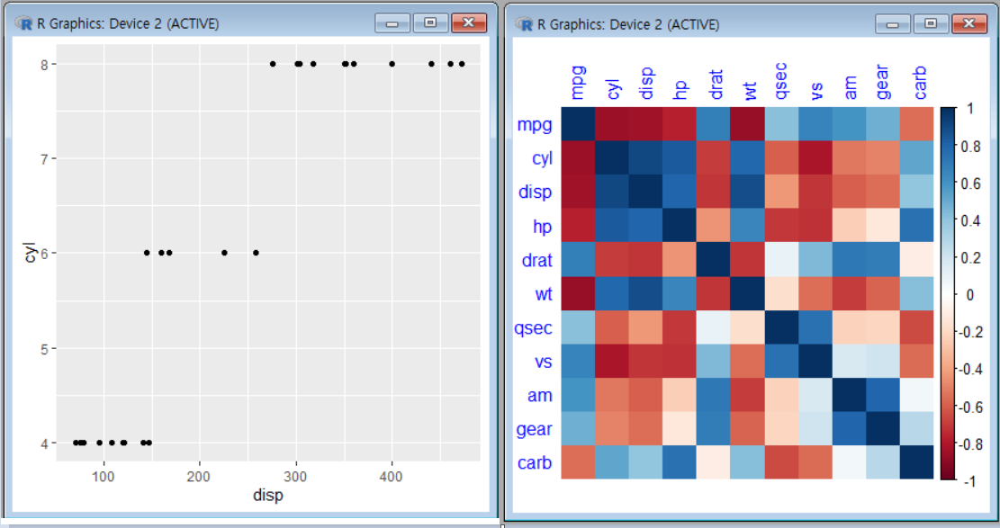

# **공공 데이터 업무적용 실습1**

## 빅데이터 분석(2) Correlation Analysis (상관 분석)









```R
library (corrplot)
library(ggplot2)
 str(mtcars) # or View(mtcars)
mtcolor<- cor(mtcars); round(mtcolor, 2);
ggplot(mtcars,aes(disp,cyl))+geom_point()  #계수가 0.902인 disp와 cyl 에 대한 산점도 그리기
(마력과 엔진 실린더와의 상관관계)
corrplot(mtcolor, method='shade', shade.col=NA, tl.col='blue', tl.srt=90)
```


## 빅데이터 분석(3) Preprocessing & Classification

## 빅데이터 분석(4) Association Rule (연관 규칙)

## 빅데이터 분석(5) Clustering Analysis (군집 분석)

## 빅데이터 분석(6) 네이버 영화평 자동 크롤링

## R 관련 site

